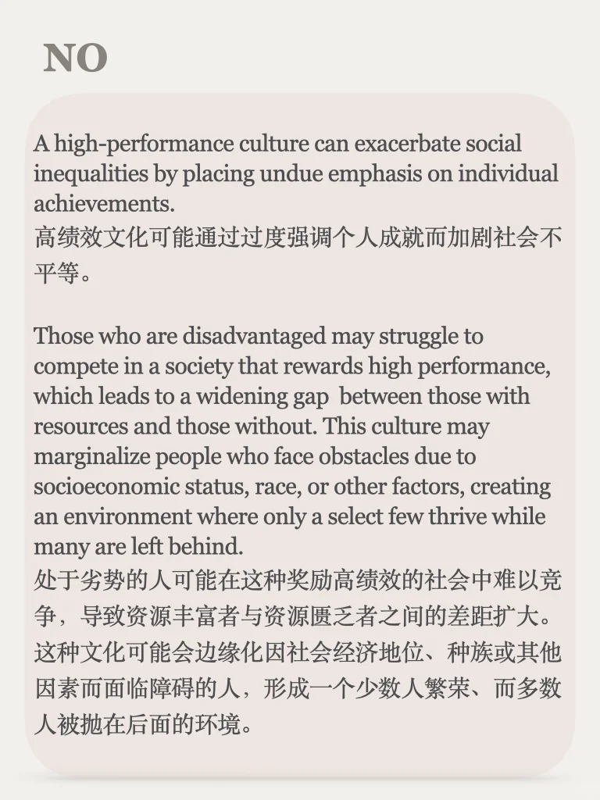
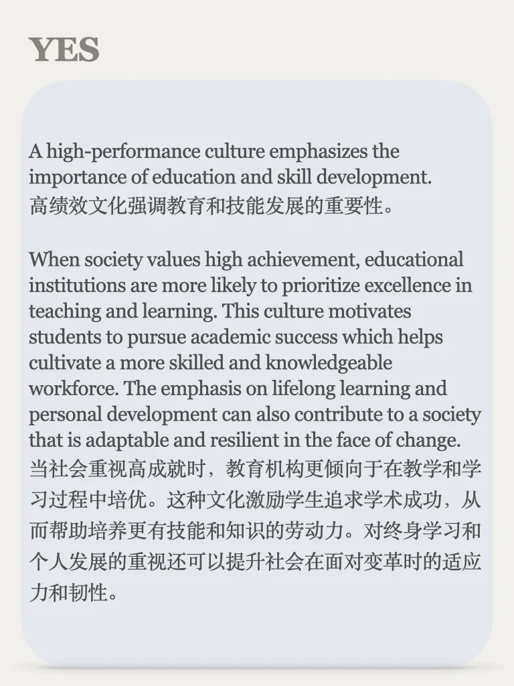
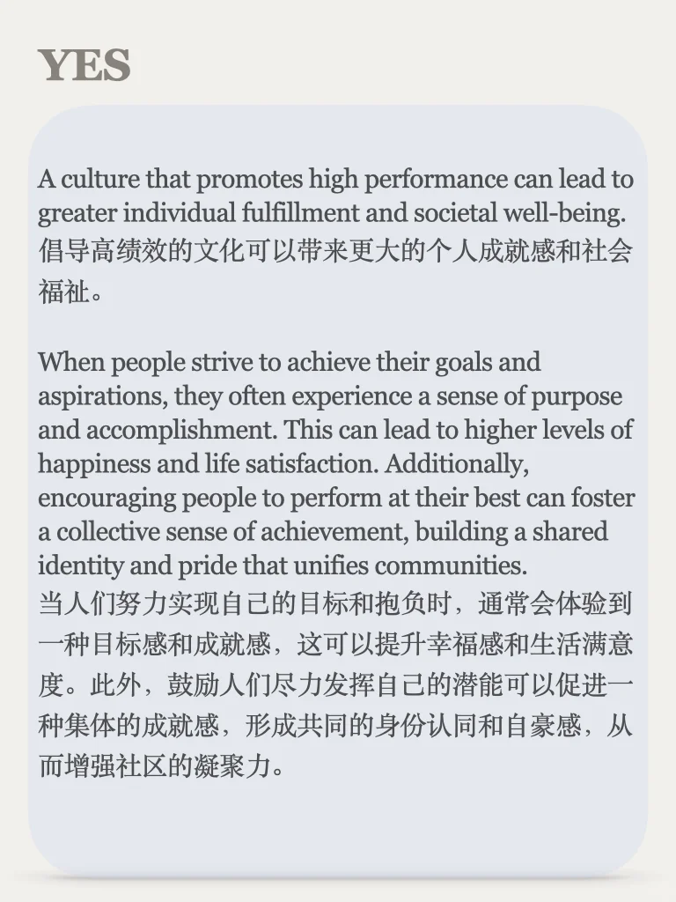
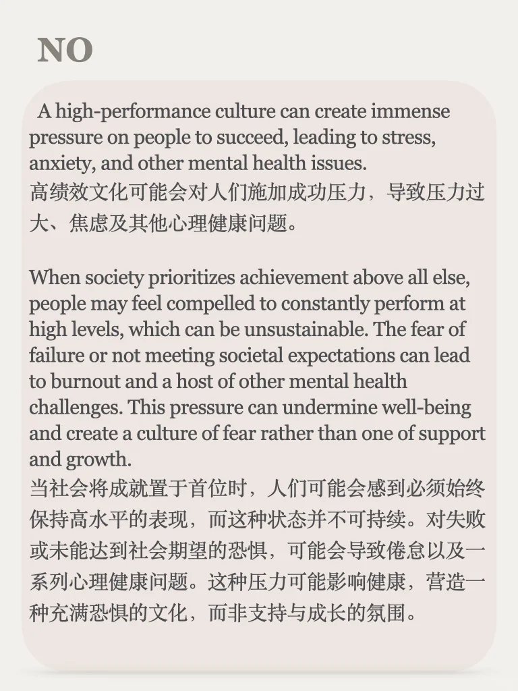
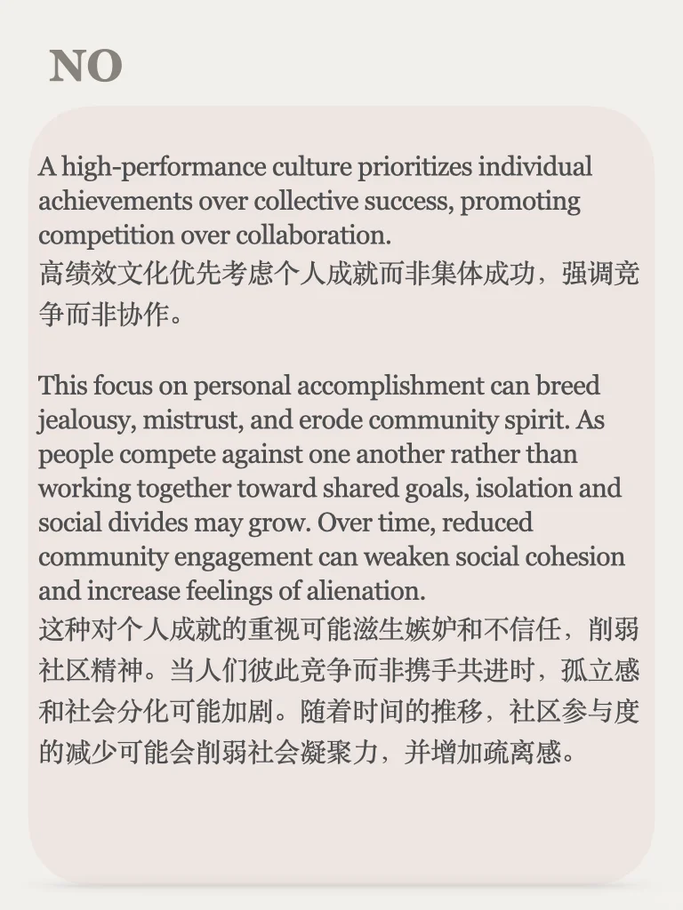

# 思辨能力培养48期｜说出你的立场

辩论系列可以作为口写语料积累，感兴趣的小伙伴可以点击左下角同款，话题丰富，永久更新
	
#雅思备考 #英语辩论 #辩证思考 #口语写作素材 #口语写作#英语地道表达 #英语学习 #四六级 #考研英语

## 图片
| 图1 | 图2 | 图3 | 图4 |
| --- | --- | --- | --- |
|  |  |  |  |
|  |  |  |   |

生成时间：2025-11-14 21:20:11