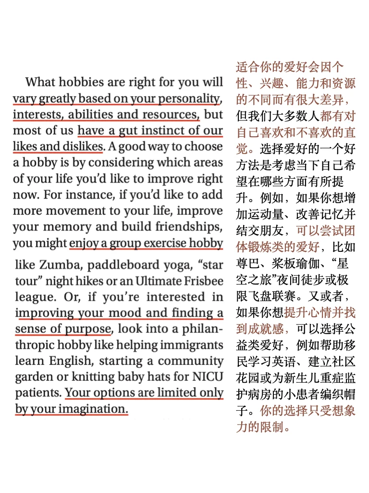
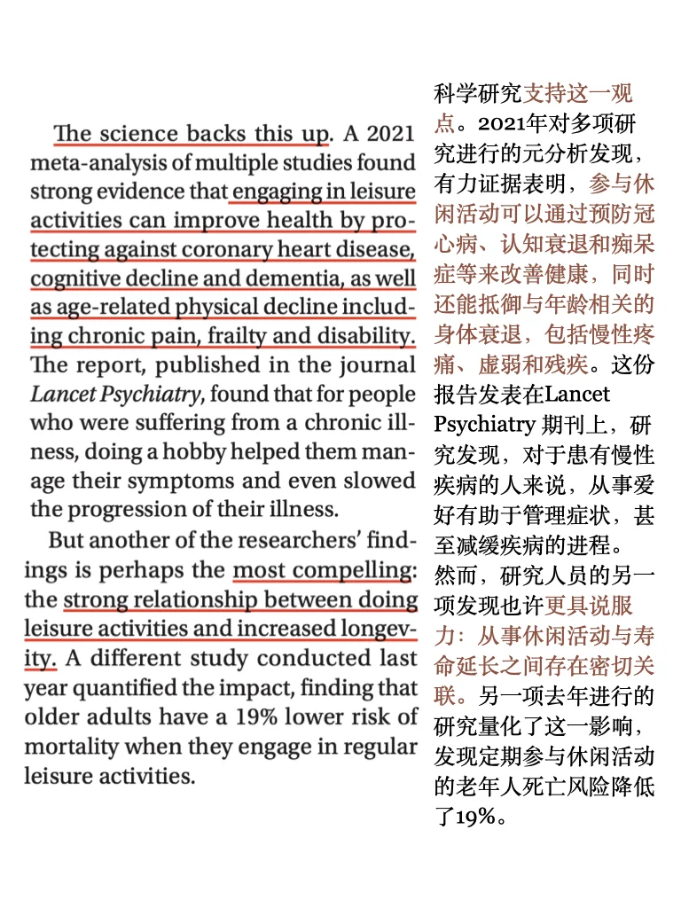
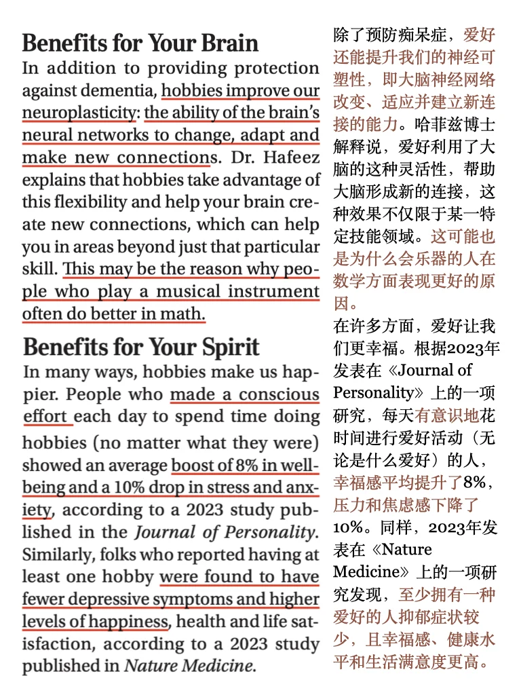
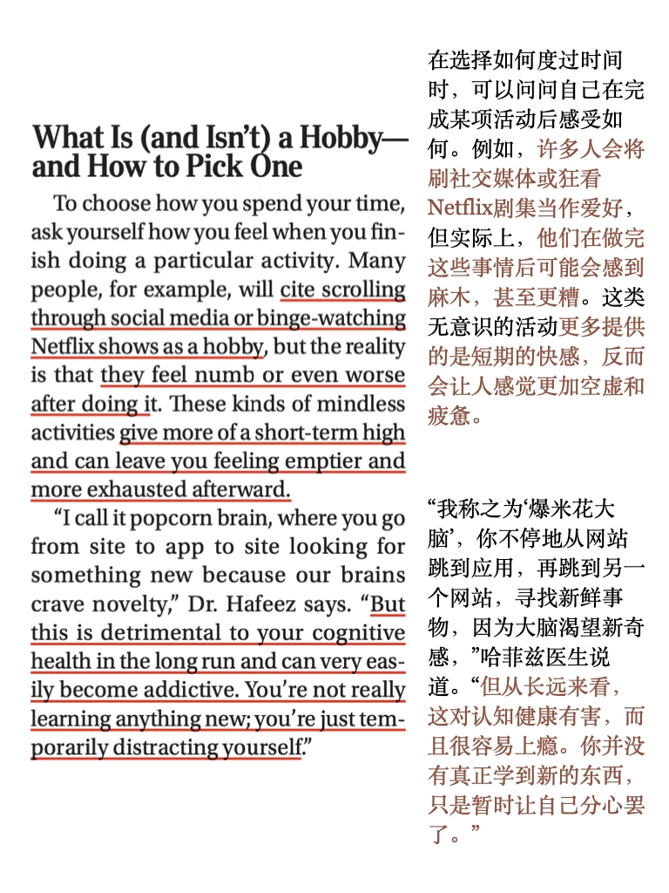

# 外刊泛读｜读者文摘用了好多雅思词汇

平时分享的内容受篇幅限制，很多是段落节选或者词汇讲解
我把平时阅读的文章从期刊、网页中筛选出来，以PDF格式保存
想更阅读更完整的外刊原文，欢迎加入群聊🎉
#外刊精读 #外刊 #雅思 #英语地道表达 #雅思备考 #雅思攻略 #雅思口语 #四六级 #考研英语

## 图片
| 图1 | 图2 | 图3 | 图4 |
| --- | --- | --- | --- |
|  |  |  |  |
|  |  |   |   |

生成时间：2025-11-14 21:19:04