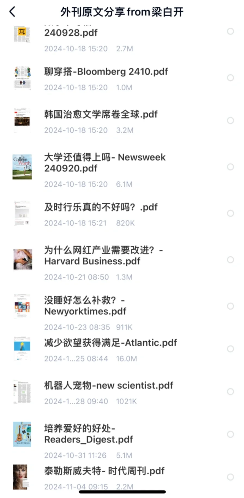
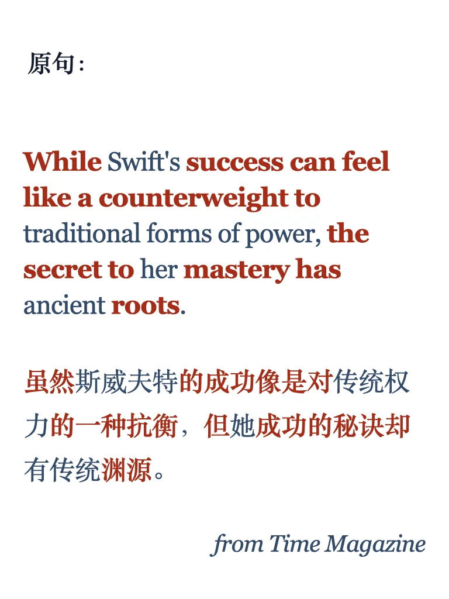
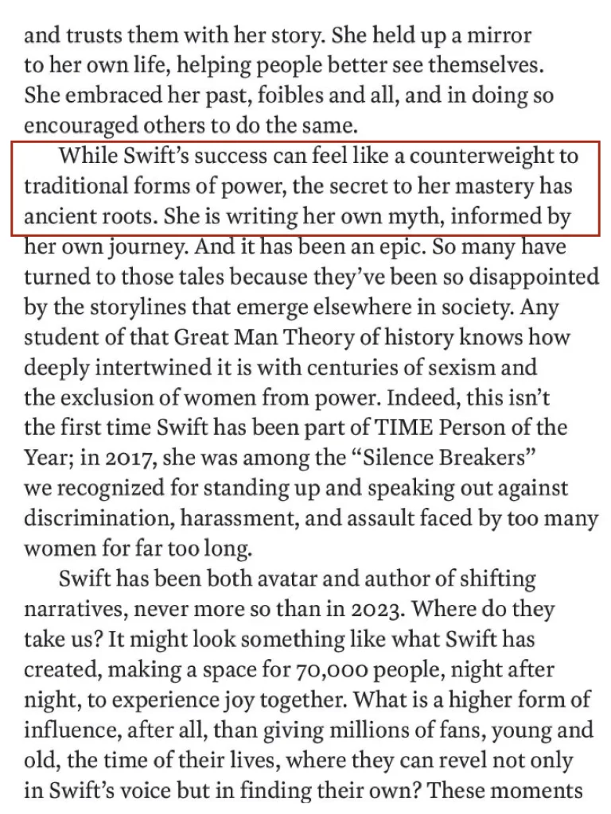

# 外刊句子仿写｜时代周刊写泰勒的成功

今天是第30期啦，一起练习仿写可以点击左下角获得同款哦
	
平时笔记的对应原文在外刊群里分享给大家
#英语地道表达 #雅思备考 #雅思攻略 #外刊 #外刊精读 #英语写作 #外刊写作 #四六级 #考研英语 #英语写作句子

## 图片
| 图1 | 图2 | 图3 | 图4 |
| --- | --- | --- | --- |
|  |  |  |  |
|  |  |   |   |

生成时间：2025-11-14 15:53:16