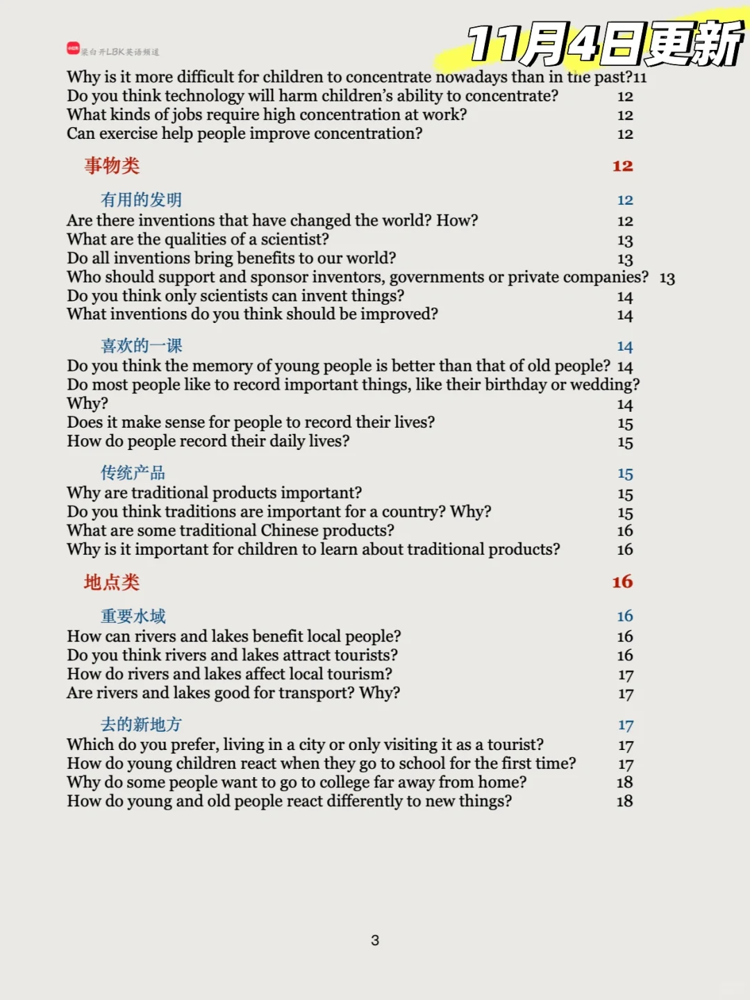
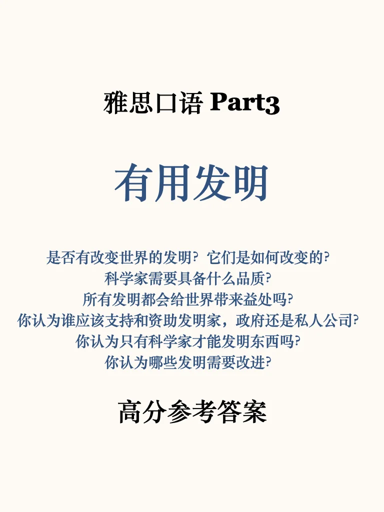
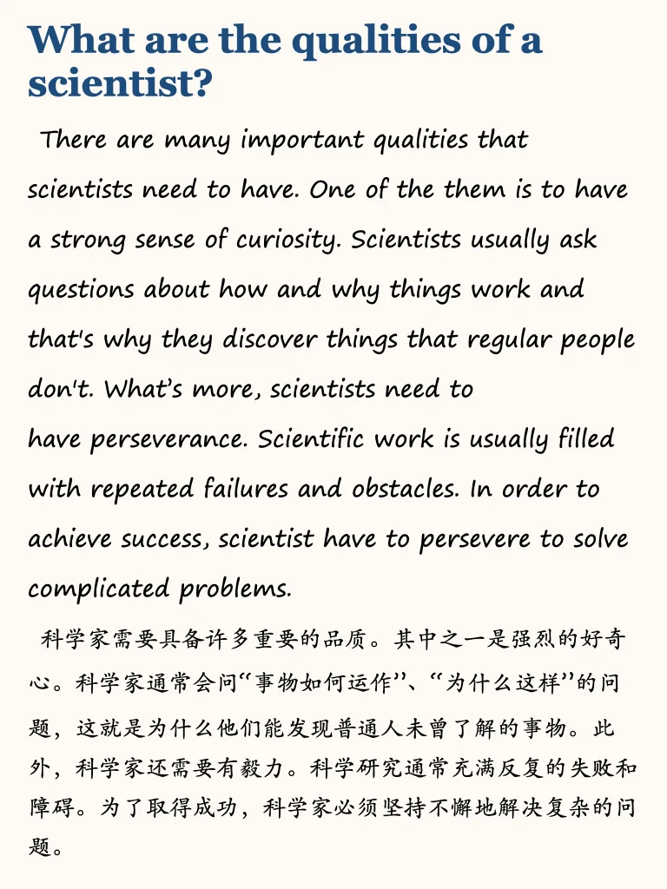
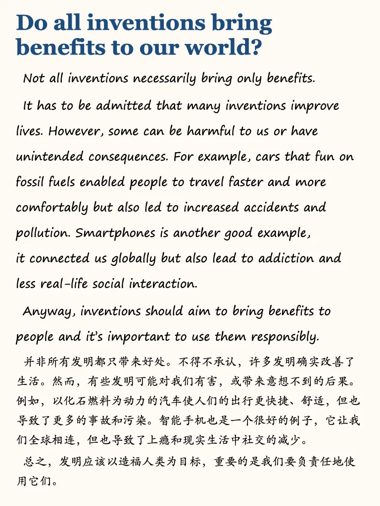
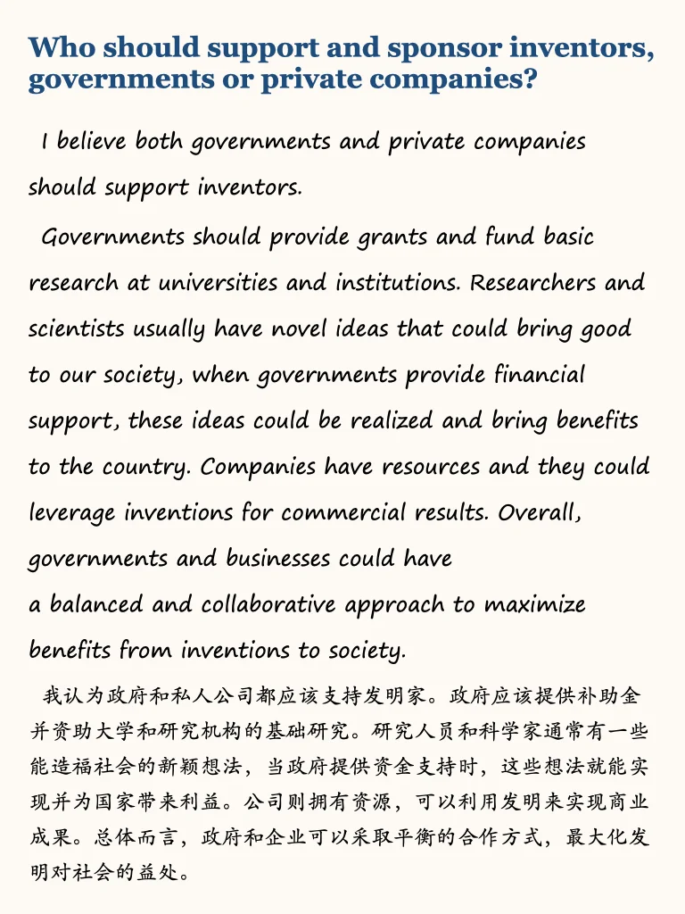
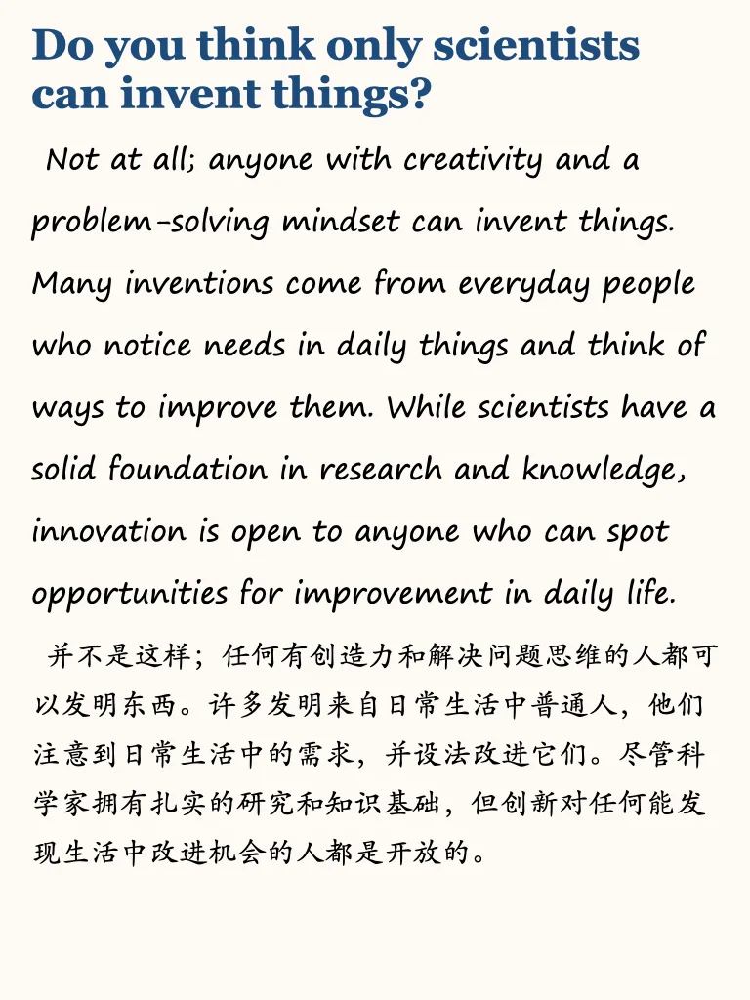
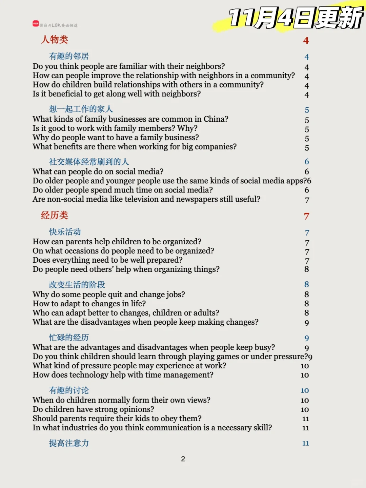

# 雅思口语P3更新｜难题-发明

#雅思备考 #雅思攻略 #雅思口语 #雅思口语素材 #英语地道表达 #雅思口语part3 #雅思口语part3新题答案 #雅思口语答案 #雅思口语高分示范

## 图片
| 图1 | 图2 | 图3 | 图4 |
| --- | --- | --- | --- |
|  |  |  |  |
|  |  |  |  |
|  |   |   |   |

生成时间：2025-11-14 21:17:58