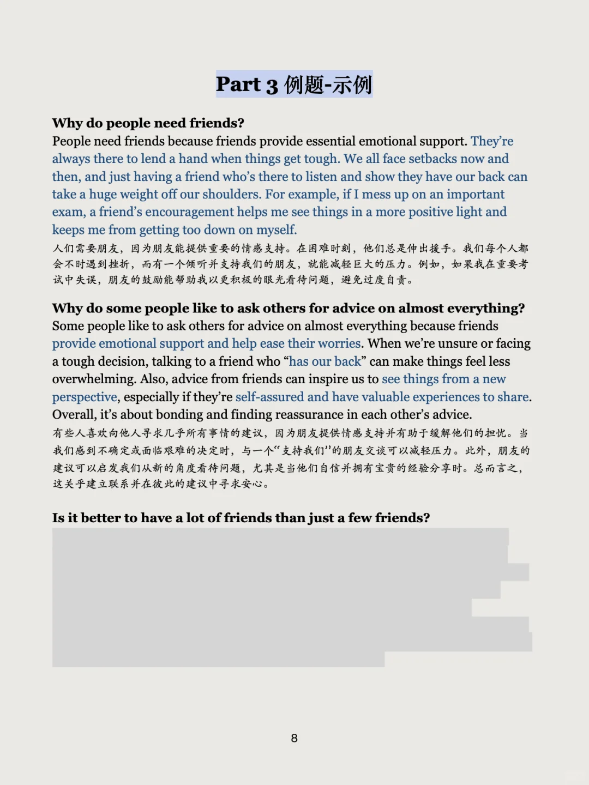
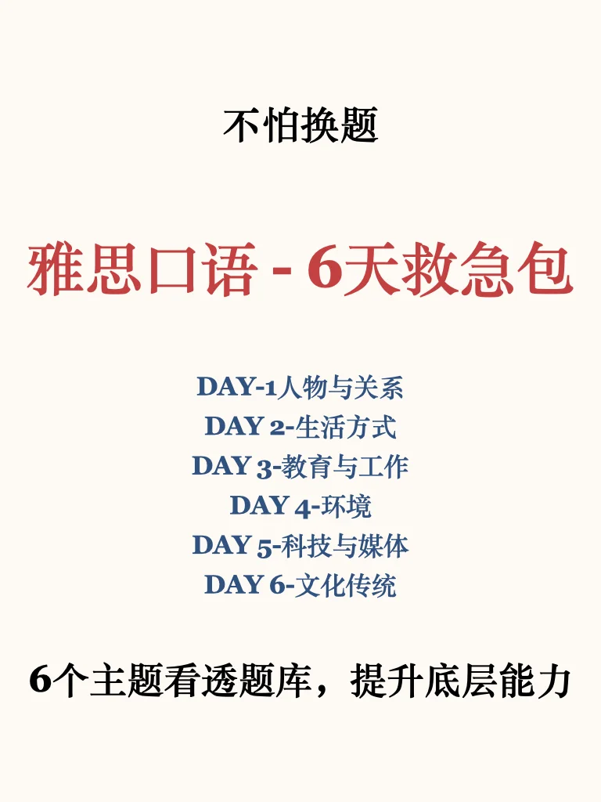
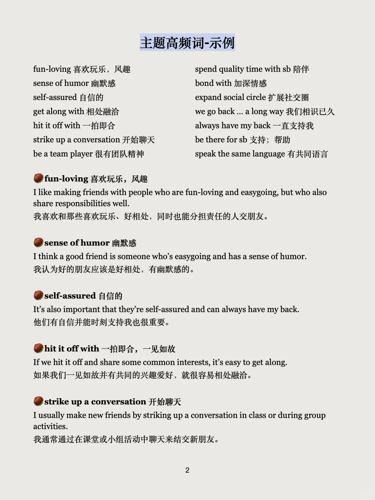
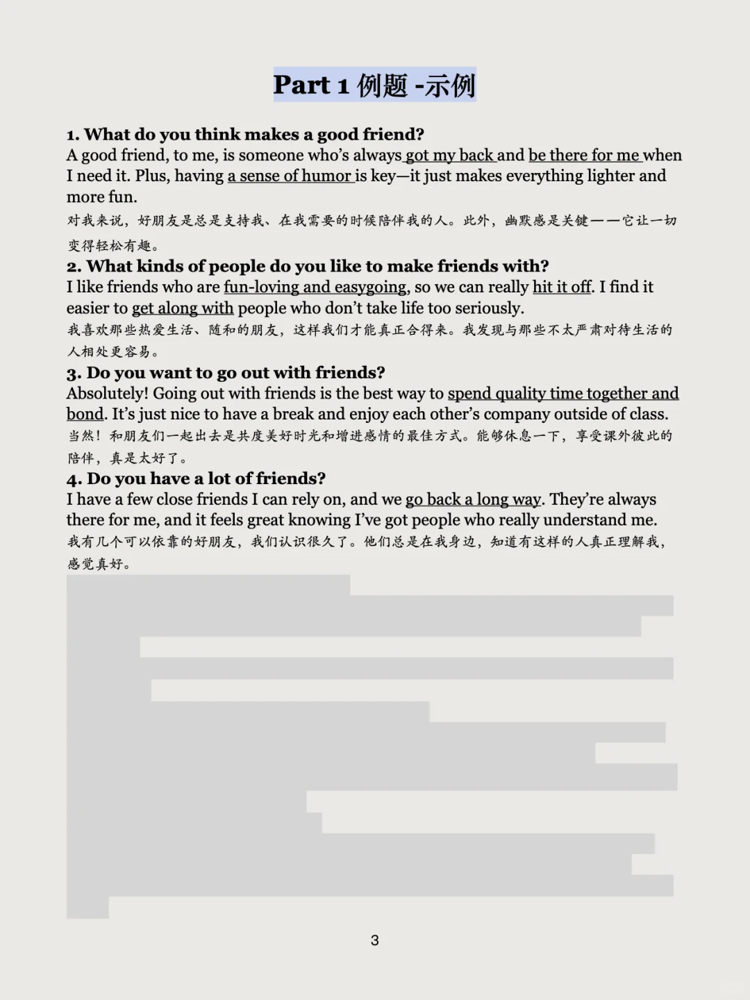
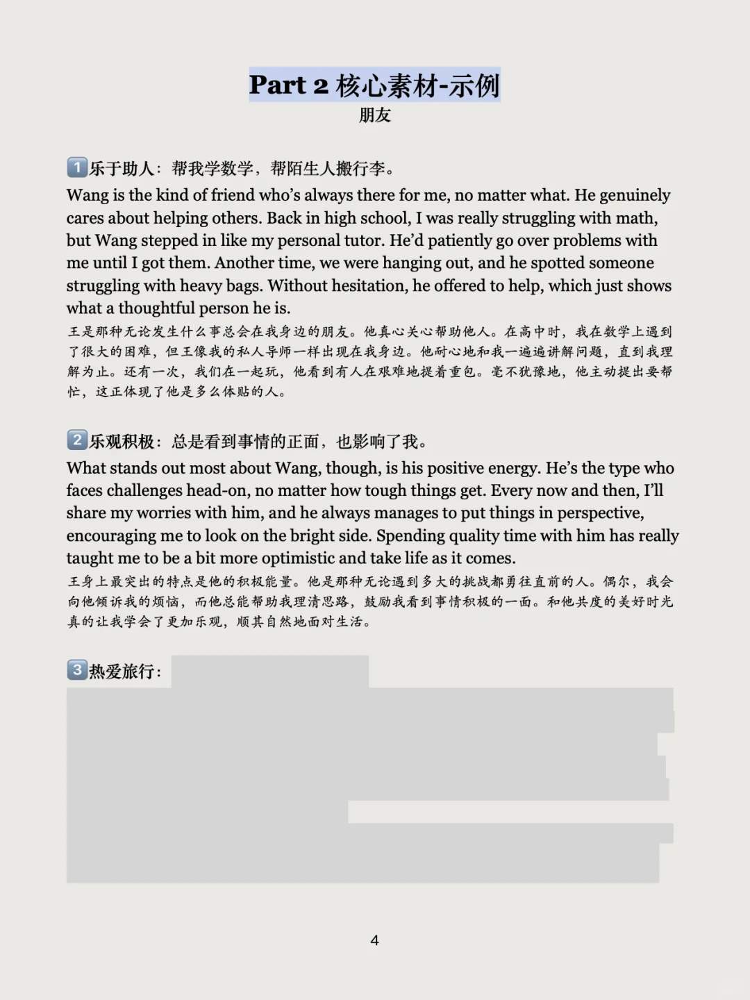
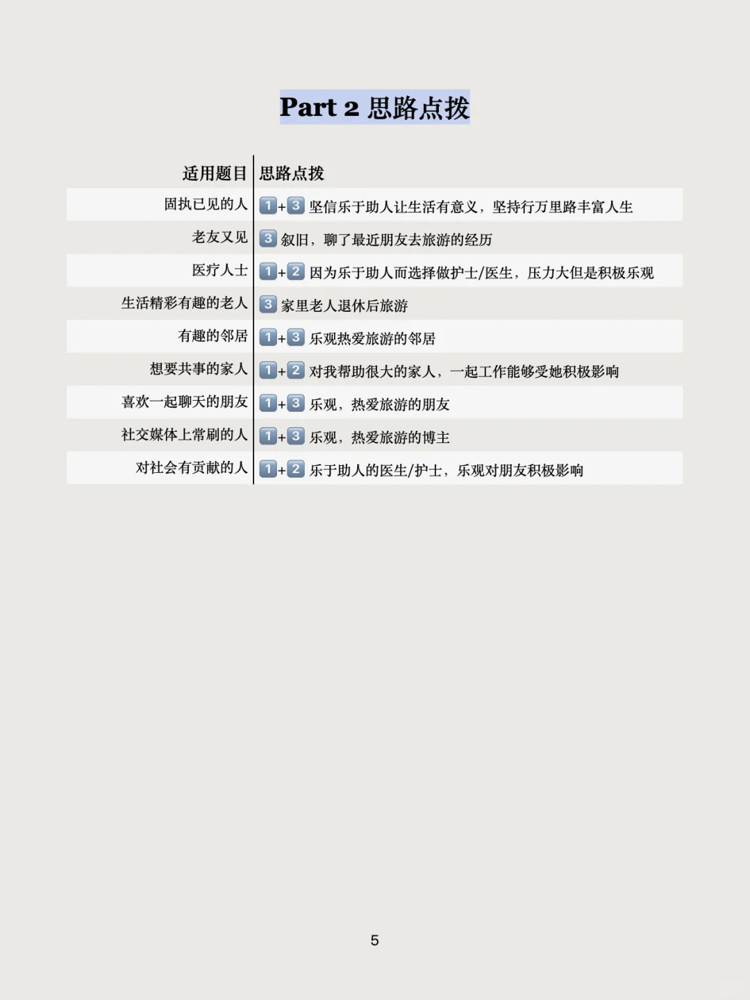
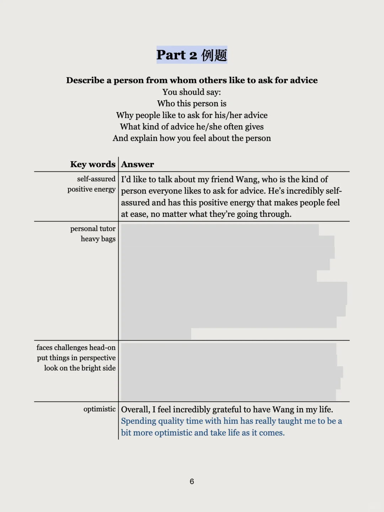
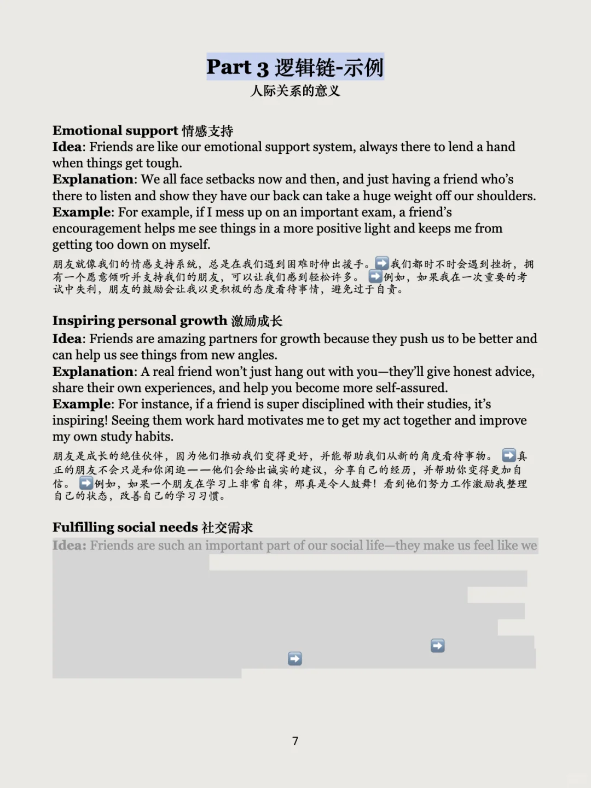

# 口语换题不用怕，六个主题搞定它

刷了十多个题库，总结出六个万用主题：
1⃣️人物与关系
2⃣️生活方式
3⃣️教育与工作
4⃣️环境
5⃣️科技与媒体
6⃣️文化传统
根据这些主题，精选了对应的万能词汇、串题素材和逻辑链，帮助考生从底层语言能力获得提升💪
考前刷一遍，无论是换题季还是题库变动期，都可以应对自如👌
#雅思口语 #雅思备考 #英语地道表达 #雅思口语换题 #雅思口语急救 #英语教育分享 #雅思口语万能模版 #雅思口语part1 #雅思口语part2 #雅思口语part3

## 图片
| 图1 | 图2 | 图3 | 图4 |
| --- | --- | --- | --- |
|  |  |  |  |
|  |  |  |  |
|  |   |   |   |

生成时间：2025-11-12 16:56:47