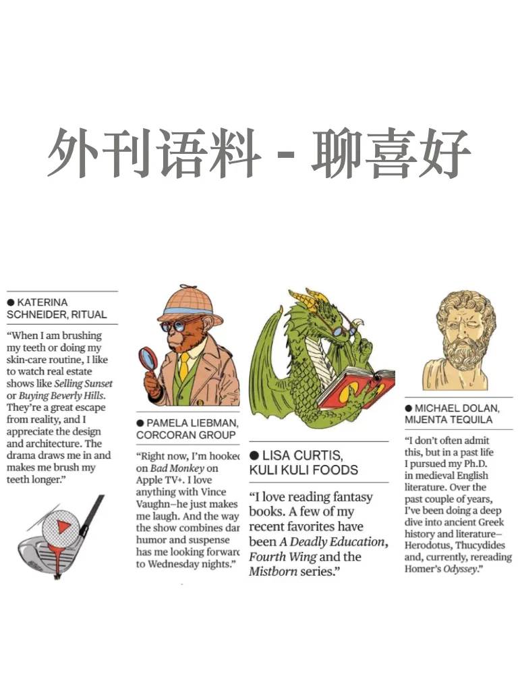

# 外刊语料｜简直是雅思口语答案

来自Bloomberg的一个小栏目，表达很有趣，很多值得学习的词句，快学起来吧
My go-to x  最喜欢的，第一选择
X is an easy binge 适合追剧
Must - watches 必看节目
Be hooked on  痴迷于…
X has me doing … 让我…
X is a great escape  让我暂时逃离现实
X draws me in  吸引着我
	
平时分享的内容受篇幅限制，很多是段落节选或者词汇讲解；
我把平时阅读的文章从期刊、网页中筛选出来，以PDF格式保存
想更阅读更完整的外刊原文，欢迎加入群聊🎉
#外刊精读 #英语地道表达 #雅思备考 #雅思攻略 #学习日常 #四六级 #考研英语 #英语素材 #口语素材

## 图片
| 图1 | 图2 | 图3 | 图4 |
| --- | --- | --- | --- |
|  |  |  |  |
|  |   |   |   |

生成时间：2025-11-14 21:15:44