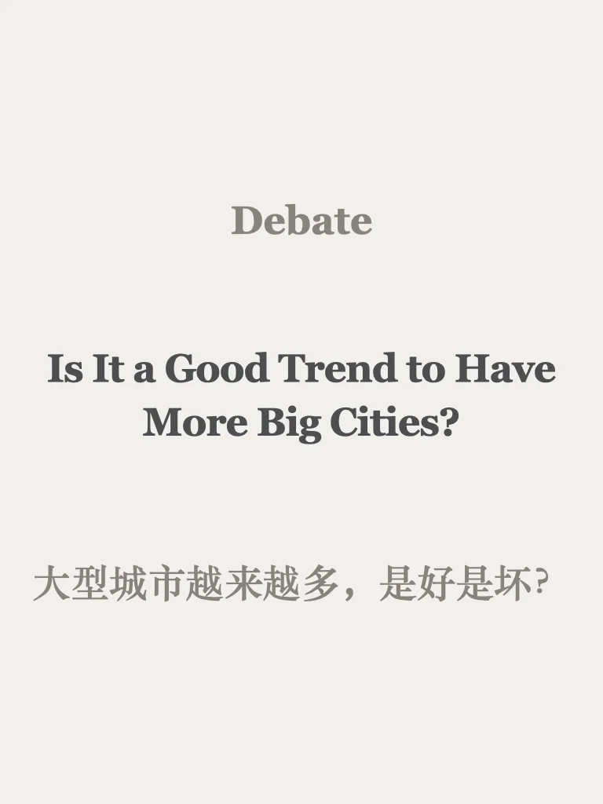
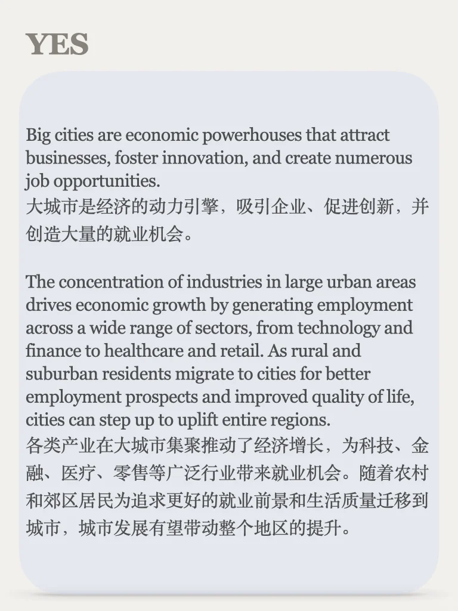
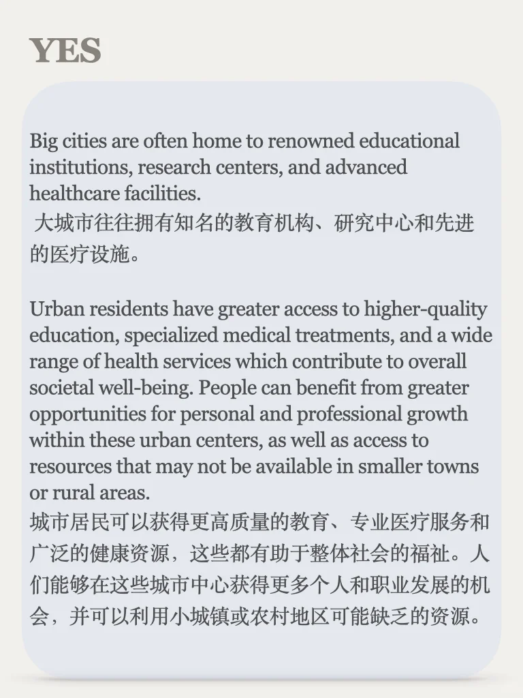
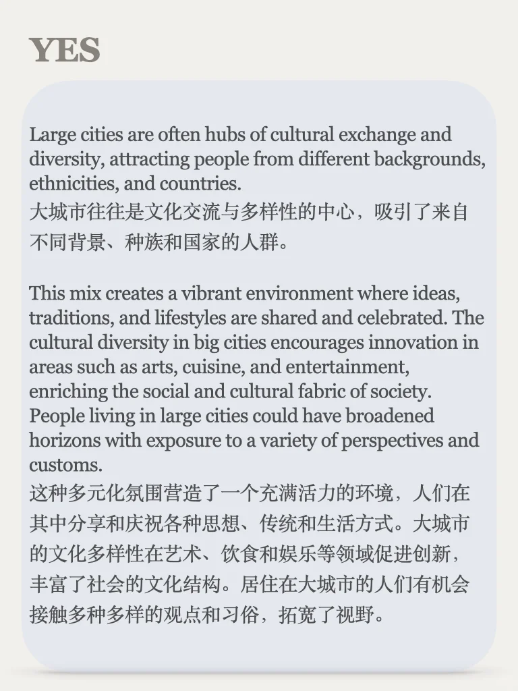
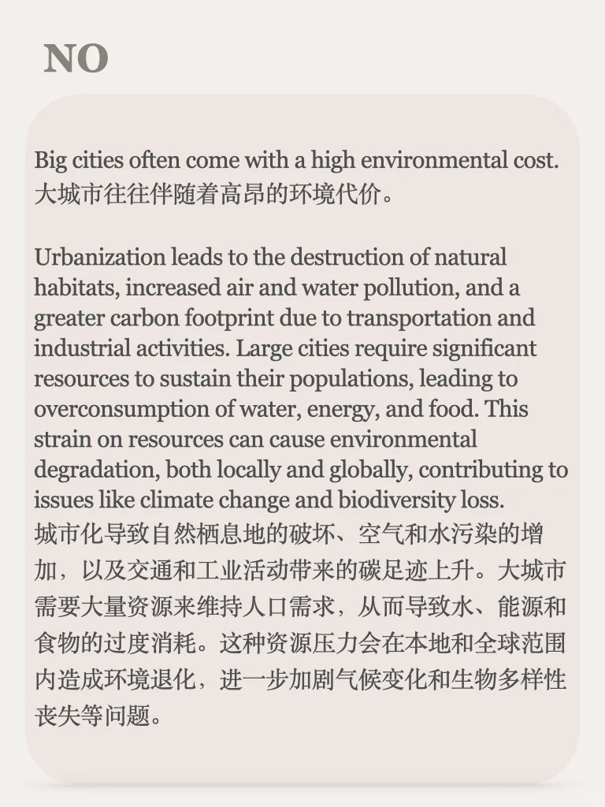
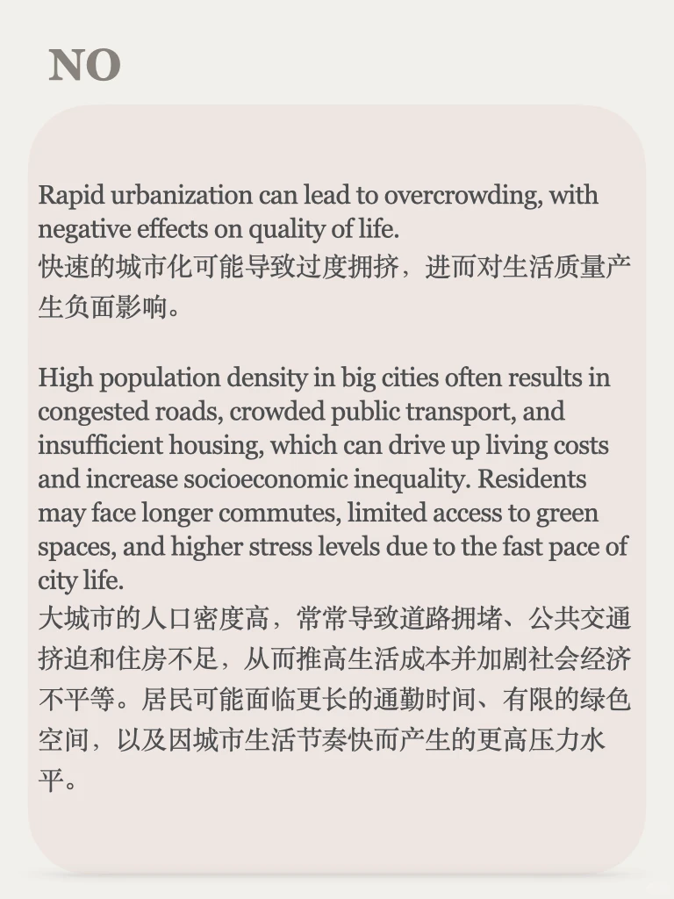
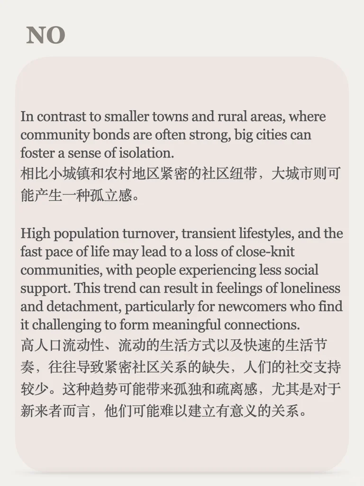

# 思辨能力培养48期｜说出你的立场

今天的主题来自雅思口语题库的一个part3问题，城市的扩张带来了生活质量的提升，也给自然资源和环境造成压力，你怎么看🤔
	
一起培养思辨能力，积累口写语料，永久更新，左下角加入我们吧💪
#雅思备考 #英语地道表达 #英语素材 #口语语料 #写作素材 #观点 #雅思攻略 #四六级 #考研英语 #英语辩论

## 图片
| 图1 | 图2 | 图3 | 图4 |
| --- | --- | --- | --- |
|  |  |  |  |
|  |  |  |  |

生成时间：2025-11-14 21:14:38