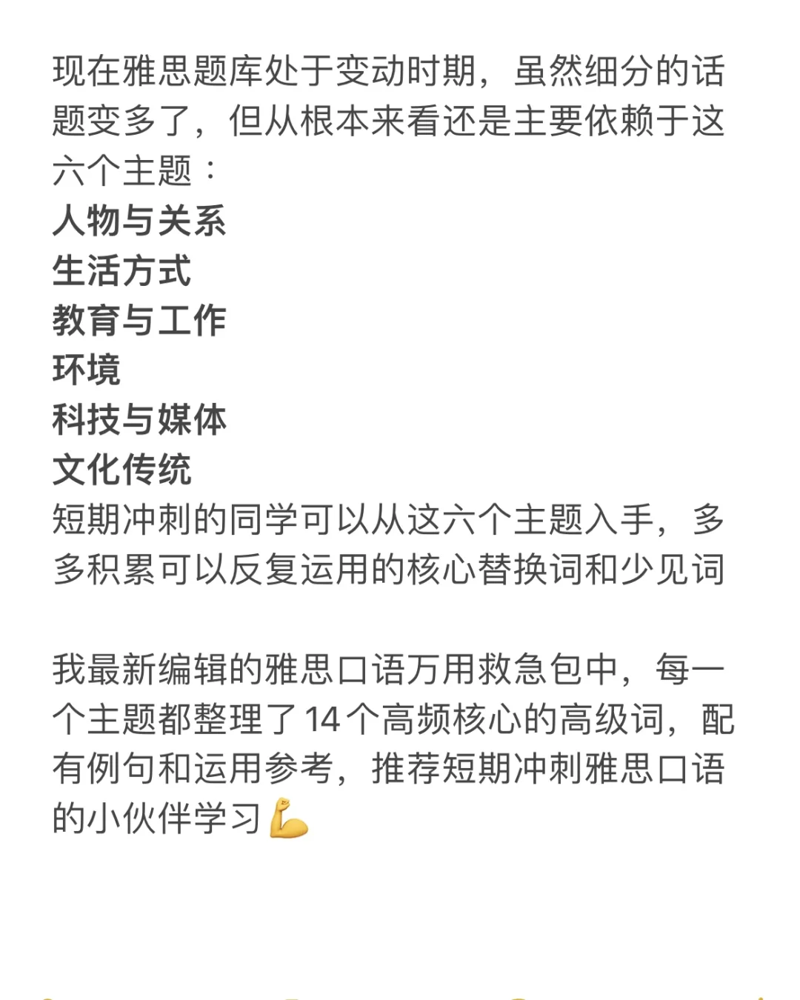
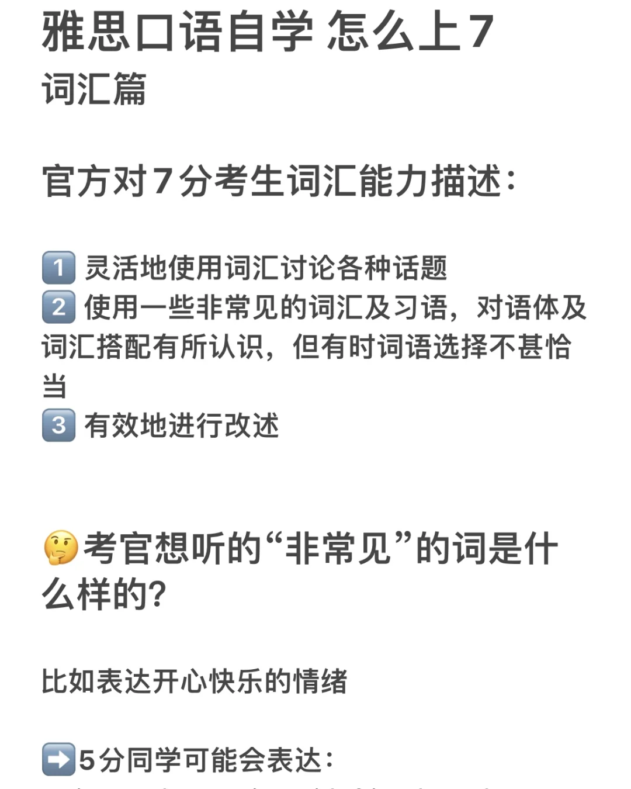
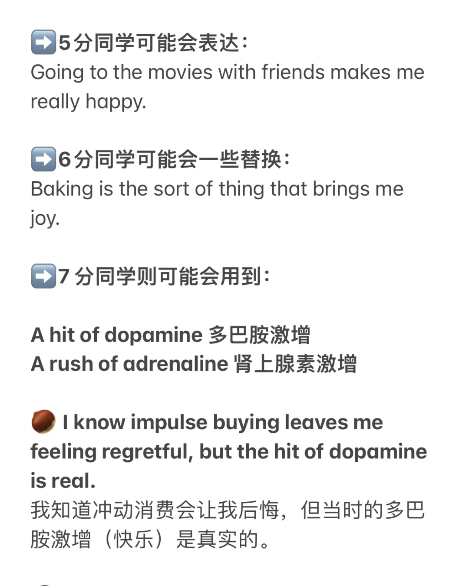

# 时间短，但是想冲7，推荐方法

官方对7分考生词汇能力描述：
1⃣️ 灵活地使用词汇讨论各种话题
2⃣️ 使用一些非常见的词汇及习语，对语体及
词汇搭配有所认识，但有时词语选择不甚恰当
3⃣️ 有效地进行改述
🤔考官想听的“非常见”的词是什么样的？
比如表达开心快乐的情绪
➡️5分同学可能会表达：
Going to the movies with friends makes me really happy.
➡️6分同学可能会一些替换：
Baking is the sort of thing that brings me joy.
➡️7 分同学则可能会用到：
A hit of dopamine 多巴胺激增
A rush of adrenaline 肾上腺素激增
🌰 I know impulse buying leaves me feeling regretful, but the hit of dopamine is real.
我知道冲动消费会让我后悔，但当时的多巴胺激增（快乐）是真实的。
🌰I’ve never tried any extreme sports before but I’ve seen videos on social media just watching them gives me an adrenaline rush
我并没有尝试过任何极限运动，但是看视频就足以给我肾上腺素激增的（兴奋）感觉。
现在雅思题库处于变动时期，虽然细分的话题变多了，但从根本来看还是主要依赖于这六个主题 ：
人物与关系
生活方式
教育与工作
环境
科技与媒体
文化传统
短期冲刺的同学可以从这六个主题入手，多多积累可以反复运用的核心替换词和少见词
我最新编辑的雅思口语万用救急包中，每一个主题都整理了14个高频核心的高级词，配有例句和运用参考，推荐短期冲刺雅思口语的小伙伴学习💪
#雅思口语 #雅思备考 #雅思 #雅思考试 #好好生活皆如所愿 #雅思口语换题 #雅思口语7分 #英语地道表达

## 图片
| 图1 | 图2 | 图3 | 图4 |
| --- | --- | --- | --- |
|  |  |  |  |

生成时间：2025-11-14 21:13:30