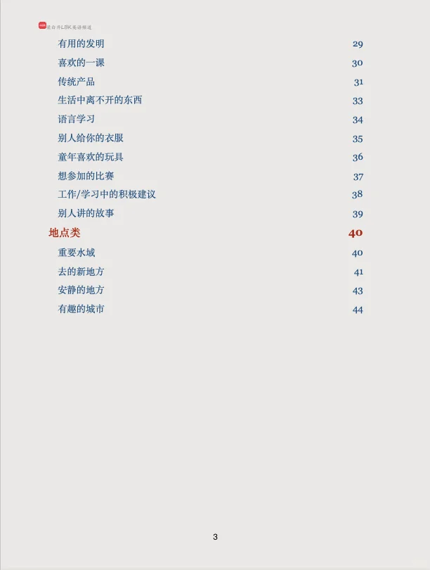
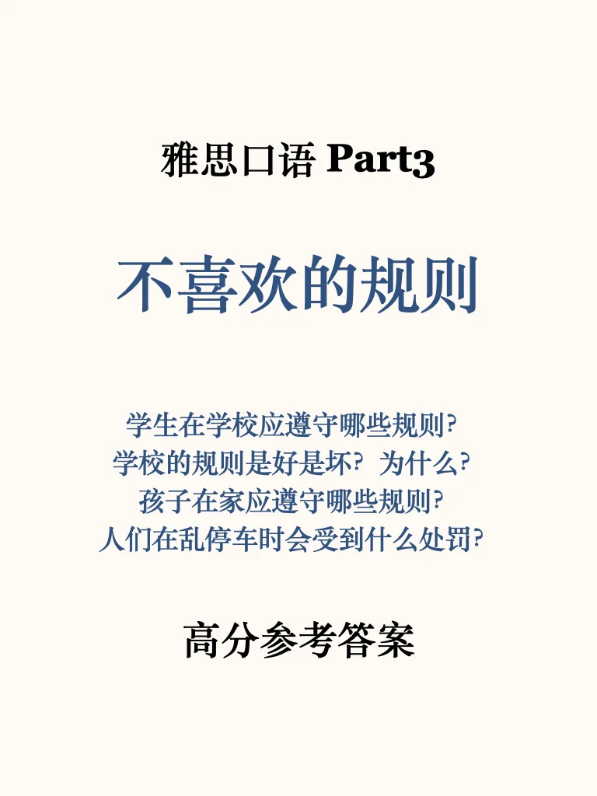
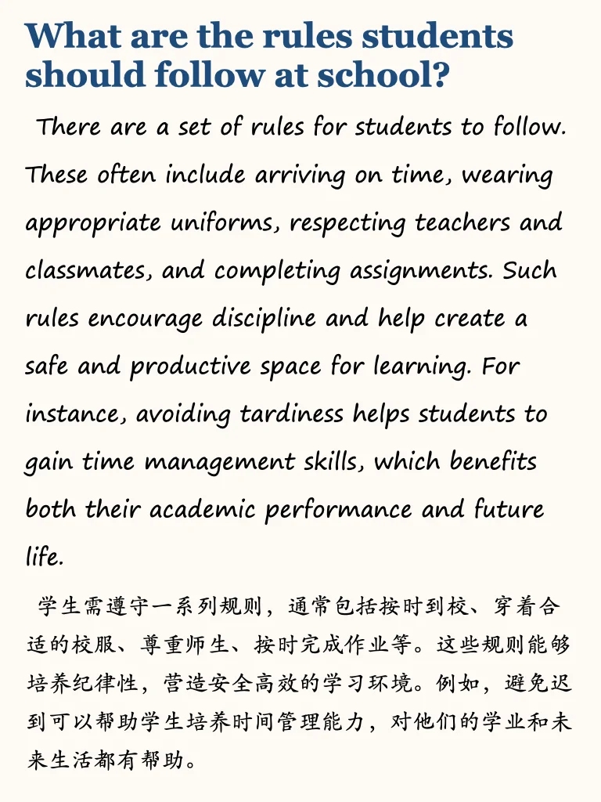
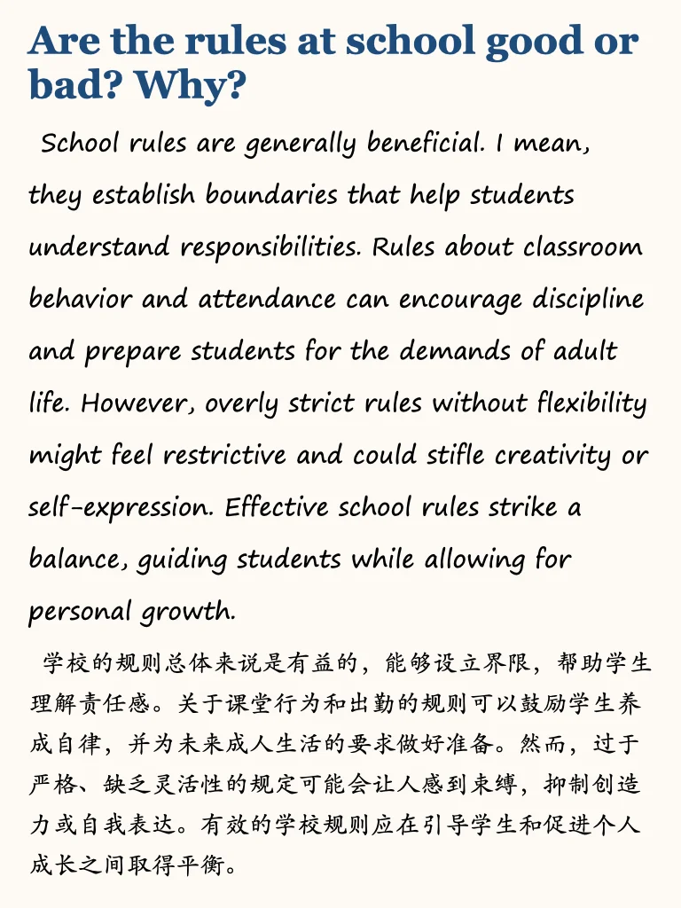
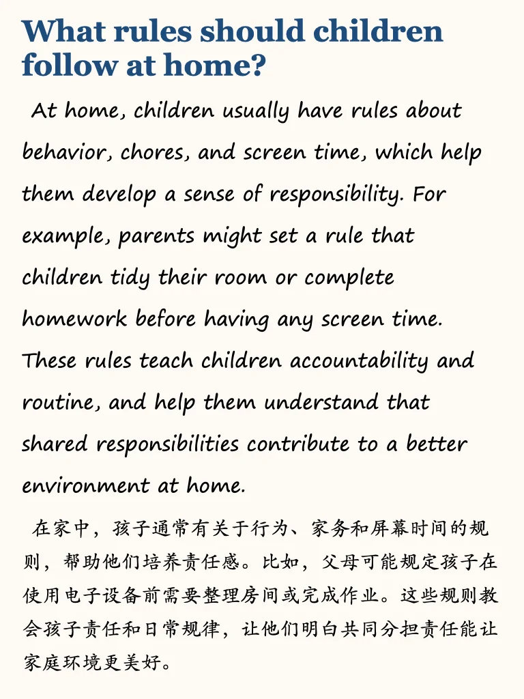
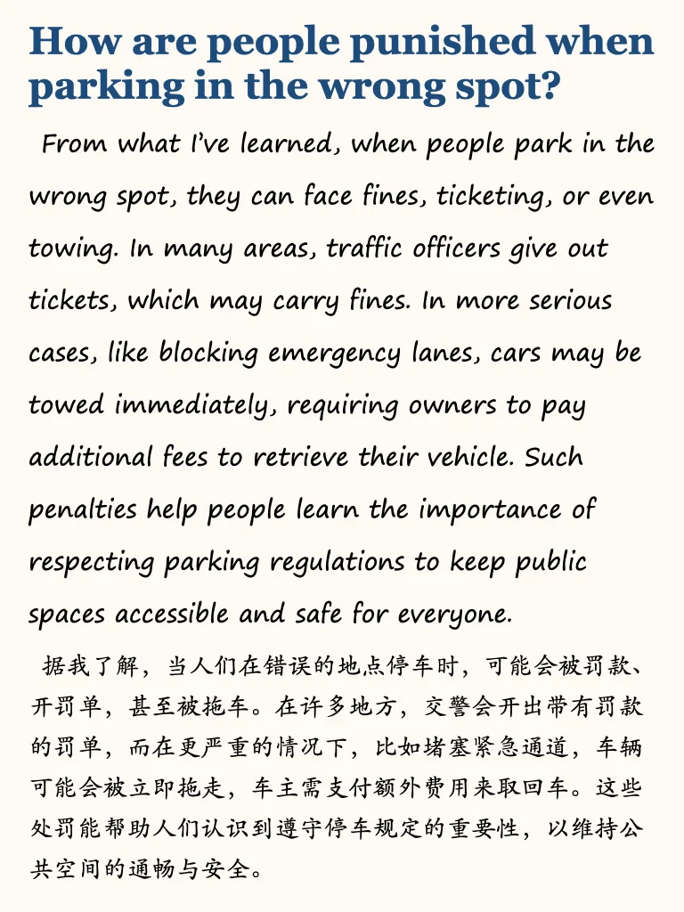
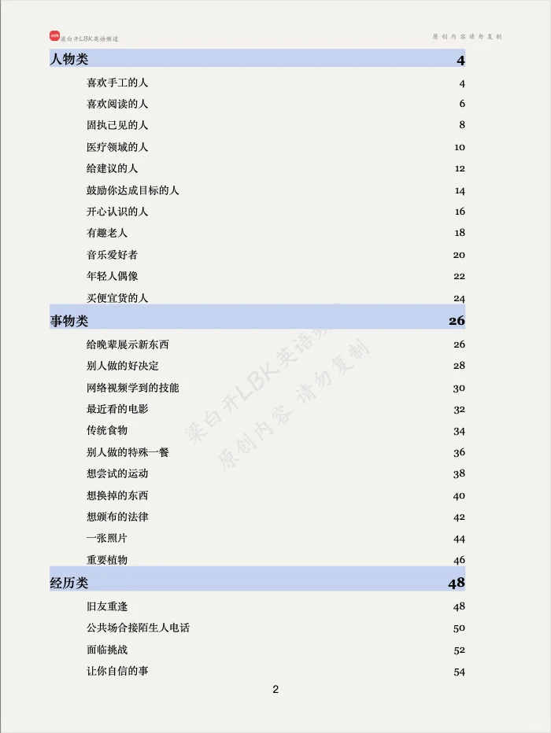
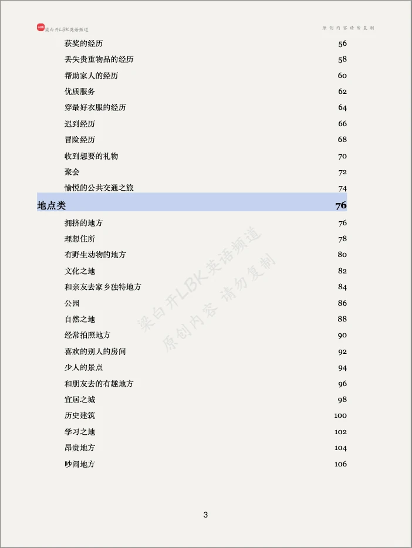
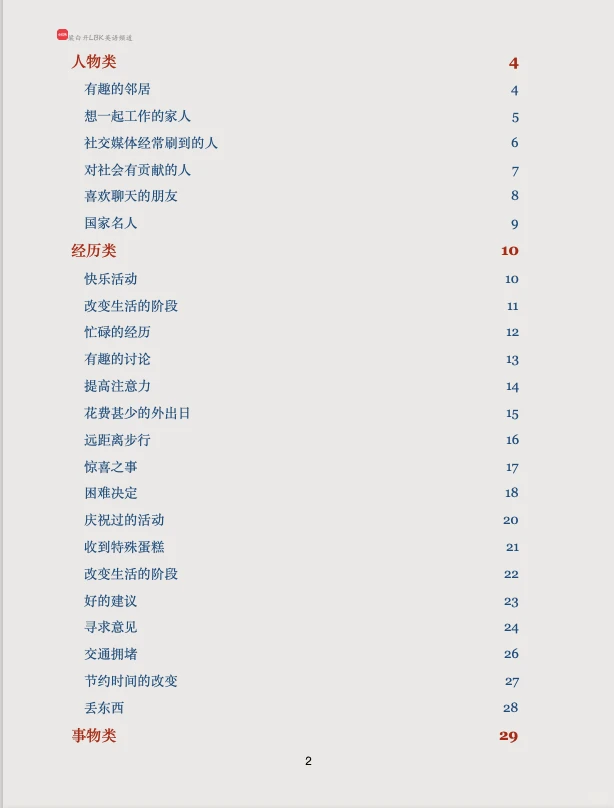

# 新增题Part3 高分参考｜持续更新

Part3 高分参考答案，11月之前题目52个
11月后新增题，已经更新37个，持续更新中
左下角+滴滴我，后期一边写一边更新给你，哪个觉得难也可以先写哪个，有问题包解答
BC虐我千百遍，答案更新不能断
	
来不及看所有题库的同学，推荐学习我的万用救急包💪
#雅思备考 #雅思口语 #雅思口语答案 #雅思口语换题 #雅思攻略 #雅思口语part3 #雅思口语高分示范

## 图片
| 图1 | 图2 | 图3 | 图4 |
| --- | --- | --- | --- |
|  |  |  |  |
|  |  |  |  |
|  |   |   |   |

生成时间：2025-11-14 21:10:14