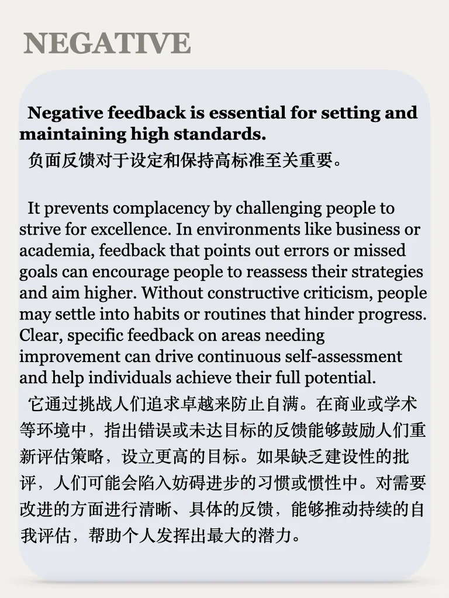
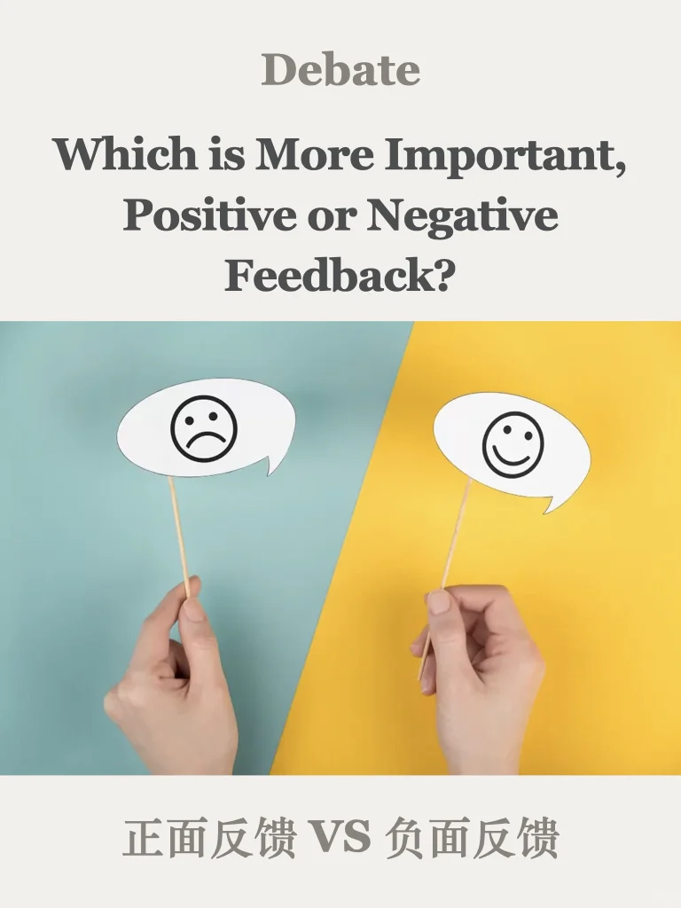
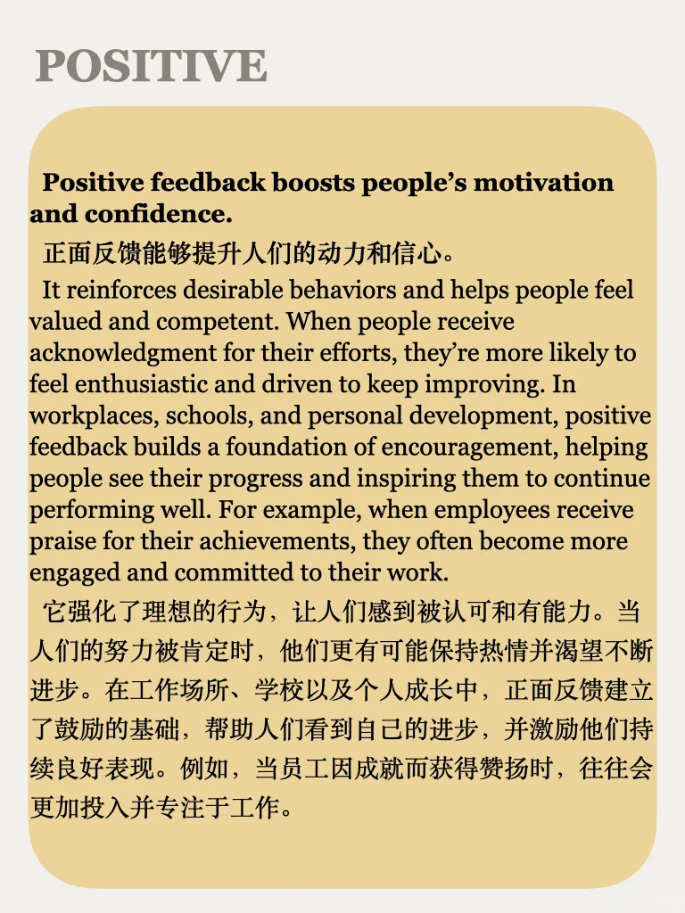
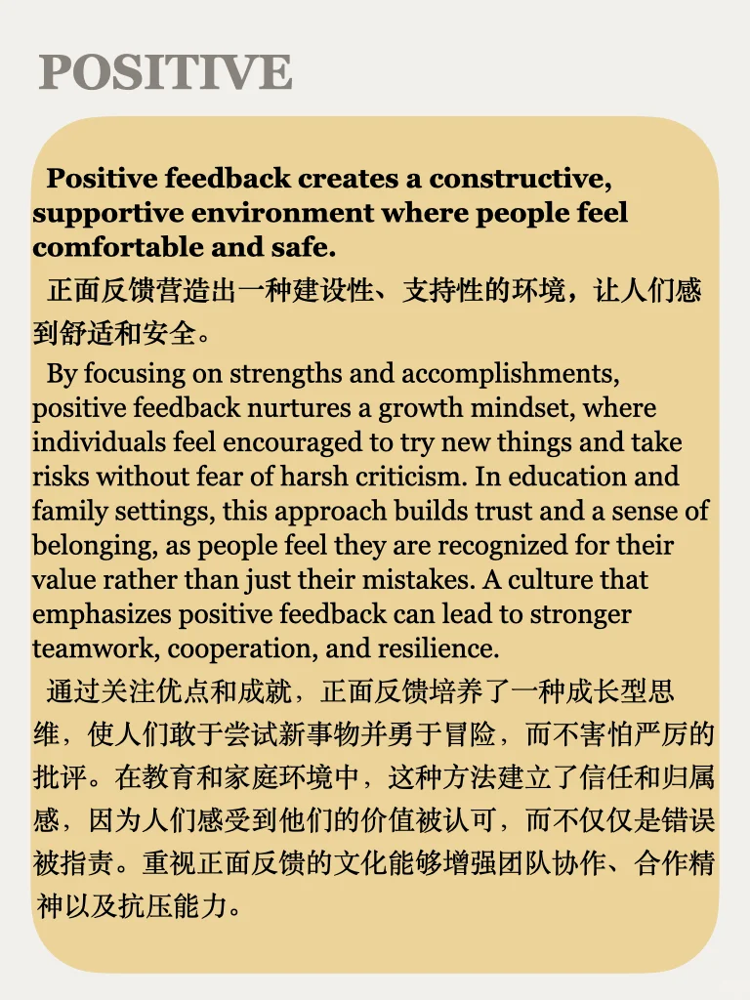
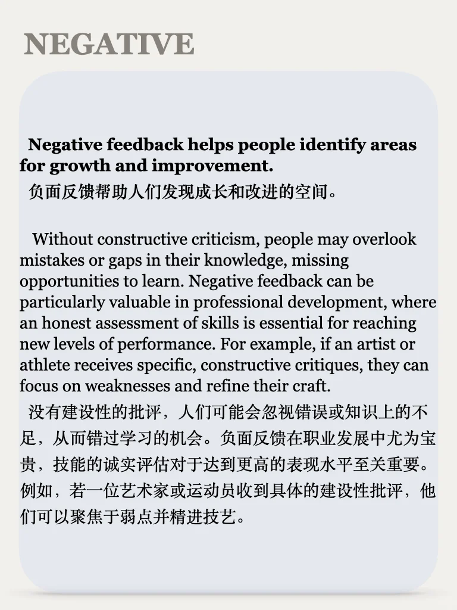
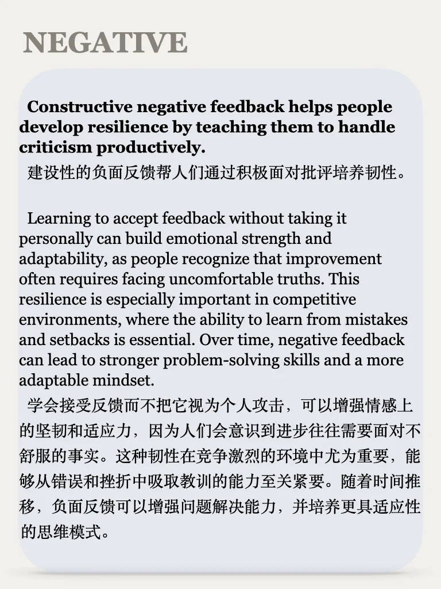

# 思辨能力培养49期｜说出你的立场

辩论节目更新48期
本期话题来自近期雅思口语题库，也找到了相关外刊给大家分享，可以进群get
一起积累口写语料，培养思辨能力，点击左下角加入吧#思辨能力 #英语辩论 #雅思备考 #写作素材 #观点 #立场 #四六级 #考研英语 #写作 #英语地道表达

## 图片
| 图1 | 图2 | 图3 | 图4 |
| --- | --- | --- | --- |
|  |  |  |  |
|  |  |  |   |

生成时间：2025-11-14 21:08:01