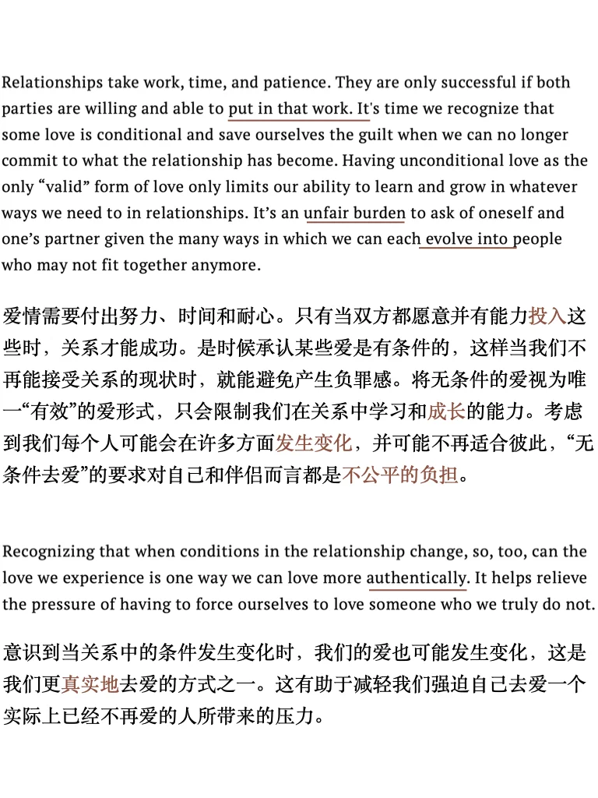
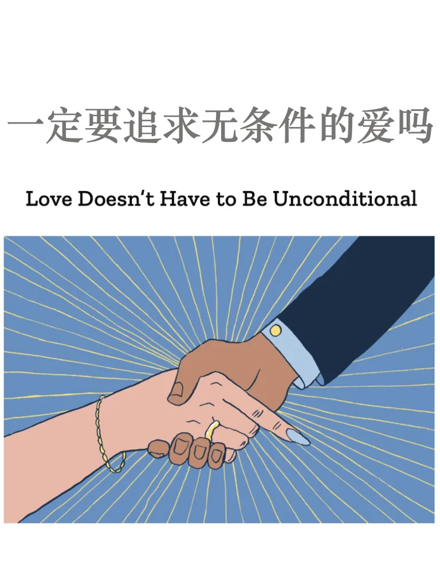
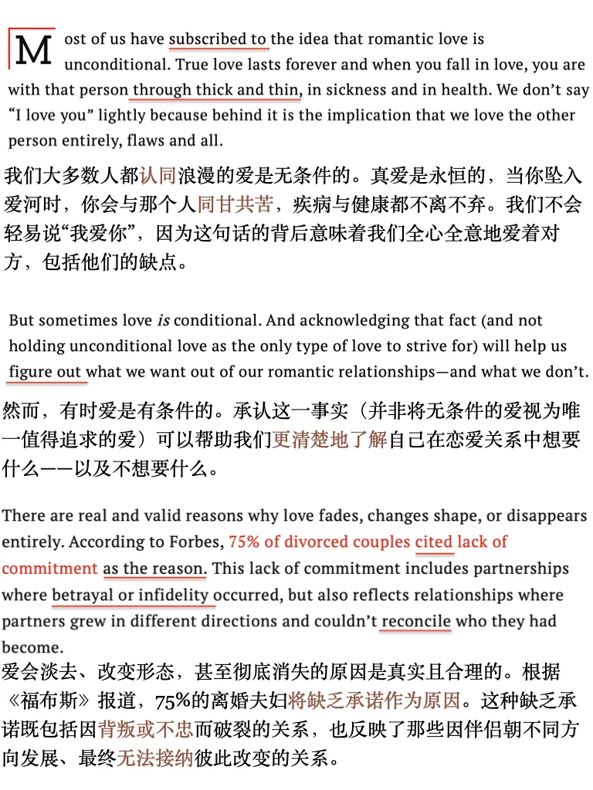
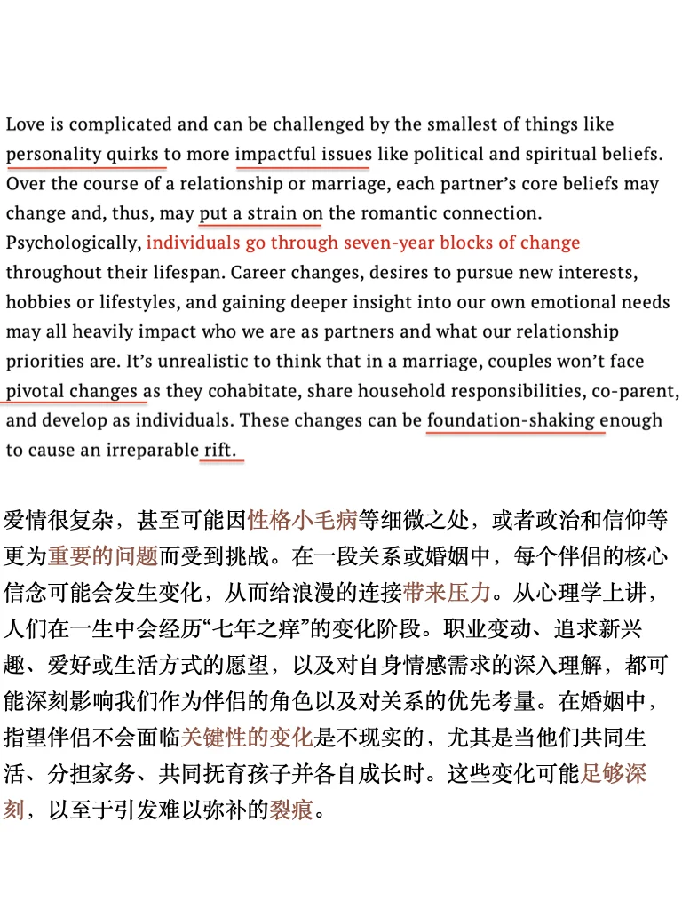
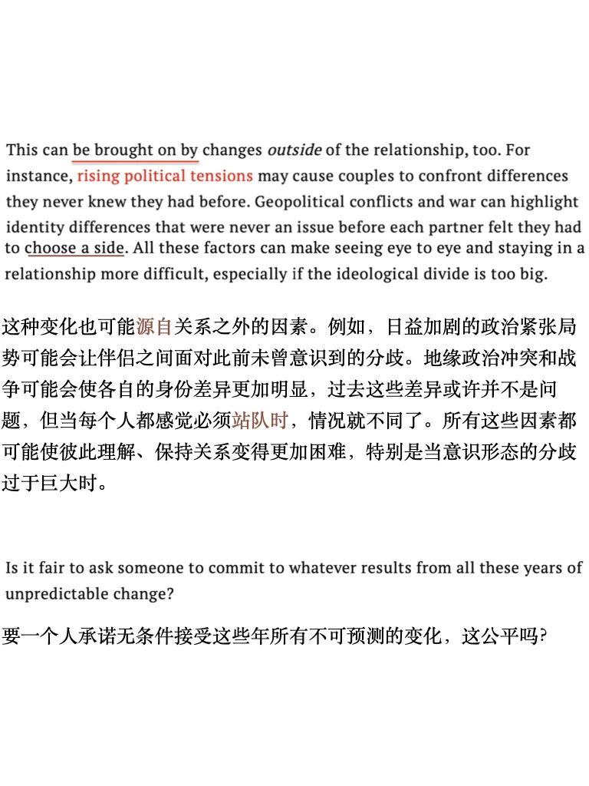
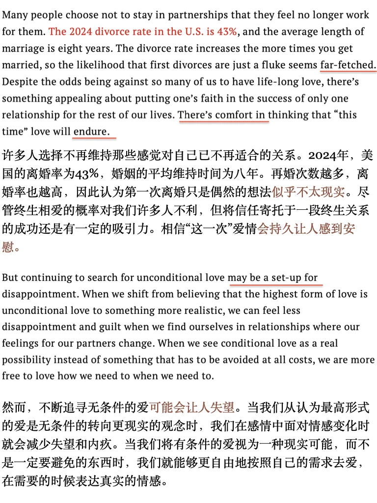
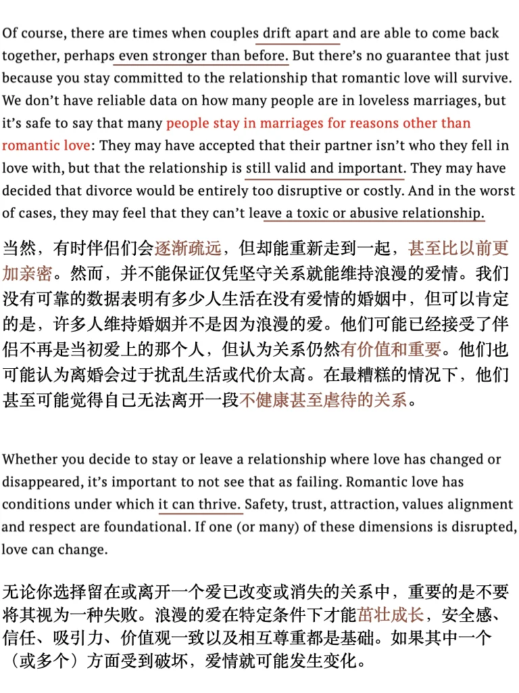

# 外刊泛读｜爱不一定要“无条件”

Time 时代周刊 IDEA - Real love 栏目下的一篇文章 用词难度和篇幅长度都比较友好，Happy Reading～
原文进群get
#雅思备考 #提升亲密关系 #雅思攻略 #爱情观 #健康的爱情观 #外刊 #泛读 #英文原版 #英文阅读 #英语地道表达

## 图片
| 图1 | 图2 | 图3 | 图4 |
| --- | --- | --- | --- |
|  |  |  |  |
|  |  |  |   |

生成时间：2025-11-14 21:06:54