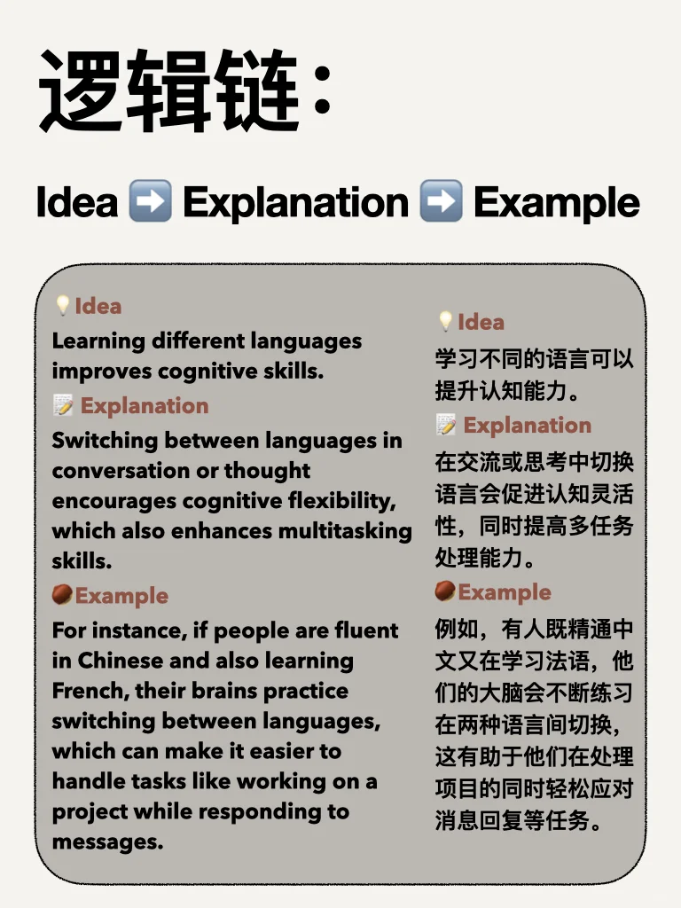
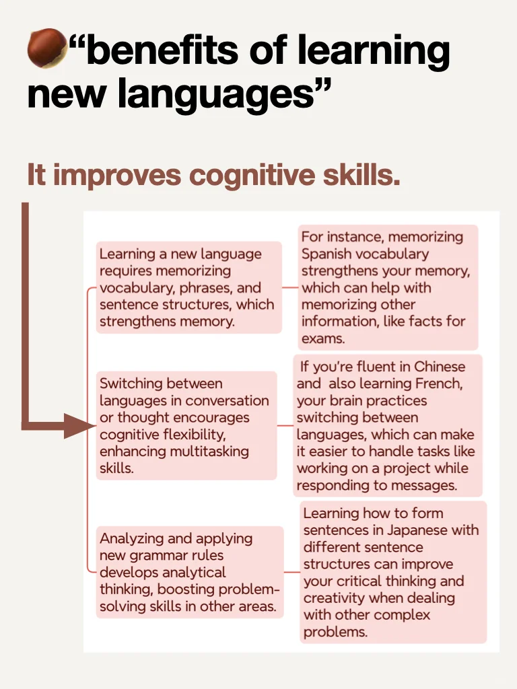
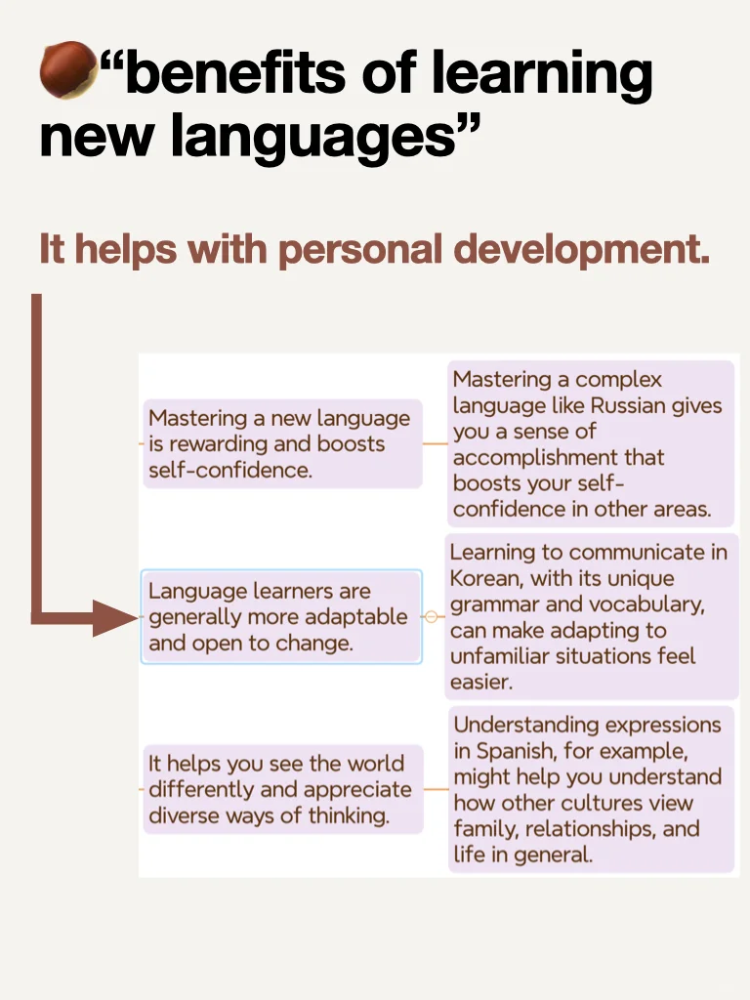
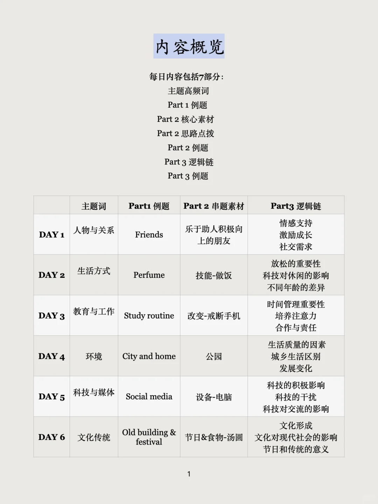

# 雅思口语逻辑怎么练（附思维导图）

清晰的逻辑不仅让考官更容易跟上你的思路，还能展现出你深入思考和精准表达的能力，从而帮助拿到更高分数。
	
今天推荐一个万能的逻辑链发展方式：
Idea ➡️ Explanation ➡️ Example
比如遇到题目：“Should students learn art at school ? ”
1️⃣ 记下自己的主要想法，可能包括：
1. Enhances Creativity
2. Improves Emotional Expression
3. Develops Problem-Solving Skills
4. Builds Confidence
2️⃣ 尝试针对每个想法简单说1-2句解释
比如第一个想法：Enhances Creativity
Art encourages students to explore new ideas and experiment with different techniques. This creative mindset helps them approach problems in innovative ways in various fields.
3️⃣ 将这个想法落实到某个群体上，加些细节，变成例子
For instance, a student designing a sculpture might find unconventional solutions, which could later help them think creatively in a design or engineering career.
	
短期冲刺备考的同学，推荐学习我的“万能救急包”资料。
通过六个角度，学习词汇，掌握逻辑和语料，提升底层能力，不怕换题💪
	
#雅思口语 #英语地道表达 #雅思备考 #雅思口语换题 #雅思口语7分 #雅思口语part3 #逻辑 #雅思口语part3逻辑 #雅思口语万能语料 #雅思

## 图片
| 图1 | 图2 | 图3 | 图4 |
| --- | --- | --- | --- |
|  |  |  |  |
|  |  |  |  |
|  |   |   |   |

生成时间：2025-11-14 21:05:47