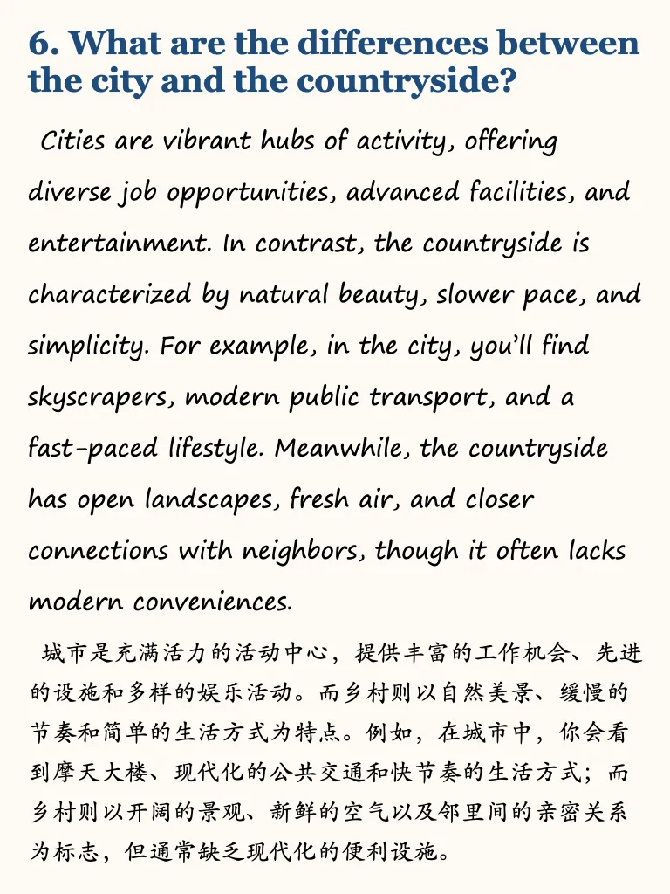
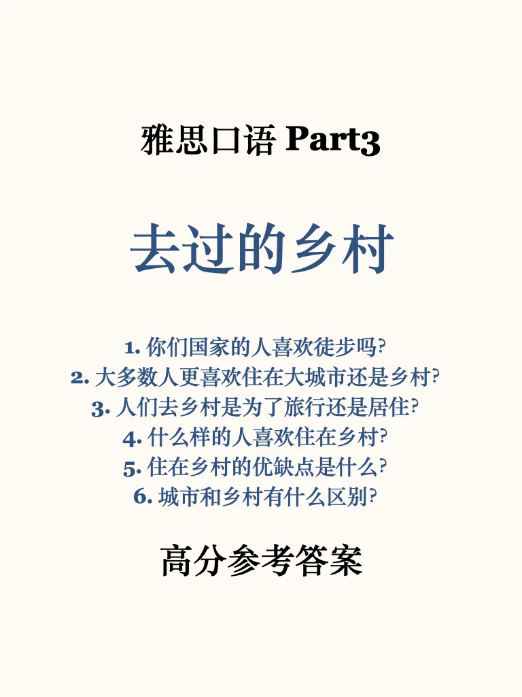
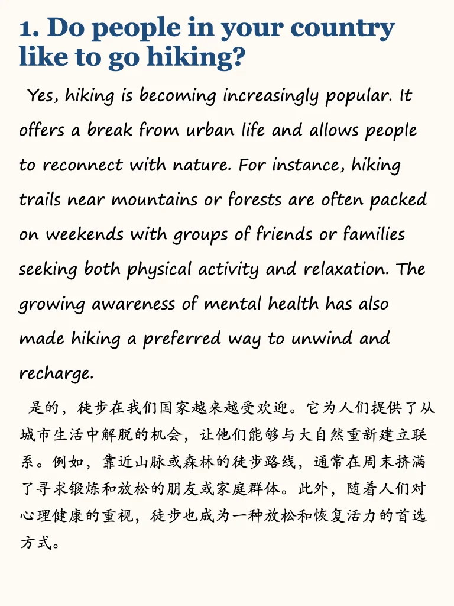
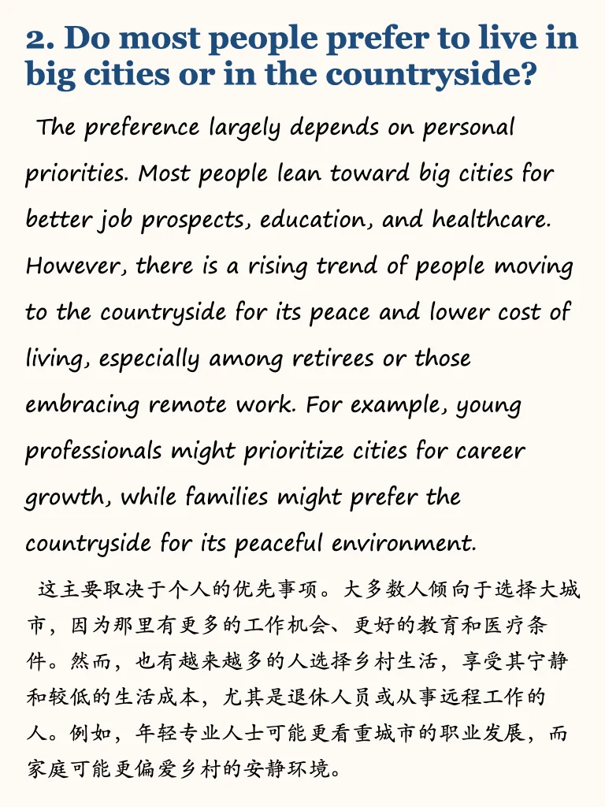
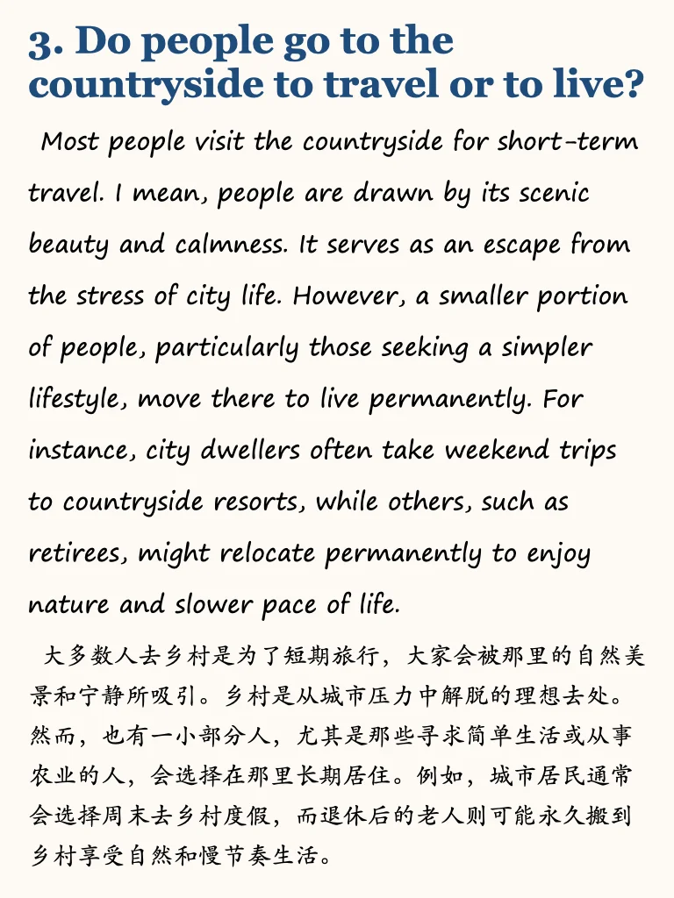
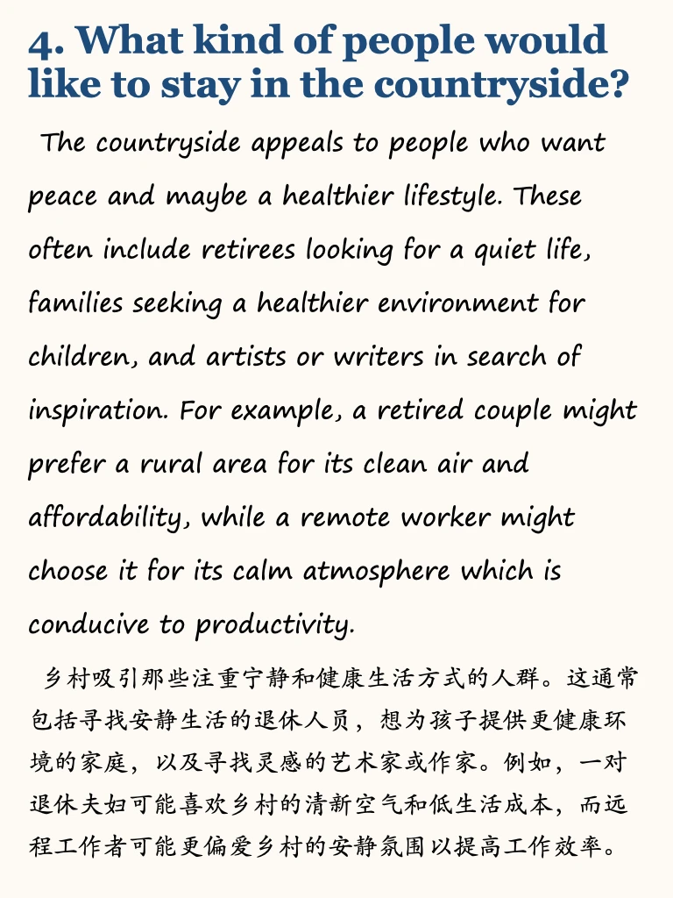
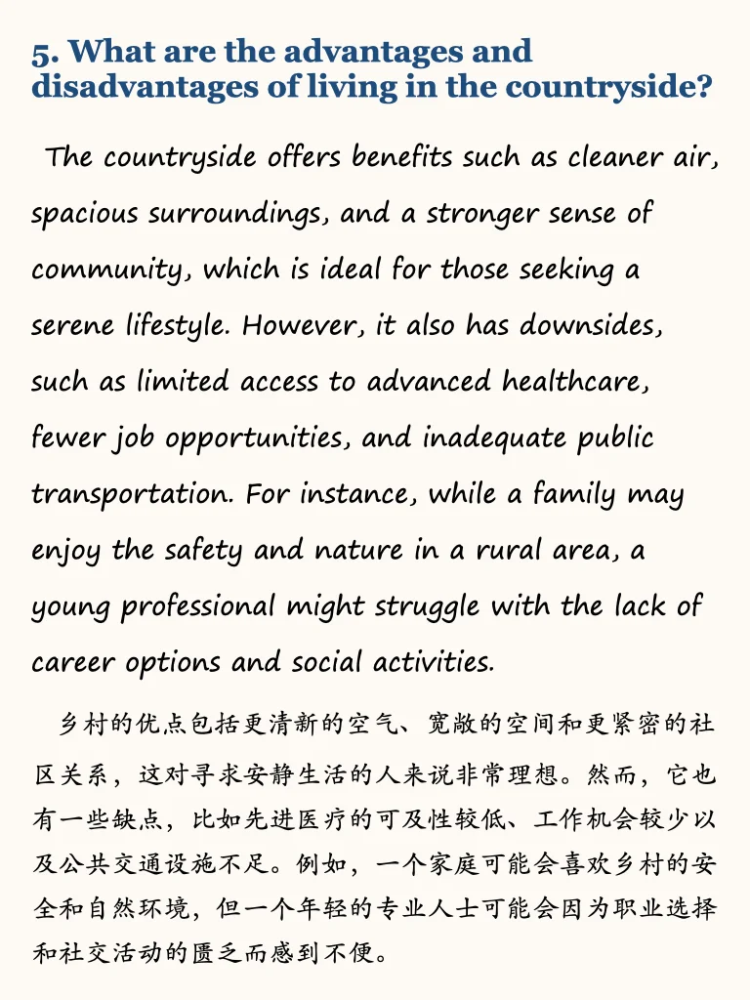

# 雅思口语part3高分参考

题库还在变动中，更考察考生底层语言能力，备考过程中多思考总结💪
近期考试同学可以参考我的救急万能语料，6个主题联系底层能力
希望多练习一些part3的同学可以get答案，随题库更新中～
#雅思口语 #雅思攻略 #雅思考试 #雅思备考 #雅思 #雅思口语part3 #英语地道表达 #雅思口语换题 #雅思口语高分示范

## 图片
| 图1 | 图2 | 图3 | 图4 |
| --- | --- | --- | --- |
|  |  |  |  |
|  |  |  |   |

生成时间：2025-11-14 21:03:33