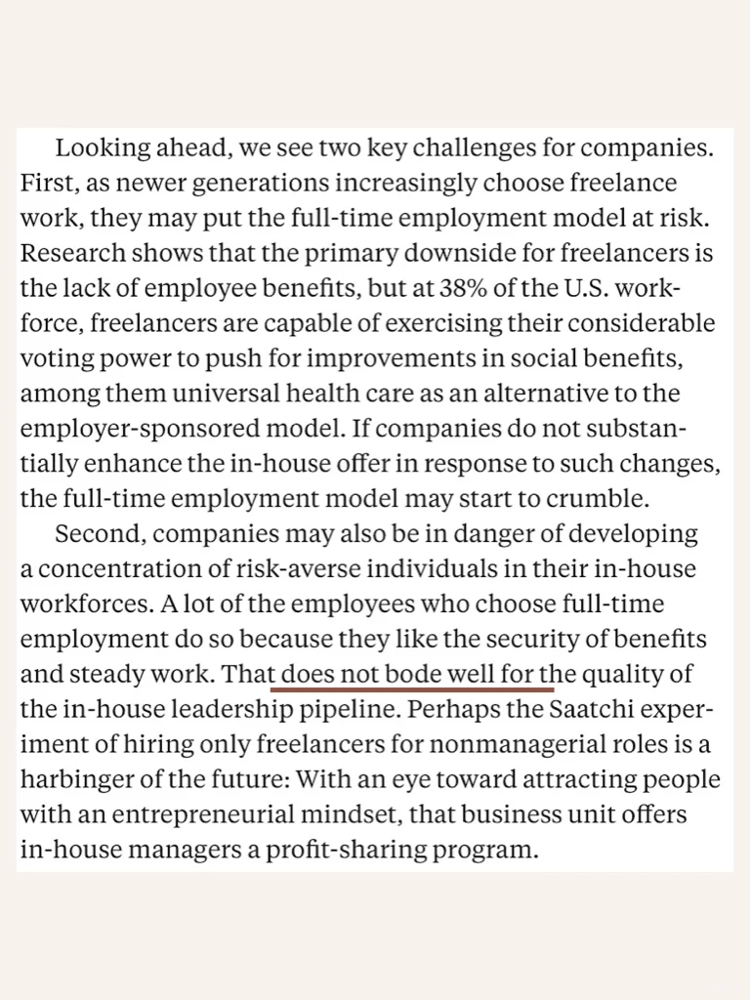

# 外刊习语｜有利/不利的一种替换方法

外刊高频词，快练习起来吧
平时分享的内容受篇幅限制，很多是段落节选或者词汇讲解
我把平时阅读的文章从期刊、网页中筛选出来，以PDF格式保存
想更阅读更完整的外刊原文，欢迎加入群聊🎉
#雅思备考 #翻译学习 #雅思攻略 #每日英语 #英语俚语 #英语地道表达 #外刊精读 #外刊阅读 #英语习语 #雅思攻略

## 图片
| 图1 | 图2 | 图3 | 图4 |
| --- | --- | --- | --- |
|  |  |  |  |

生成时间：2025-11-14 21:02:26