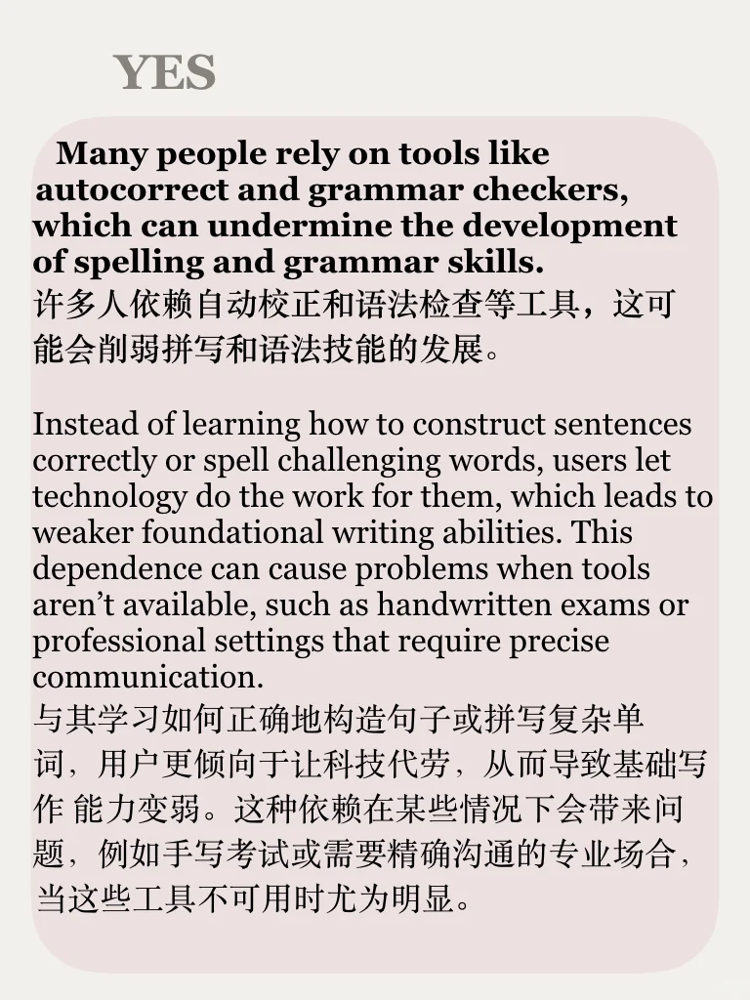
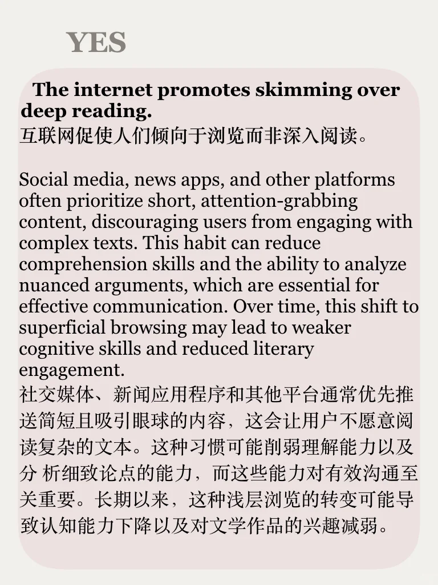
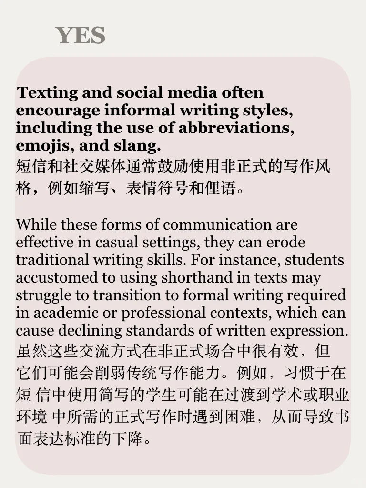
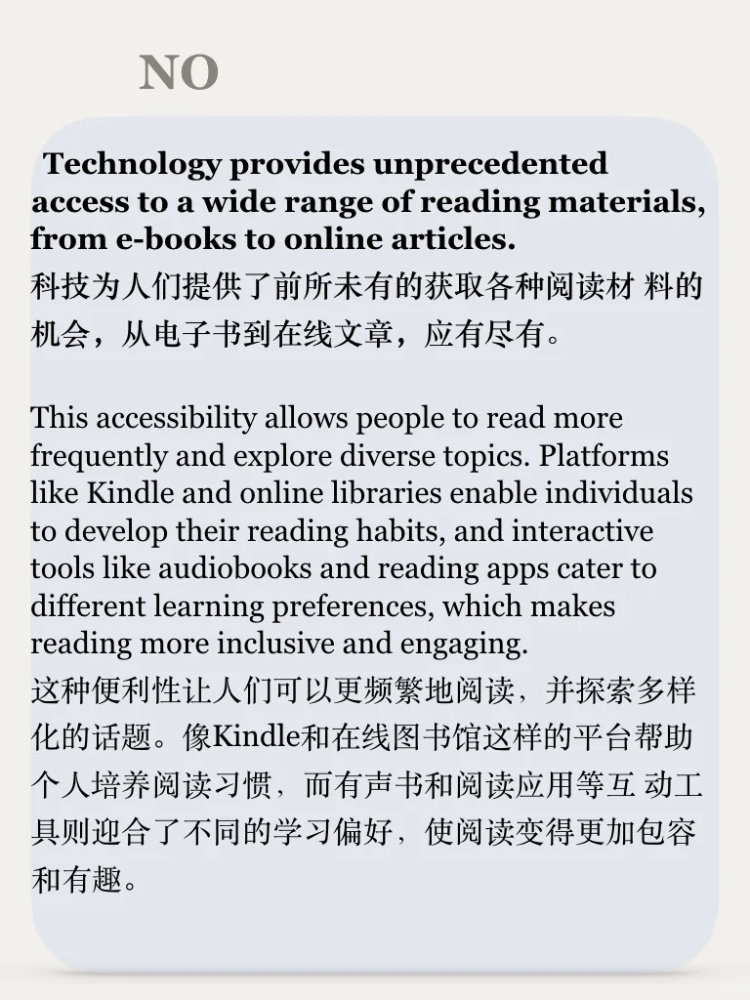

# 思辨能力训练第50期｜说出你的立场

科技成为学习生活中不可或缺一部分，我们是否过于依赖？人们的读写能力是否受到影响而退化？
	
左下角加入我们一起锻炼思辨能力，还赠送电子书哦
#英文写作 #雅思备考 #英语辩论 #思辨 #英语地道表达 #口语 #写作 #观点 #雅思作文观点积累 #雅思口语语料

## 图片
| 图1 | 图2 | 图3 | 图4 |
| --- | --- | --- | --- |
|  |  |  |  |
|  |  |  |   |

生成时间：2025-11-14 21:01:21