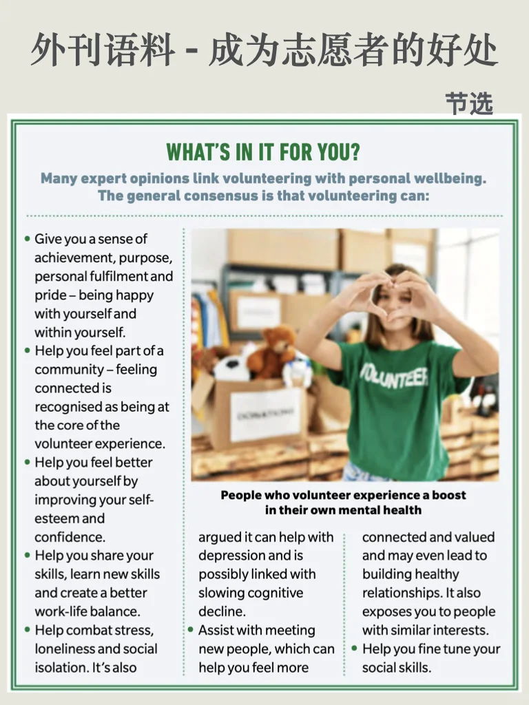
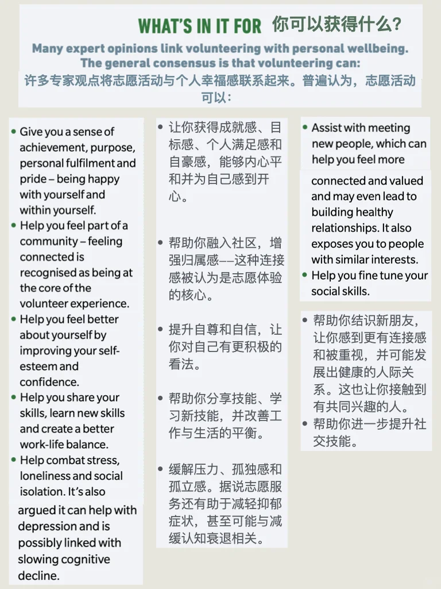
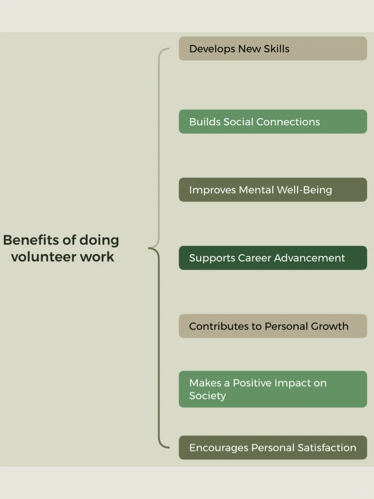
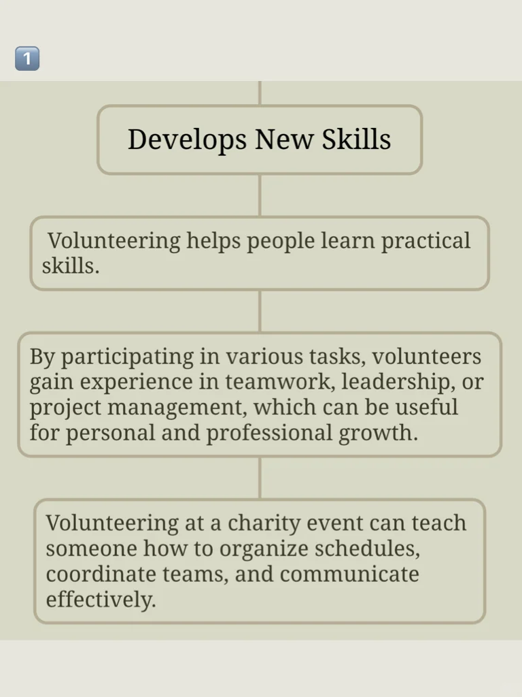
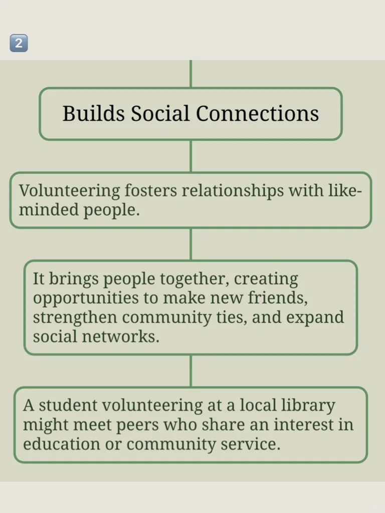
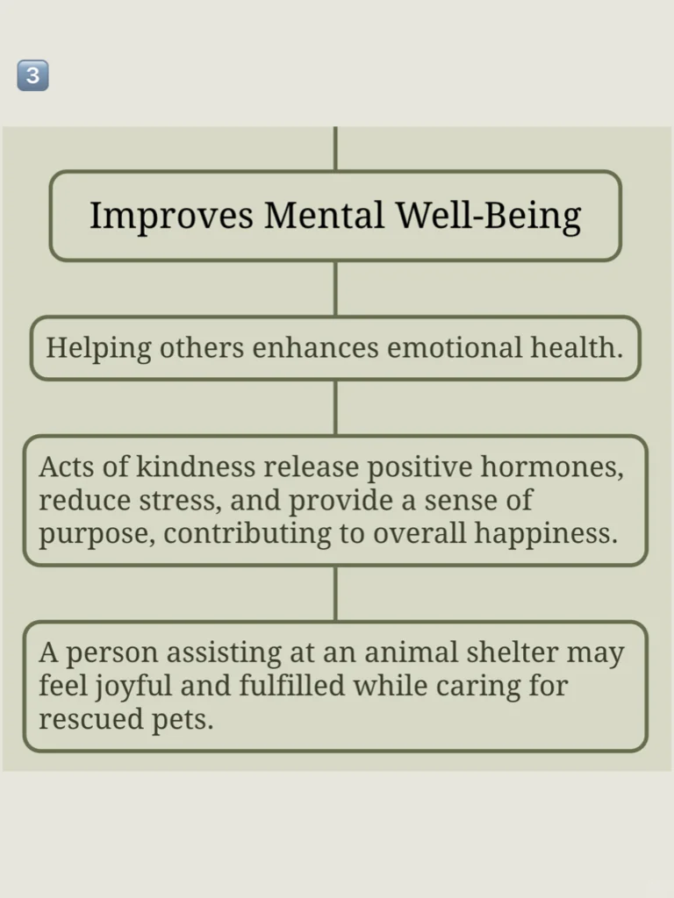
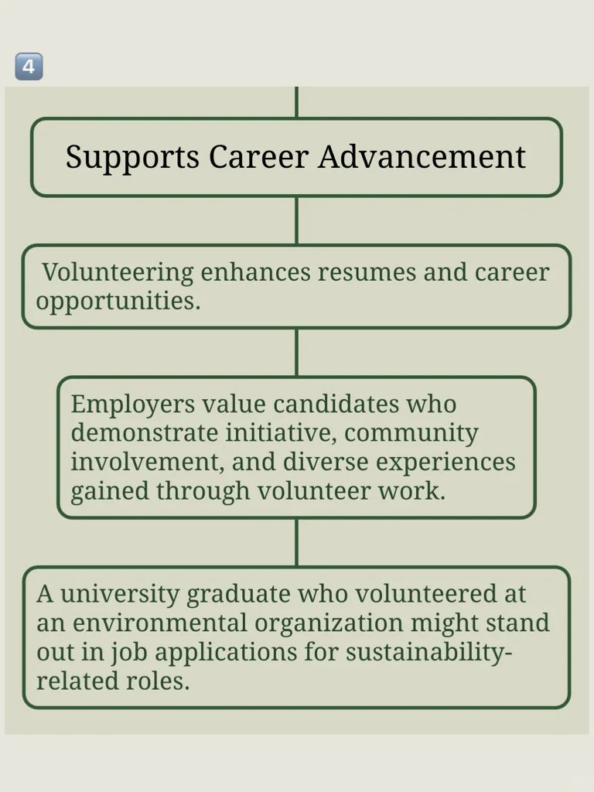
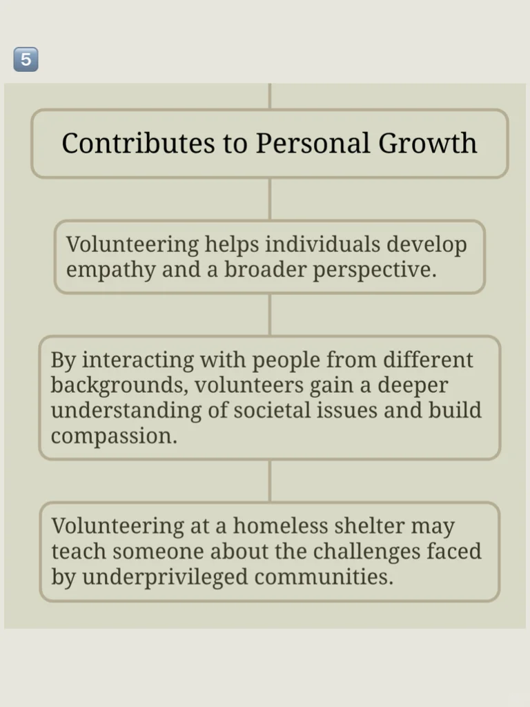
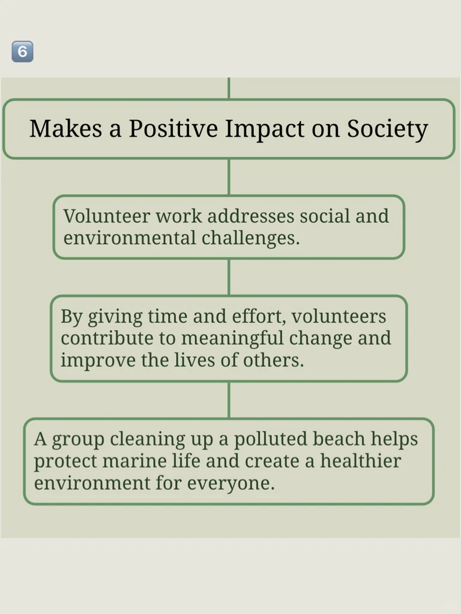

# 外刊语料｜志愿者活动利人利己（附思维导图）

文章节选自读者文摘，完整文章进群get🌹
	
志愿者活动话题也是雅思口写常出现的讨论方向，给大家编辑了思维导图，加深印象，也欢迎补充其他想法#雅思备考 #雅思攻略 #雅思口语 #外刊 #英语地道表达 #四六级 #考研英语 #志愿者 #外刊精读 #口语写作

## 图片
| 图1 | 图2 | 图3 | 图4 |
| --- | --- | --- | --- |
|  |  |  |  |
|  |  |  |  |
|  |  |   |   |

生成时间：2025-11-14 20:59:08