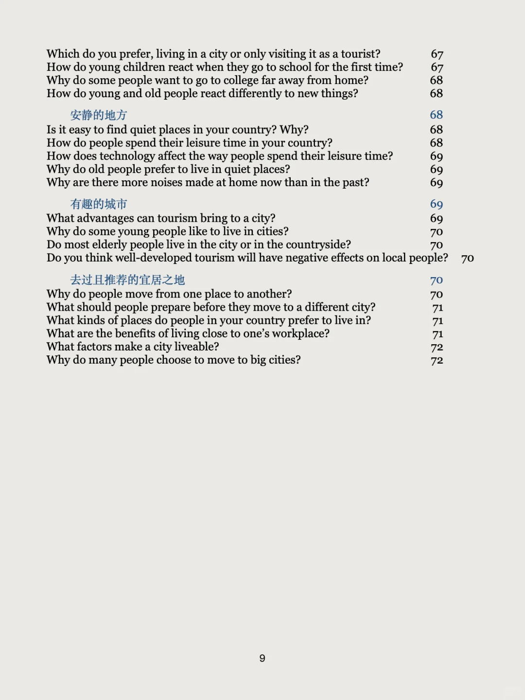
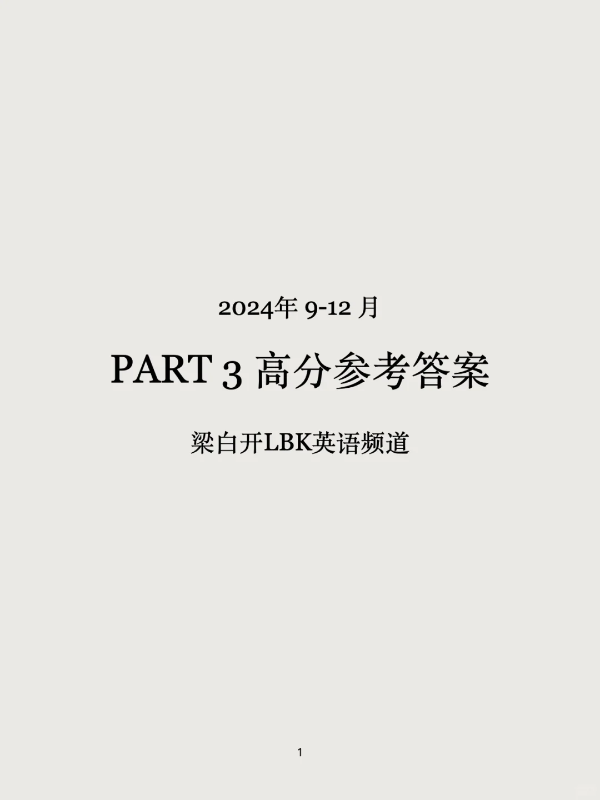
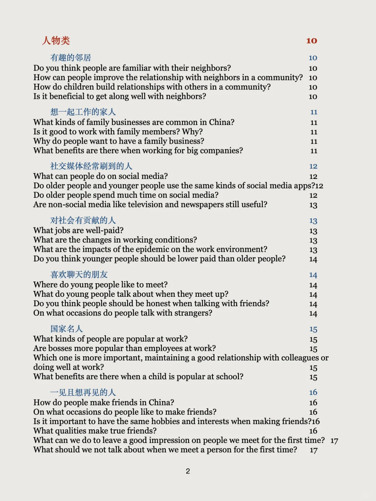
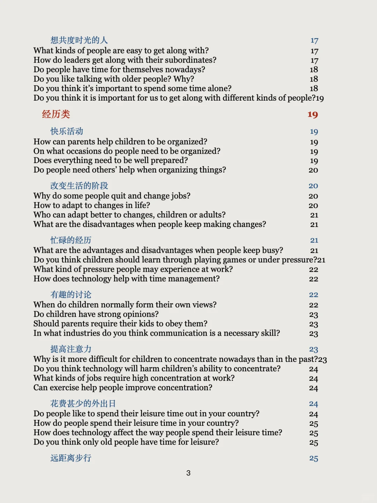
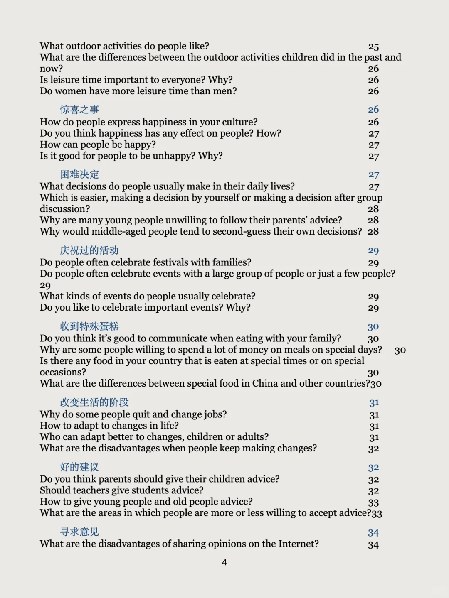
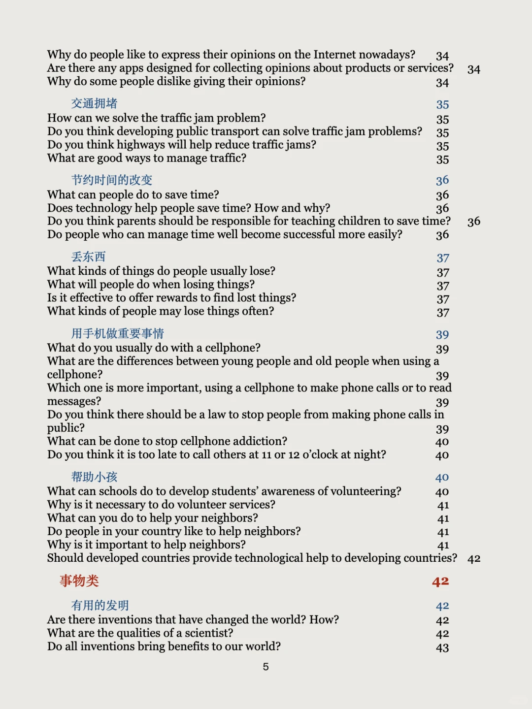
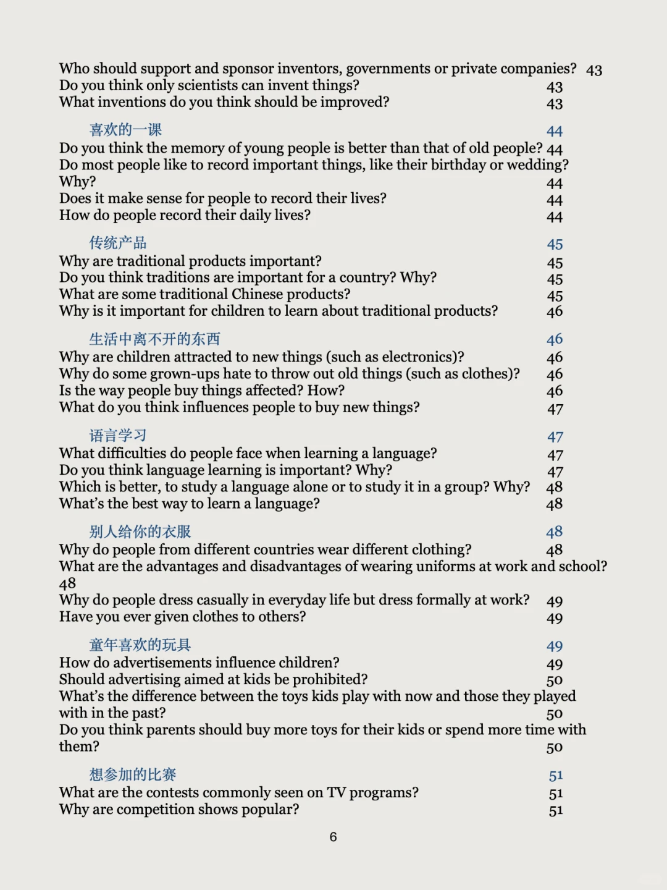
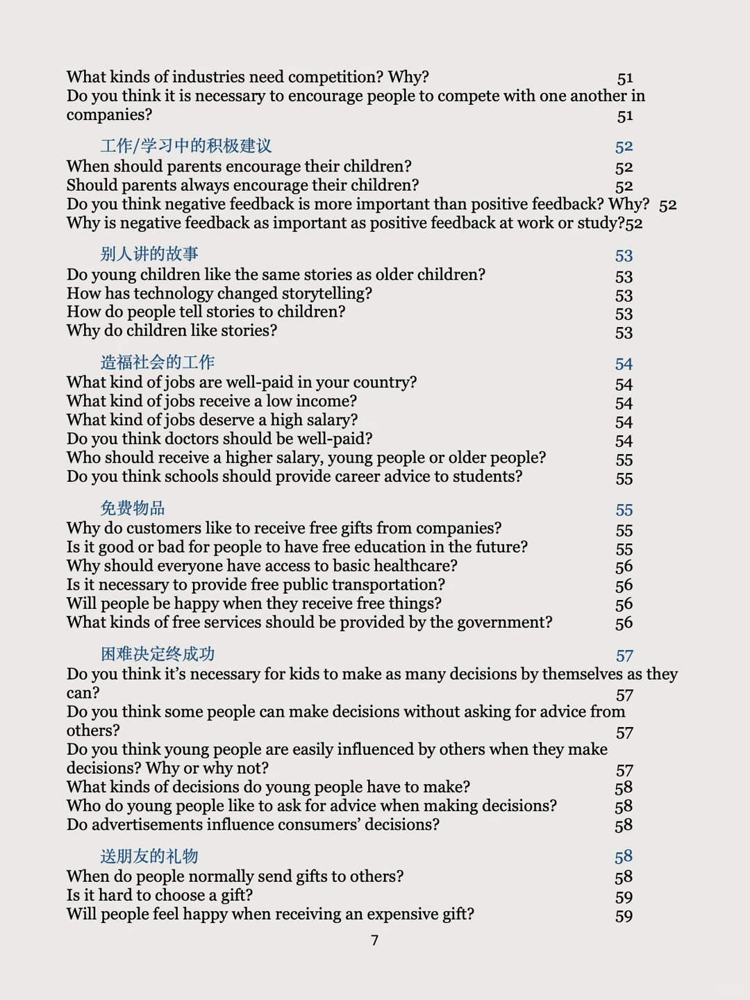
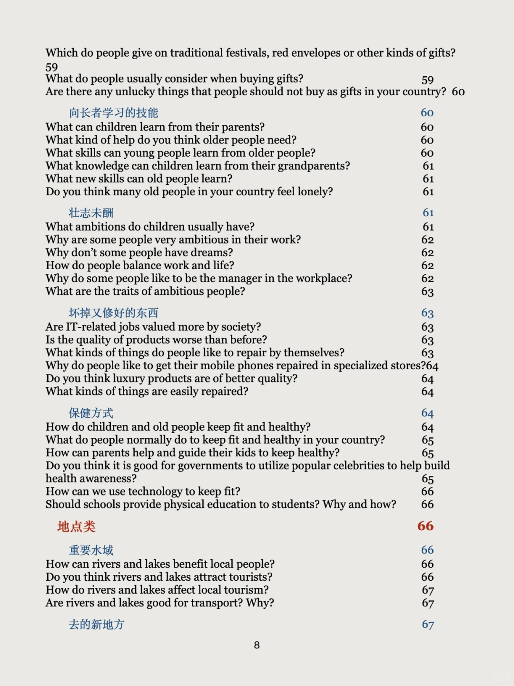

# 题量暴增 怒写200多个Part3答案

原本9-12月题库有50+part2
十月底变动以来，又新增了50，每个part2对应4-6个part3，我能收集到的都写了答案
后期还有的话，那就持续加更
part3 不仅是考官“探测实力”的环节，还可以是你“逆风翻盘”的一趴，烤鸭们要注重练习，给出清晰有深度的答案。左下角get全部参考答案，丰富你的语言和观点
备考时间比较紧的考生，不建议这么大的学习范围啦，可以参考我的“救急包”快速锻炼底层能力
#雅思备考 #雅思预测 #雅思攻略 #雅思考试 #雅思口语 #雅思 #雅思口语part3 #雅思口语换题 #雅思口语part3新题答案 #雅思口语高分答案

## 图片
| 图1 | 图2 | 图3 | 图4 |
| --- | --- | --- | --- |
|  |  |  |  |
|  |  |  |  |
|  |   |   |   |

生成时间：2025-11-14 20:56:52