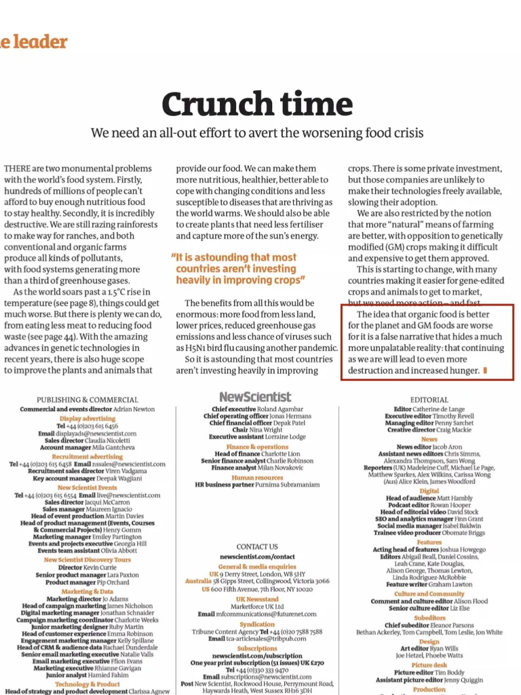
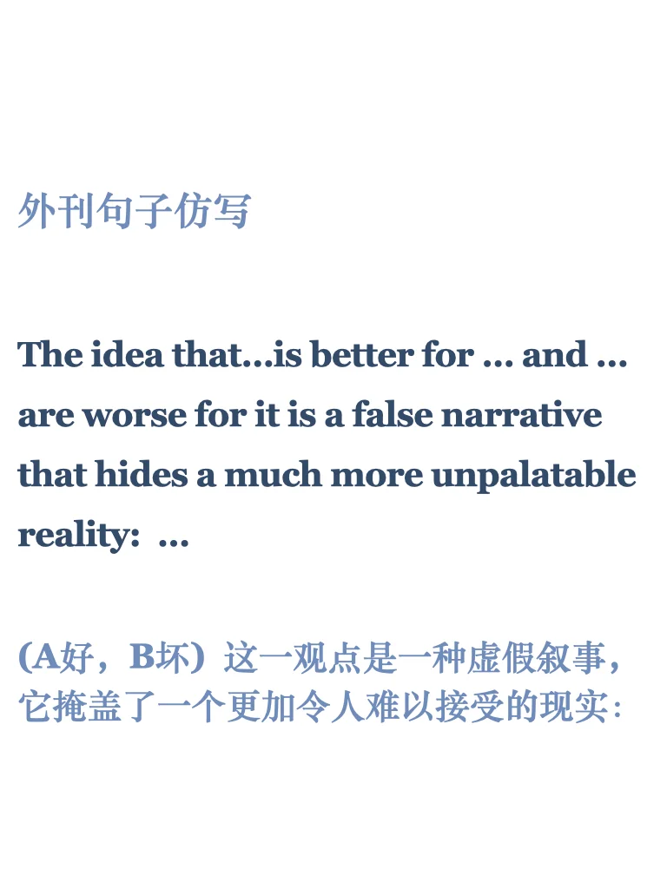

# 写作提升｜写出“虚假叙事”掩盖的事实

今天仿写一句“长难句”，三个主要部分构成，细节分析和更多练习点击右下角get 每周一期，仿写高级句型，今天更新至33期啦。
	
本句原文来自new scientist，原文进群get#雅思备考 #英语写作 #雅思攻略 #每日英语 #英文写作 #英语地道表达 #外刊 #四六级 #考研英语 #长难句

## 图片
| 图1 | 图2 | 图3 | 图4 |
| --- | --- | --- | --- |
|  |  |  |  |
|  |   |   |   |

生成时间：2025-11-14 20:52:25