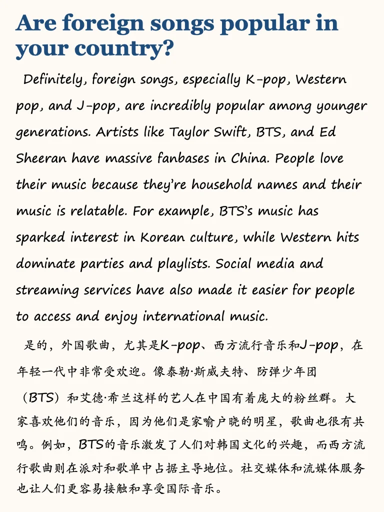
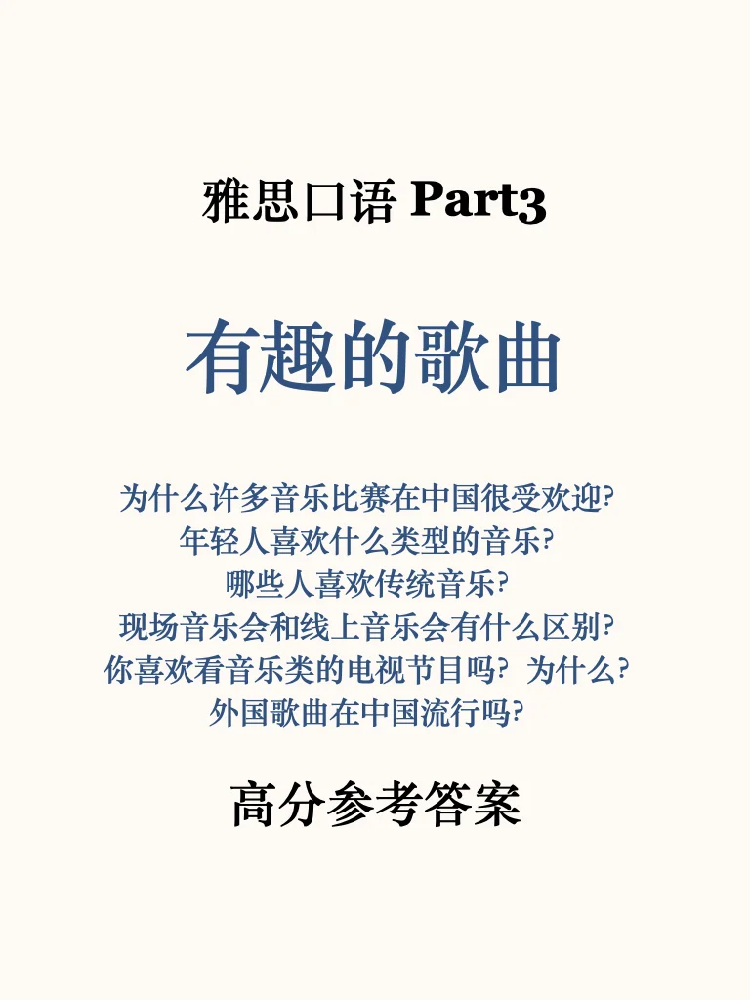
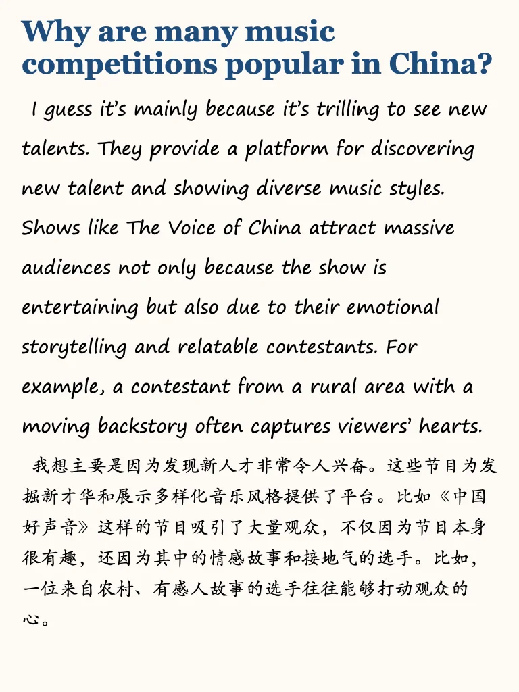
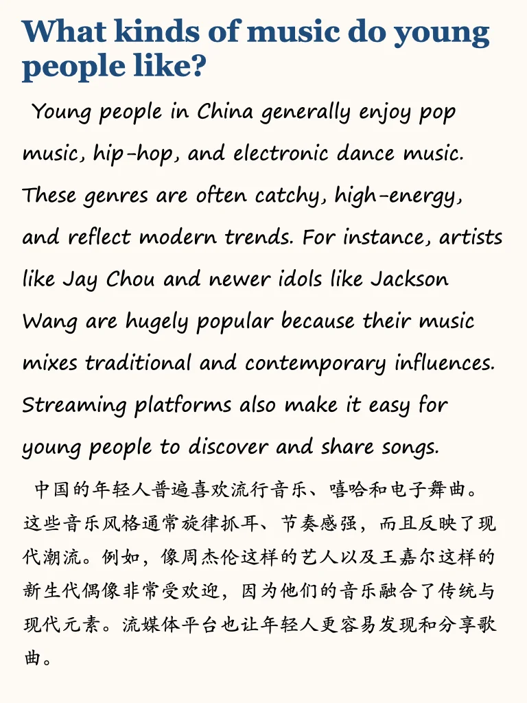
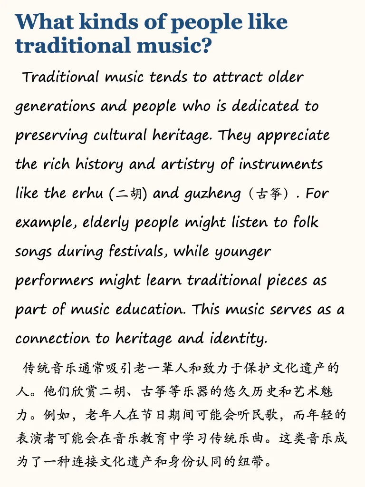
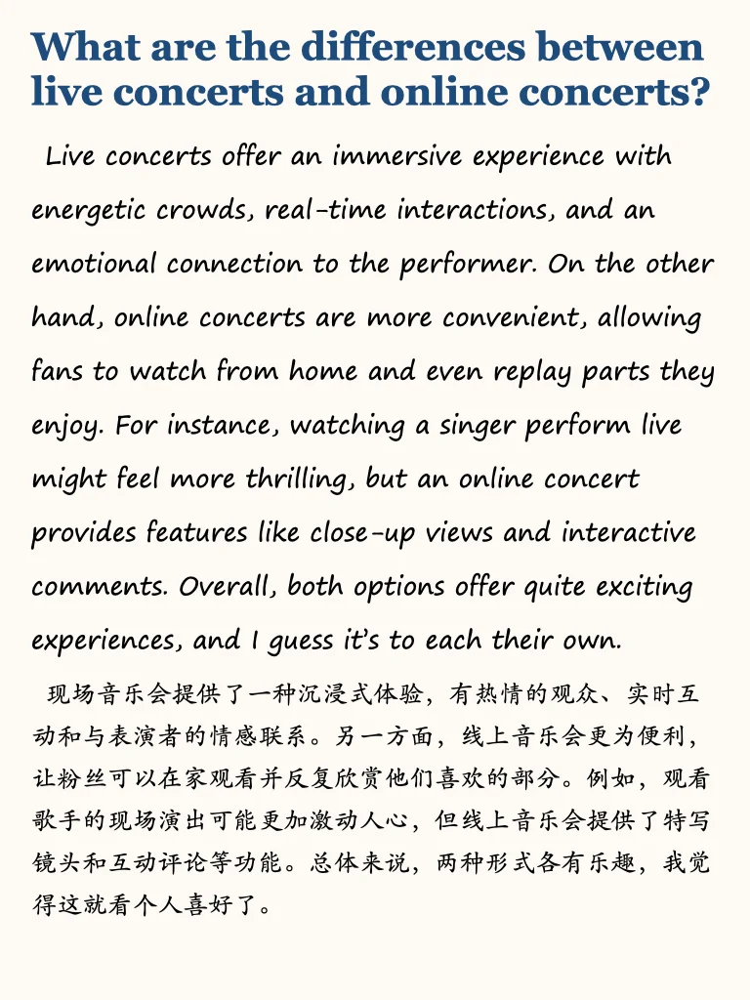

# 雅思口语高分参考｜音乐相关问题

左下角get 目前更新103个主题part3，每个主题下4-6的题
	
part3是高分目标同学应该多投入时间练习的部分💪
如果备考时间紧张，可以参考我的救急包，六个主题练透题库
#雅思备考 #雅思口语 #雅思攻略 #雅思考试 #屠雅攻略 #雅思 #雅思口语换题 #雅思口语高分示范 #雅思口语part3#雅思口语万能句

## 图片
| 图1 | 图2 | 图3 | 图4 |
| --- | --- | --- | --- |
|  |  |  |  |
|  |  |  |   |

生成时间：2025-11-14 20:50:14