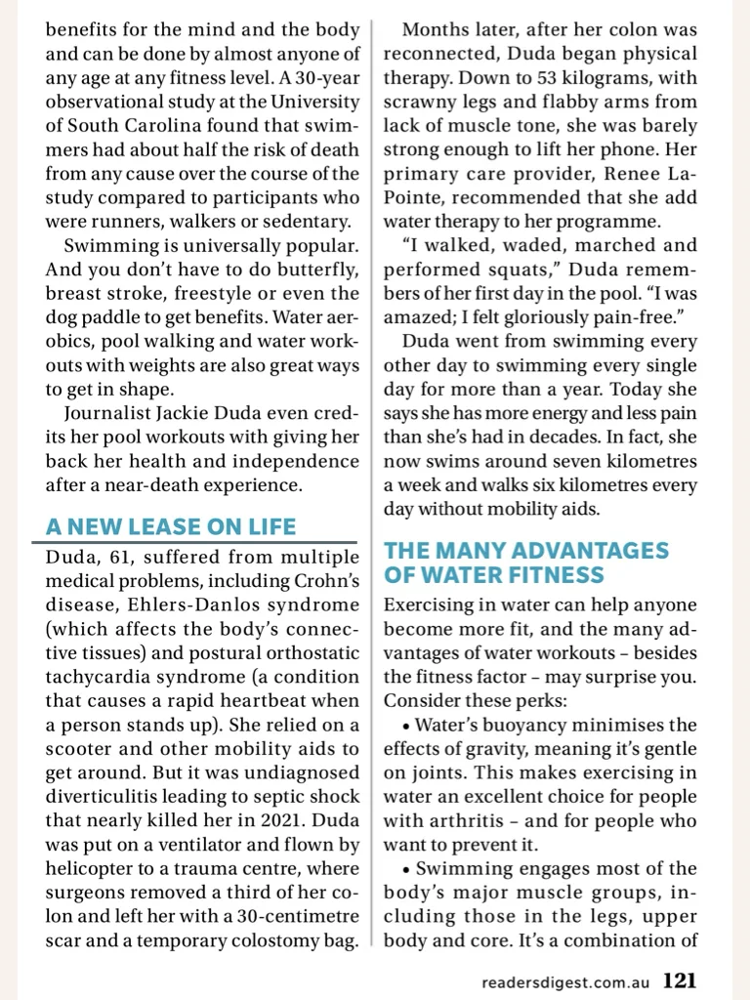
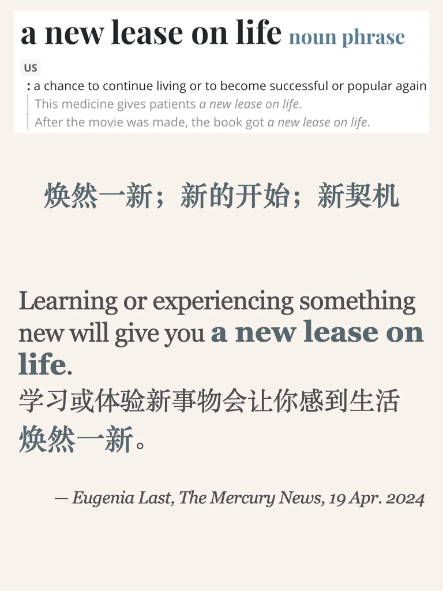

# 外刊习语｜焕然一新

今天的习语来自reader’s digest
文章主题为水上活动比如游泳的好处，想读完整原文可以进我的外刊群
#雅思备考 #翻译学习 #雅思攻略 #每日英语 #英语地道表达 #英语翻译 #外刊精读 #四六级 #考研英语 #外刊

## 图片
| 图1 | 图2 | 图3 | 图4 |
| --- | --- | --- | --- |
|  |  |  |  |

生成时间：2025-11-14 20:48:01