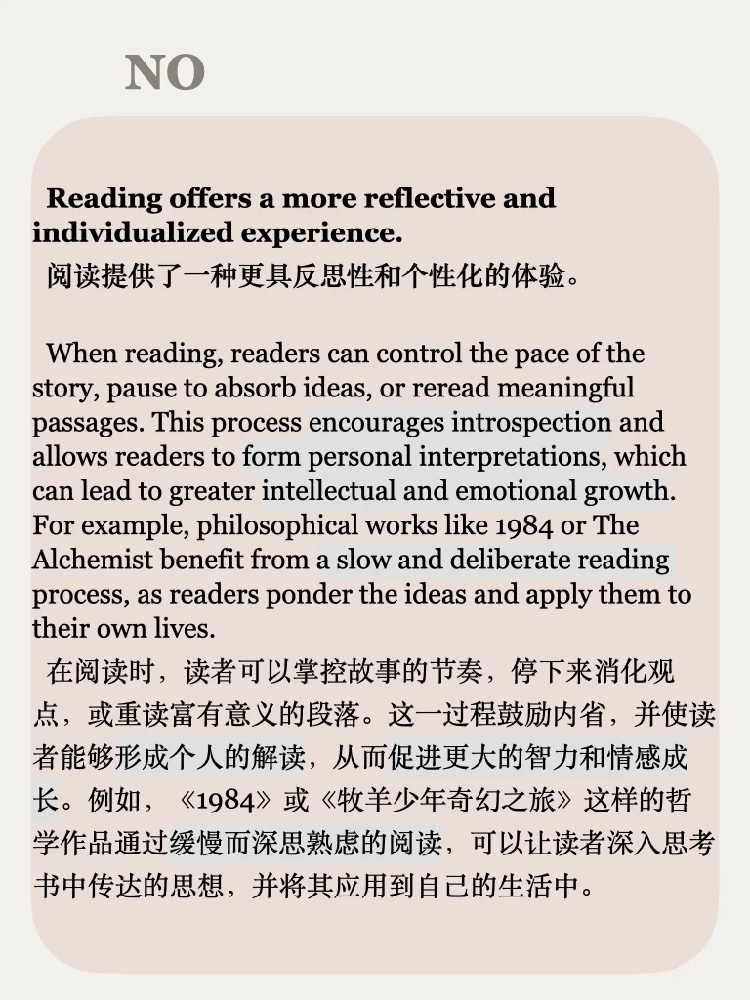
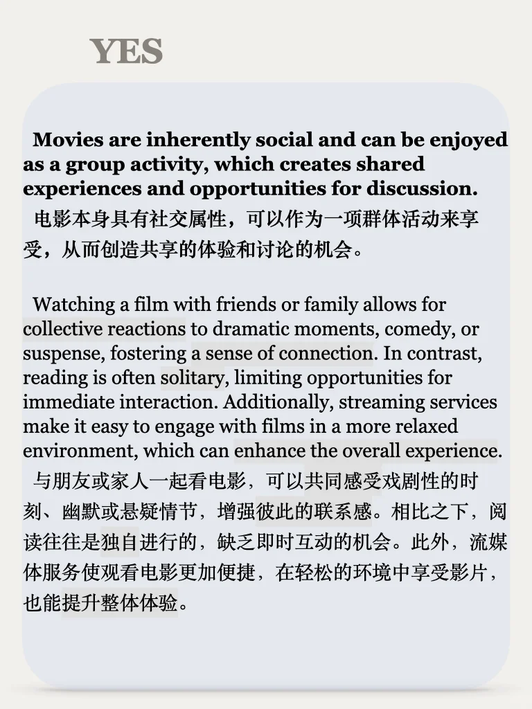
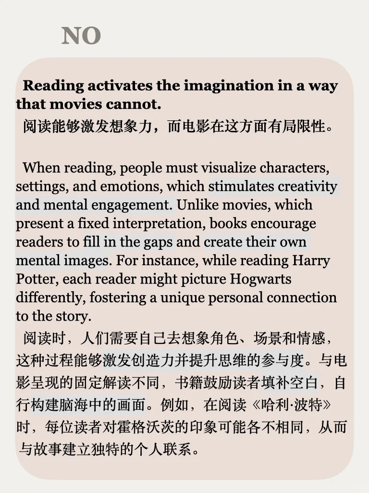
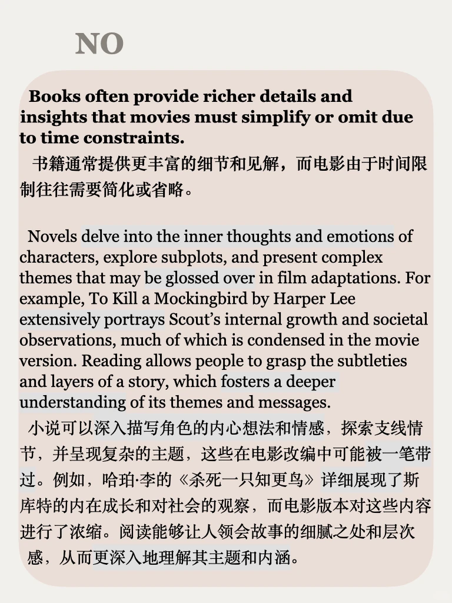

# 思辨能力练习51期｜说出你的想法

今天是思辨练习的第51期啦，尝试表达自己的立场并且解释和例证吧～
思辨全部资料点击左下角get，语料丰富 ，话题广泛，适合作为口语和写作的素材积累
每周一更，永久更新
#英文学习 #长期主义 #雅思备考 #雅思攻略 #英语素材 #英语地道表达 #思辨能力 #英语教育分享 #四六级 #考研英语

## 图片
| 图1 | 图2 | 图3 | 图4 |
| --- | --- | --- | --- |
|  |  |  |  |
|  |  |  |   |

生成时间：2025-11-14 21:00:14