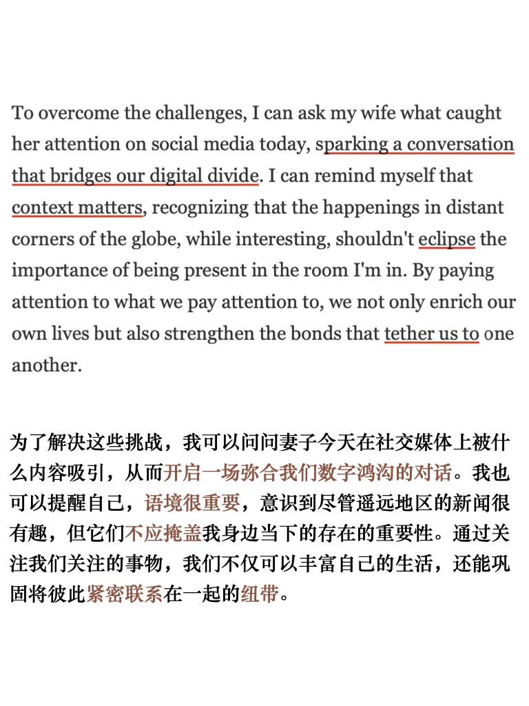
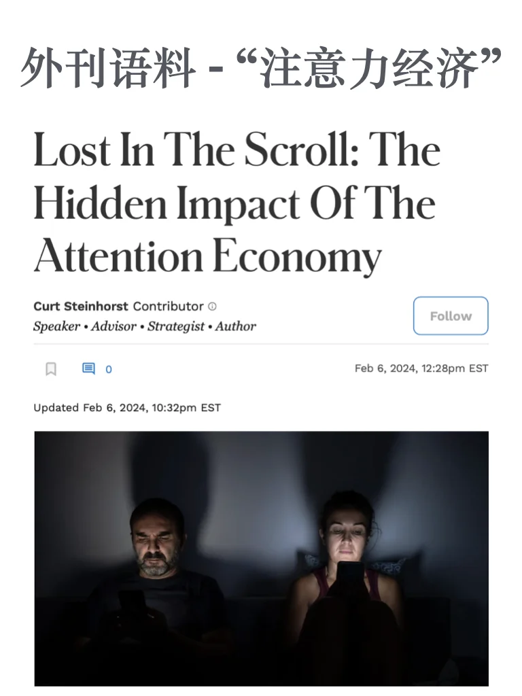
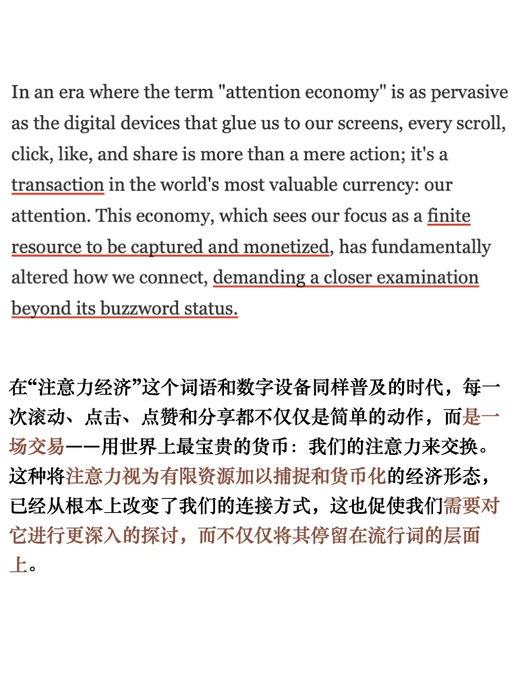
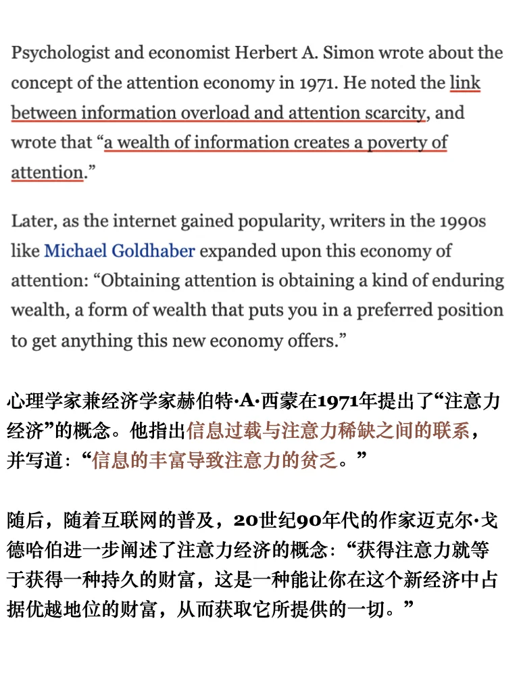
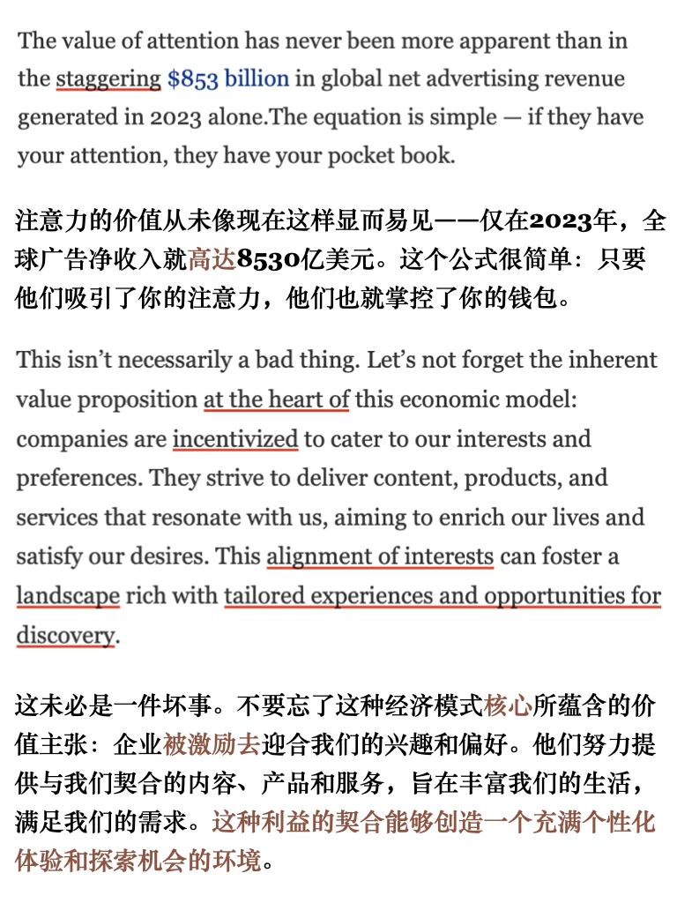
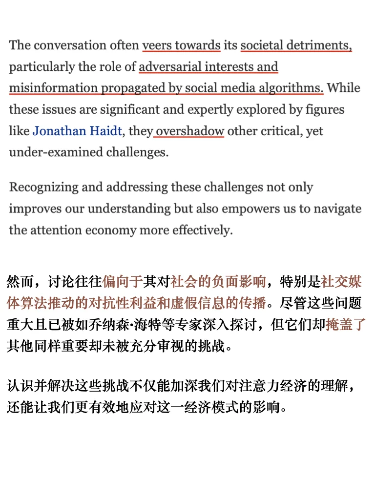
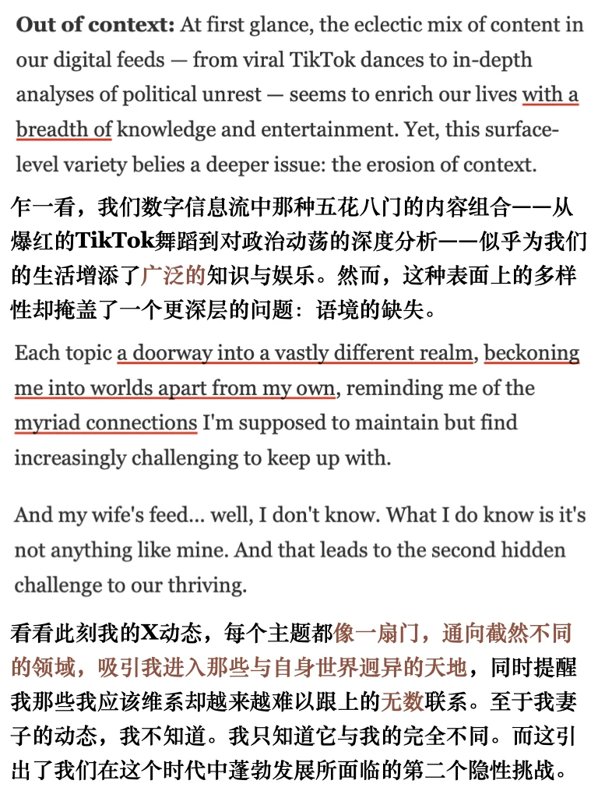
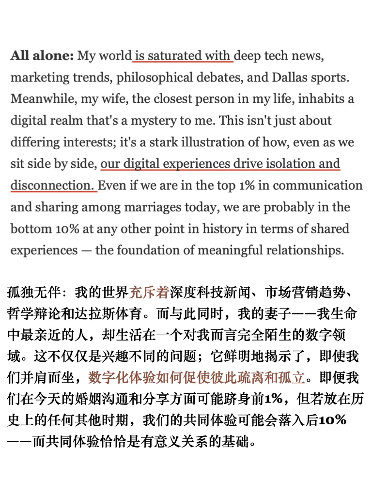
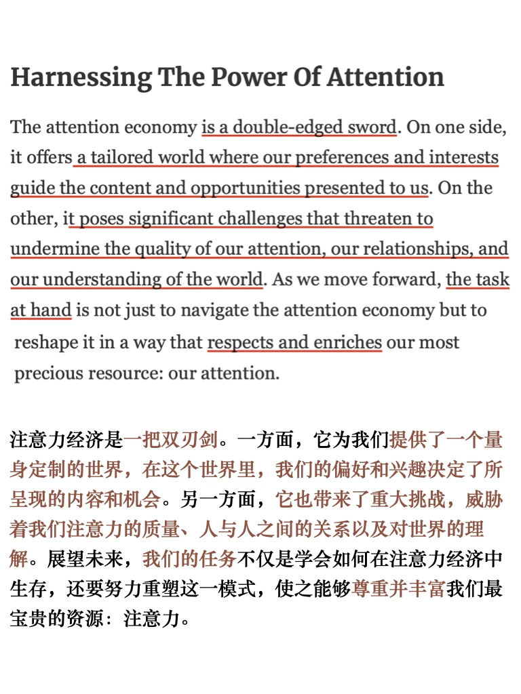

# 外刊泛读 ｜信息丰富导致注意力匮乏

今天的泛读主题和上周五分享的播客主题相近，来自Forbes，完整原文PDF 可以进群get 我读过或分享过的外刊都在里面啦
	
#外刊 #外刊精读 #英语泛读 #四六级 #考研英语 #写作素材 #观点 #雅思备考 #英语地道表达 #冲破信息茧房

## 图片
| 图1 | 图2 | 图3 | 图4 |
| --- | --- | --- | --- |
|  |  |  |  |
|  |  |  |  |
|  |  |   |   |

生成时间：2025-11-14 20:58:01