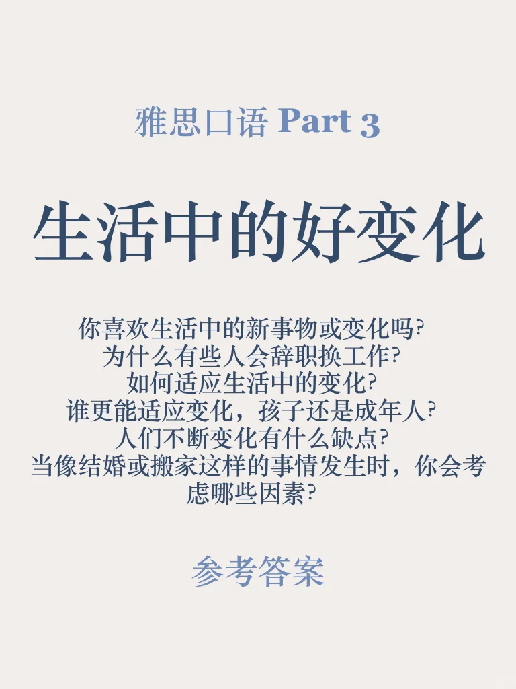
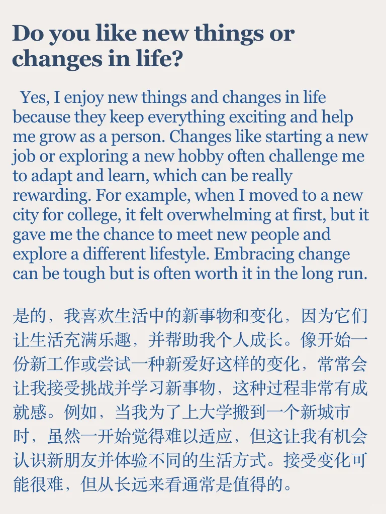
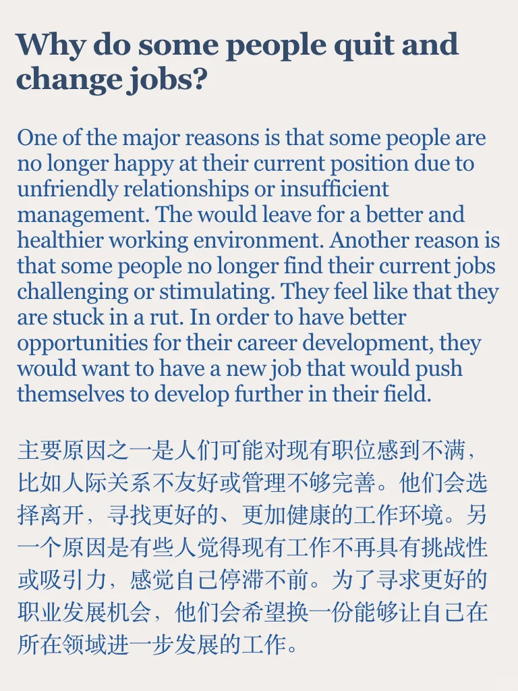
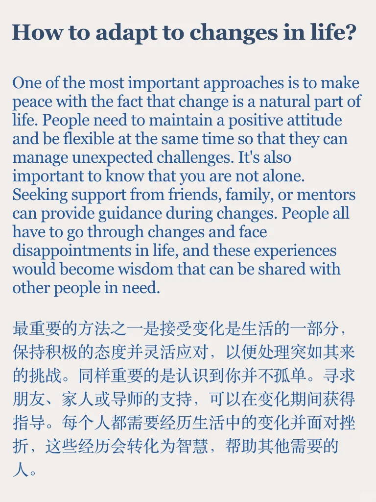
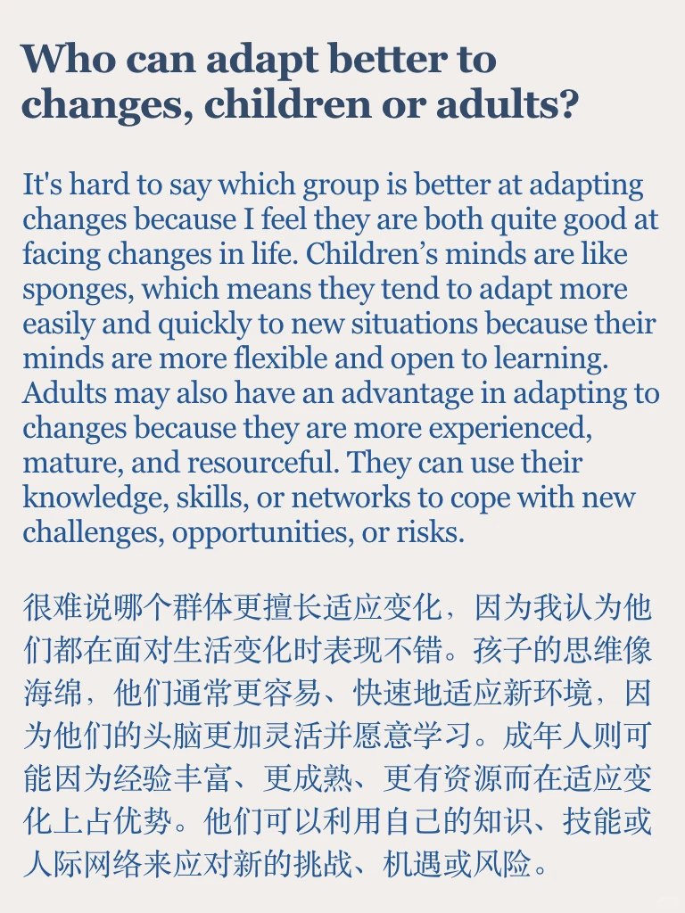
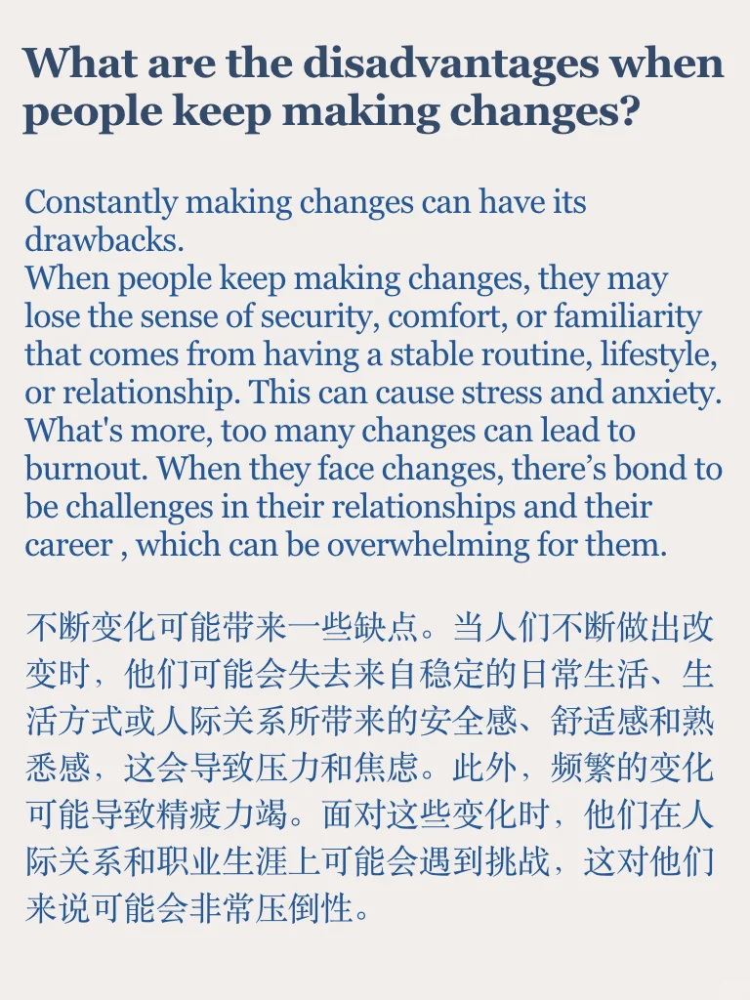

# 雅思口语Part3参考｜好的变化

近期高频Part2 ： something that changed your life in good ways
Part 3 主要讨论变化的原因、影响、应对
目前整理了100多个part2题目对应的
400多个part3问题答案
左下角get
	
备考时间短，冲高分的小伙伴，可以参考我的救急包，六个主题看透题库💪
#雅思备考 #雅思口语 #雅思考试 #雅思 #雅思攻略 #英语地道表达 #雅思口语换题 #雅思口语part3 #雅思口语素材

## 图片
| 图1 | 图2 | 图3 | 图4 |
| --- | --- | --- | --- |
|  |  |  |  |
|  |  |  |   |

生成时间：2025-11-14 20:53:31