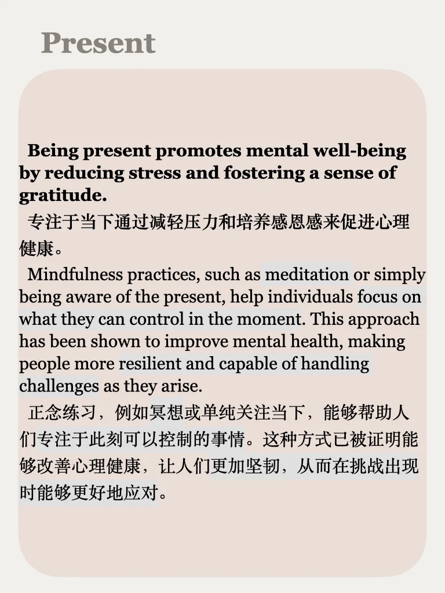
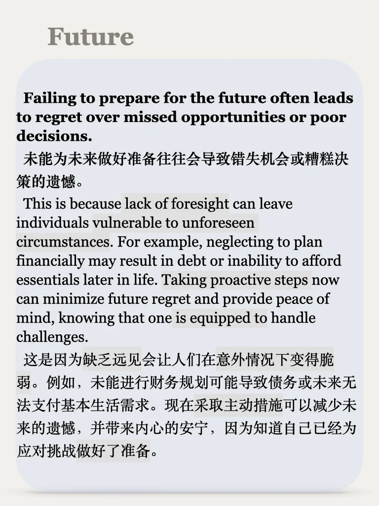
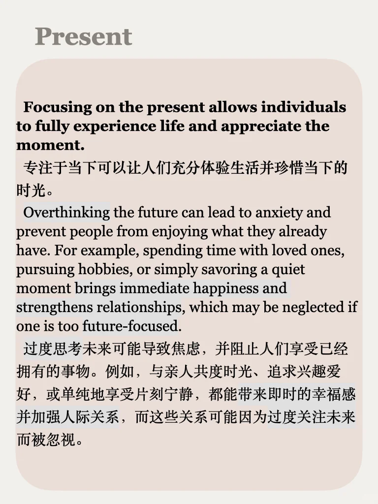
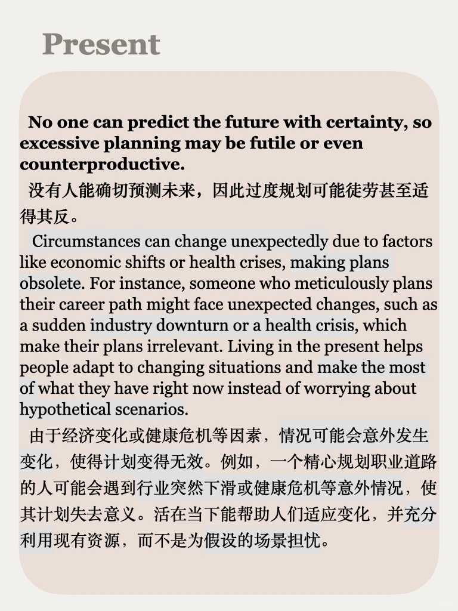

# 思辨能力培养53｜说出你的想法

尝试表达自己的立场，并为自己的想法进行例证解释，培养辨证与逻辑能力💪
53期&持续更新，左下角get
#雅思 #英语地道表达 #雅思攻略 #英语写作 #写作素材 #考研英语 #四六级 #思辨 #立场 #英语辩论

## 图片
| 图1 | 图2 | 图3 | 图4 |
| --- | --- | --- | --- |
|  |  |  |  |
|  |  |  |   |

生成时间：2025-11-14 20:49:08