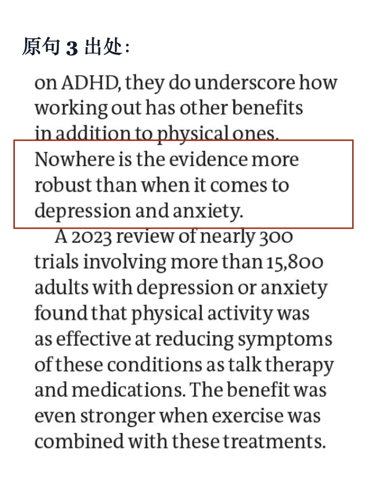
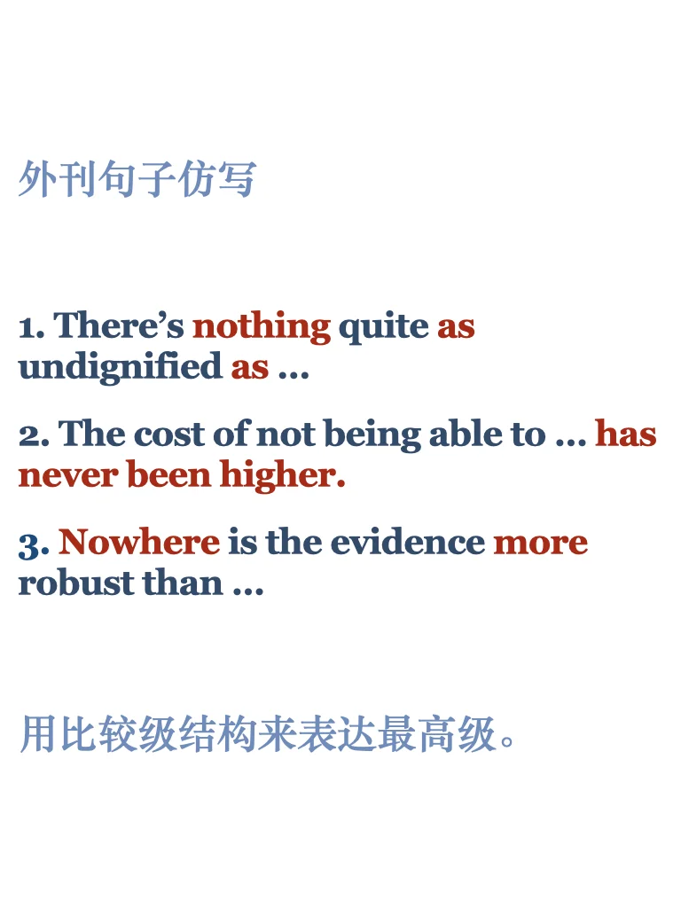
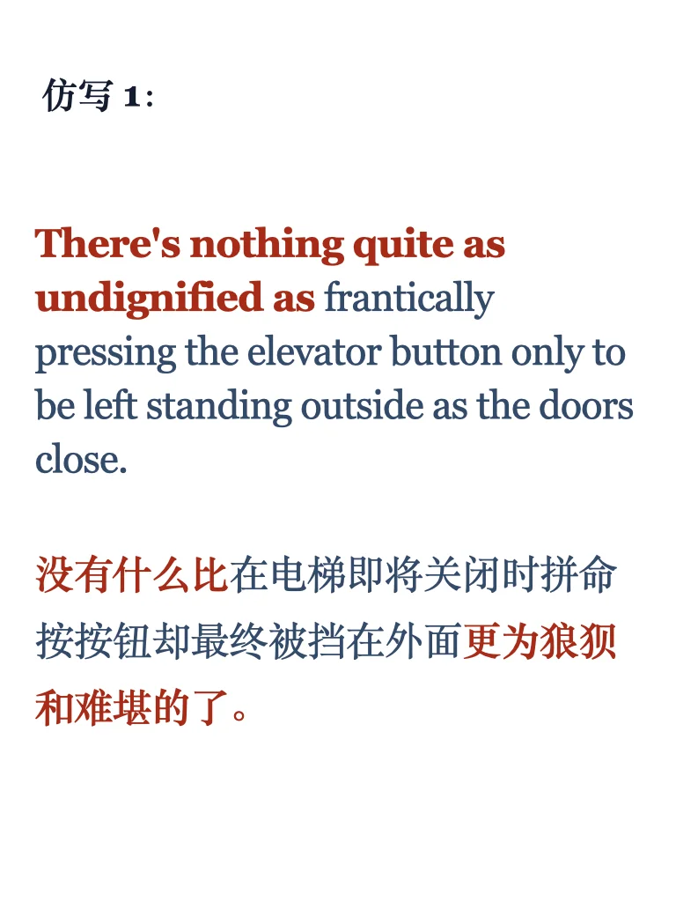
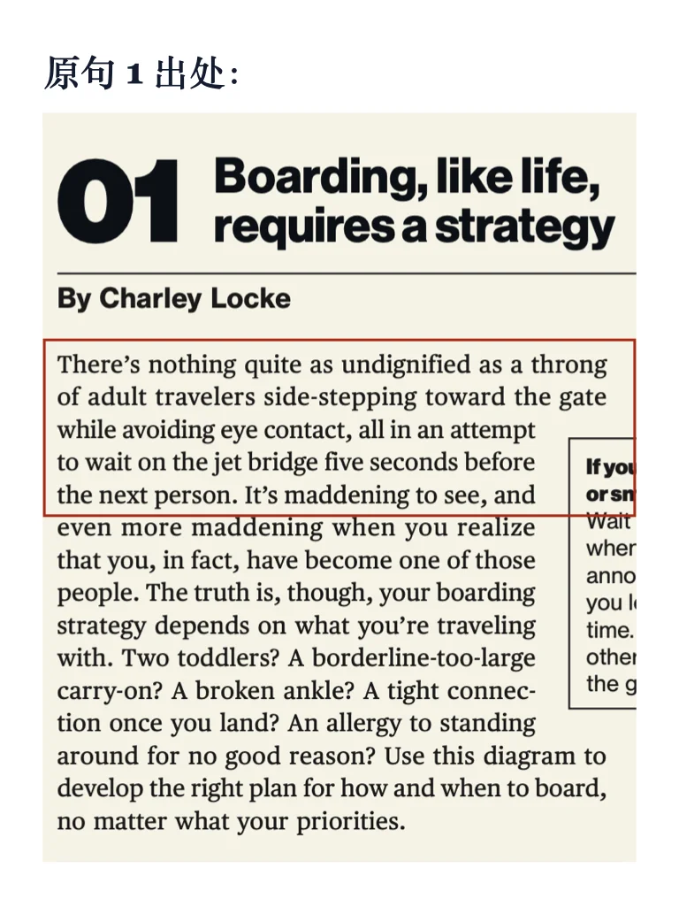
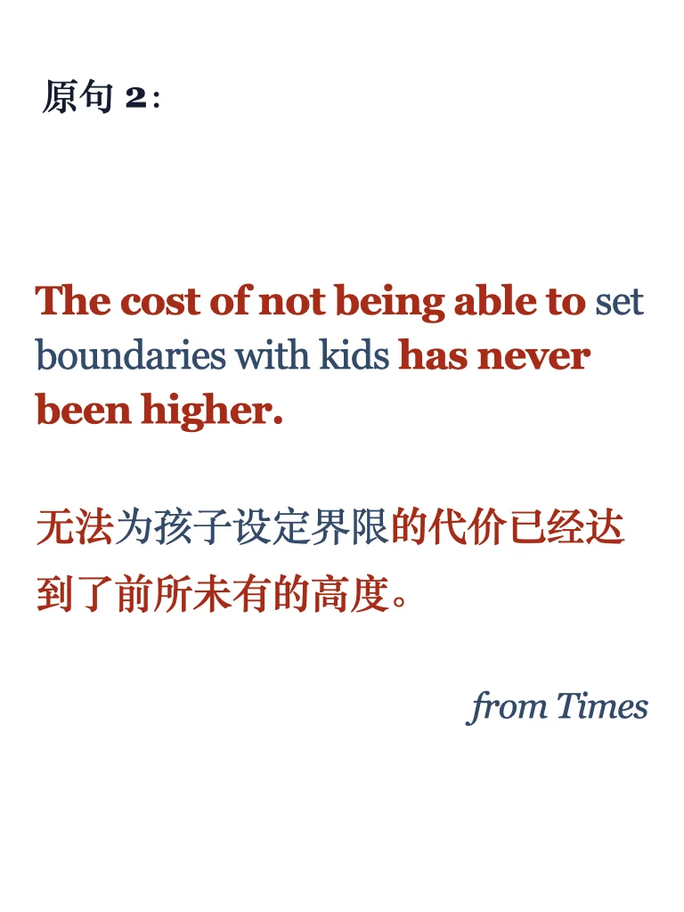
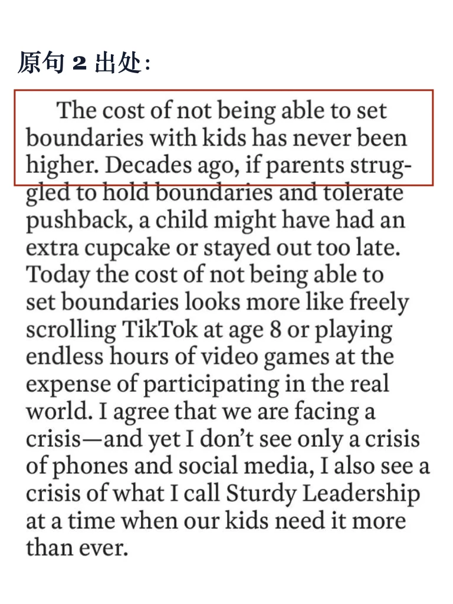
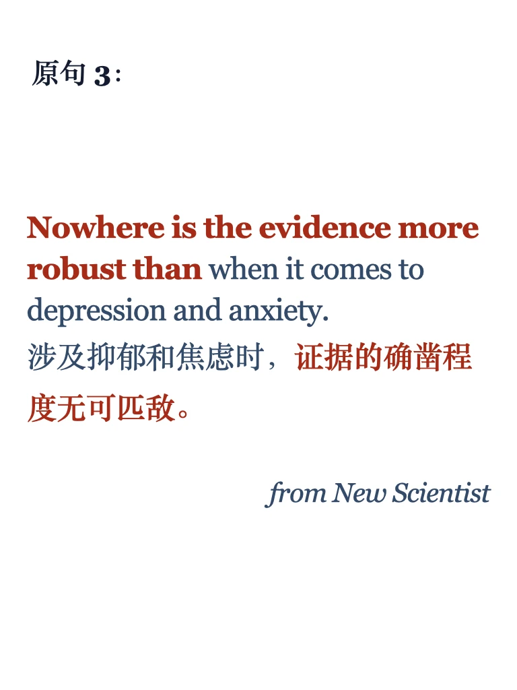

# 写作提升35期｜今天学三个否定+比较级

今天一口气学三个，都适合用于突出强调或对比👍
更多讲解练习左下角get 每周一更
	
三个句子的对应原文进群get～
#英语写作 #雅思备考 #雅思攻略 #每日英语 #英文写作 #英语地道表达 #外刊 #外刊精读#四六级 #考研英语

## 图片
| 图1 | 图2 | 图3 | 图4 |
| --- | --- | --- | --- |
|  |  |  |  |
|  |  |  |  |
|  |  |   |   |

生成时间：2025-11-14 20:45:49