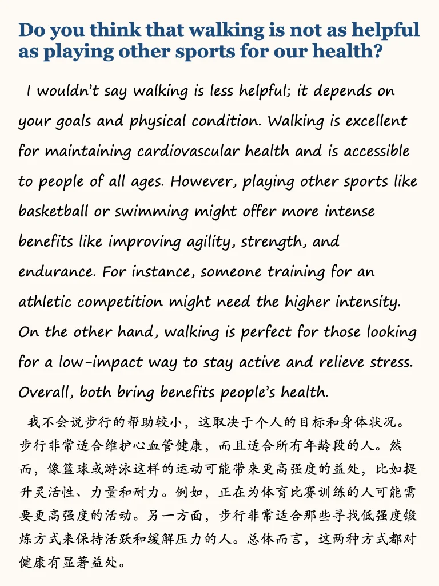
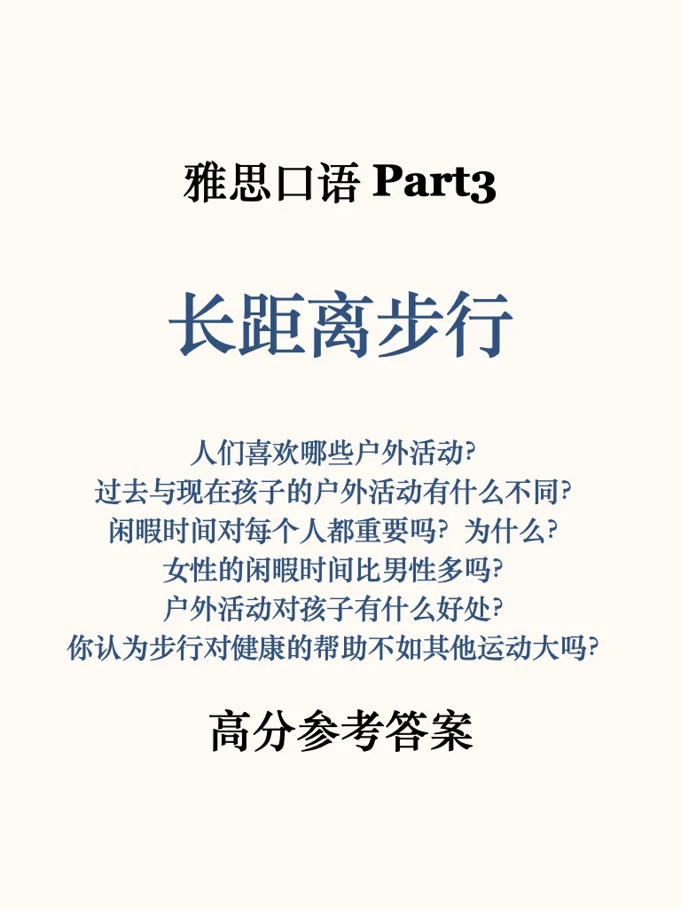
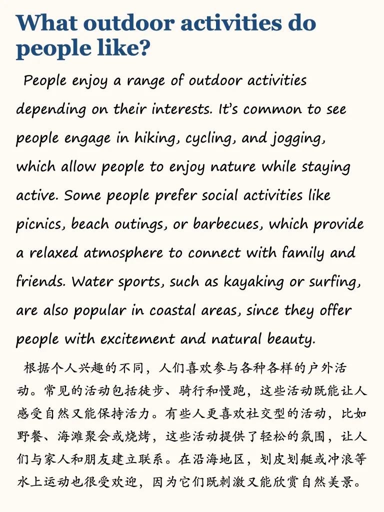
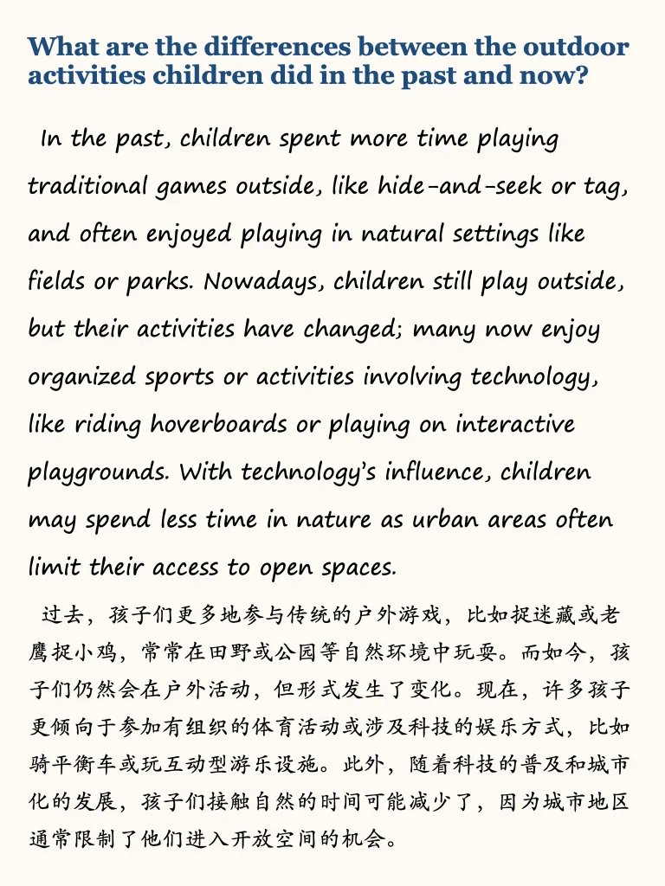
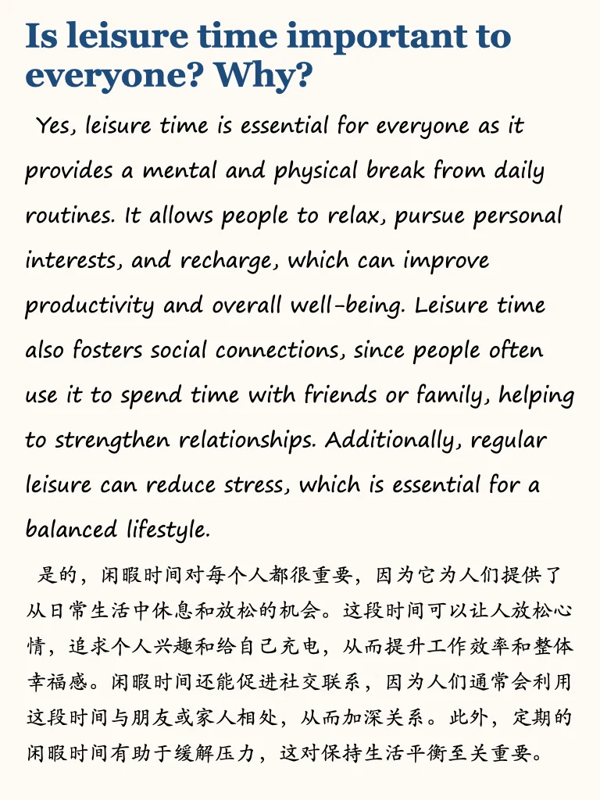
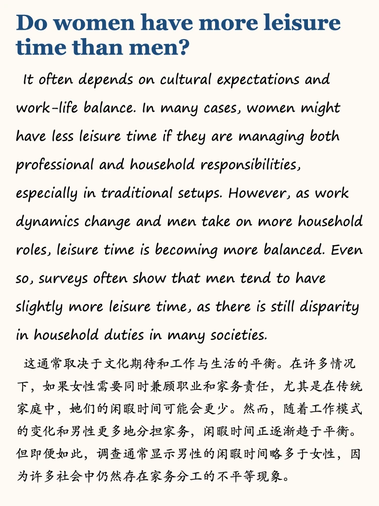
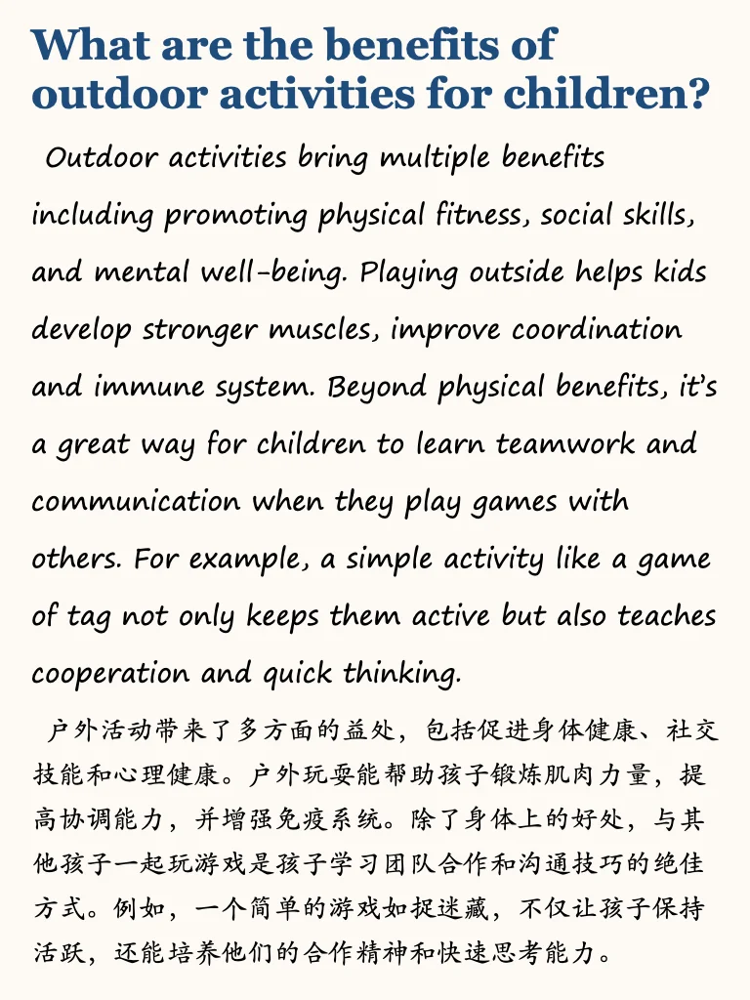

# 雅思口语高分参考｜长距离步行P3

本季400+part3参考，左下角get
包更新
学素材，学思路，让part3有话可说👍
#雅思备考 #雅思口语 #雅思攻略 #雅思预测 #雅思考试 #雅思口语换题 #雅思口语part3新题答案 #雅思口语高分示范 #英语地道表达

## 图片
| 图1 | 图2 | 图3 | 图4 |
| --- | --- | --- | --- |
|  |  |  |  |
|  |  |  |   |

生成时间：2025-11-14 20:44:40