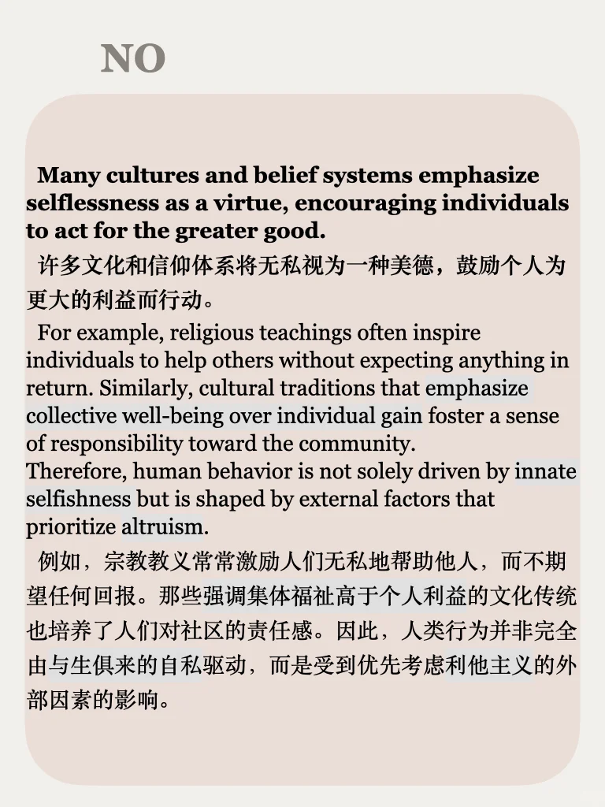
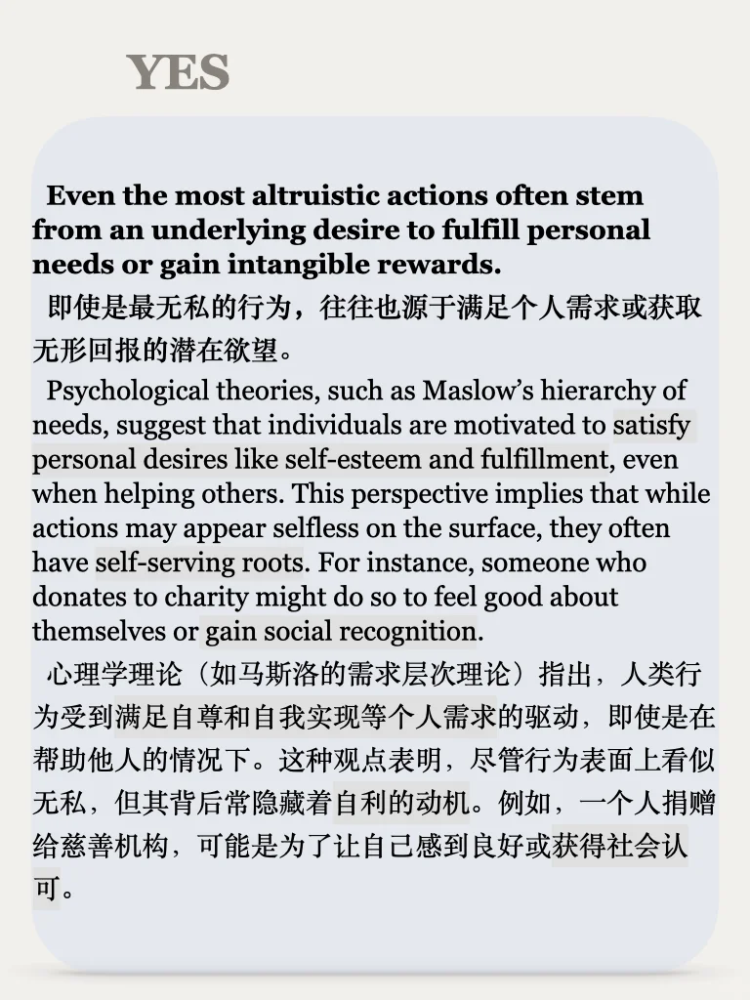
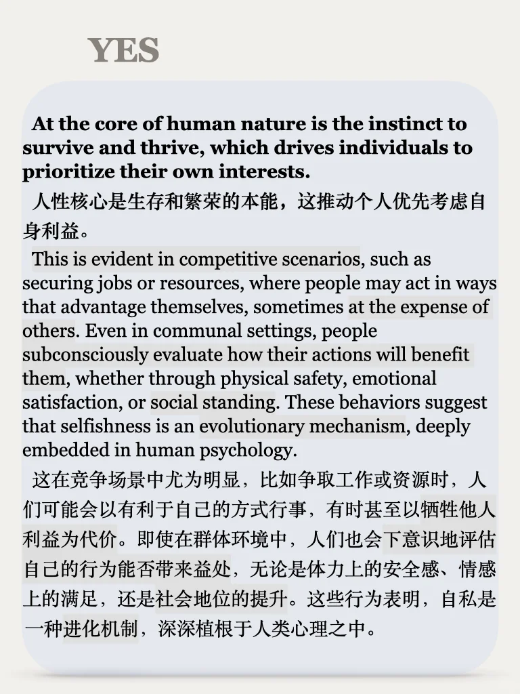
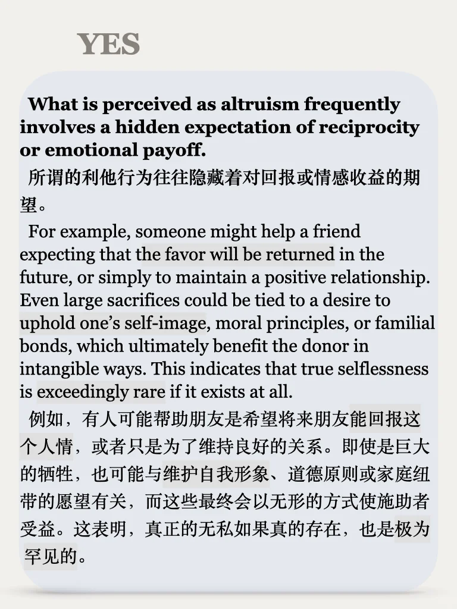
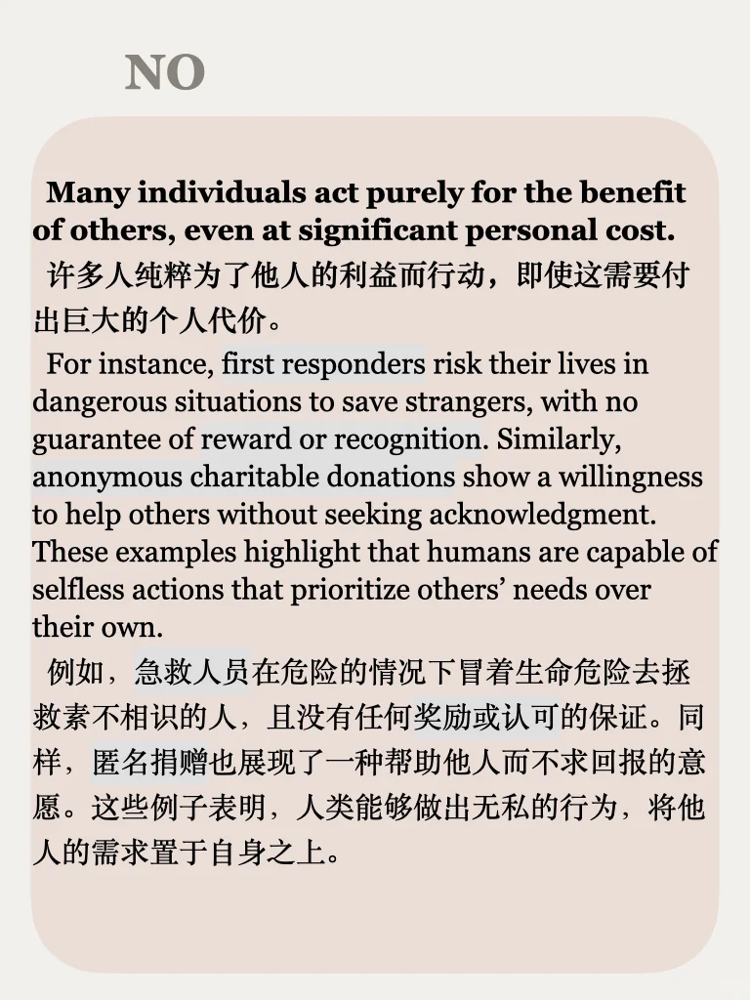

# 思辨能力培养53期｜自私

思辨系列涵盖社会、个人发展、媒体、科技、自然等广泛话题，从正反两个角度思考整理素材，适合备考写作、积累口语观点、培养辨证逻辑能力，每周一更左下角get
#雅思备考 #雅思攻略 #生活英语 #英文学习 #英语地道表达 #辩论 #英语辩论 #思辨能力 #素材 #语料库

## 图片
| 图1 | 图2 | 图3 | 图4 |
| --- | --- | --- | --- |
|  |  |  |  |
|  |  |  |   |

生成时间：2025-11-14 20:42:28