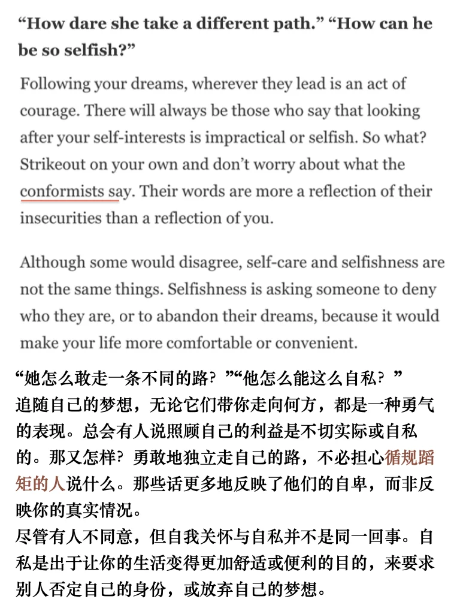
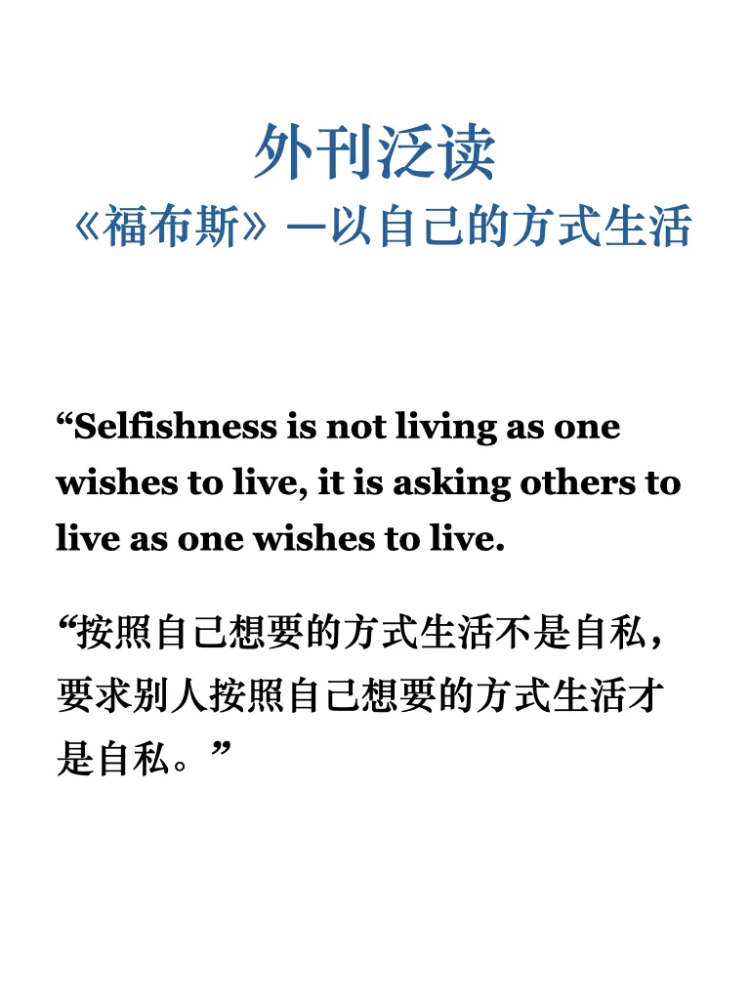
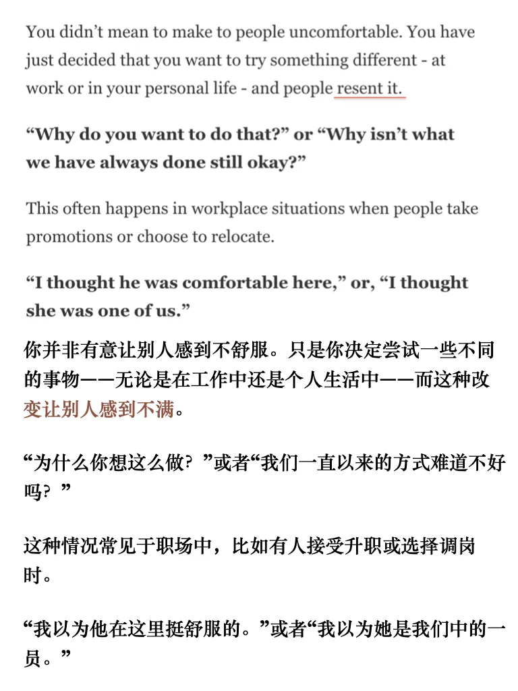
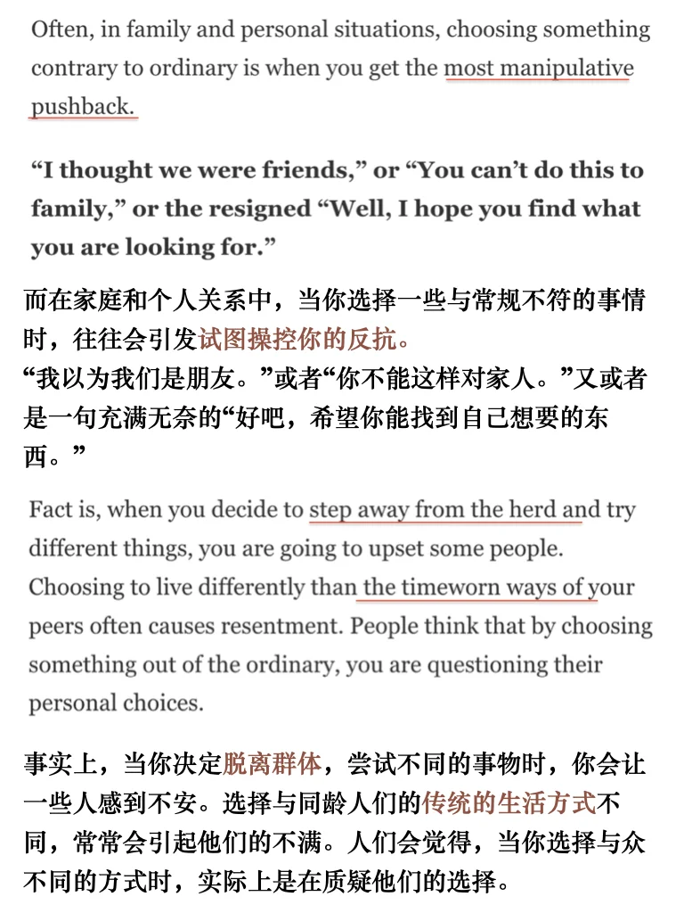
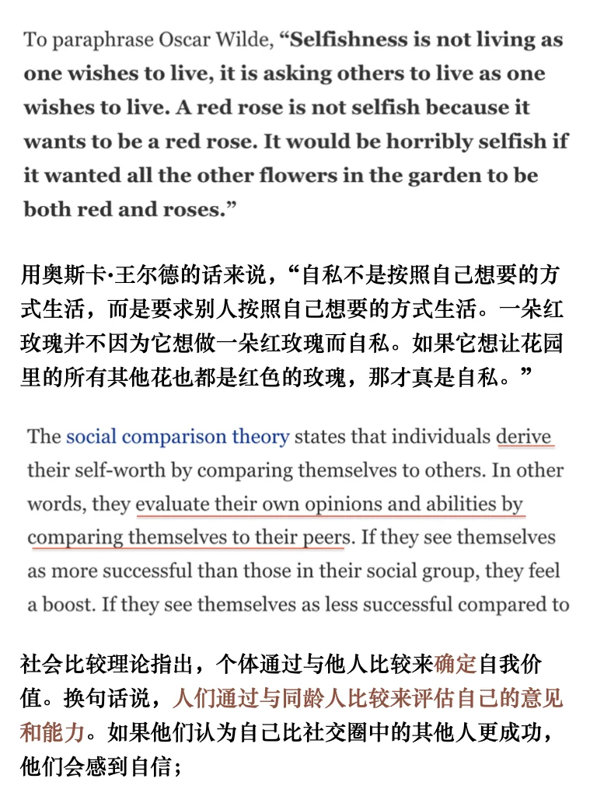
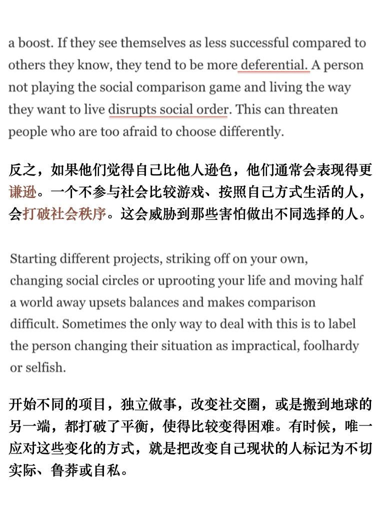
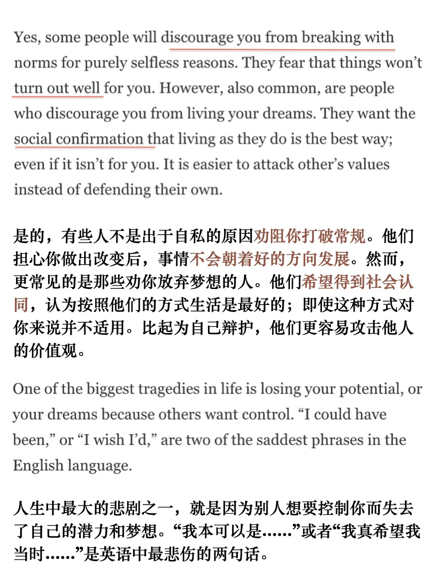
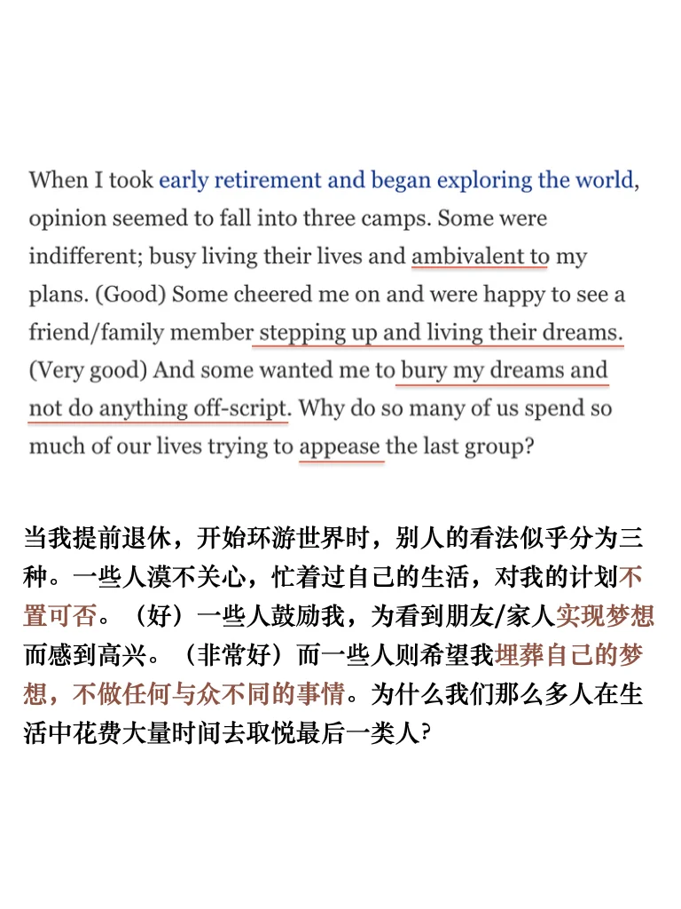

# “过好自己不是自私，干涉他人才是”

昨天的辩论话题是“人是否都是自私的” 做相关阅读时遇到这篇文章，来自Forbs； 原文进群get
#外刊 #四六级 #考研英语 #雅思 #英语地道表达 #英语泛读#雅思攻略 #过好自己 #福布斯

## 图片
| 图1 | 图2 | 图3 | 图4 |
| --- | --- | --- | --- |
|  |  |  |  |
|  |  |  |  |

生成时间：2025-11-14 20:41:22