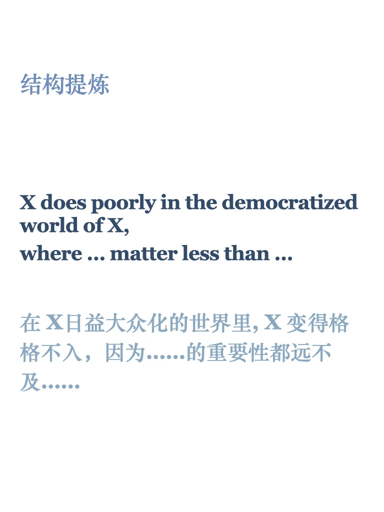

# 外刊写作36期｜写的具体有力

中文的概括能力很强，英语写作时又追求言之有物，具体化让语言更有影响力，来看看今天来自⛄️的句子，介绍新的变化趋势，对比有力。
仿写外刊，每周一更
更多详解练习，左下角get
完整原文，进群get
#雅思备考 #翻译学习 #雅思攻略 #雅思写作 #英语写作 #每日英语 #四六级 #考研英语 #英语地道表达 #外刊精读

## 图片
| 图1 | 图2 | 图3 | 图4 |
| --- | --- | --- | --- |
|  |  |  |  |
|  |   |   |   |

生成时间：2025-11-14 20:40:15