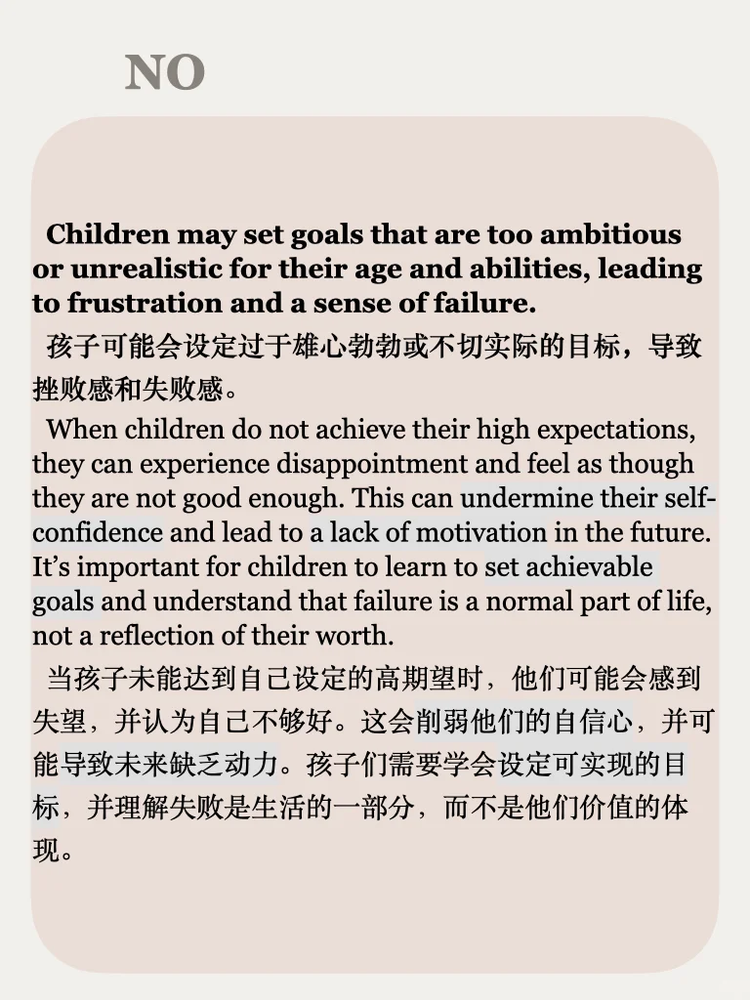
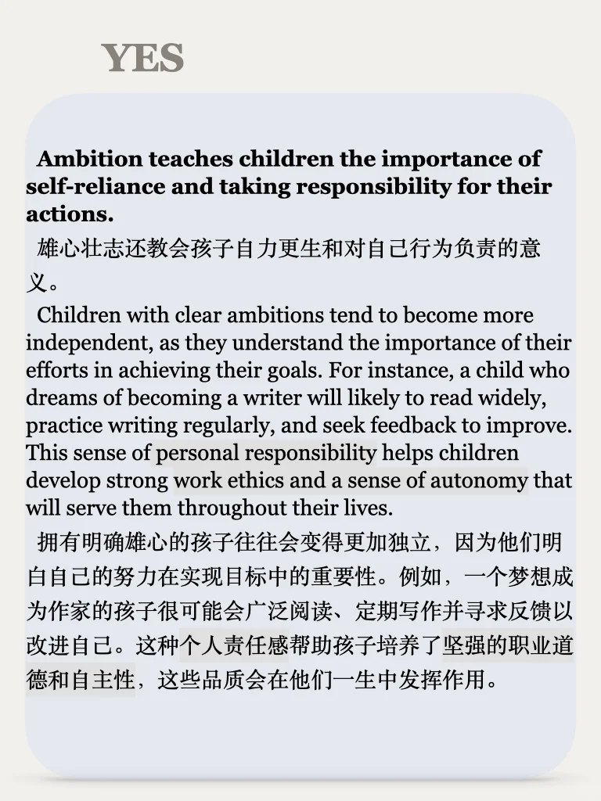
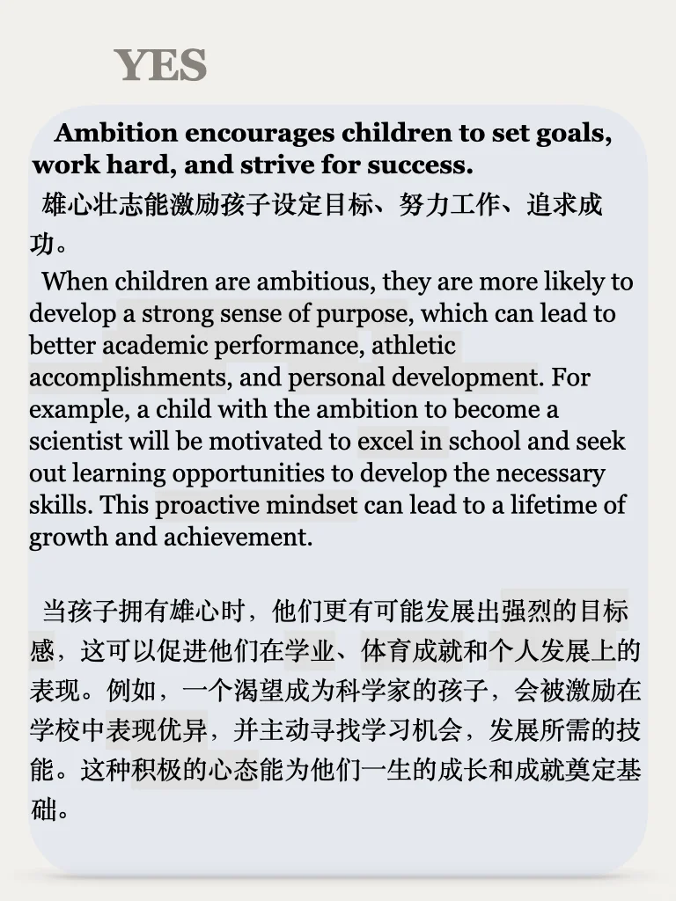
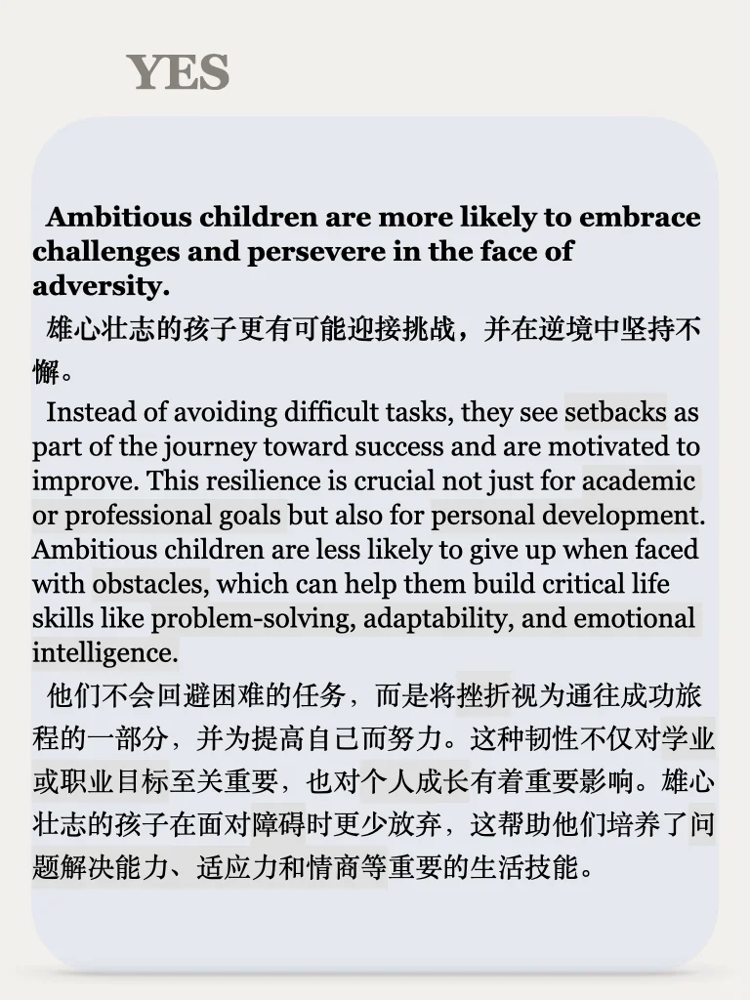
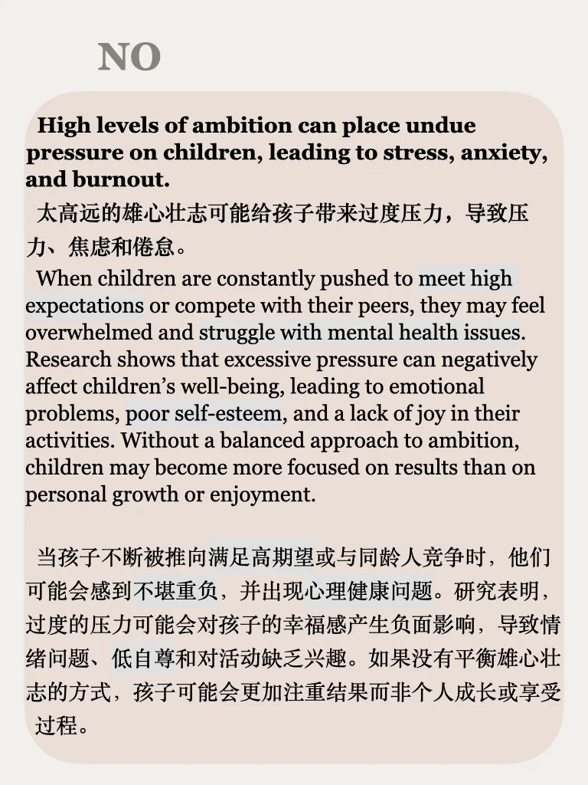
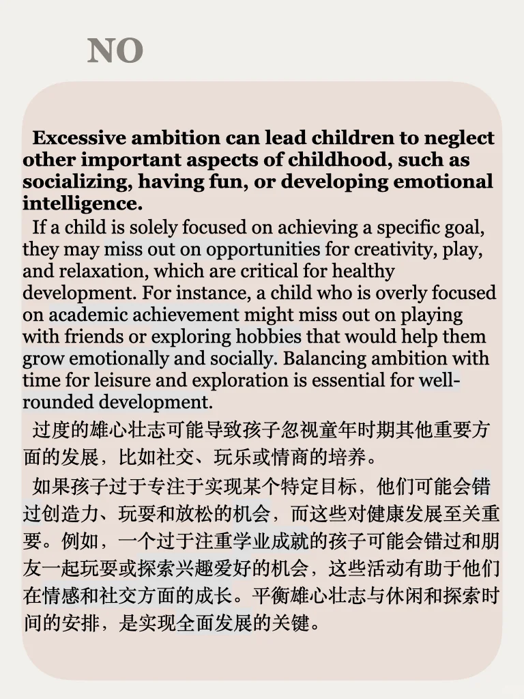

# 思辨能力培养54期｜说出你的立场

孩子是否都需要大大的梦想？雄心壮志带来的更多是压力还是动力？
辩论系列语料，涉及话题广泛，适合用于积累写作素材和口语观点，左下角get
#英语地道表达 #四六级 #考研英语 #雅思攻略 #雅思备考 #雅思写作 #雅思口语 #mti #catti #英语写作

## 图片
| 图1 | 图2 | 图3 | 图4 |
| --- | --- | --- | --- |
|  |  |  |  |
|  |  |  |   |

生成时间：2025-11-14 20:36:57