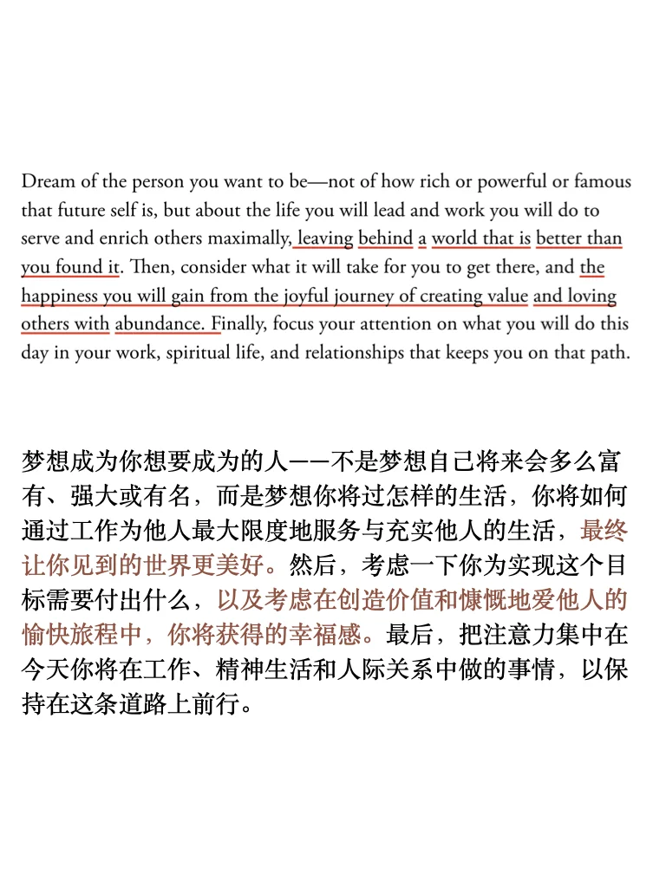
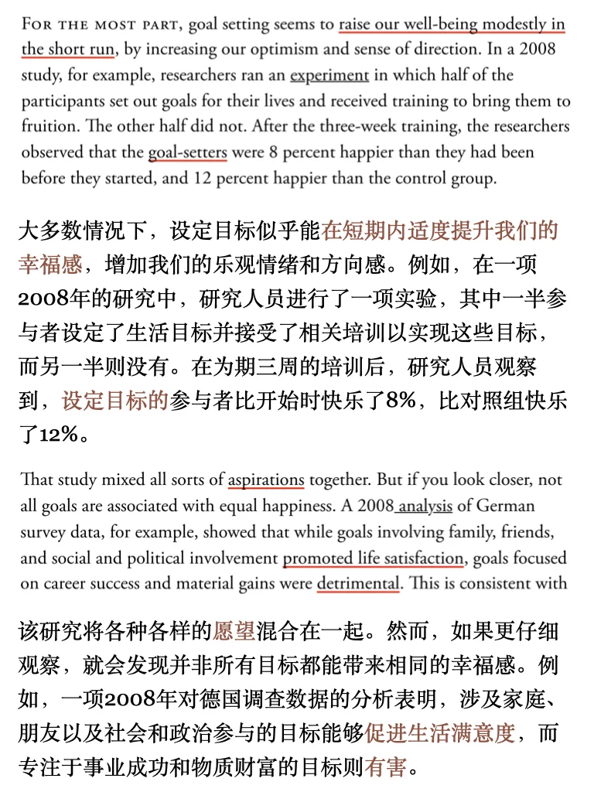
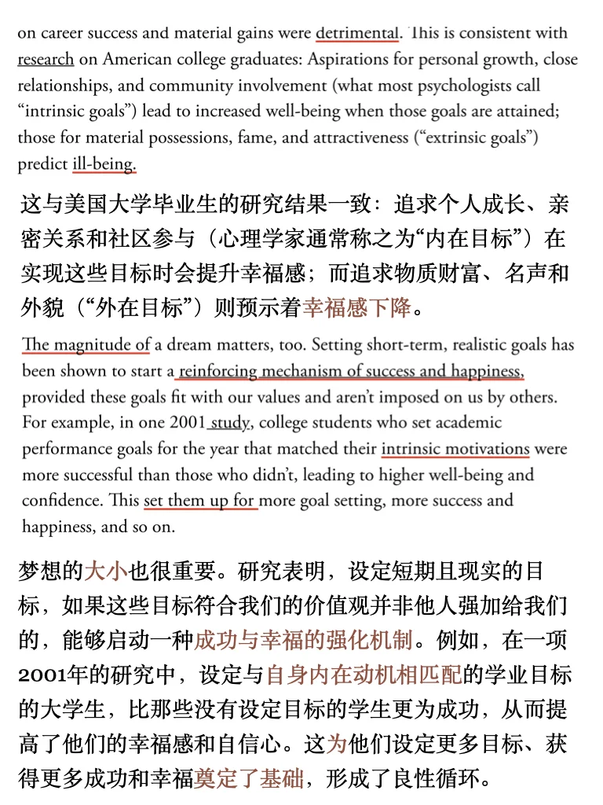
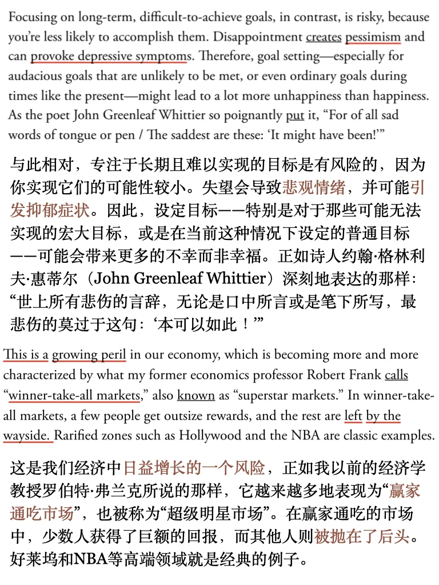
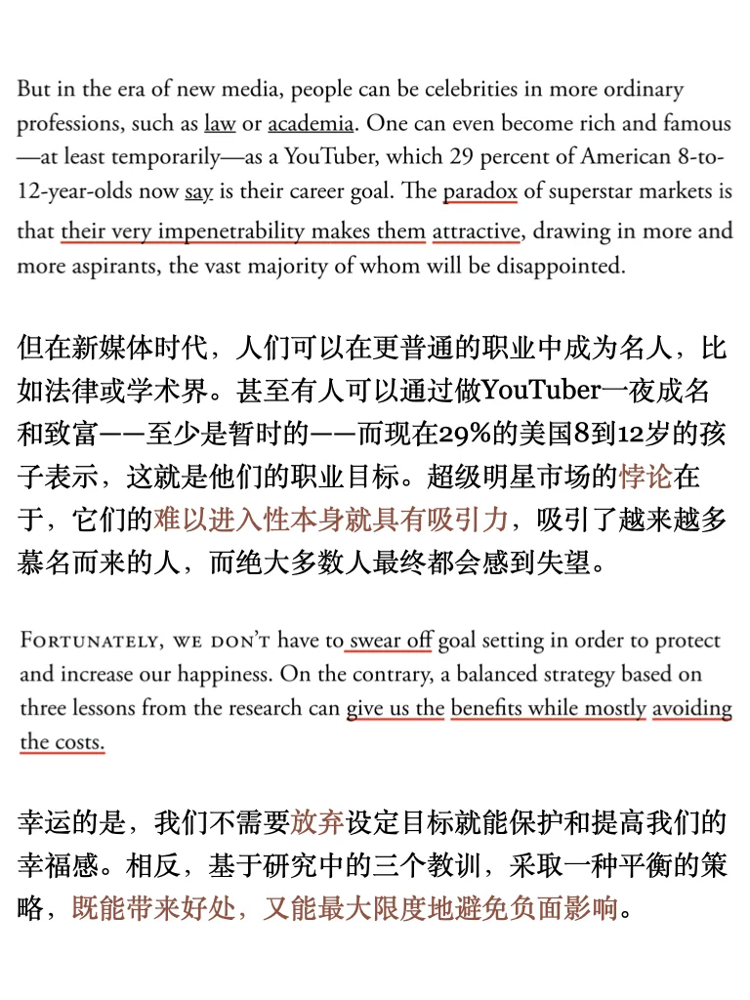
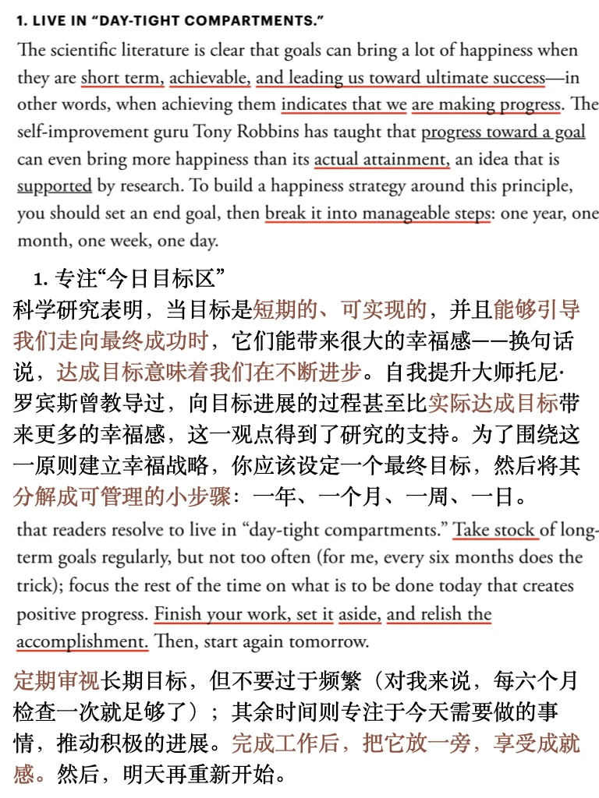
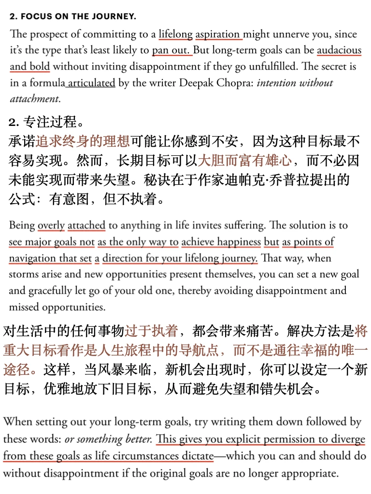
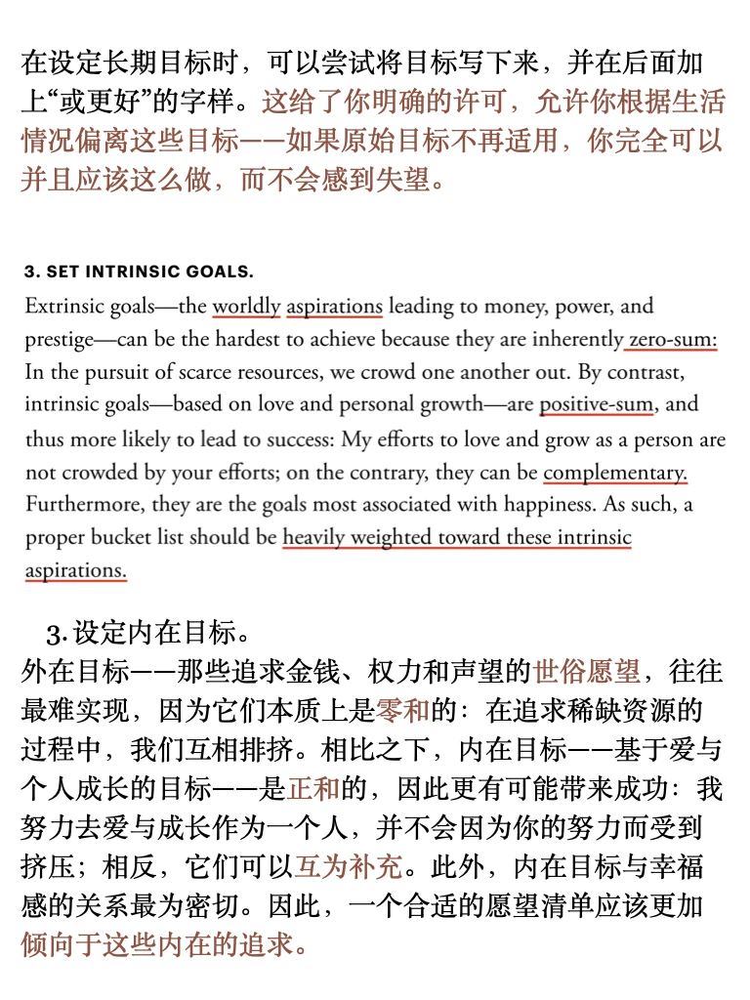

# 外刊泛读｜远大梦想怎么实现

昨天的辩论话题讨论到“梦想、雄心壮志”今天的泛读也来看看梦想的话题吧～
平时分享的内容受篇幅限制，很多是段落节选或者词汇讲解，我把平时阅读的文章从期刊、网页中筛选出来，以PDF格式保存
想更阅读更完整的外刊原文，欢迎加入群聊🎉
	
#雅思备考 #外刊#英语地道表达 #英语泛读 #梦想 #雅思备考 #四六级 #考研英语 #原版阅读

## 图片
| 图1 | 图2 | 图3 | 图4 |
| --- | --- | --- | --- |
|  |  |  |  |
|  |  |  |  |
|  |   |   |   |

生成时间：2025-11-14 20:35:50