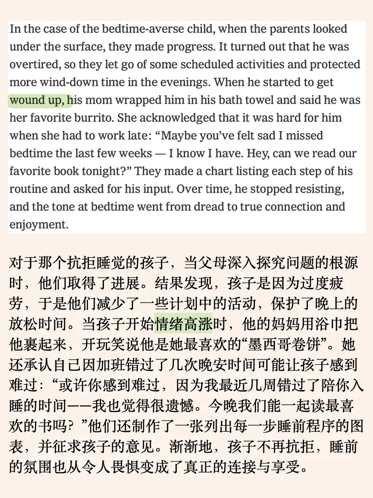
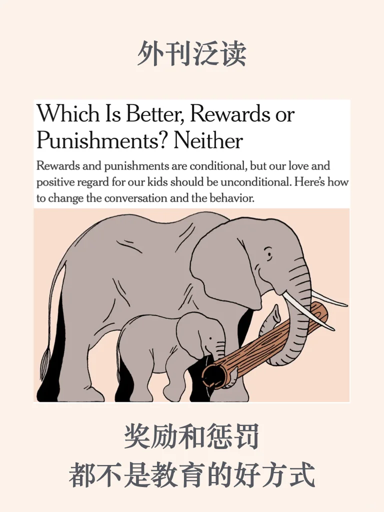
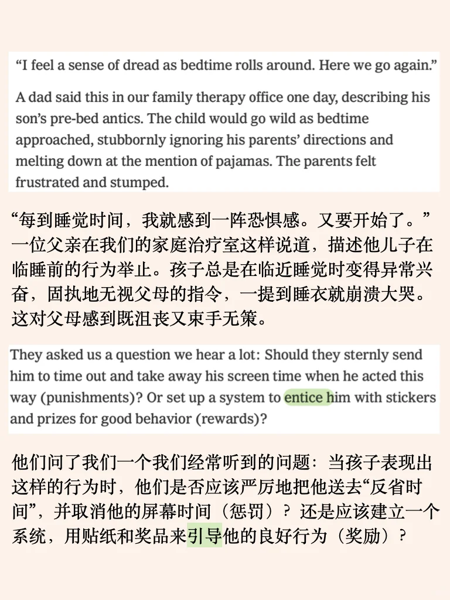
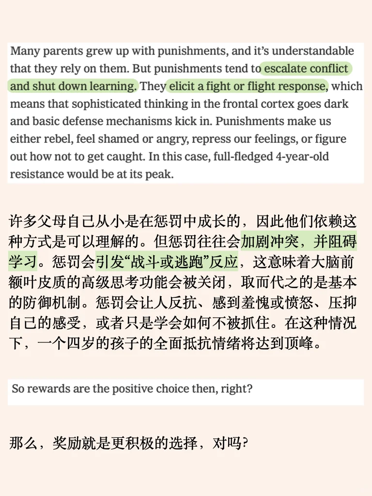
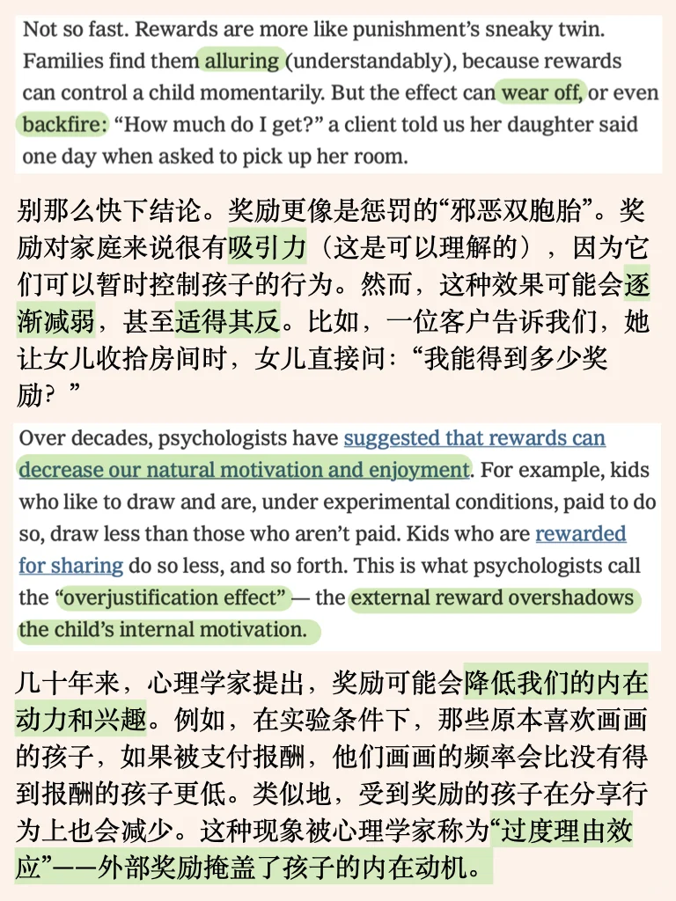
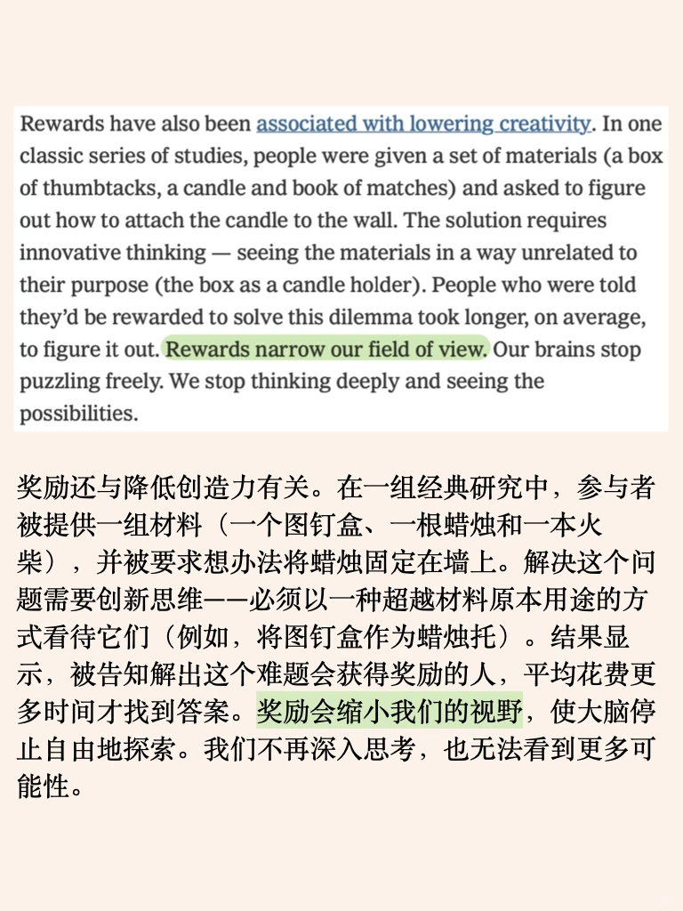
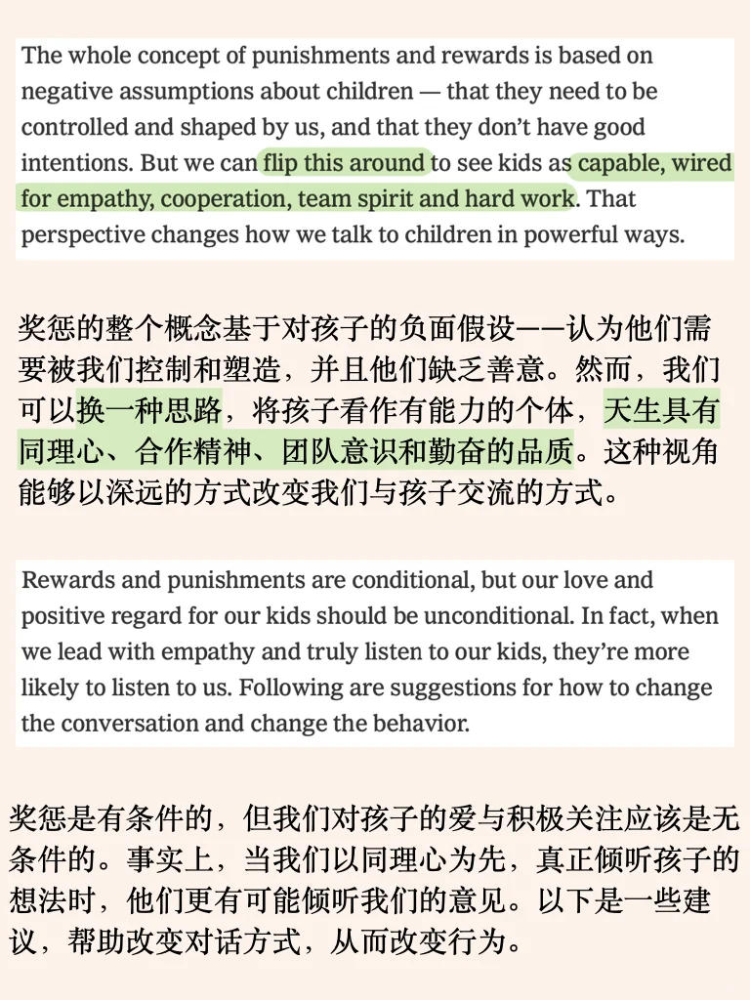
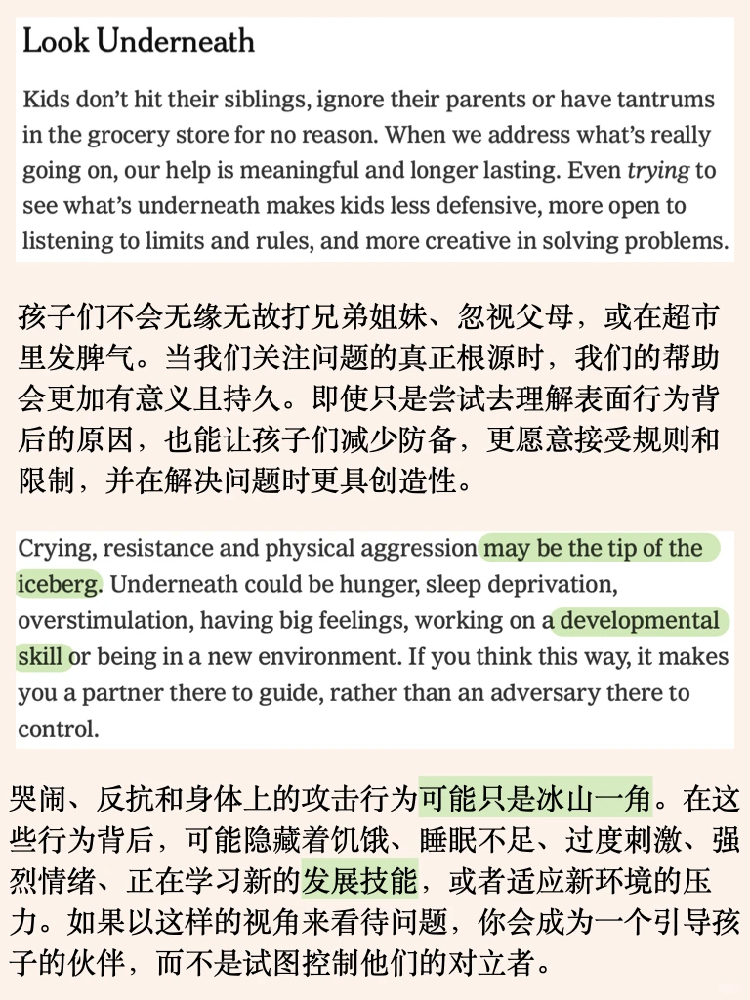
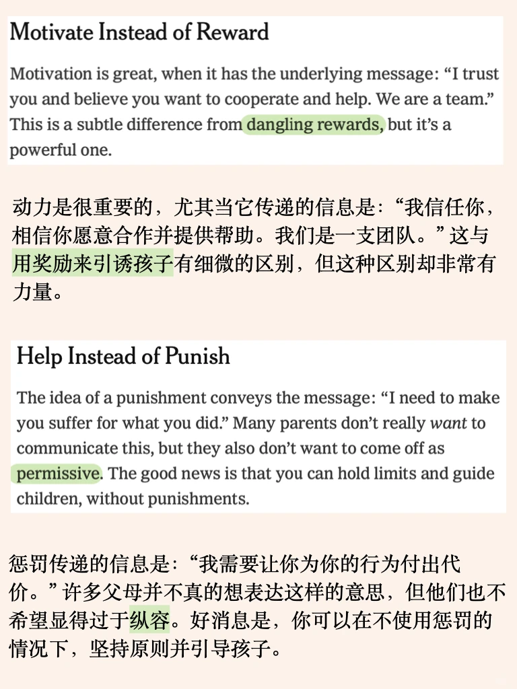
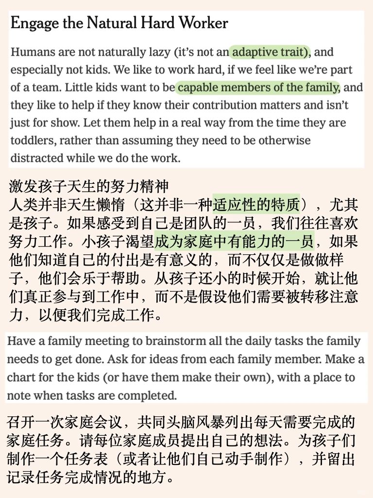

# 外刊泛读｜奖励与惩罚

#英文学习 #英语地道表达 #每日英语 #英文阅读 #英语原著阅读 #外刊 #泛读 #英语泛读 #雅思 #四六级
平时分享的内容受篇幅限制，很多是段落节选或者词汇讲解
我把平时阅读的文章从期刊、网页中筛选出来，以PDF格式保存
想更阅读更完整的外刊原文，欢迎加入群聊🎉

## 图片
| 图1 | 图2 | 图3 | 图4 |
| --- | --- | --- | --- |
|  |  |  |  |
|  |  |  |  |
|  |  |   |   |

生成时间：2025-11-14 20:17:59