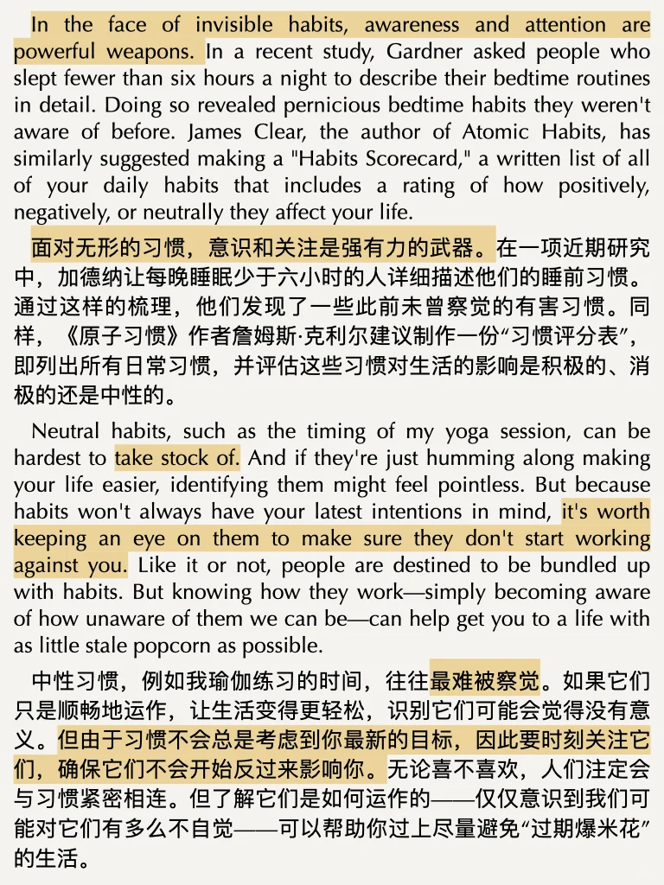
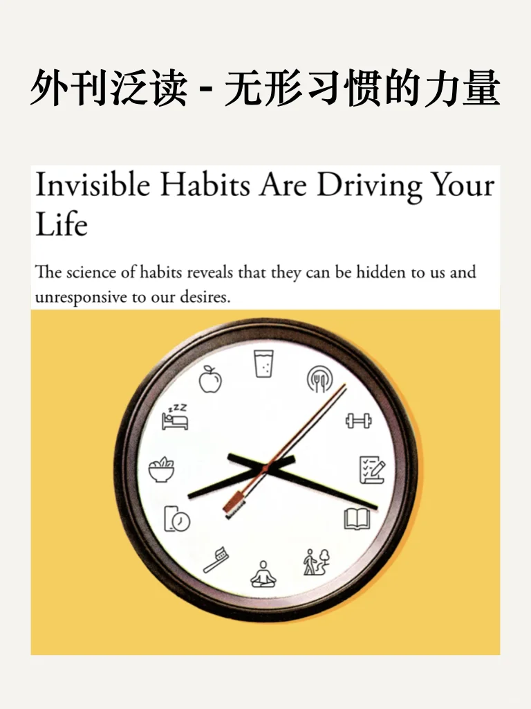
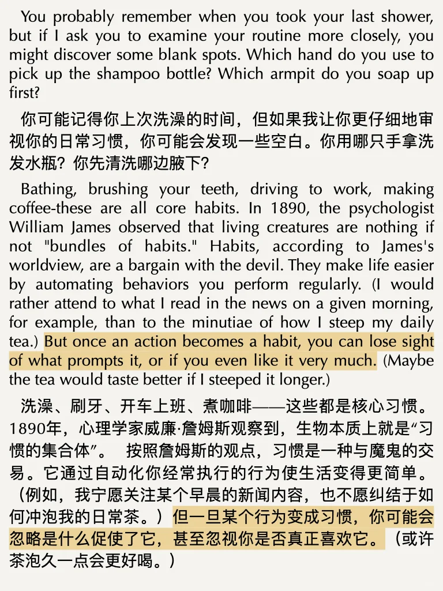
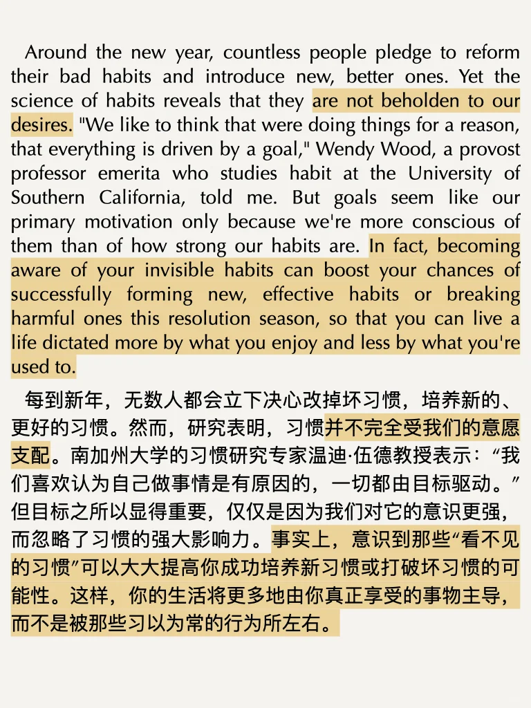
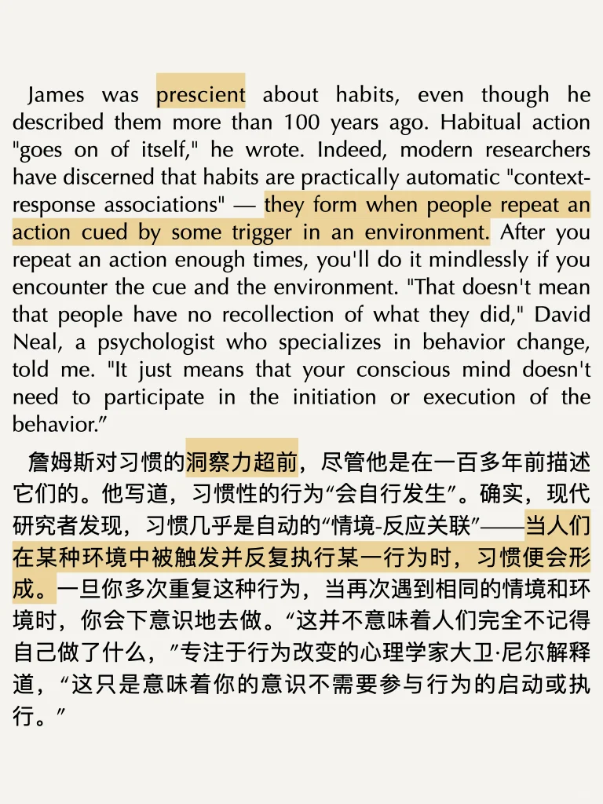
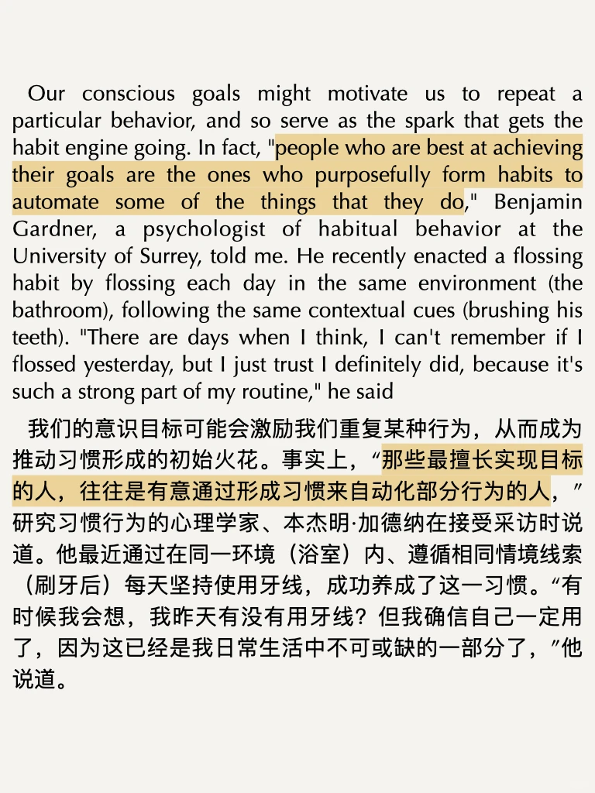
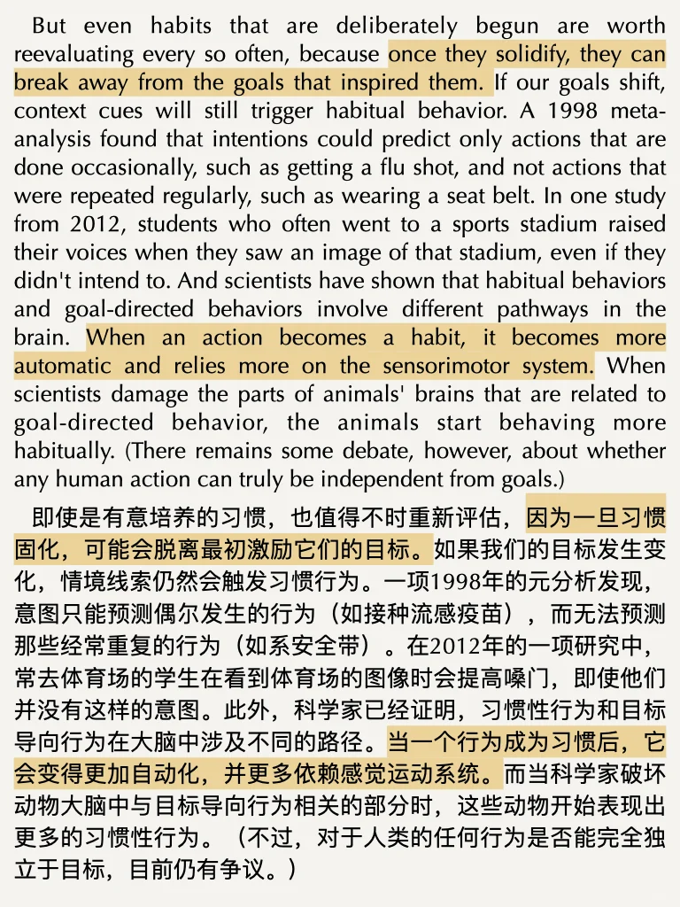
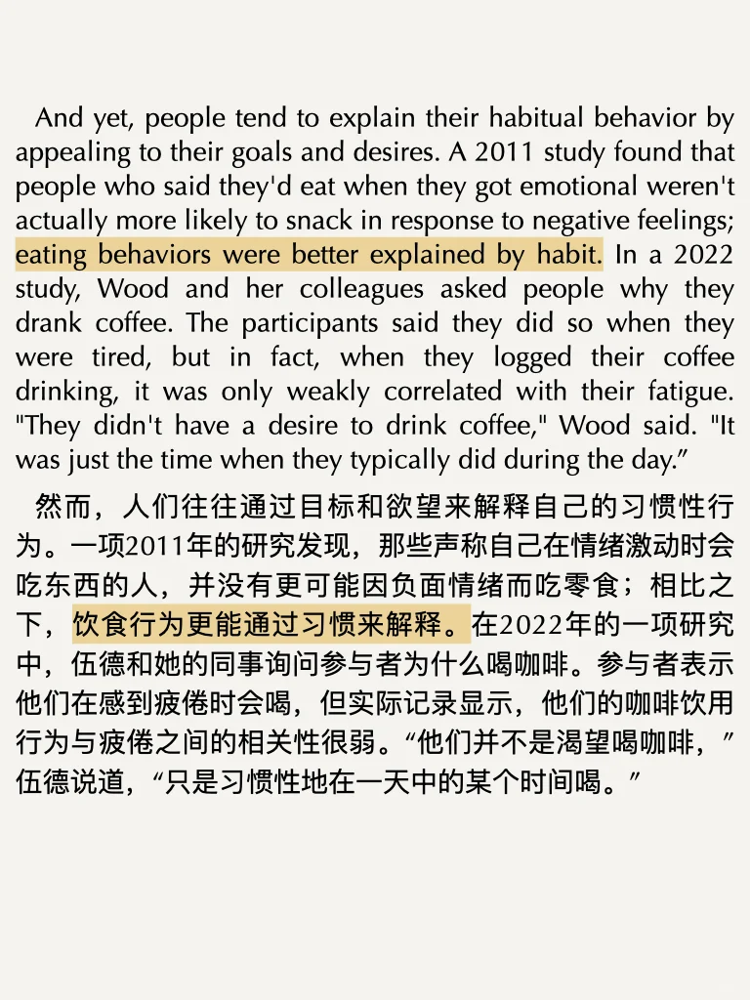
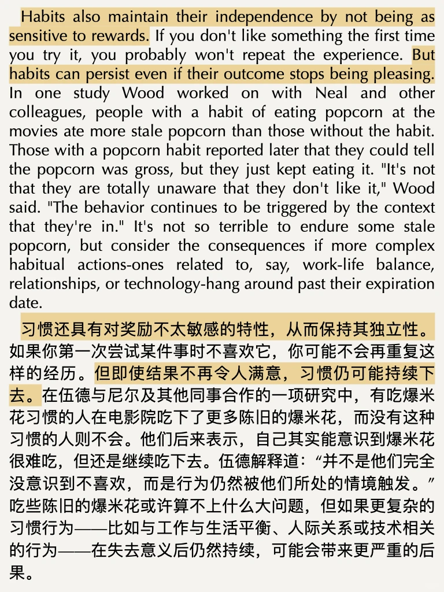

# 习惯的力量：识别与掌控潜藏的行为模式

文章来自The Atlantic，主要讲述了习惯如何让我们的行为自动化，而通过提高自我意识和培养反思习惯，我们可以更好地掌控生活、打破不良习惯并形成积极的行为模式。
#外刊 #泛读 #阅读 #习惯

## 图片
| 图1 | 图2 | 图3 | 图4 |
| --- | --- | --- | --- |
|  |  |  |  |
|  |  |  |  |
|  |   |   |   |

生成时间：2025-11-14 20:15:45