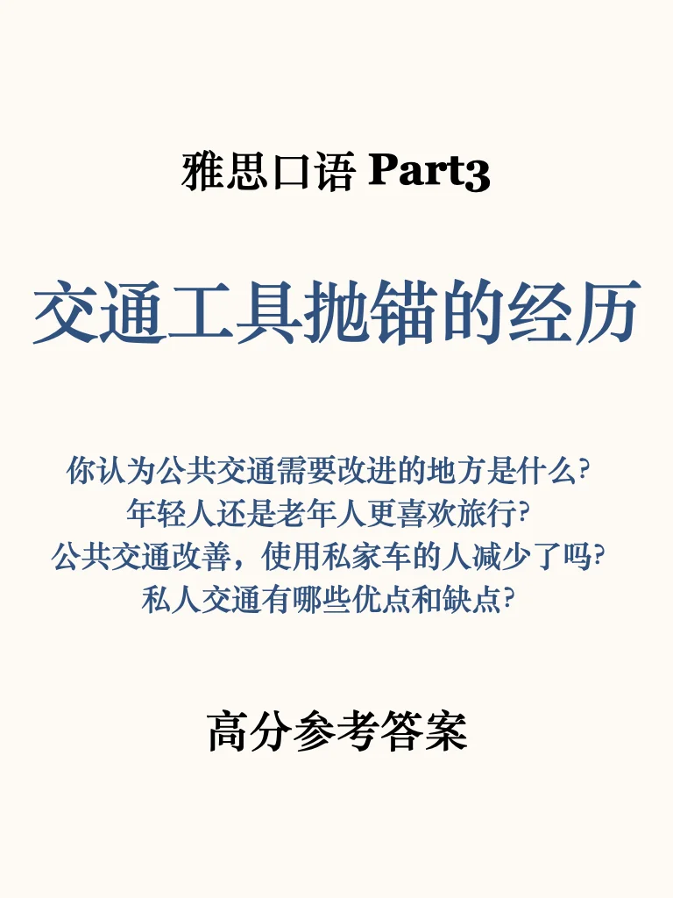
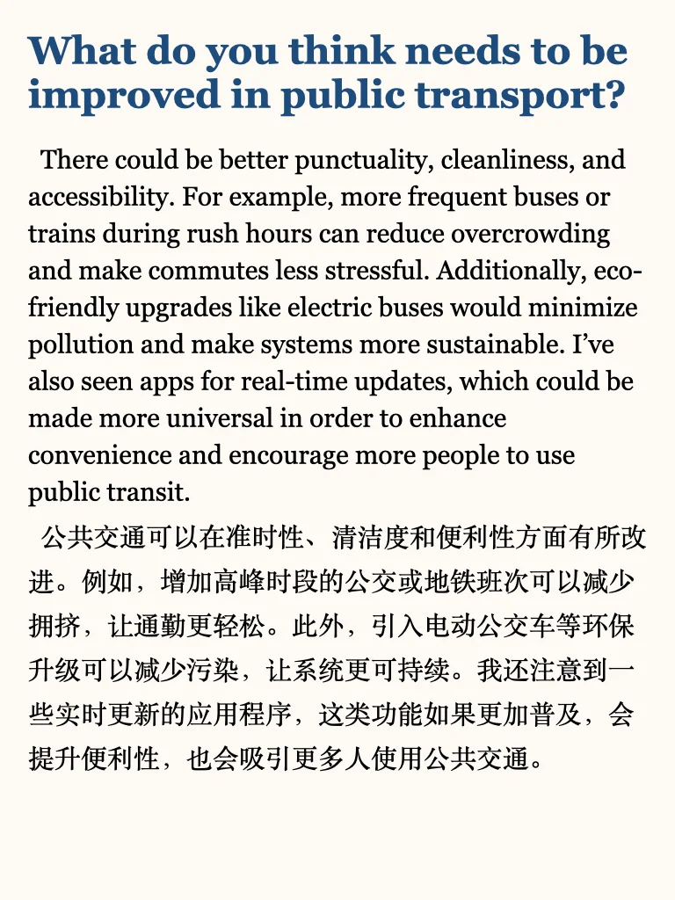
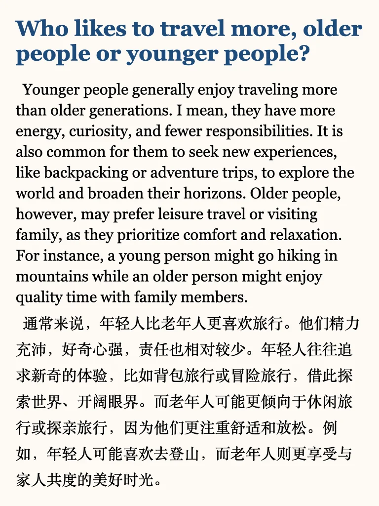
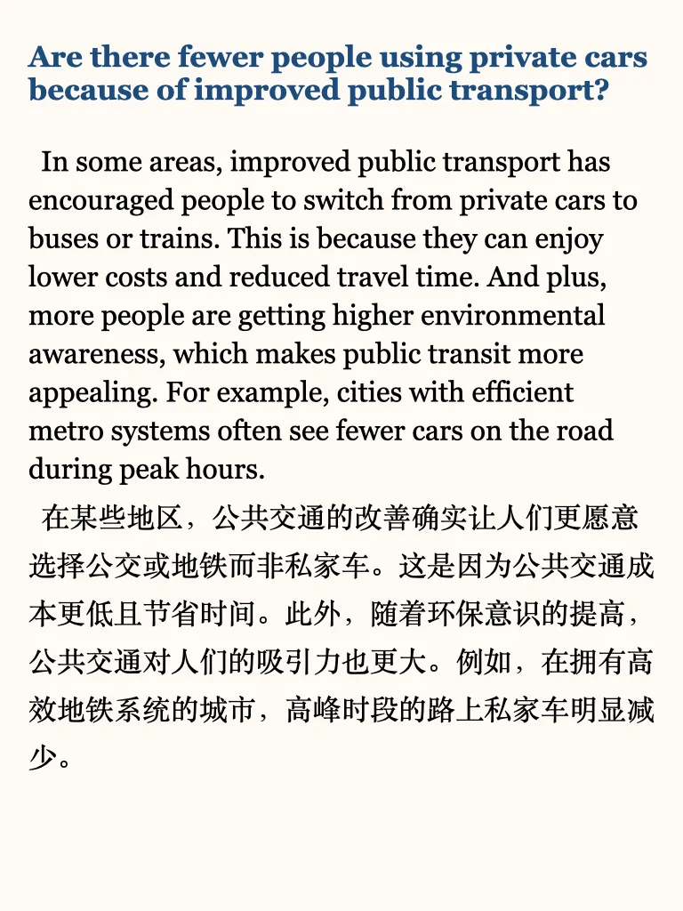
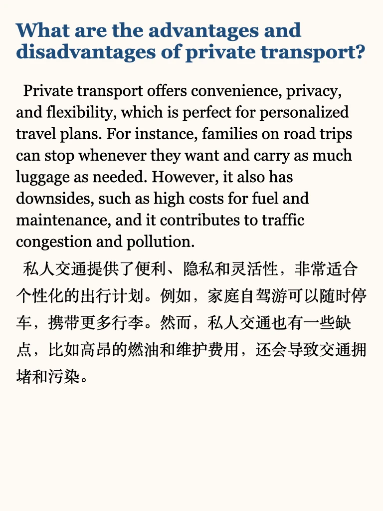

# 雅思口语参考｜新题part3

在更新中啦，左下角get上季度400+part3，包本季度更新（最后两页是目前进度）
#雅思备考 #雅思口语 #英语地道表达 #雅思预测 #出行交通工具 #雅思口语part3 #雅思口语高分表达 #雅思口语part3新题答案 #雅思口语答案

## 图片
| 图1 | 图2 | 图3 | 图4 |
| --- | --- | --- | --- |
|  |  |  |  |
|  |  |  |   |

生成时间：2025-11-14 20:28:00