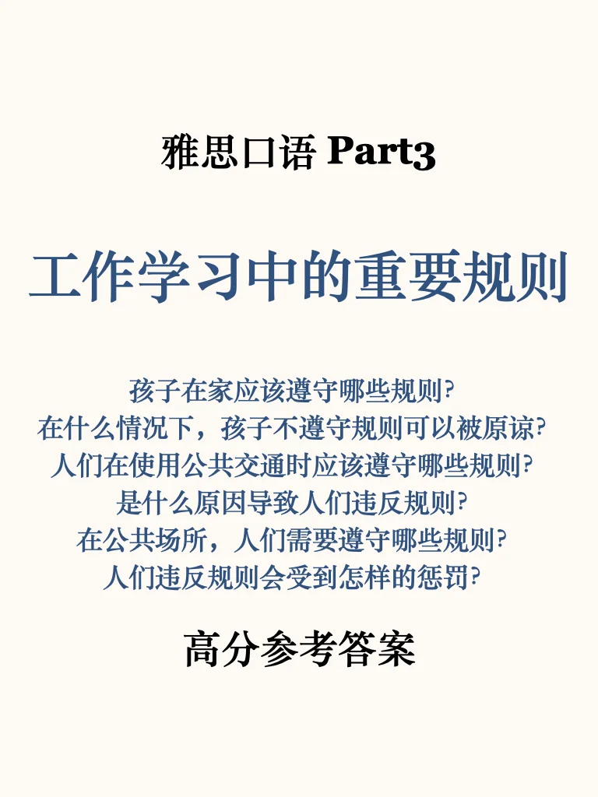
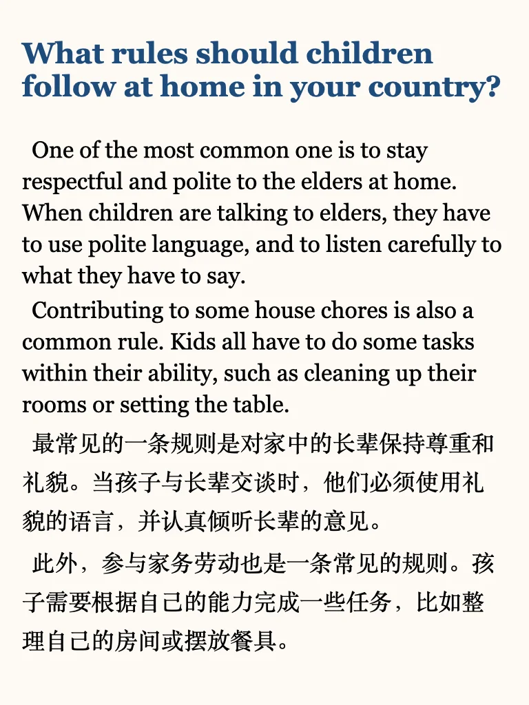
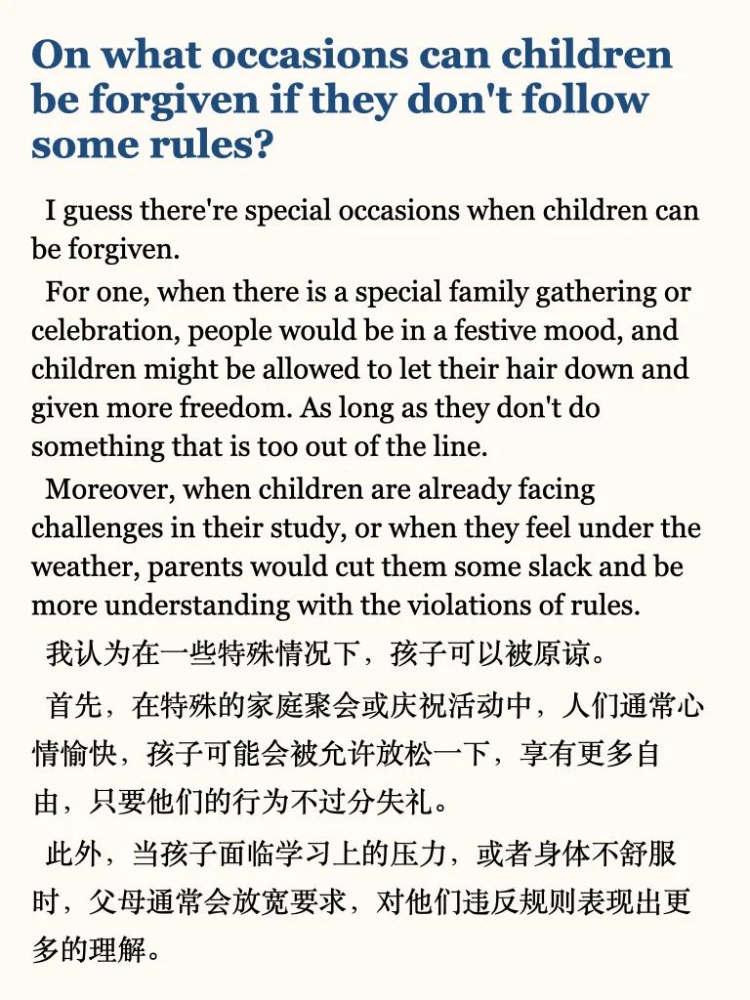
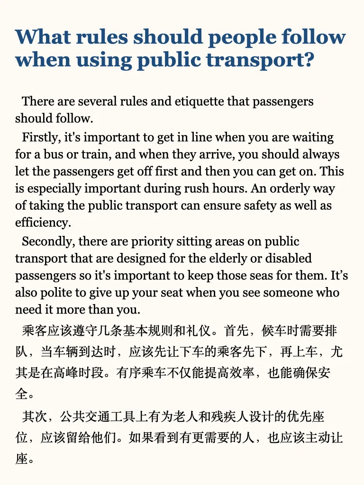
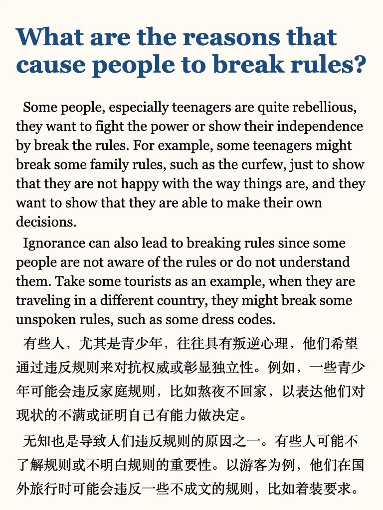
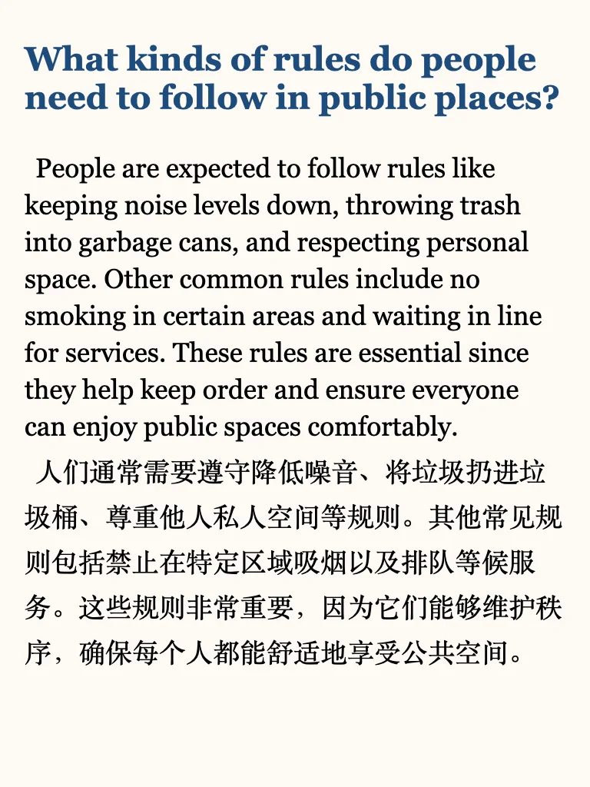
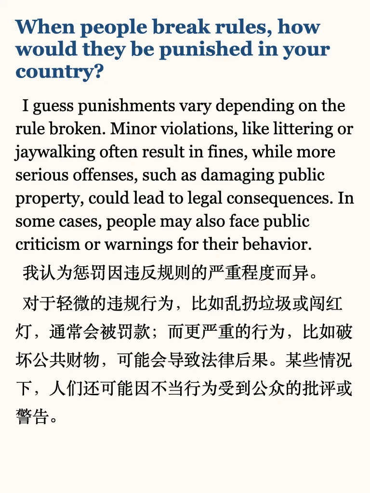

# 雅思口语P3参考｜规则相关

左下角get 上季度完整part3+本季度更新（还在更新中）
	
短期备考同学，推荐学习我的六天救急包
#英语地道表达 #雅思备考 #每日英语 #雅思口语 #雅思口语part3 #雅思口语part3新题答案 #雅思口语part3高分答案

## 图片
| 图1 | 图2 | 图3 | 图4 |
| --- | --- | --- | --- |
|  |  |  |  |
|  |  |  |  |
|  |   |   |   |

生成时间：2025-11-14 20:14:37