# 外刊泛读｜审美标准变化等因素推动医美行业

#英语地道表达 #雅思备考 #英语阅读打卡 #mti #四六级 #外刊 #阅读 #原版阅读 #医美
平时分享的内容受篇幅限制，很多是段落节选或者词汇讲解
我把平时阅读的文章从期刊、网页中筛选出来，以PDF格式保存
想更阅读更完整的外刊原文，欢迎加入群聊🎉

## 图片
| 图1 | 图2 | 图3 | 图4 |
| --- | --- | --- | --- |
| 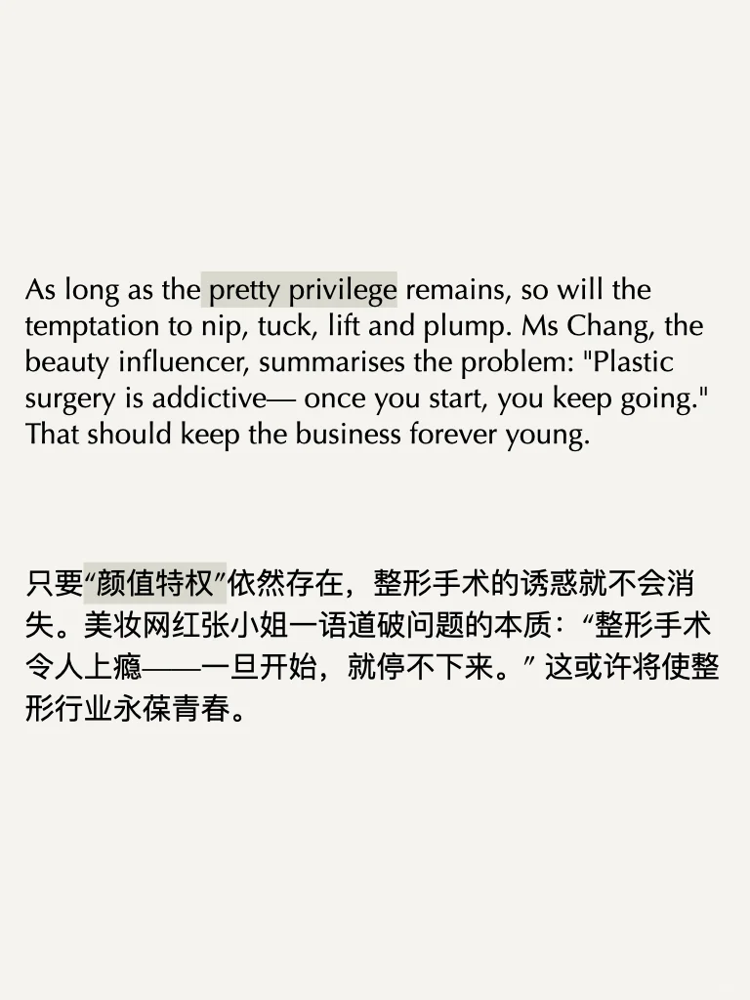 | 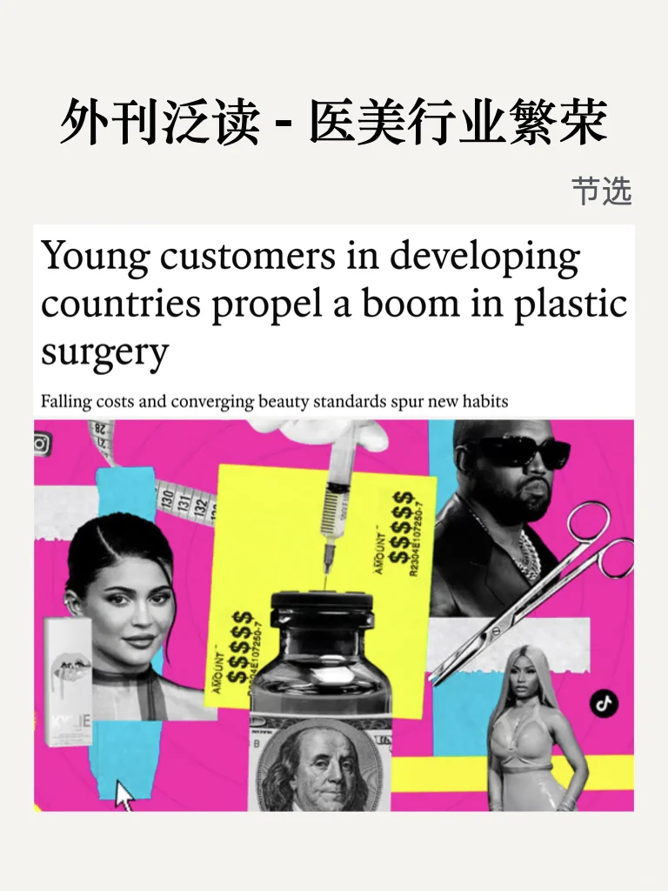 | 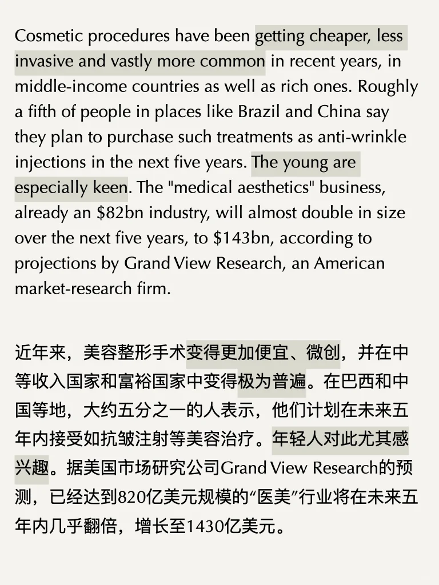 | 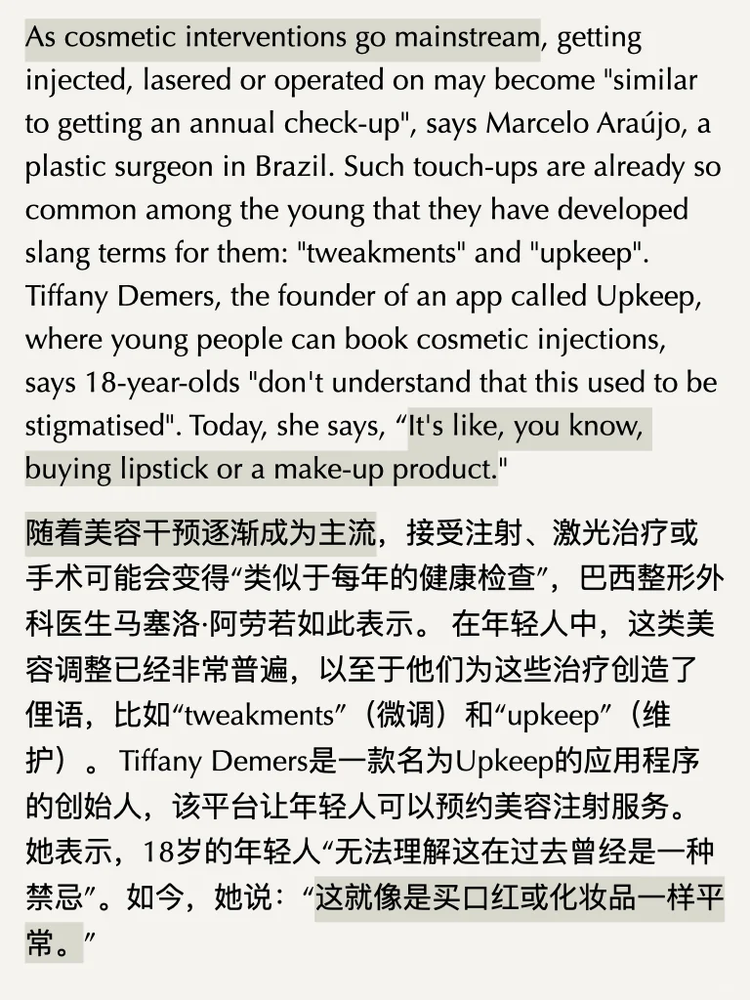 |
| 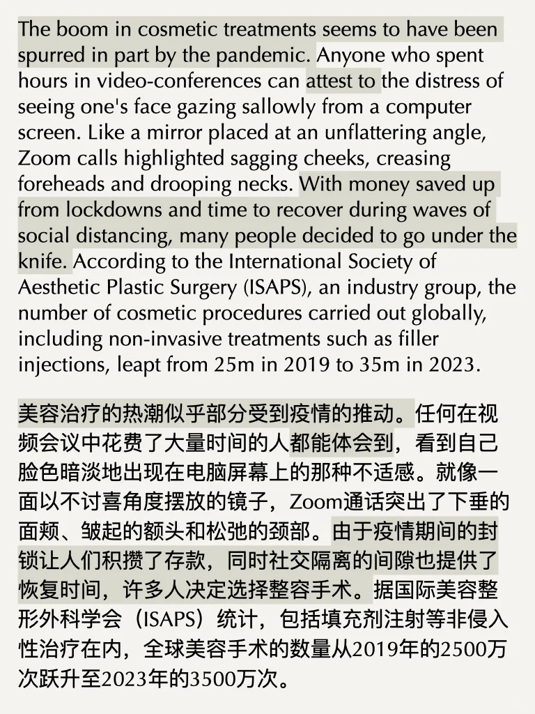 | 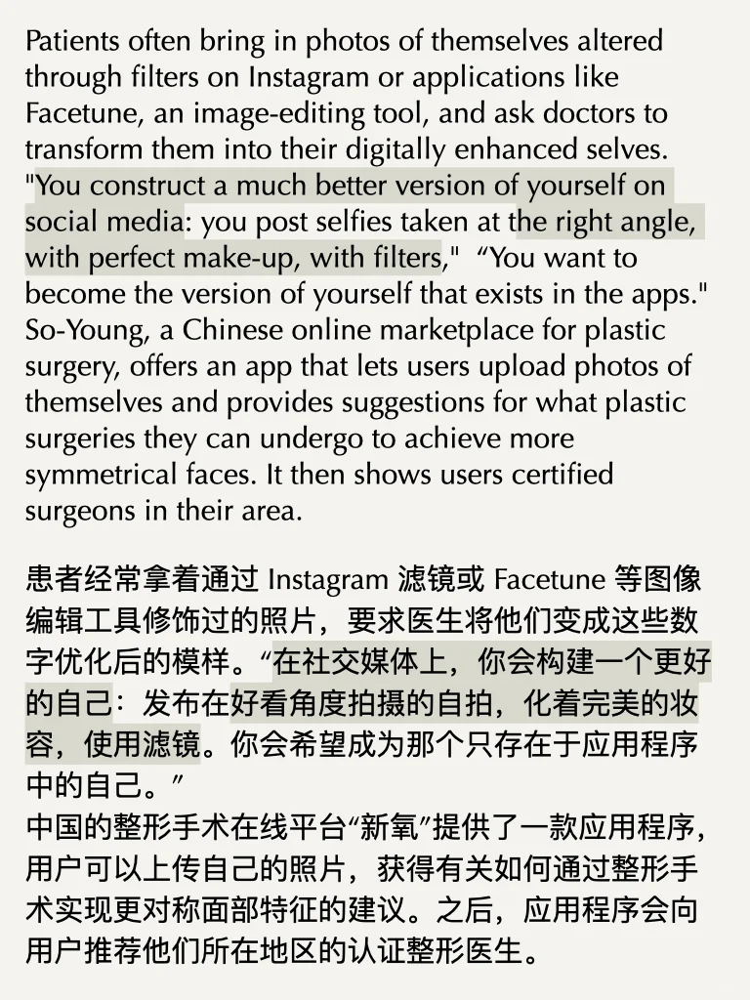 | 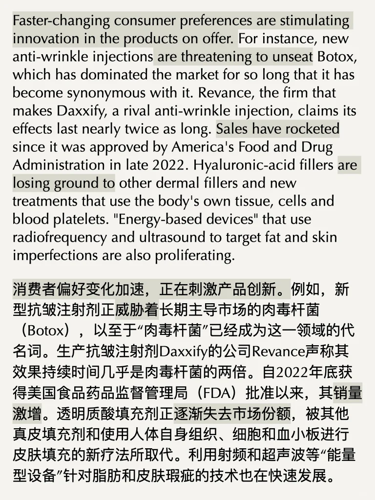 | 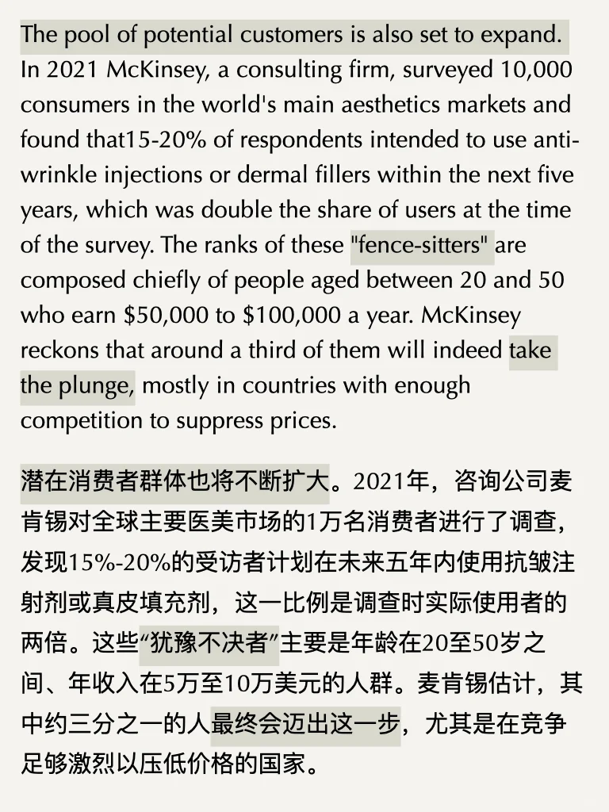 |
| 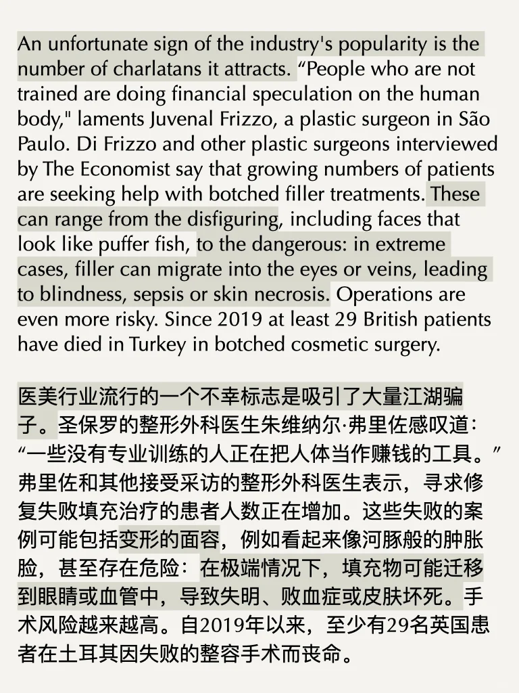 | 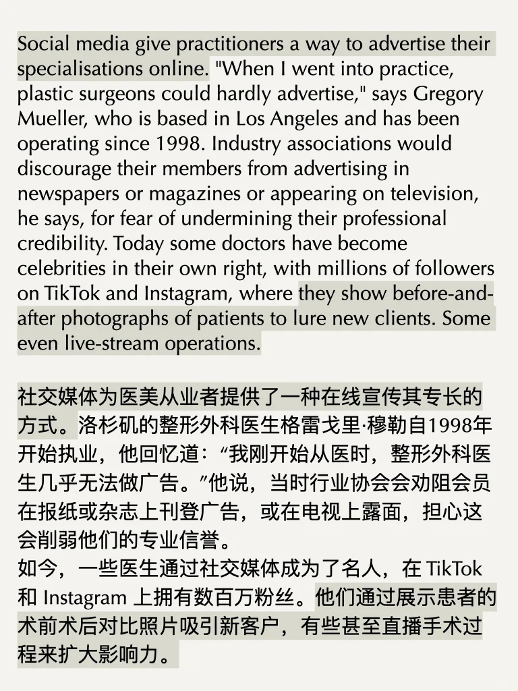 | 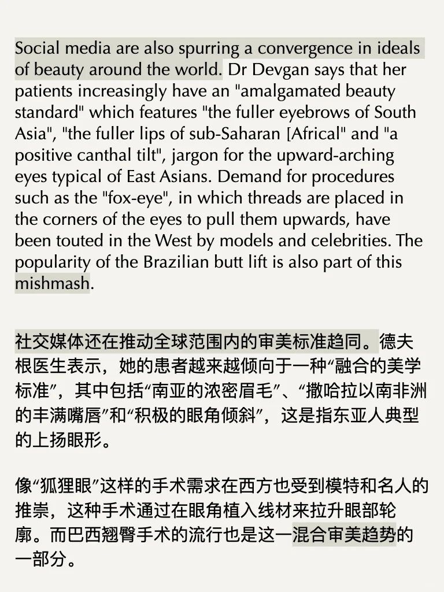 | 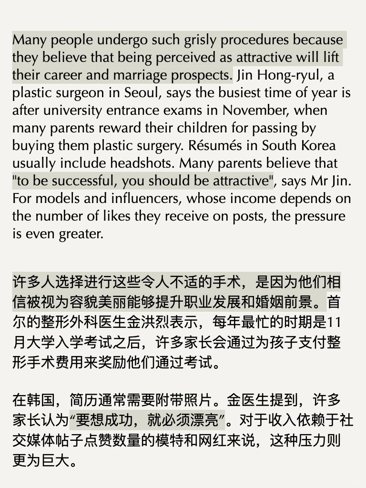 |

生成时间：2025-11-14 20:10:10