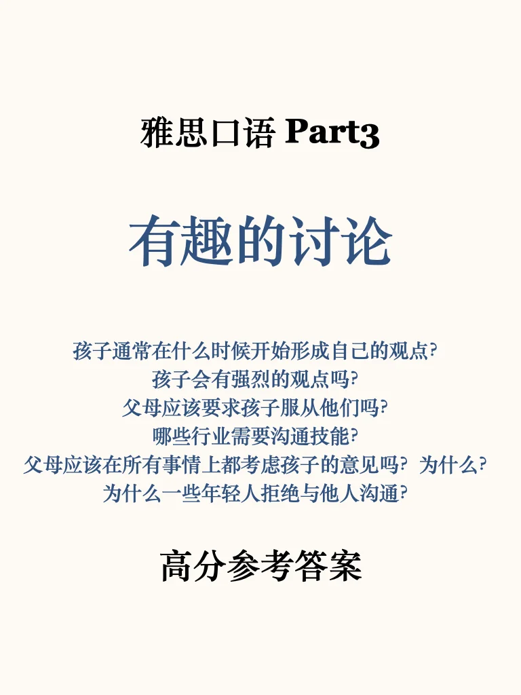
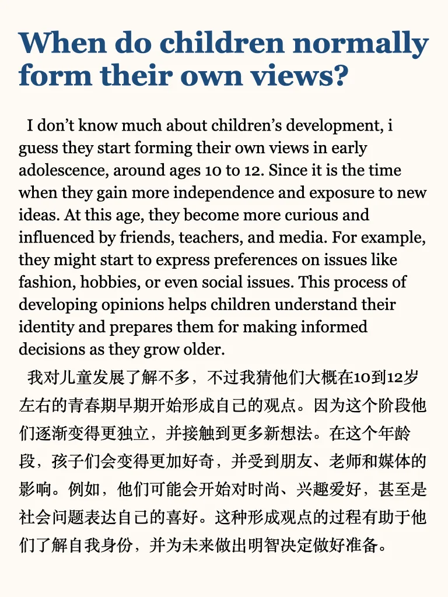
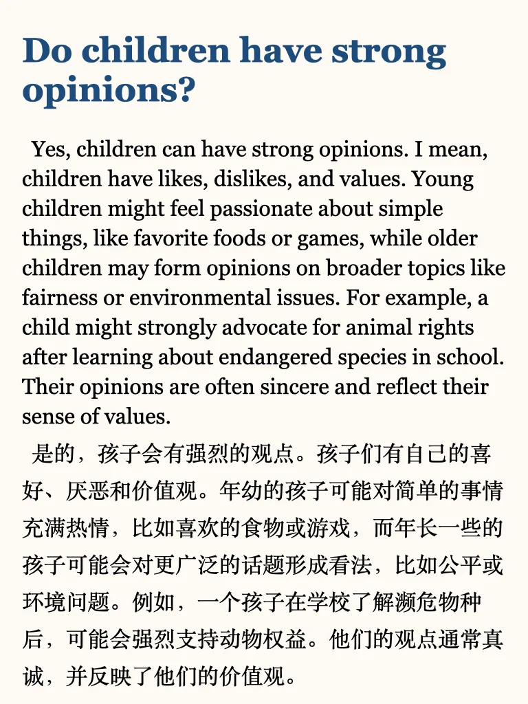
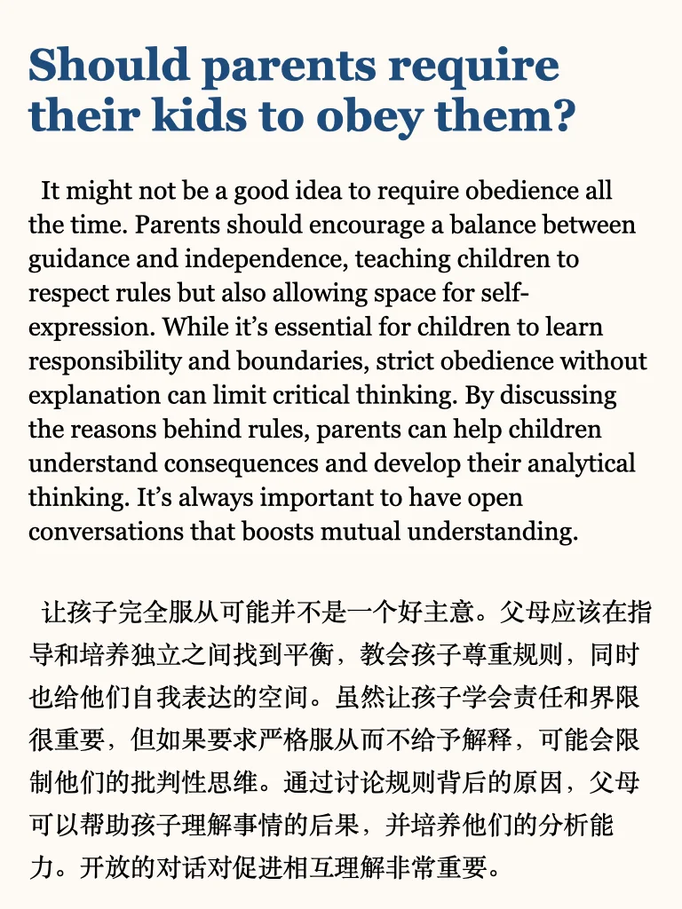
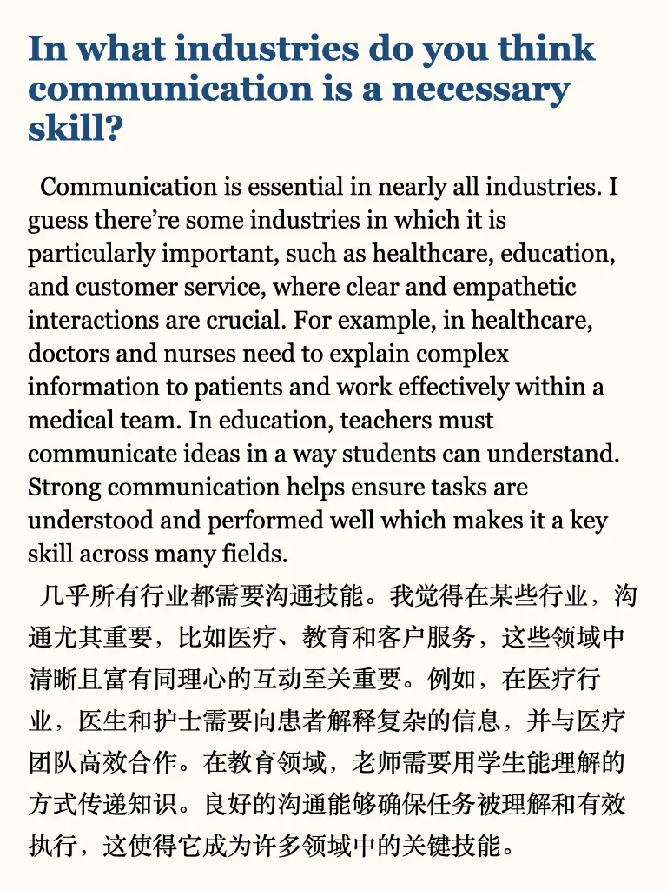
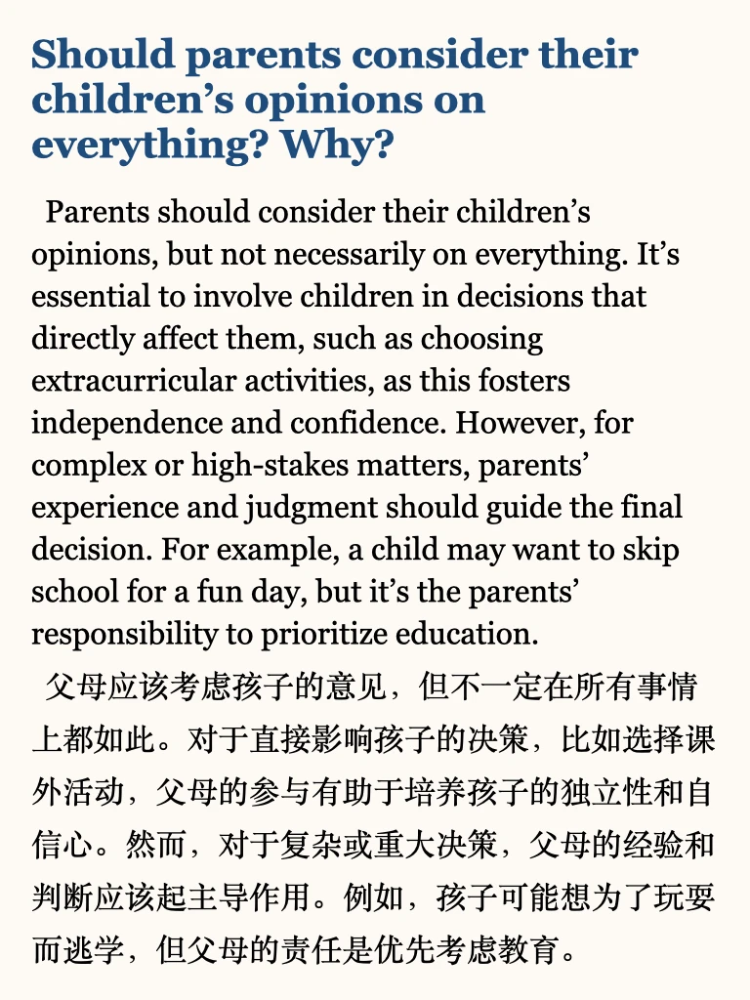
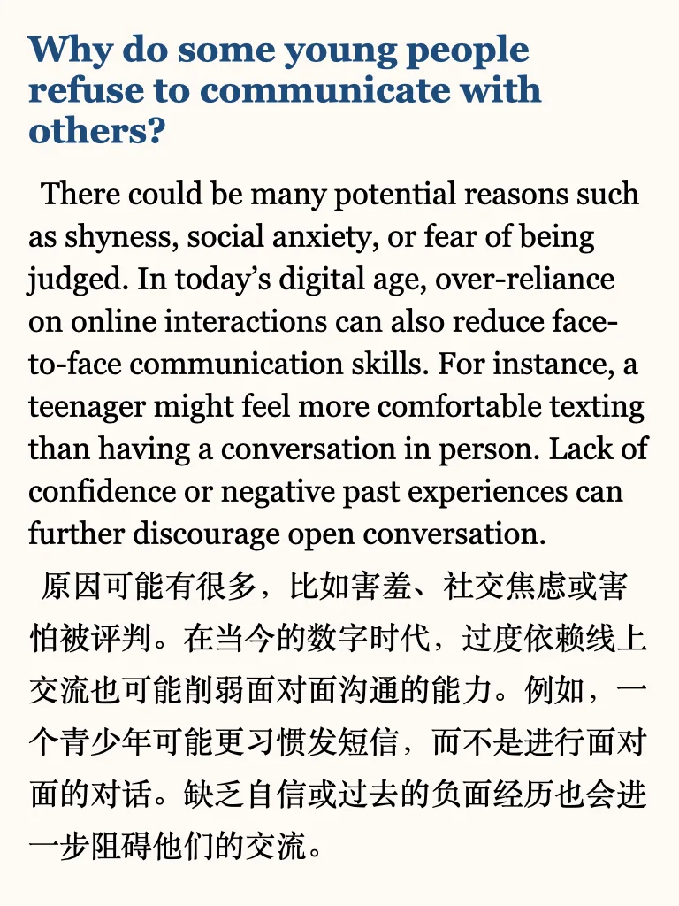

# 雅思口语part3高分参考｜观点与交流

今天分享近期高频题“有趣讨论”相关的part3，观点类思路讲解干货在最后一页
上季度完整part3答案 加本季度更新，左下角get
短期备考冲高分同学，推荐学习我的六天救急包
#英语地道表达 #英文写作 #雅思备考 #雅思口语part3新题答案 #雅思口语 #雅思口语参考答案 #雅思口语换题

## 图片
| 图1 | 图2 | 图3 | 图4 |
| --- | --- | --- | --- |
|  |  |  |  |
|  |  |  |  |

生成时间：2025-11-14 20:05:35