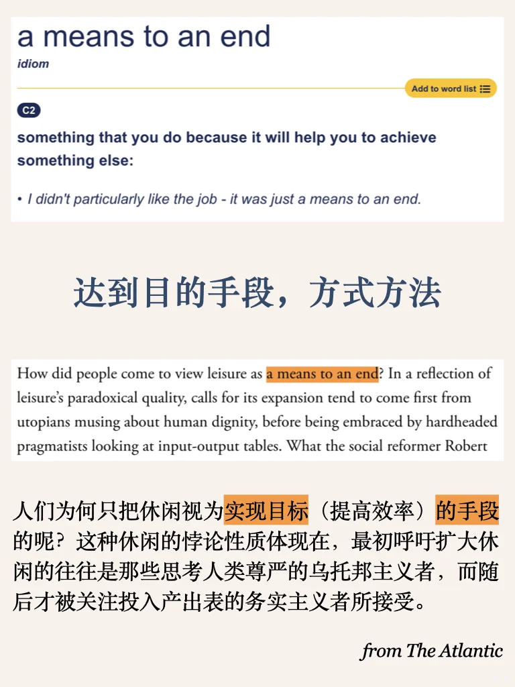

# 外刊习语｜达到目的的方法

#外刊精读 #英语地道表达 #英文学习 #翻译学习 #雅思备考 #四六级 #外刊 #考研英语
更多干货分享，最后一页get
感谢支持关注，一起持续学习❤️
	
平时分享的内容受篇幅限制，很多是段落节选或者词汇讲解
我把平时阅读的文章从期刊、网页中筛选出来，以PDF格式保存
想更阅读更完整的外刊原文，欢迎加入群聊🎉

## 图片
| 图1 | 图2 | 图3 | 图4 |
| --- | --- | --- | --- |
|  |  |  |  |

生成时间：2025-11-14 20:04:27