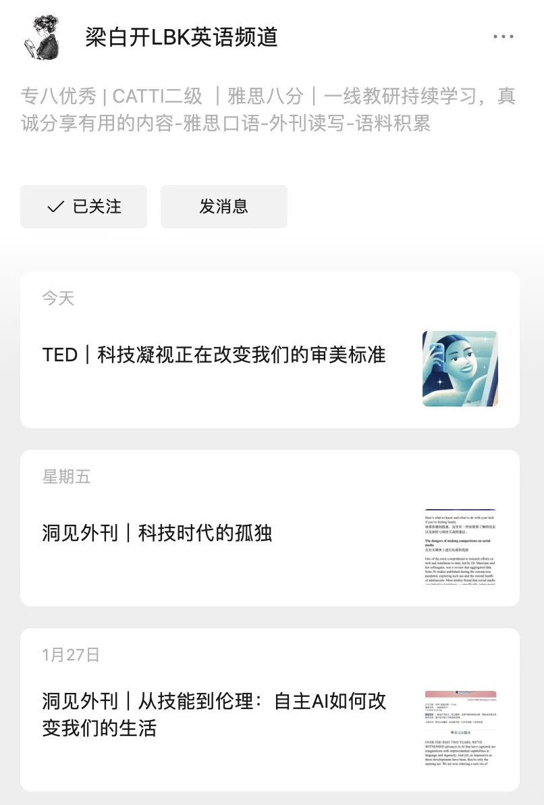
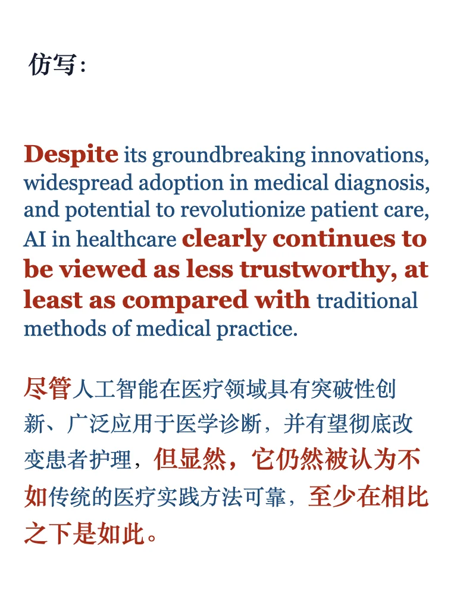
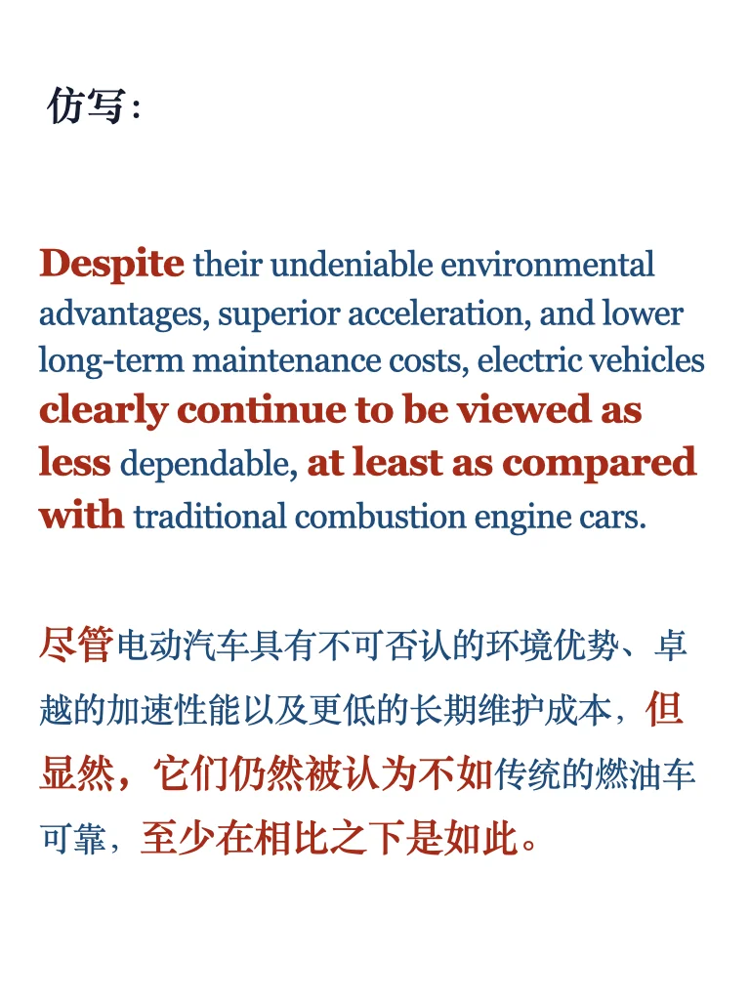
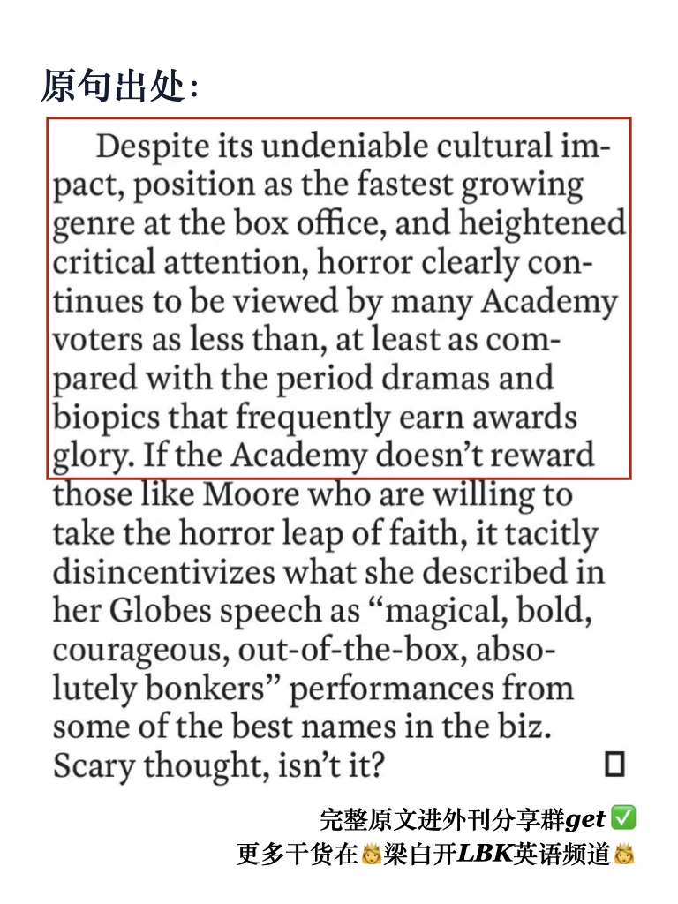

# 时代周刊仿写｜为什么这些宝藏总是被低估？

“尽管它有多重好处，却还是被低估”
你发现了哪些明明很优秀，却总是被忽视甚至被偏见对待的事物 ？
- 恐怖片明明超火，奥斯卡却总看不上它
- 电动车环保又省钱，却总被说不如油车可靠
- 古典音乐超有魅力，却总被年轻人嫌弃
跟着时代周刊的句子，一起运用让不逻辑，描述“宝藏”被忽视的现象。
	
更多详解练习，持续更新PDF，左下角get
进外刊分享群获取完整原文 ✅
更多干货在👸梁白开LBK英语频道👸
#雅思 #外刊精读 #四六级 #考研英语 #MTI #CATTI #英语写作 #被低估的宝藏 #英语地道表达 #雅思备考

## 图片
| 图1 | 图2 | 图3 | 图4 |
| --- | --- | --- | --- |
|  |  |  |  |
|  |  |   |   |

生成时间：2025-11-14 19:54:26