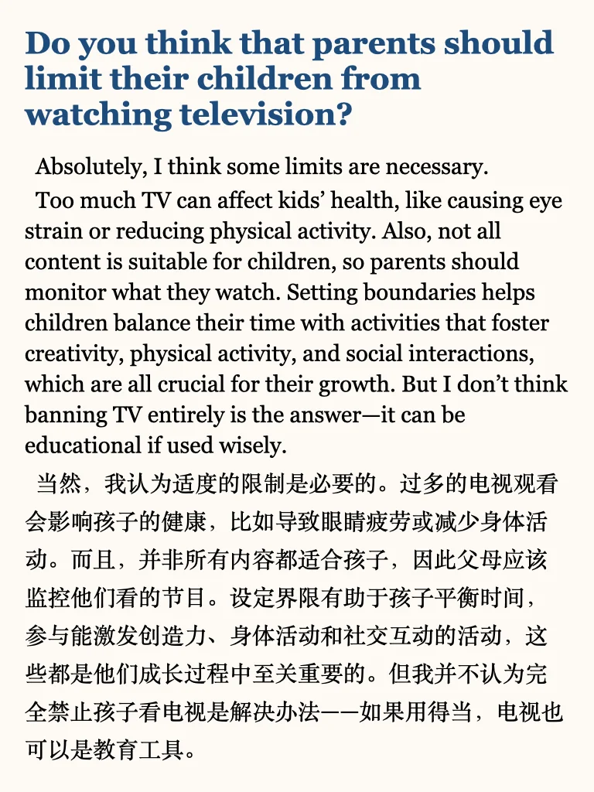
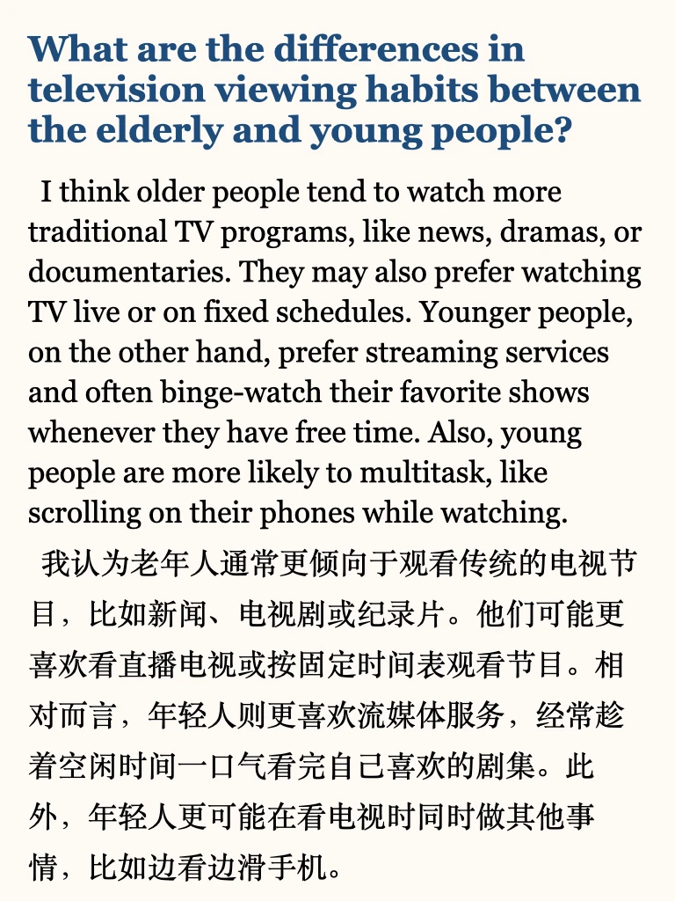

# 新题参考答案｜电视相关

#学习 #雅思 #雅思自学 #雅思书籍 #英语地道表达 #雅思备考 #雅思口语高分示范 #雅思口语part3 #雅思口语新题
左下角get上季度完整part3答案+本季度更新
目前更新：
精力充沛的人
近期改变的计划
近期日常改变
交通工具抛锚的经历
忘记重要事情
喜欢的电视节目
感兴趣的科学科目
喜欢的诗歌/歌词
许下的承诺
重要决定
重要规则
乡村一隅
想去的国外
有趣的建筑
	
短时间备考的同学，推荐学习我的救急包，六个主题get题库规律

## 图片
| 图1 | 图2 | 图3 | 图4 |
| --- | --- | --- | --- |
|  |  |  |  |
|  |  |   |   |

生成时间：2025-11-14 19:53:20