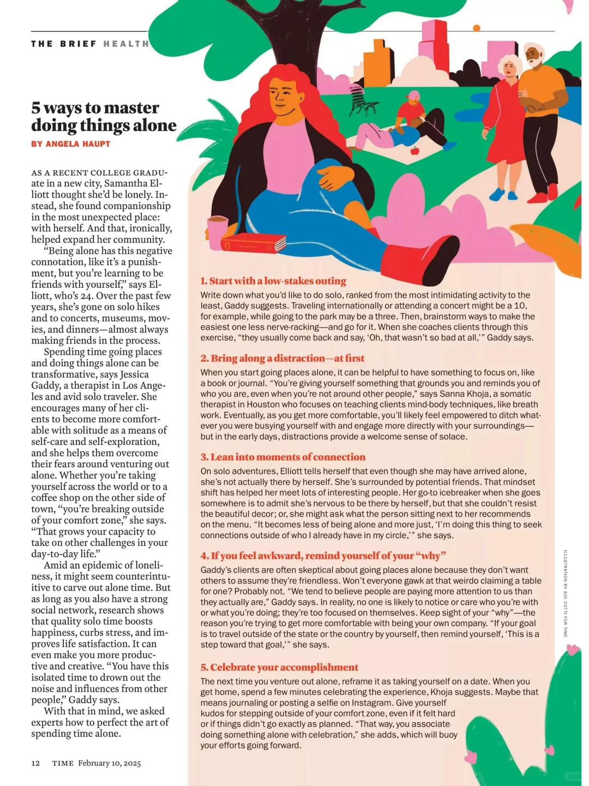
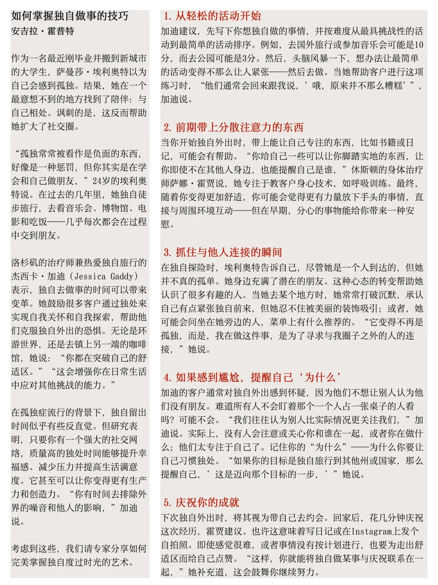

# 一个人也能闪闪发光✨独处生活指南

独处是一种自我成长的绝佳机会
时代周刊分享了5个超实用的技巧，帮助你提升独处体验，让一个人的时光也能充满乐趣和意义。
	
最后一页get TIME Feb-10 刊
#学习 #时代周刊 #Time #外刊 #独处

## 图片
| 图1 | 图2 | 图3 | 图4 |
| --- | --- | --- | --- |
|  |  |  |   |

生成时间：2025-11-14 19:52:14