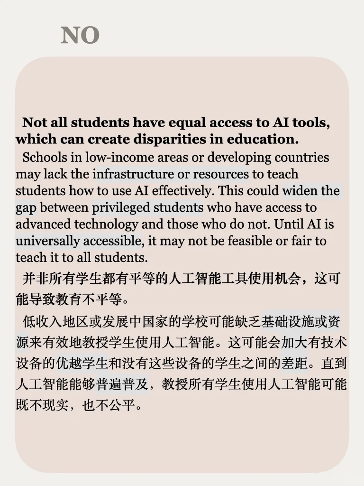
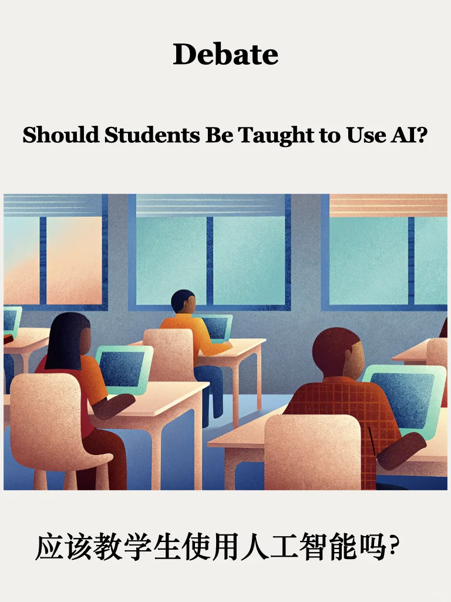
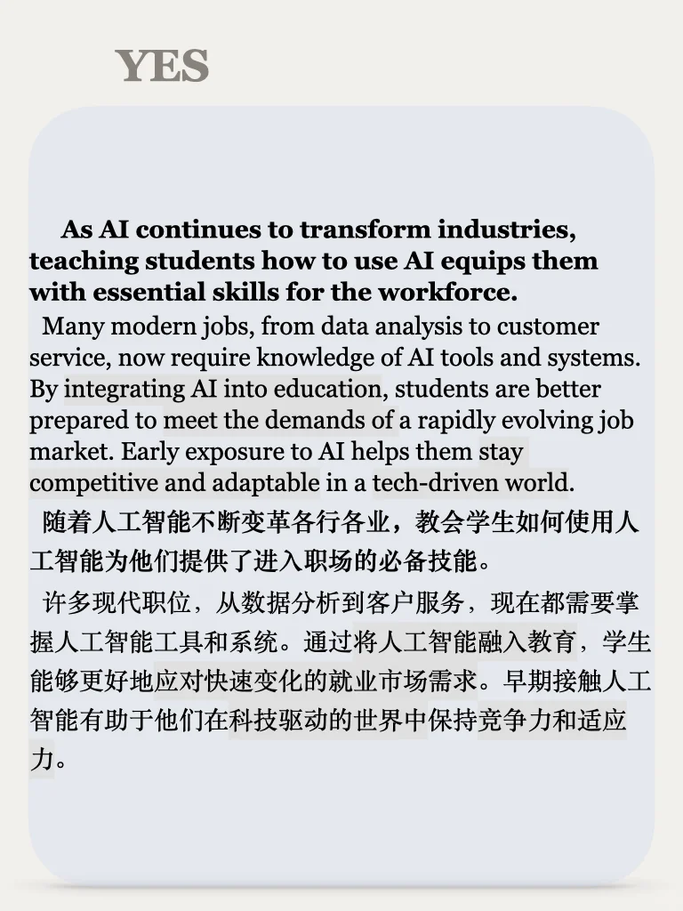
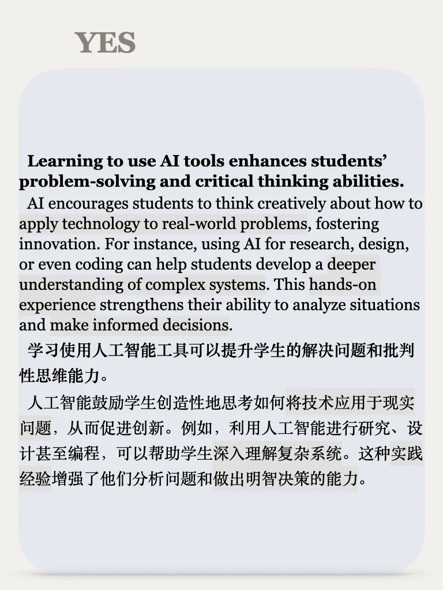
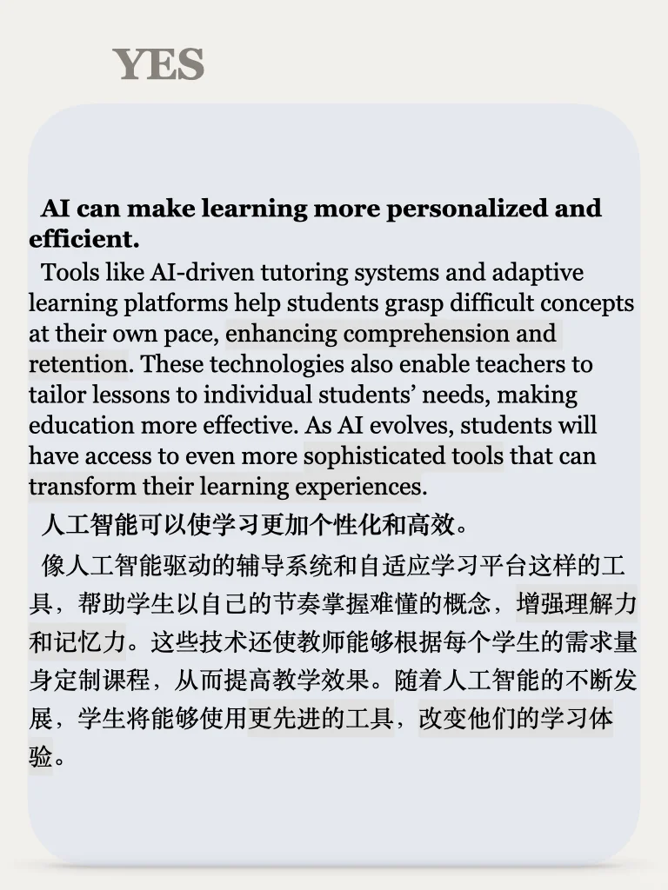
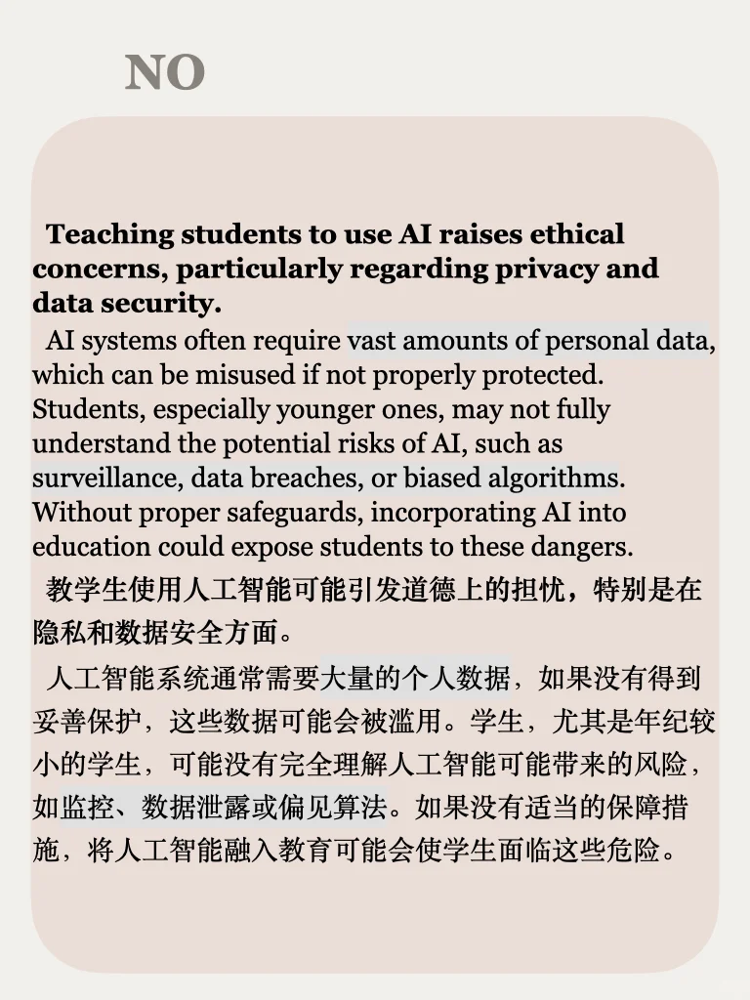
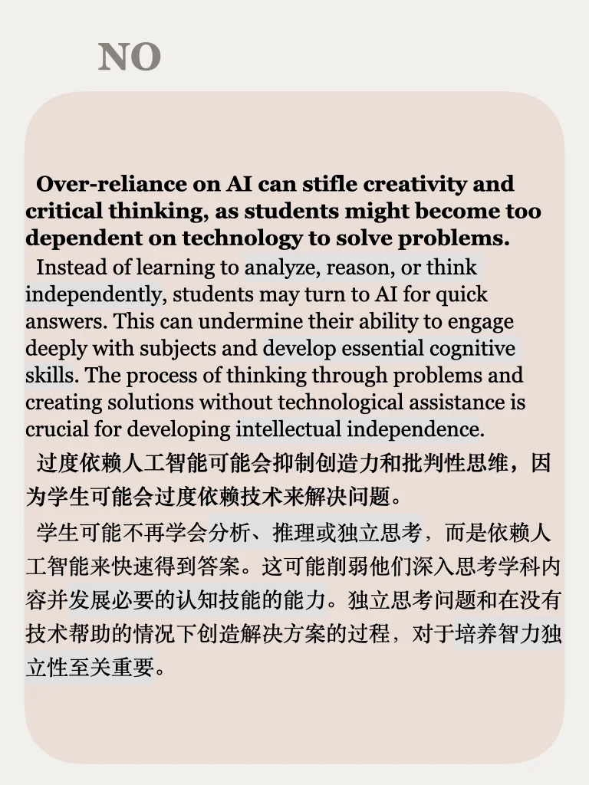

# 辩论61期｜学生用人工智能，是助力还是负担？

人工智能正在改变世界，但学生该不该从小学习AI？🤔 有人认为这是未来必备技能，有人却担心过早接触会带来负面影响。你怎么看？
	
思辨栏目涵盖社会、个人发展、媒体、科技、自然等广泛话题，从正反两个角度思考整理素材，适合备考写作、积累口语观点、培养辨证逻辑能力，每周一更左下角get PDF

## 图片
| 图1 | 图2 | 图3 | 图4 |
| --- | --- | --- | --- |
|  |  |  |  |
|  |  |  |   |

生成时间：2025-11-14 19:51:09