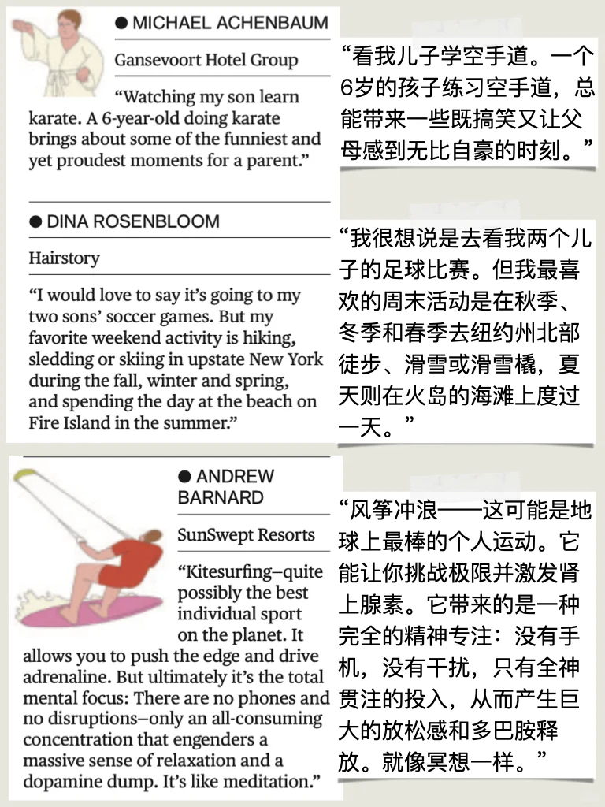
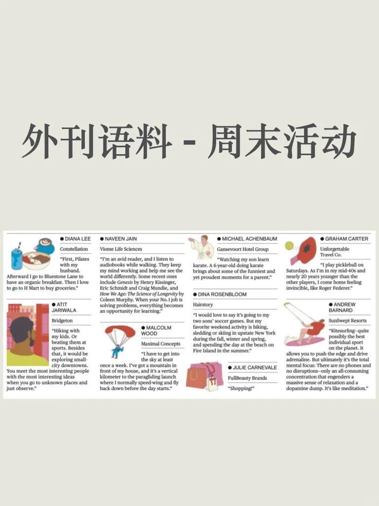
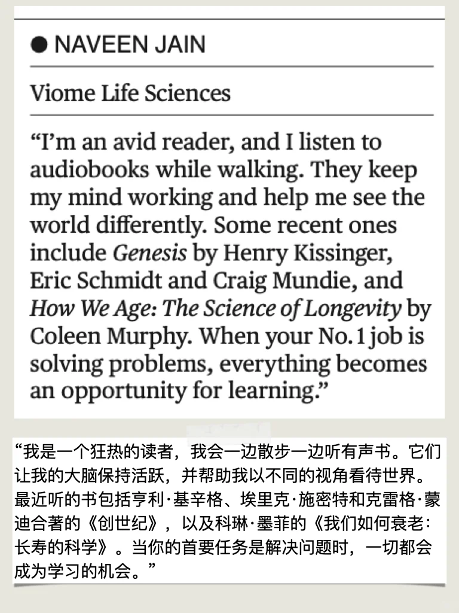
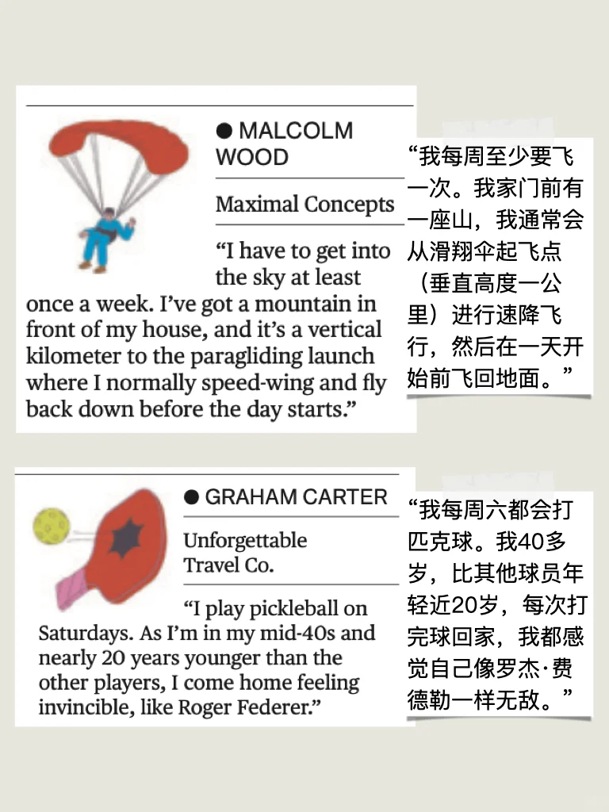

# Bloomberg｜CEO周末生活大公开

从普拉提到风筝冲浪，从亲子徒步到听书学习，大佬们的周末生活好精彩～
	
🌟亮点词组：
1. avid reader
- 狂热读者
- 例句：She’s an avid reader and finishes at least two books a week.
2. keep my mind working
- 让大脑保持活跃
- 例句：Solving puzzles helps keep my mind working.
3. push the edge
- 挑战极限
- 例句：Extreme sports like kitesurfing allow you to push the edge.
4. drive adrenaline
- 激发肾上腺素
- 例句：Skydiving really drives adrenaline and makes you feel alive.
5. all-consuming concentration
- 全神贯注
- 例句：When I’m painting, I experience an all-consuming concentration that blocks out everything else.
6. dopamine dump
- 多巴胺释放
- 例句：Winning the game gave me a dopamine dump and left me feeling euphoric.

## 图片
| 图1 | 图2 | 图3 | 图4 |
| --- | --- | --- | --- |
|  |  |  |  |
|  |   |   |   |

生成时间：2025-11-14 19:50:02