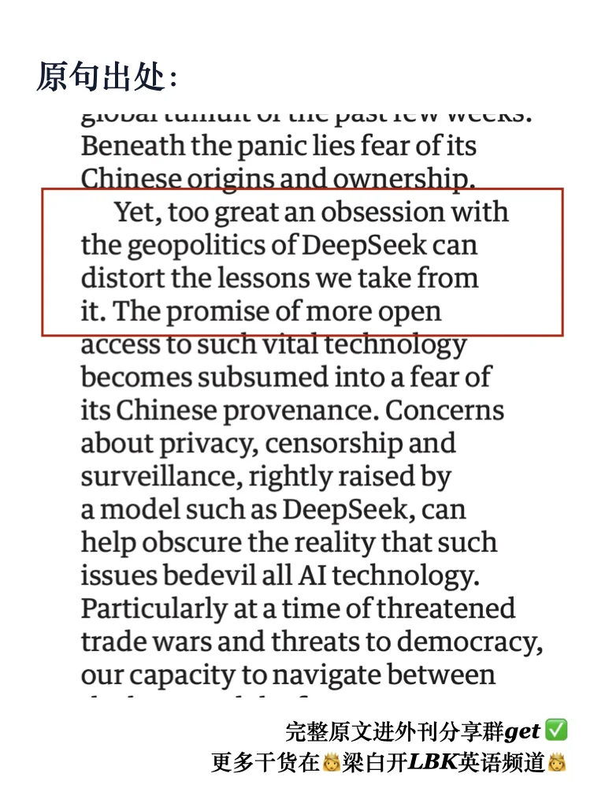
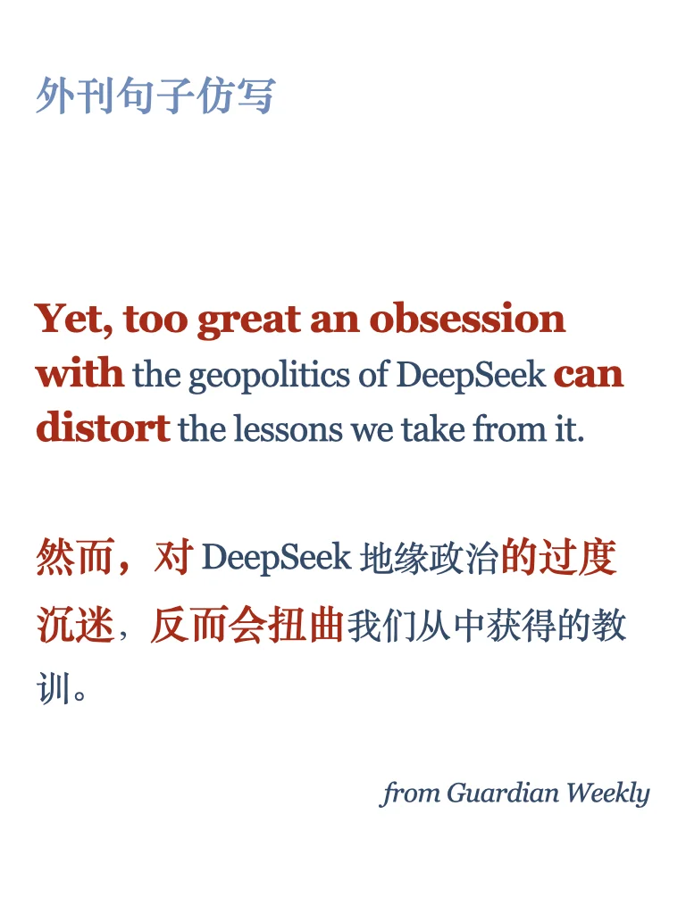
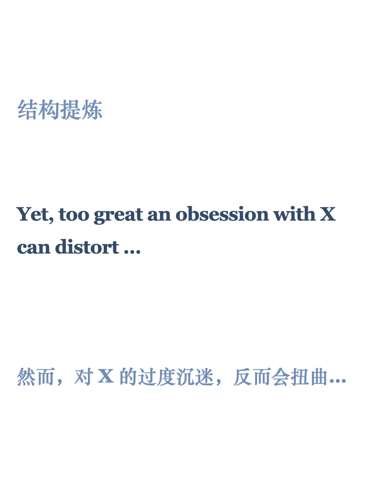
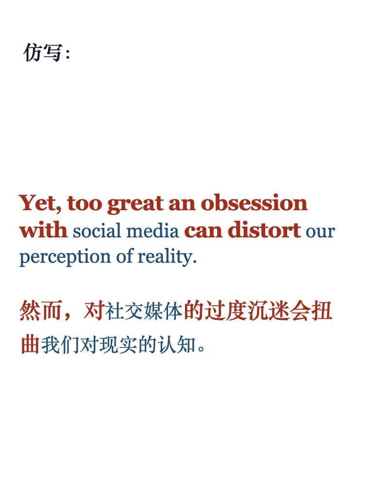
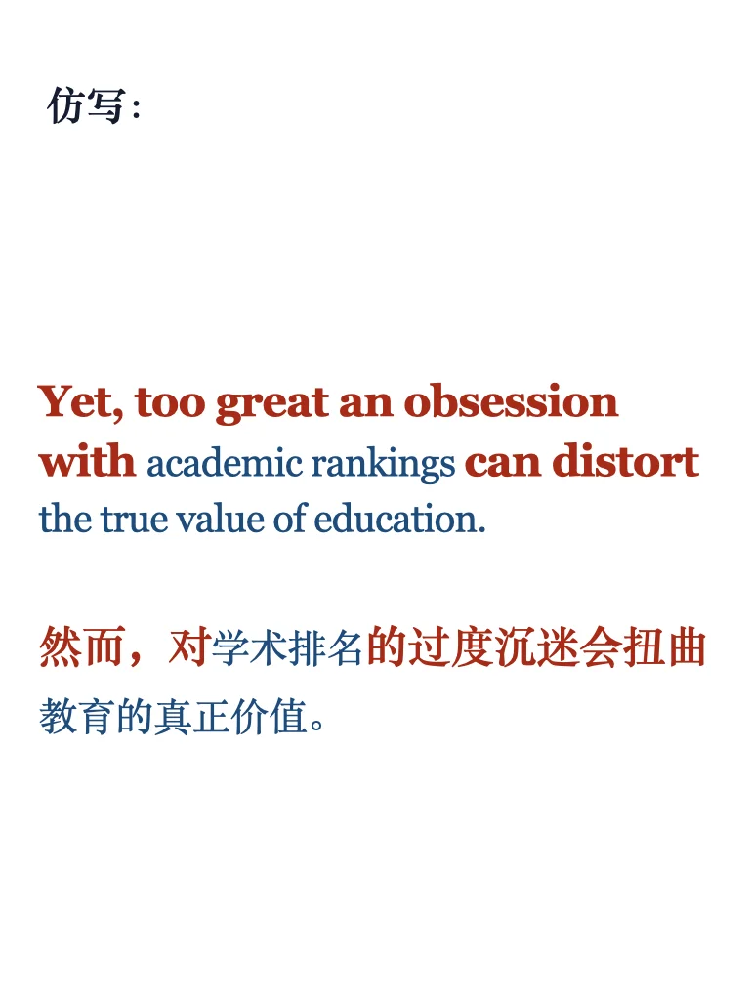

# 句型44期｜“防沉迷” 保持理性思考

你是否发现，有时对某件事太过于执着，反而会适得其反？
🌰
过度沉迷社交媒体，却忽略了现实生活。
过度追求学术排名，却忘了教育的真正意义。
过度关注经济增长，却忽视了环境的可持续发展。🌟 “Yet, too great an obsession with X can distort …..”
学习用今天的句子，描述你认为“过度”而导致“扭曲”认知的现象吧。
	
#好句 #英文 #雅思 #英语地道表达 #外刊精读 #英语语法 #英语写作 #考研英语 #四六级 #MTI

## 图片
| 图1 | 图2 | 图3 | 图4 |
| --- | --- | --- | --- |
|  |  |  |  |
|  |   |   |   |

生成时间：2025-11-14 19:46:46