# 20个英语习语，让你的口语不再&quot;塑料&quot;

来自于杂志“Learn Hot English”
最后一页get原版PDF
	
🌟 Water under the bridge  过去的事就让它过去吧
🌟 Piece of cake  小菜一碟
🌟 Let the cat out of the bag  泄露秘密
🌟 Hit the nail on the head  一语中的
🌟 You can’t judge a book by its cover  人不可貌相
🌟 Don’t bite off more than you can chew  不要贪多嚼不烂
🌟 You scratch my back and I’ll scratch yours  互相帮忙
🌟 Add insult to injury  雪上加霜
🌟 Once in a blue moon  千载难逢
🌟 See eye to eye  意见一致
🌟 Kill two birds with one stone  一箭双雕
🌟 The last straw  压倒骆驼的最后一根稻草
🌟 Sit on the fence  坐山观虎斗
🌟 Pull the wool over someone’s eyes  瞒天过海
🌟 Cut corners  走捷径
🌟 Take what someone says with a pinch of salt  听听就好
🌟 The best of both worlds  两全其美
🌟 Speak of the devil! / Talk of the devil!  说曹操，曹操到
🌟 To give someone the cold shoulder  冷落某人
🌟 A lot on your plate  事情太多
#雅思 #雅思备考 #雅思自学 #英语地道表达 #英语俚语 #每日英语 #实用英语 #英语阅读 #原版杂志 #口语

## 图片
| 图1 | 图2 | 图3 | 图4 |
| --- | --- | --- | --- |
| 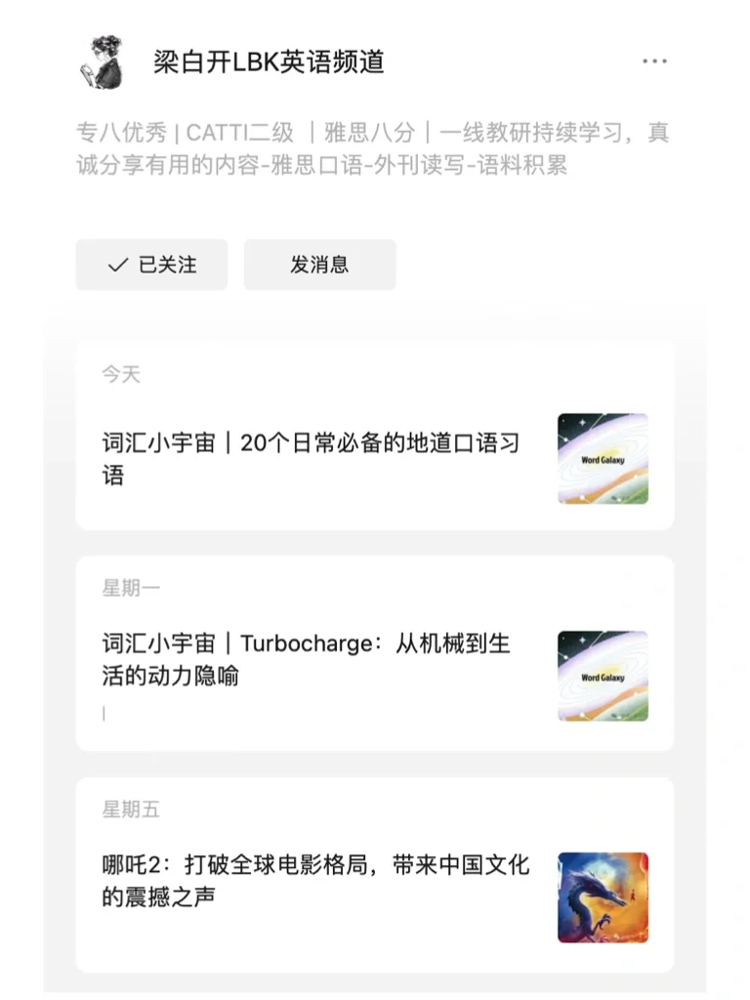 | 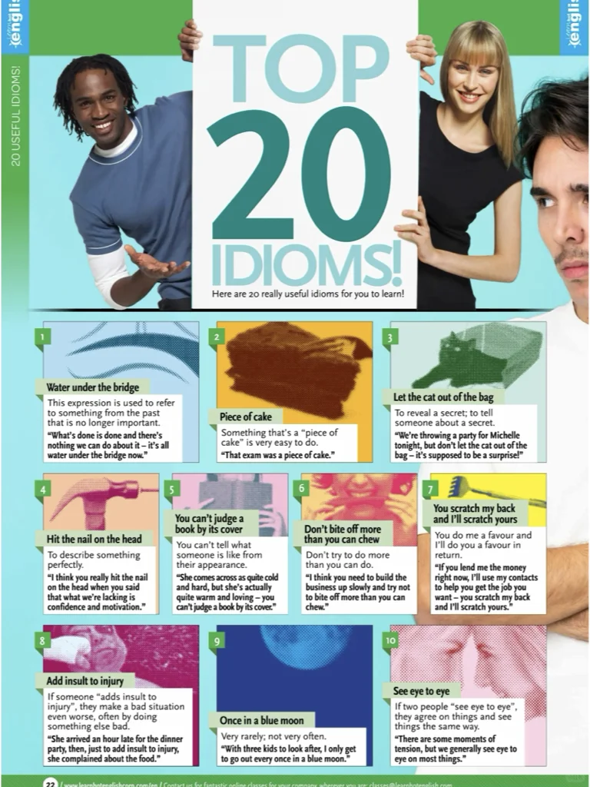 | 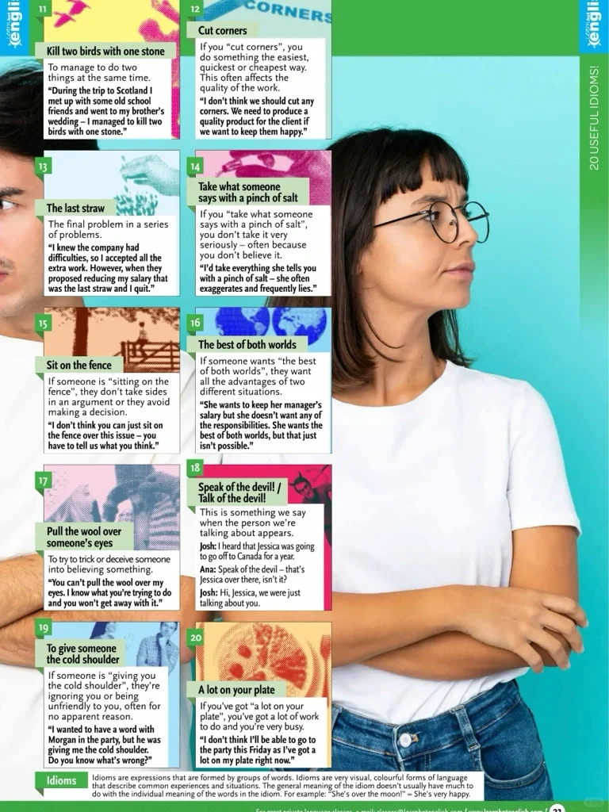 | 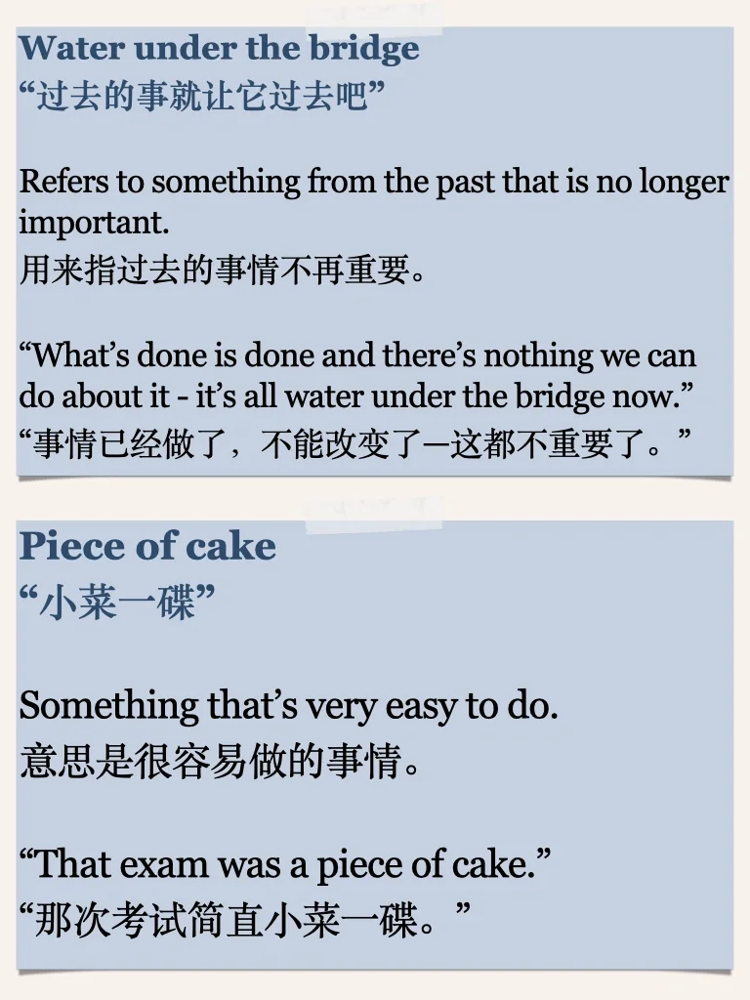 |
| 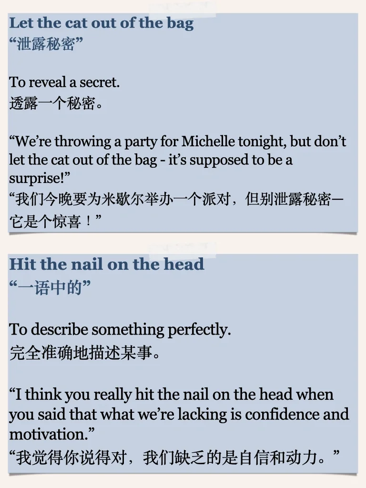 | 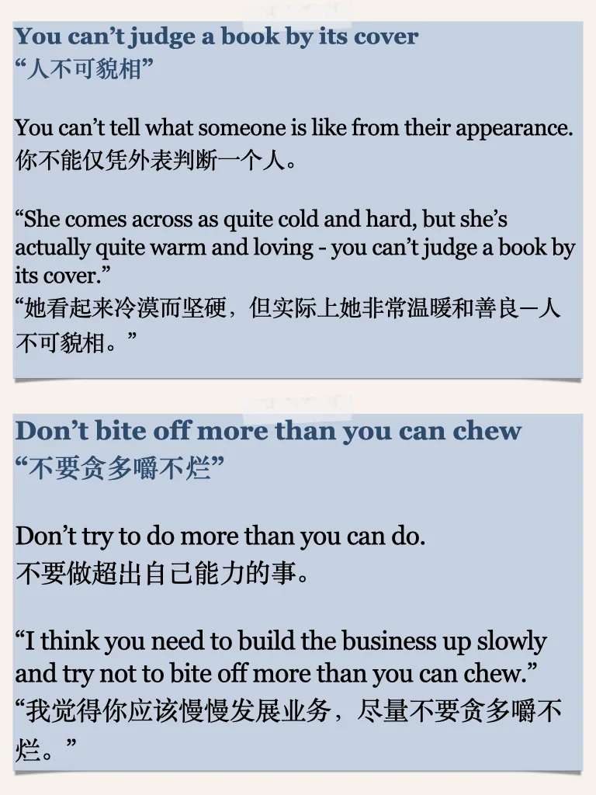 | 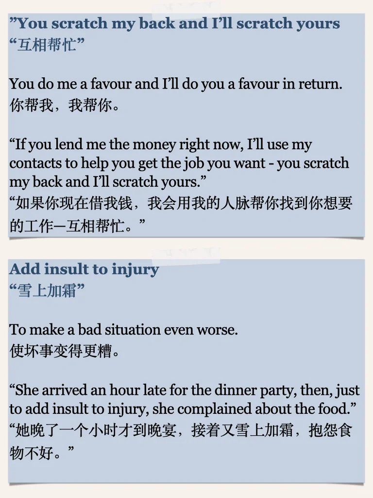 | 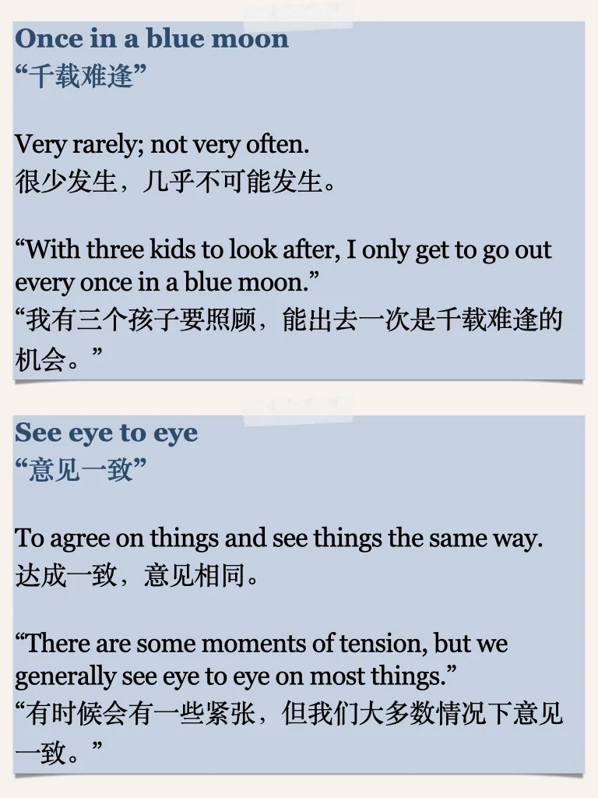 |
| 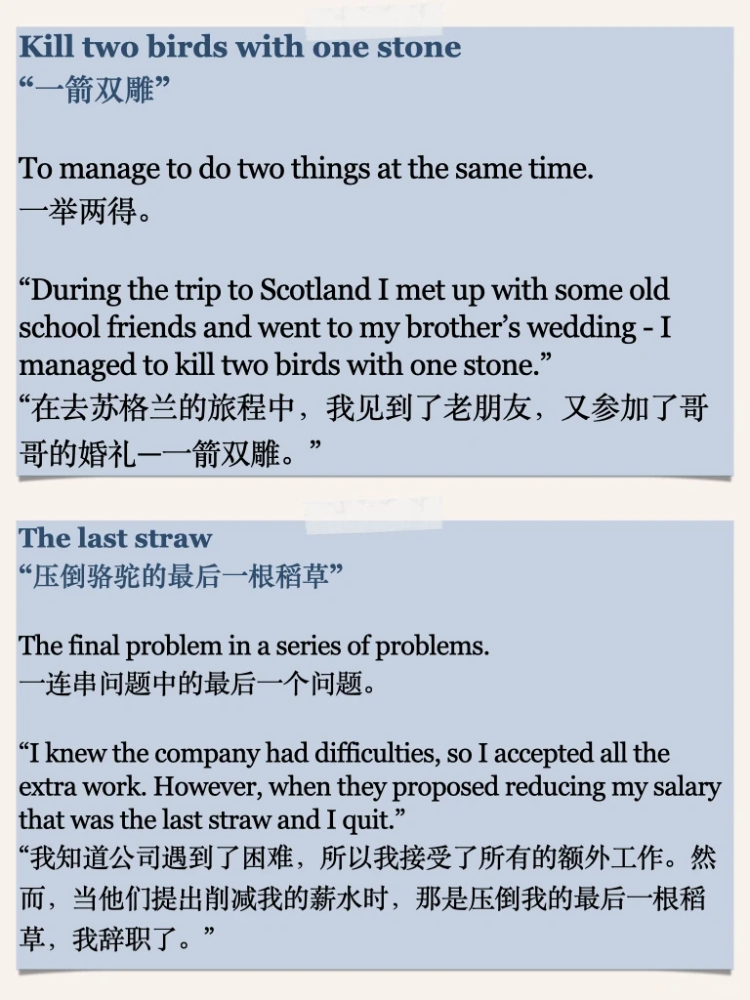 | 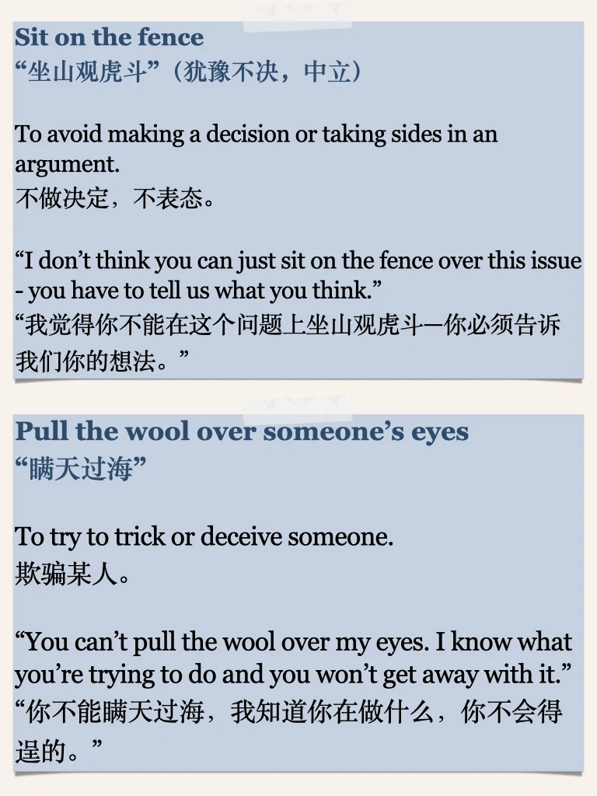 | 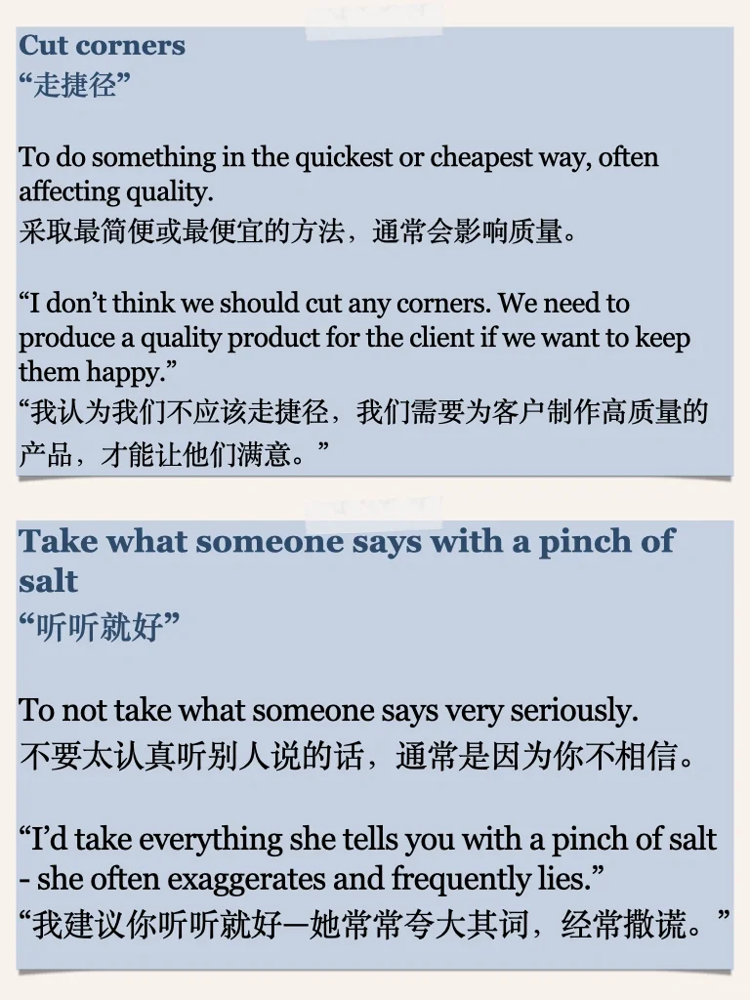 | 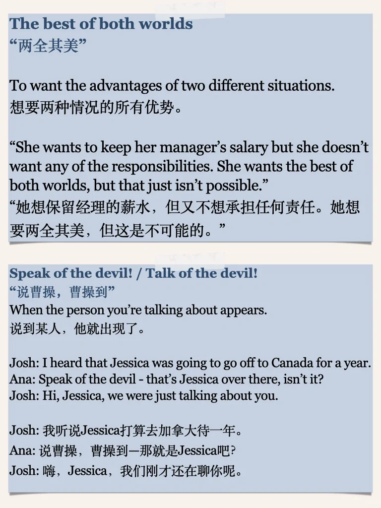 |
| 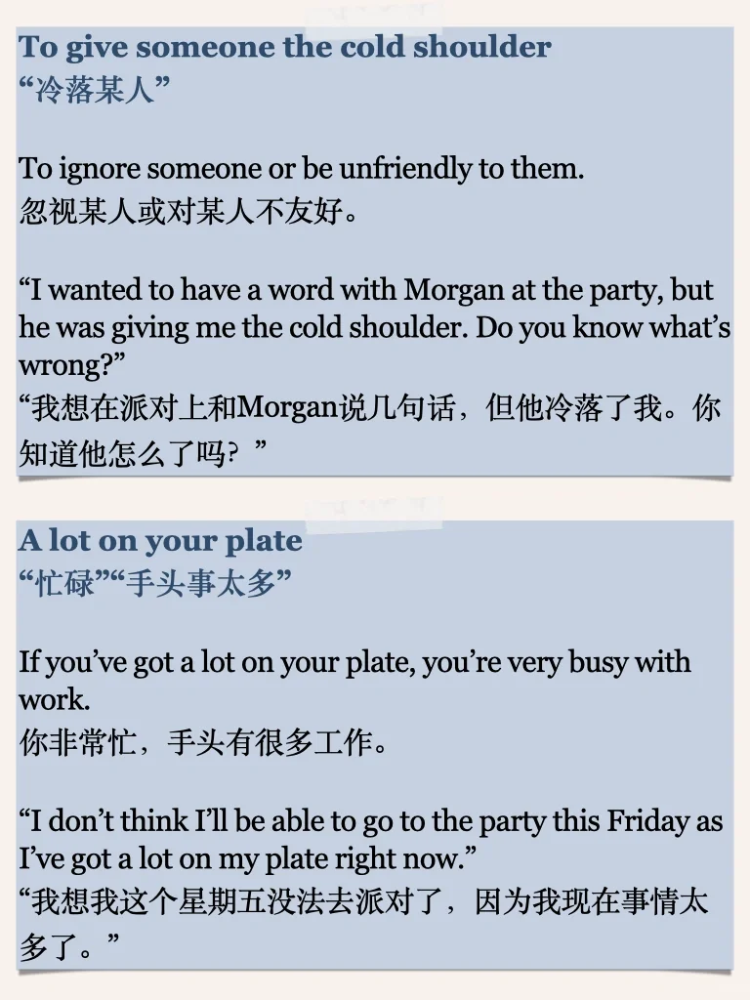 |   |   |   |

生成时间：2025-11-14 19:44:34