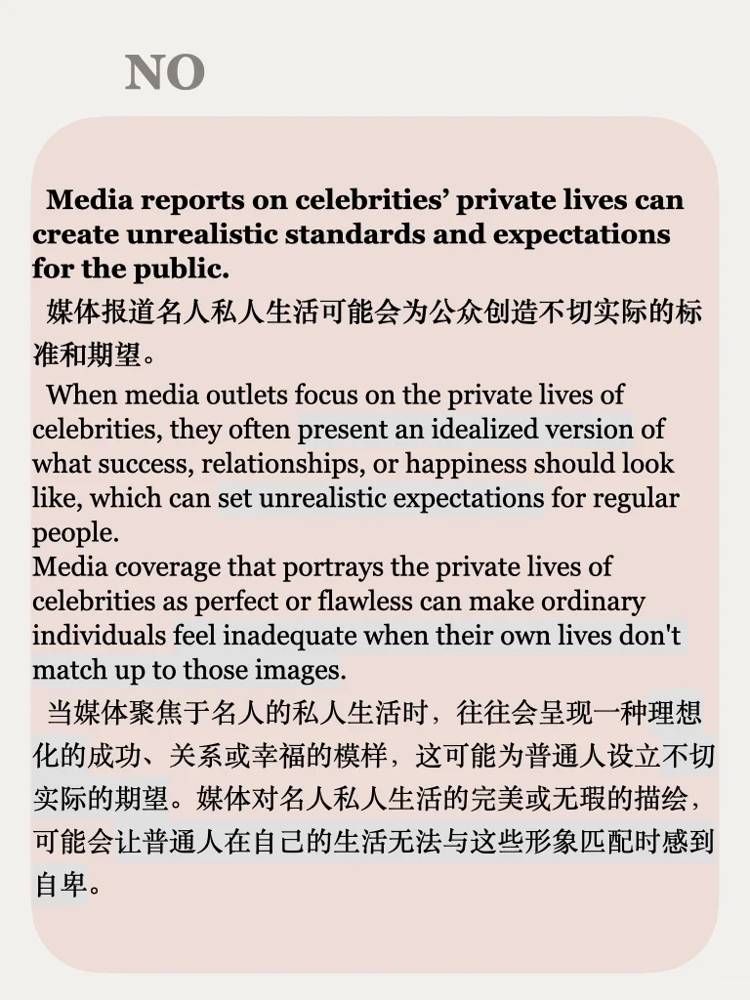
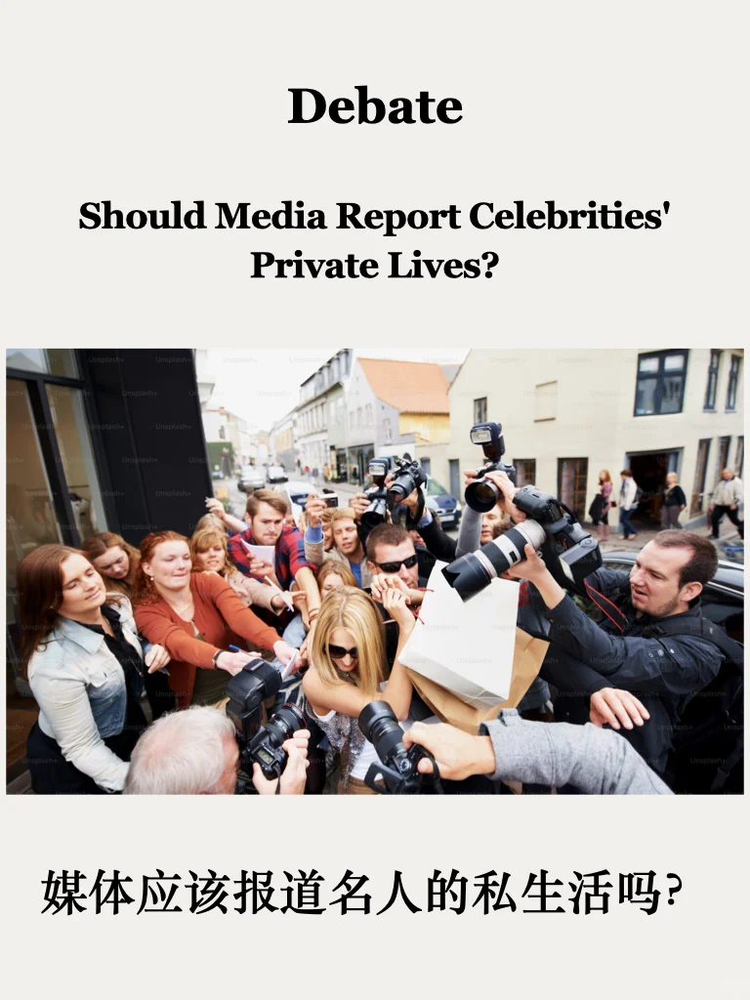
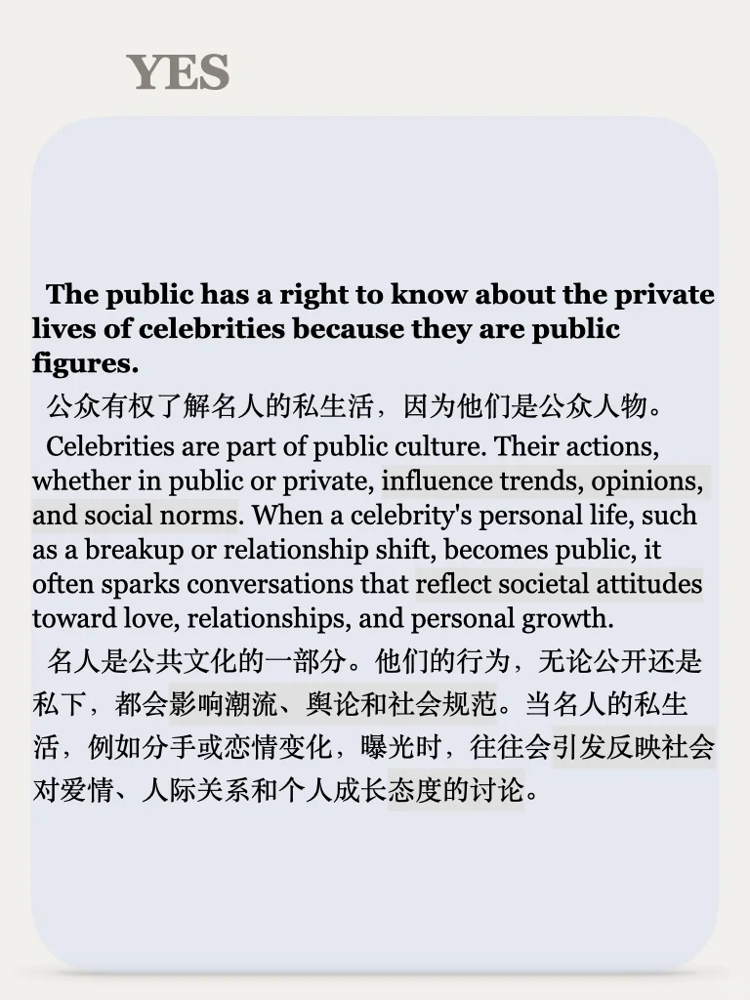
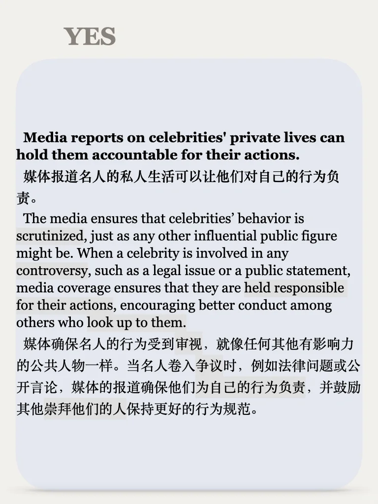
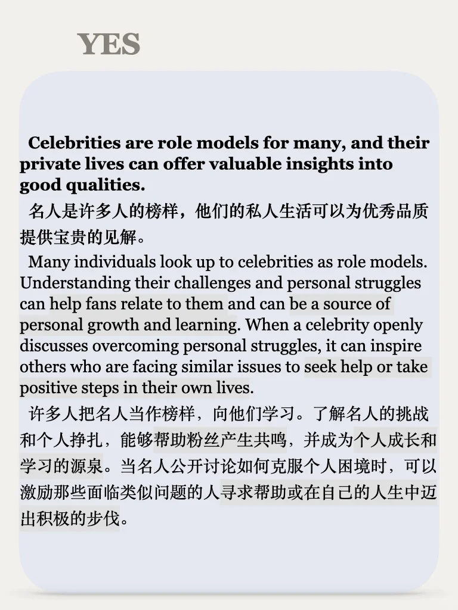
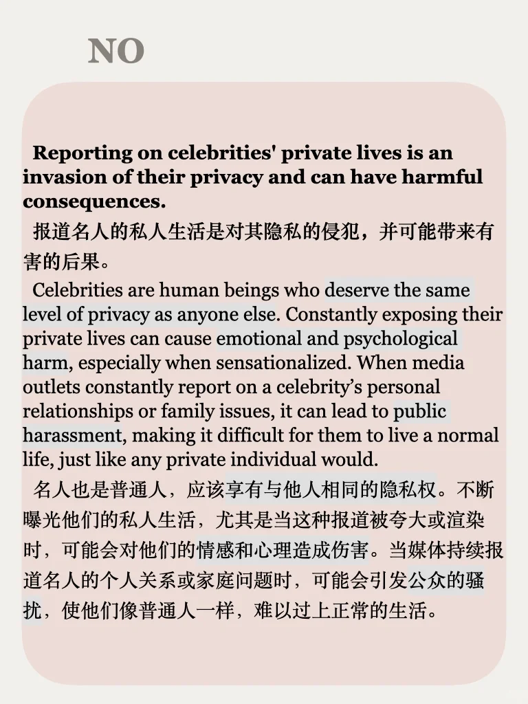
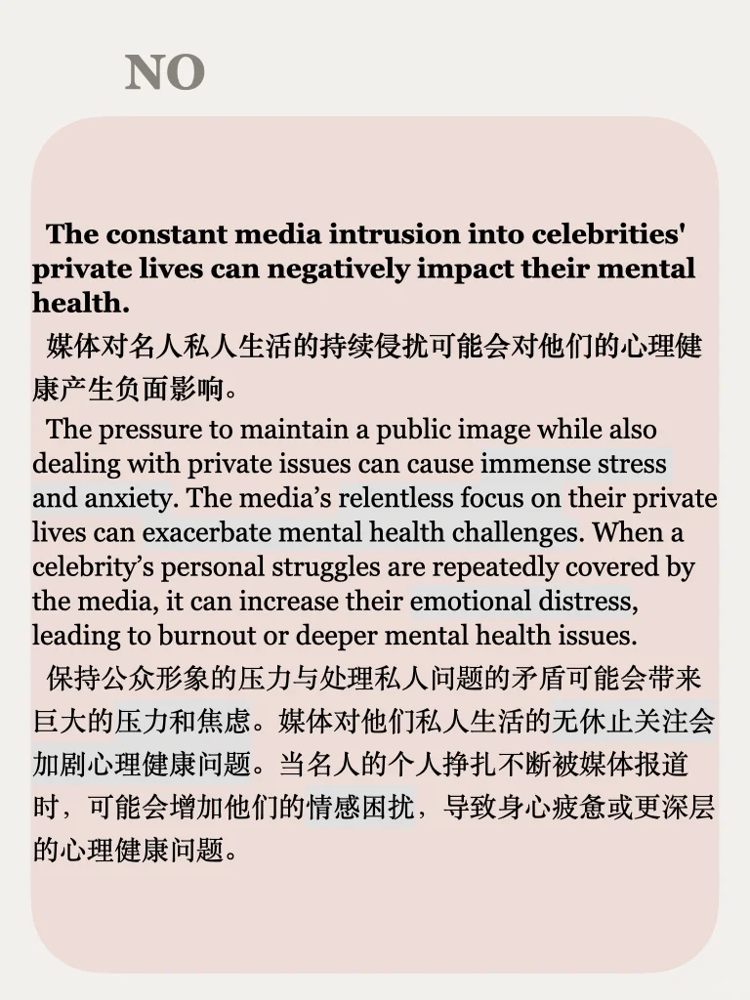

# 思辨能力62期｜媒体该不该报道明星的“瓜”

说出你的想法🎙️
🔵明星作为公众人物，享受了流量红利，就应该接受公众监督，私生活也是人设的一部分，我们有权利知道真相。
🔴明星也是普通人，私生活不该成为大众茶余饭后的谈资，过度曝光只会助长狗仔文化，侵犯隐私权！
#雅思备考 #雅思 #雅思自学 #四六级 #英语地道表达 #思辨 #写作 #mti #考研英语
思辨系列涵盖社会、个人发展、媒体、科技、自然等广泛话题，从正反两个角度思考整理素材，适合备考写作、积累口语观点、培养辨证逻辑能力，每周一更左下角get

## 图片
| 图1 | 图2 | 图3 | 图4 |
| --- | --- | --- | --- |
|  |  |  |  |
|  |  |  |   |

生成时间：2025-11-14 19:43:24