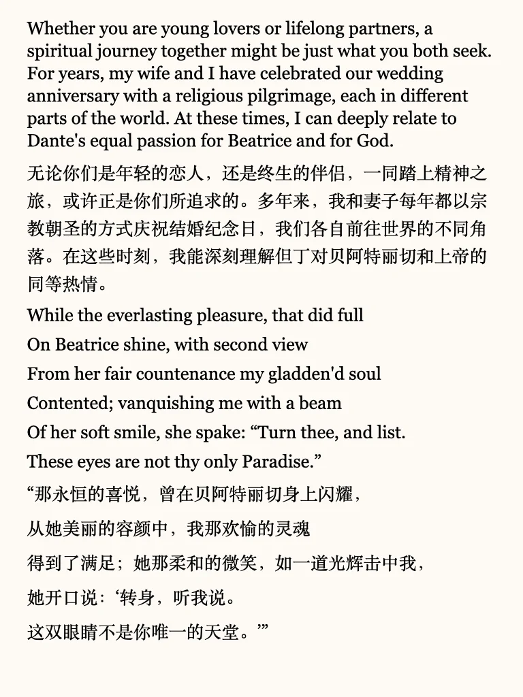
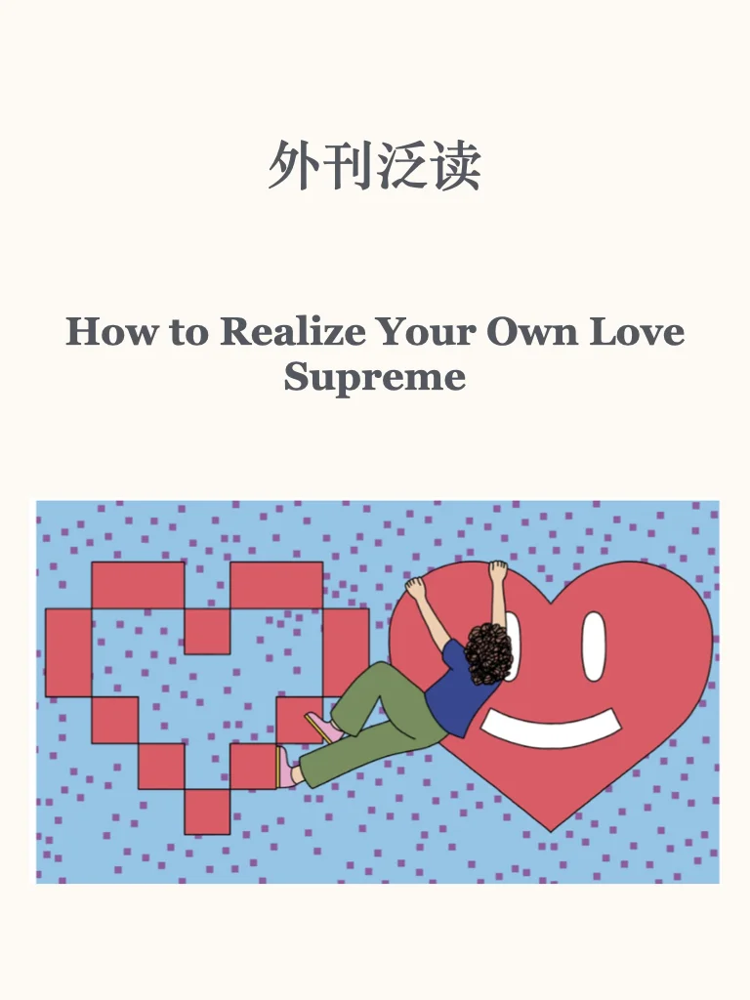
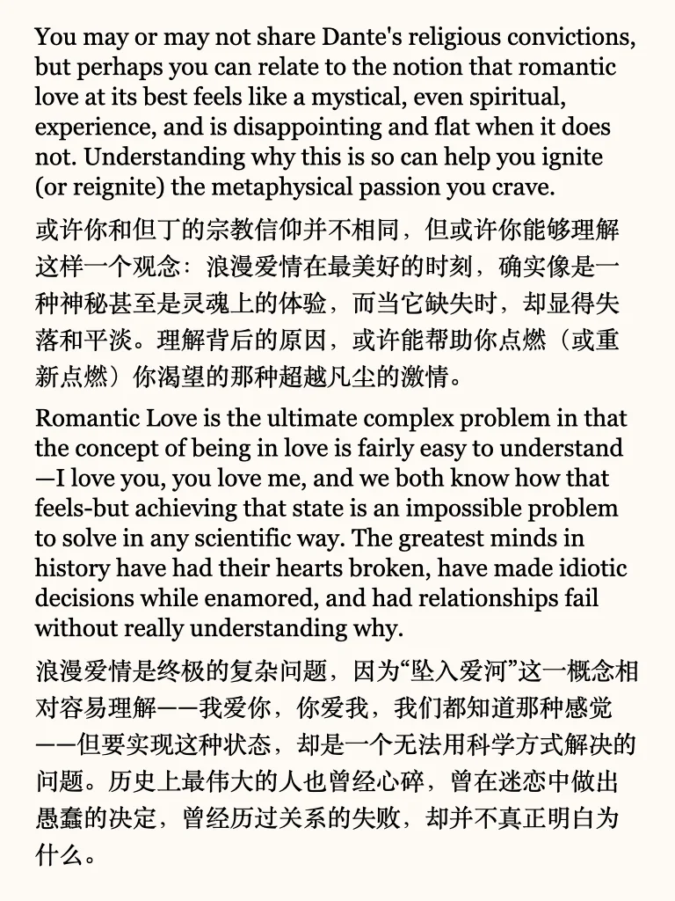
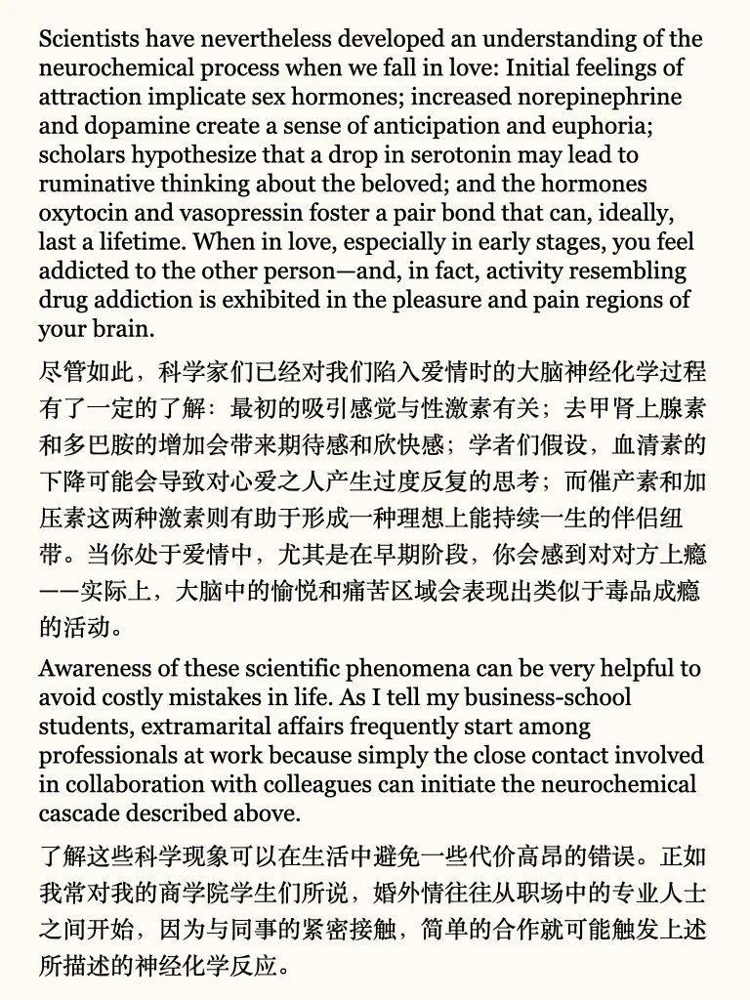
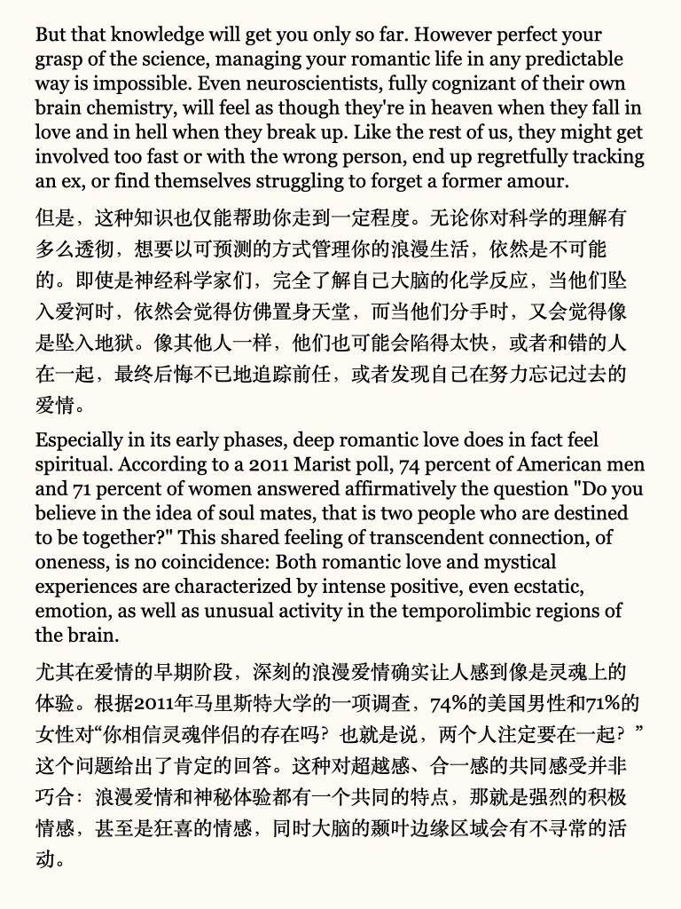
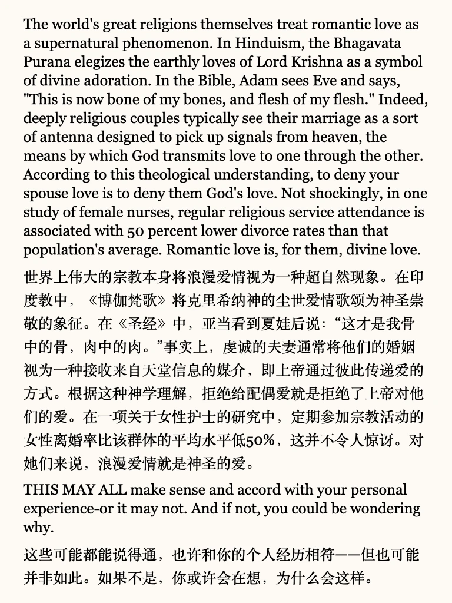
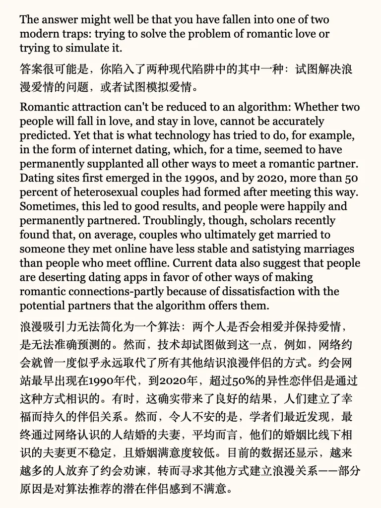
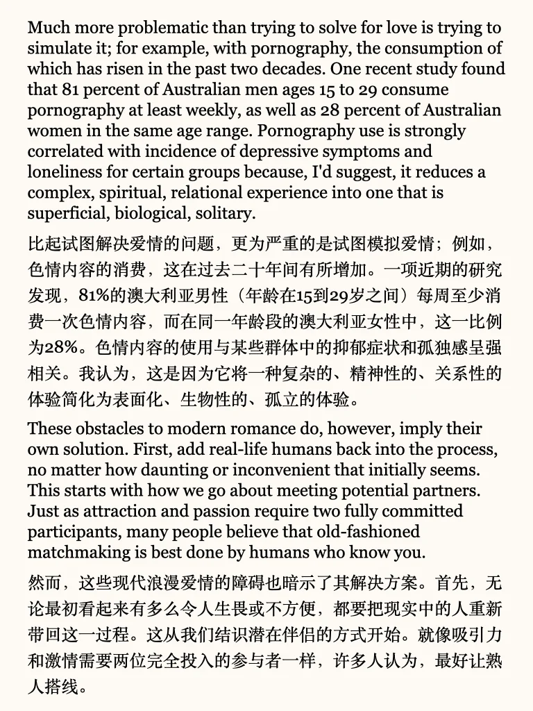
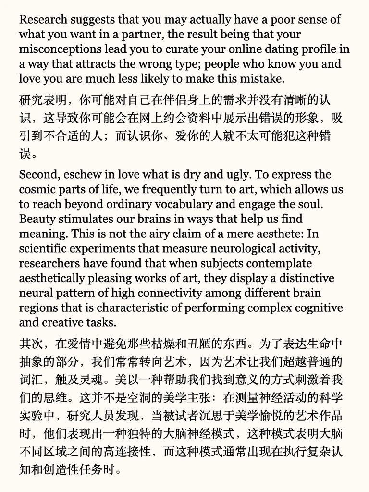
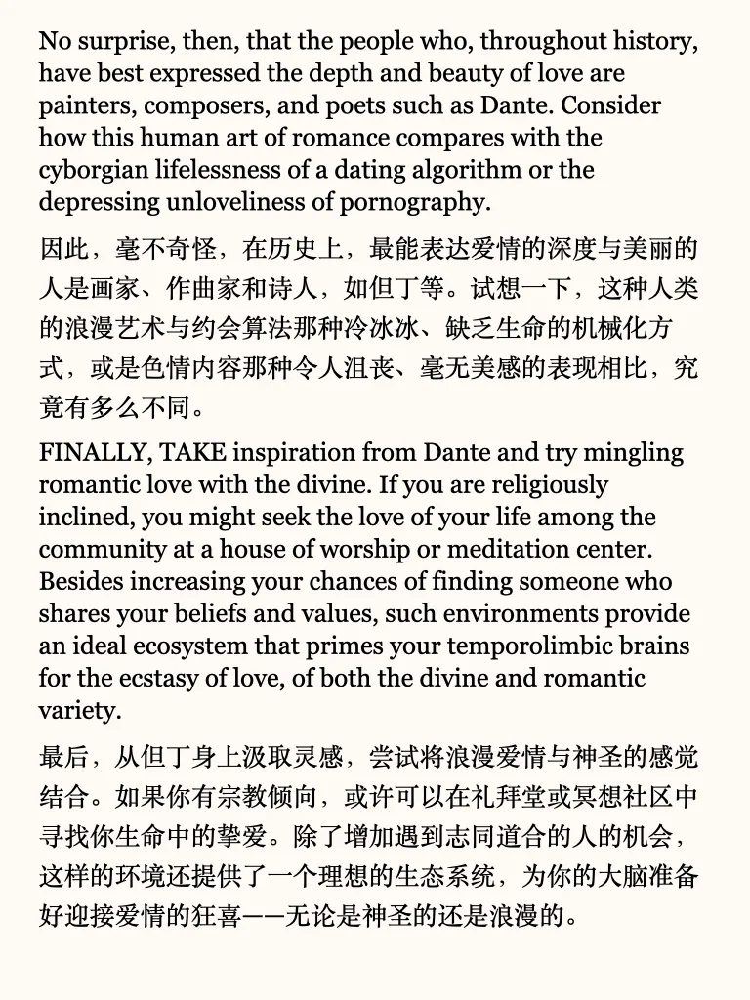

# “恋爱脑”的终极进化：找到“触及灵魂的爱”

跳出“恋爱脑”，重新定义浪漫：爱不是算法算出来的，也不是荷尔蒙上头的冲动，而是一种深刻的精神体验。想要找到属于你的“至高之爱”？你需要的是真实的情感连接、对美的感知，还有一点点“神圣感”的加持~
🌟 为什么爱不能用科学解释？
🌟 如何从“恋爱脑”进化到“灵魂伴侣”？
🌟 找到“至高之爱”的3个关键是什么？
	
#英语 #雅思 #阅读 #英语地道表达 #外刊 #英语原版 #英语泛读 #恋爱脑

## 图片
| 图1 | 图2 | 图3 | 图4 |
| --- | --- | --- | --- |
|  |  |  |  |
|  |  |  |  |
|  |  |  |   |

生成时间：2025-11-14 19:40:04