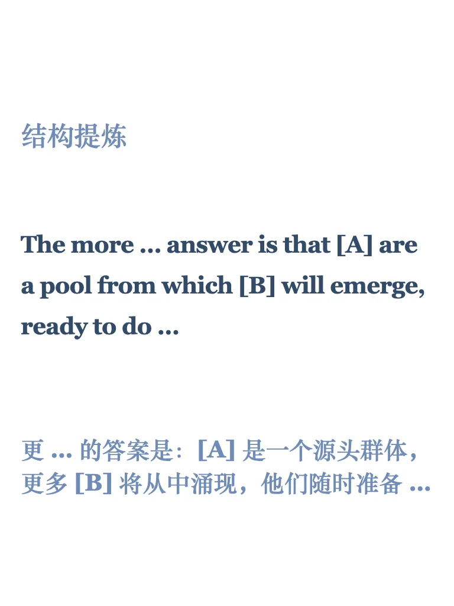
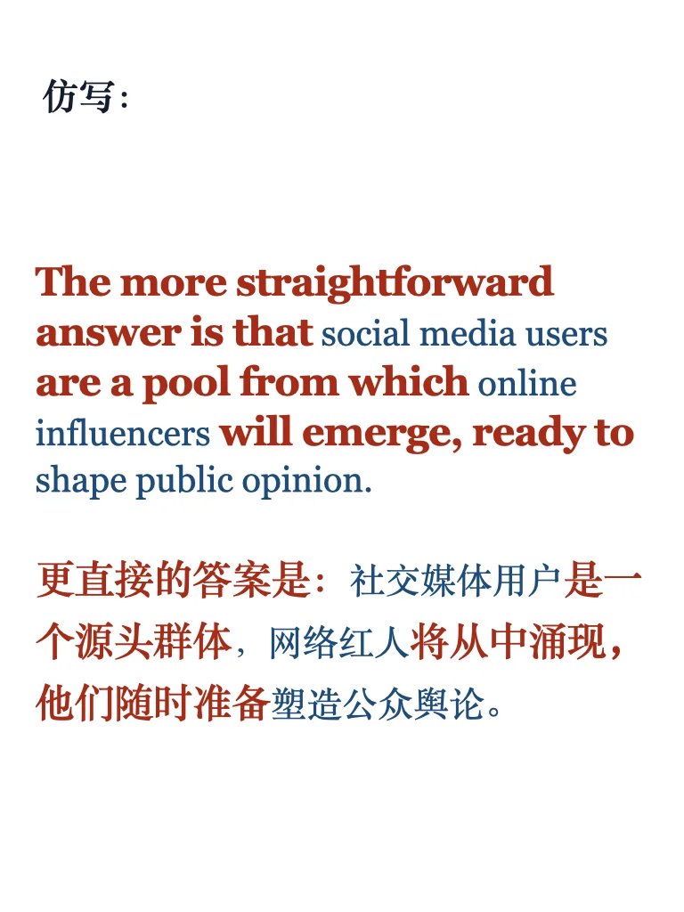
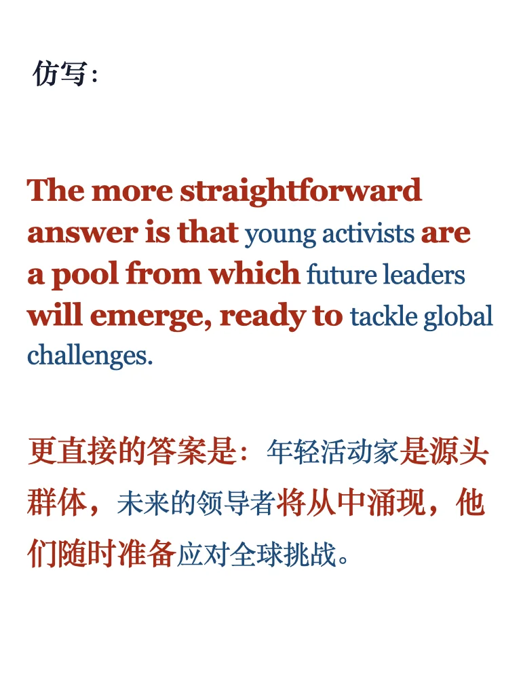

# 句型45期｜演变变化

这个句型可以用于分析一些趋势或现象，比如从普通到专业的变化，职业或兴趣发展，社会运动或思潮等。同时增强论述的逻辑性和说服力！
#雅思 #英语资料 #英语地道表达 #实用英语 #写作 #外刊精读 #四六级 #mti #考研英语

## 图片
| 图1 | 图2 | 图3 | 图4 |
| --- | --- | --- | --- |
|  |  |  |  |
|  |   |   |   |

生成时间：2025-11-14 19:38:54