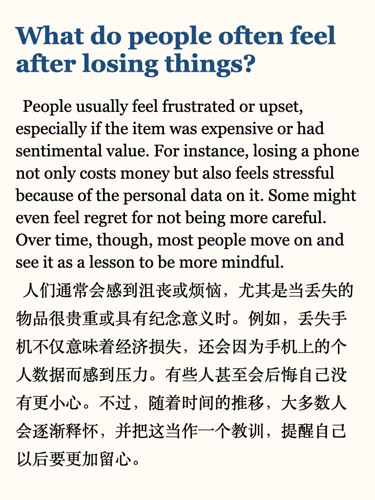
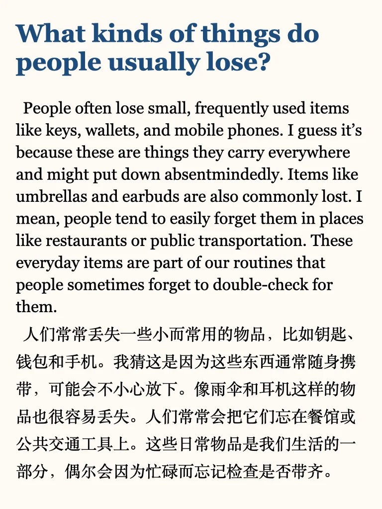
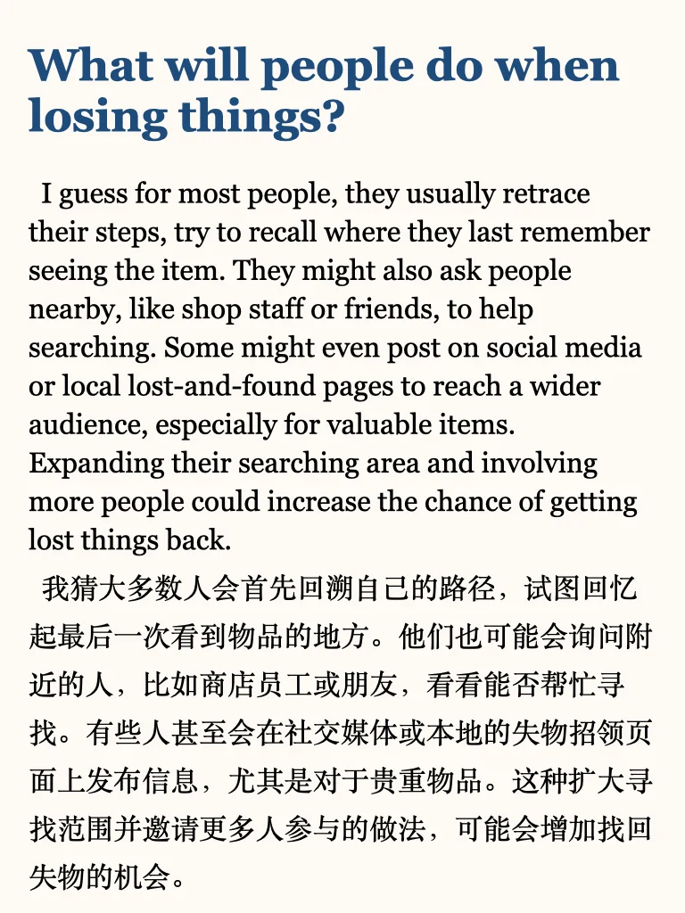
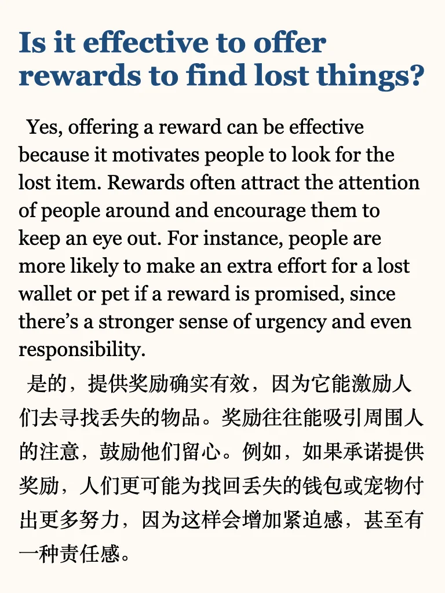
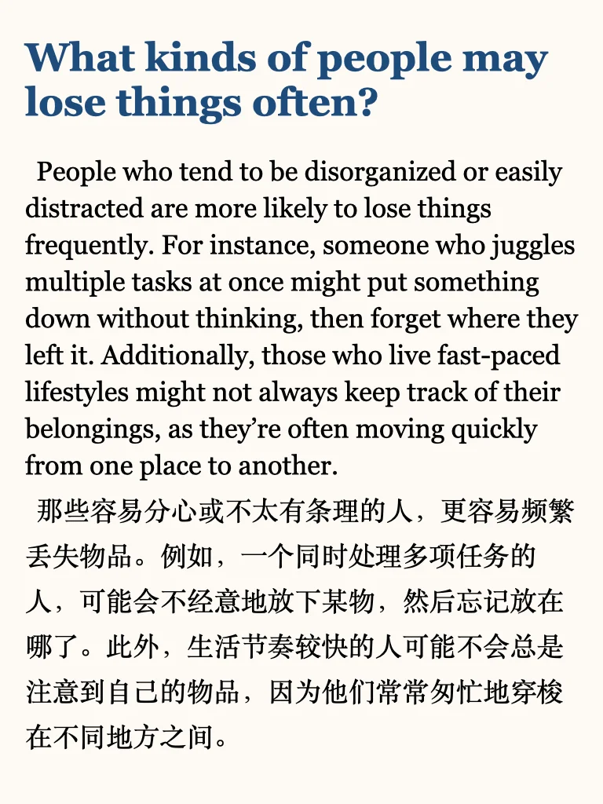
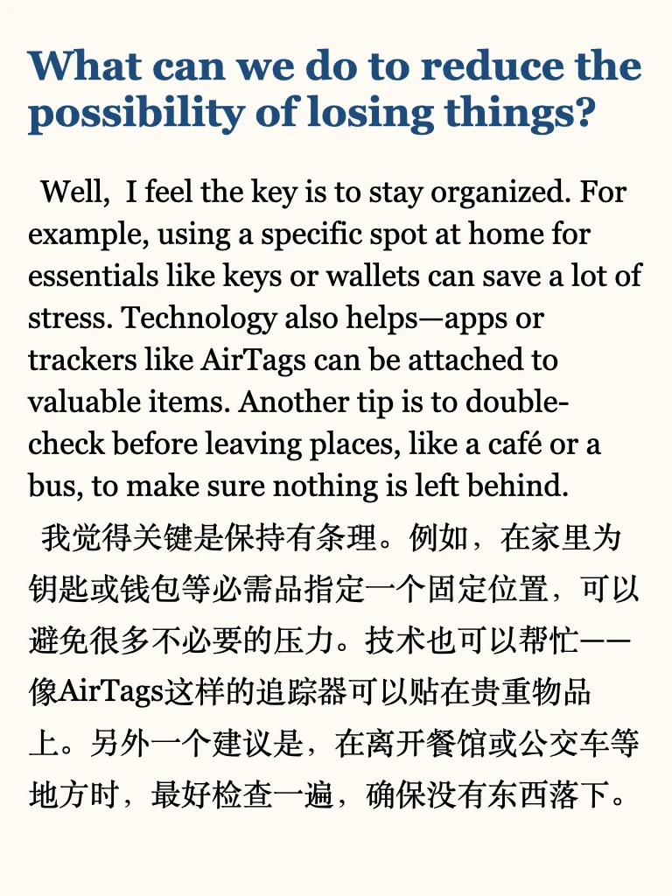

# 雅思口语p3高分参考

虽然新题一直在陆陆续续更新，感觉周边考场反馈还是旧题偏多？
左下角get上季度完整part3答案+本季度更新中
短期备考同学推荐学习我的六天救急包
#雅思 #雅思自学 #雅思刷题 #英语地道表达 #雅思备考 #雅思口语 #每日英语口语学习 #雅思口语part3 #雅思攻略 #雅思口语part3高分答案

## 图片
| 图1 | 图2 | 图3 | 图4 |
| --- | --- | --- | --- |
|  |  |  |  |
|  |  |  |   |

生成时间：2025-11-14 19:37:48