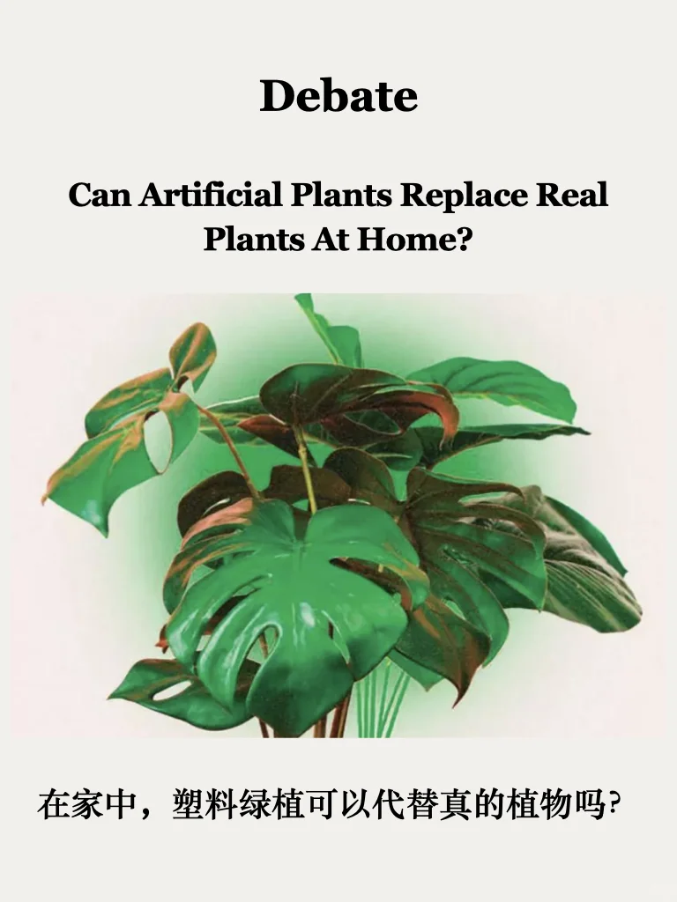
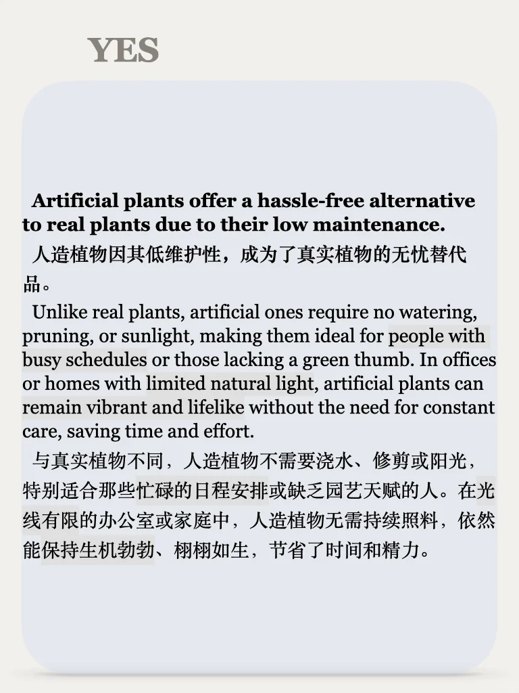
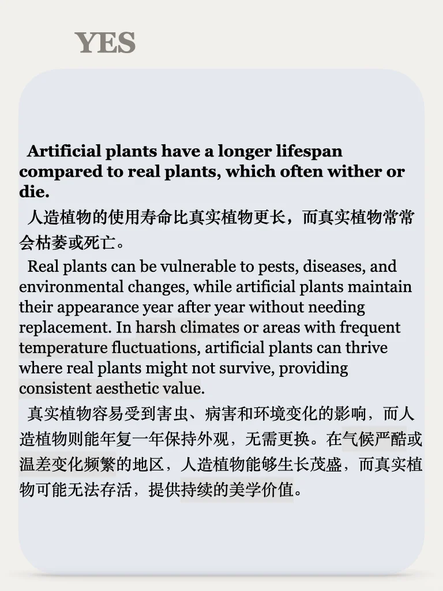
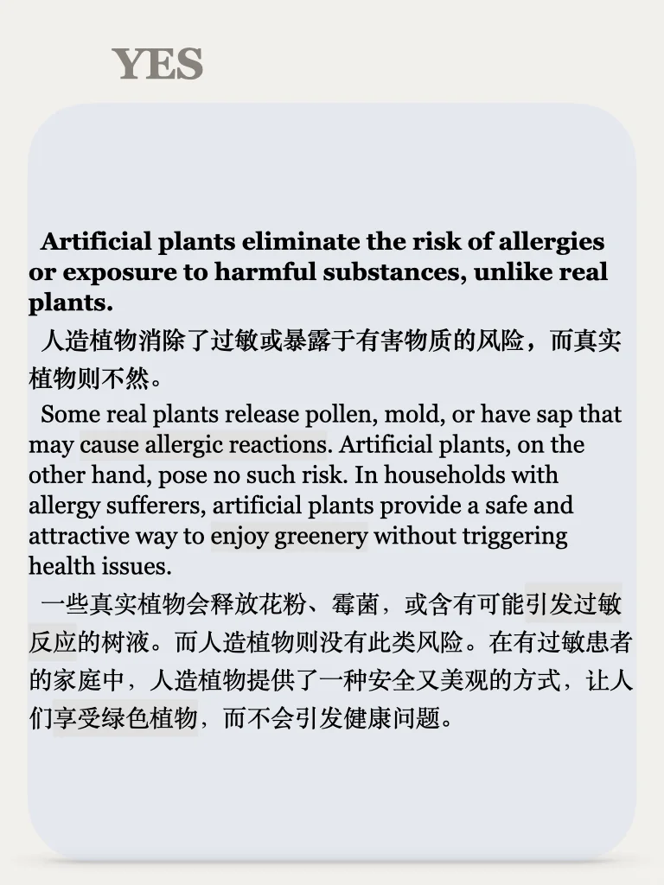
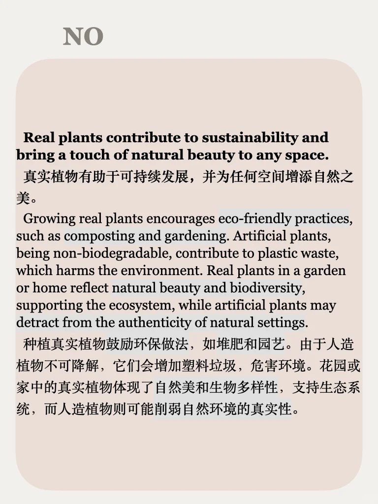
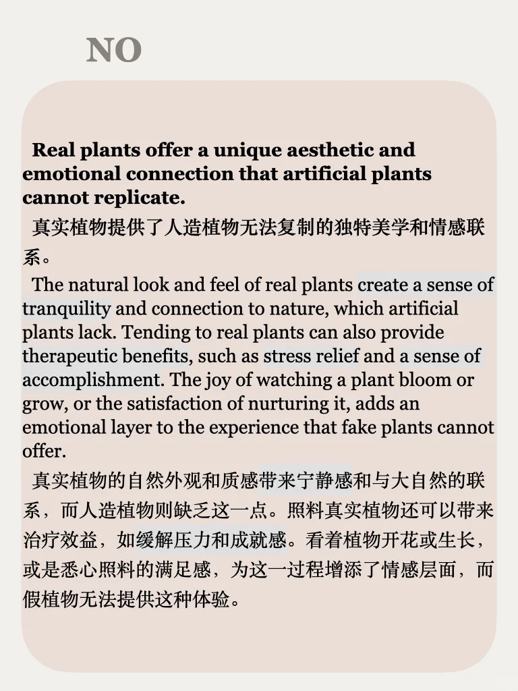
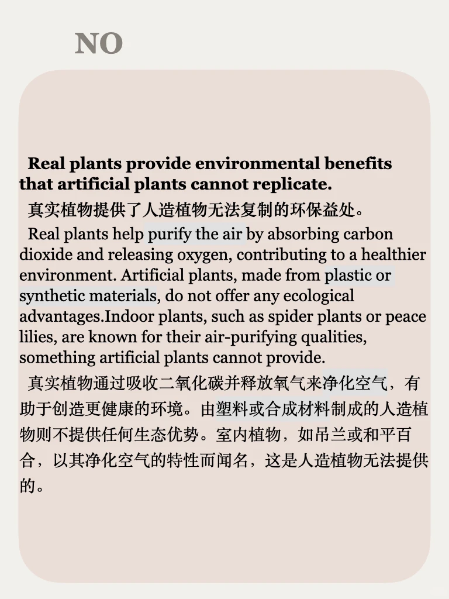

# 思辨能力63期｜说出你的想法

🌿真假植物大PK：为什么我们更爱真实的大自然？
今天的话题来自于时代周刊的一篇文章，研究发现，真实的大自然不仅能带来无与伦比的心理健康益处，还能让我们感受到与生命的深刻连接。而假植物，虽然看似完美，却无法复制这种独特的体验。全文和思考在最后一页更新啦，感谢关注💚
#我的家里不能没有植物 #英语 #学习 #思辨 #素材 #英语素材 #英语辩论 #观点分享 #雅思口语 #四六级

## 图片
| 图1 | 图2 | 图3 | 图4 |
| --- | --- | --- | --- |
|  |  |  |  |
|  |  |  |  |

生成时间：2025-11-14 19:35:34